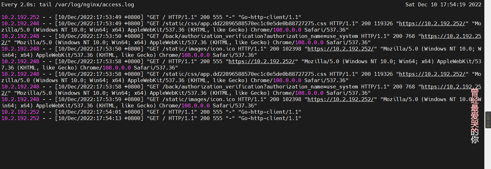
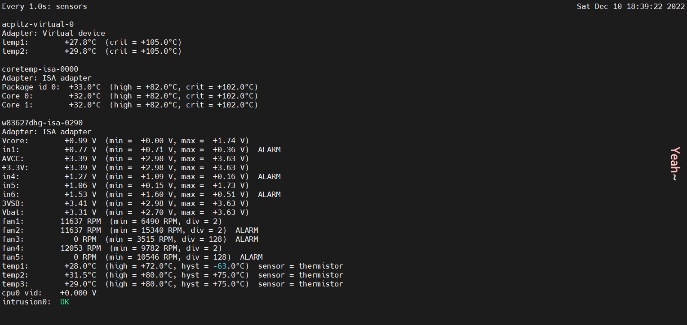
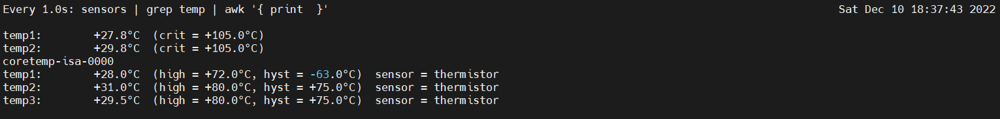

`Linux` 中的 `watch` 命令提供了一种方式处理重复的任务。默认`watch` 会每 2 秒重复执行命令。

<!-- more -->

执行 `watch --help` 查看使用说明。

```
Usage:
 watch [options] command

Options:
  -b, --beep             beep if command has a non-zero exit
  -c, --color            interpret ANSI color and style sequences
  -d, --differences[=<permanent>]
                         highlight changes between updates
  -e, --errexit          exit if command has a non-zero exit
  -g, --chgexit          exit when output from command changes
  -n, --interval <secs>  seconds to wait between updates
  -p, --precise          attempt run command in precise intervals
  -t, --no-title         turn off header
  -x, --exec             pass command to exec instead of "sh -c"

 -h, --help     display this help and exit
 -v, --version  output version information and exit

For more details see watch(1).
```

`watch` 是一个很好的观察 log 文件的工具。

```shell
# 想要停止命令的执行,只要使用标准的 kill 流程, [Ctrl]+C
watch tail /var/log/nginx/access.log
```



你可以使用 `-n` 开关改变并指定时间间隔。要想每 10 秒检测日志文件，试试这个。

```shell
watch -n 10 tail /var/log/your_log_file
```

## 带有管道的watch命令

`watch` 并不仅限于浏览日志文件，它可以用来重复你给它的任何命令。

如果你要监测 `CPU` 的温度，你可以使用 `watch` 后跟上 `sensord` 命令来查看。

```shell
watch -n 1 sensors
```



可以使用管道命令结合 `grep` 检索指定信息，如：`sensors | grep temp | awk '{ print $2 }'`

`watch` 命令会重复它后面的第一个命令，必须要注意命令后面跟上管道的情况。你可以将你的命令放在引号里面来管理。

```shell
watch -n1 "sensors | grep temp | awk '{ print $2 }'"
```

