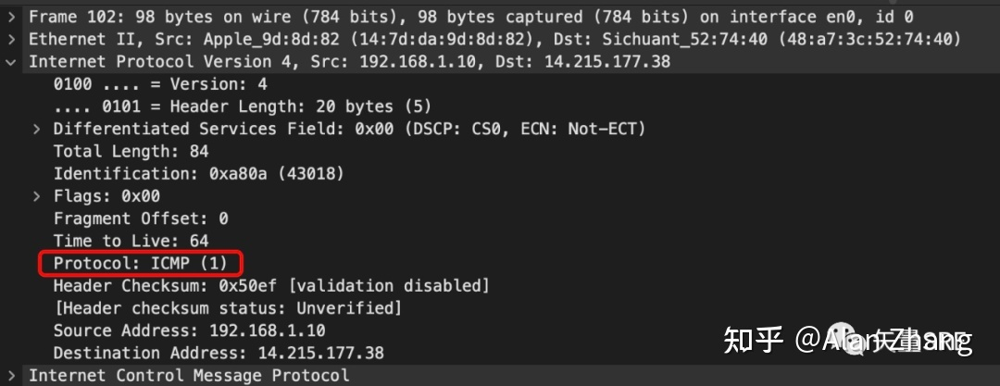
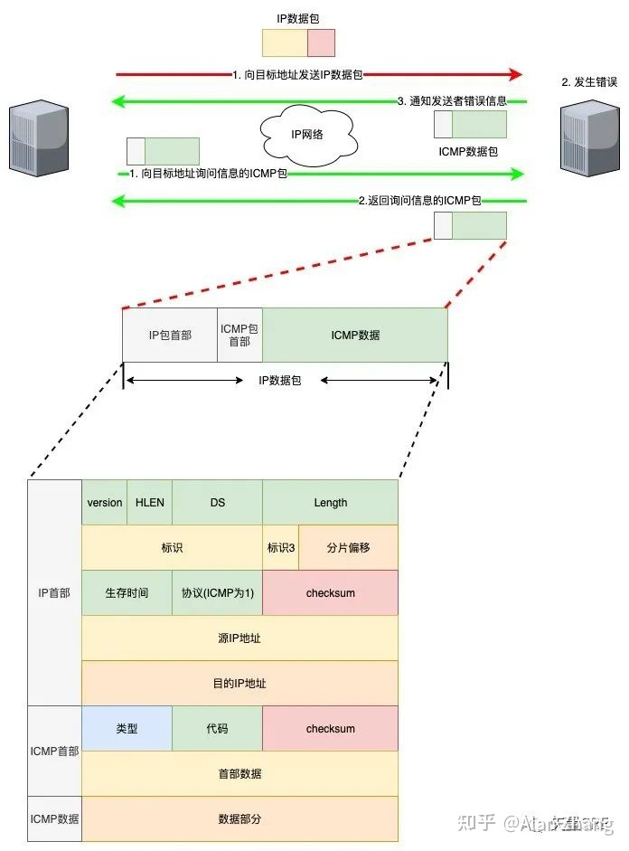
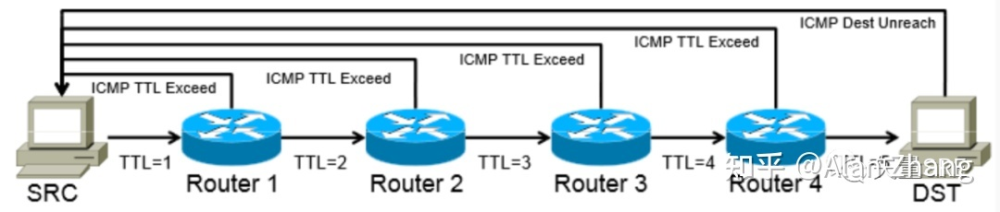

> 文章引自·知乎·[BurningZhang](https://zhuanlan.zhihu.com/p/369623317)

## 简介

ICMP 是 Internet Control Message Protocol 的缩写，即互联网控制消息协议。它是互联网协议族的核心协议之一。它用于 TCP/IP 网络中发送控制消息，提供可能发生在通信环境中的各种问题反馈，通过这些信息，使网络管理者可以对所发生的问题作出诊断，然后采取适当的措施解决问题。

<!-- more -->
虽然 ICMP 是网络层协议，但是它不像 IP 协议和 ARP 协议一样直接传递给数据链路层，而是先封装成 IP 数据包然后再传递给数据链路层。所以在 IP 数据包中如果协议类型字段的值是 1 的话，就表示 IP 数据是 ICMP 报文。IP 数据包就是靠这个协议类型字段来区分不同的数据包的。如下图 WireShark 抓包所示：

在 IP 通信中如果某个包因为未知原因没有到达目的地址，那么这个具体的原因就是由 ICMP 负责告知。而 ICMP 协议的类型定义中就清楚的描述了各种报文的含义。

## ICMP 协议类型

ICMP 协议分为**查询报文**和**差错报文**。

| 种类 | 类型 | 代码 | 报文含义
| - | - | - | - |
| 查询报文 | 0 | 0 | 回显应答 |
| 查询报文 | 8 | 0 | 回显请求 |
| 差错报文 | 3 | 0 | 网络不可达  |
| 差错报文 | 3 | 1 | 主机不可达 |
| 差错报文 | 3 | 2 | 协议不可达 |
| 差错报文 | 3 | 3 | 端口不可达 |
| 差错报文 | 3 | 4 | 需要进行分片但设置不分片比特 |
| 差错报文 | 3 | 5 | 源站选路失败 |
| 差错报文 | 3 | 6 | 目的网络未知 |
| 差错报文 | 3 | 7 | 目的主机未知 |
| 差错报文 | 3 | 8 | 源主机被隔离 |
| 差错报文 | 3 | 9 | 目的网络被强制禁止 |
| 差错报文 | 3 | 10 | 目的主机被强制禁止 |
| 差错报文 | 3 | 11 | 由于服务类型 TOS，网络不可达 |
| 差错报文 | 3 | 12 | 由于服务类型 TOS，主机不可达 |
| 差错报文 | 3 | 13 | 由于过滤，通信被强制禁止 |
| 差错报文 | 3 | 14 | 主机越权 |
| 差错报文 | 3 | 15 | 优先中止生效 |
| 差错报文 | 4 | 0 | 源端被关闭 |
| 差错报文 | 5 | 0 | 对网路重定向 |
| 差错报文 | 5 | 1 | 对主机重定向 |
| 差错报文 | 5 | 2 | 对服务类型和网络重定向 |
| 差错报文 | 5 | 3 | 对服务类型和主机重定向 |
| 差错报文 | 9 | 0 | 路由器通告 |
| 差错报文 | 10 | 0 | 路由器请求 |
| 差错报文 | 11 | 0 | 传输期间生存时间为 0 |
| 差错报文 | 11 | 1 | 在数据报组装期间生存时间为 0 |
| 差错报文 | 12 | 0 | 坏的 IP 首部 |
| 差错报文 | 12 | 1 | 缺少必须的选项 |

## ICMP 报文格式

从 ICMP 的报文格式来说，ICMP 是 IP 的上层协议。但是 ICMP 是分担了 IP 的一部分功能。所以，他也被认为是与 IP 同层的协议。

## ICMP协议实现-Ping命令

1. 向目的服务器发送回显请求

    首先，向目的服务器上执行 ping 命令，主机会构建一个 ICMP 回显请求消息数据包（类型是 8，代码是 0 ），在这个回显请求数据包中，除了类型和代码字段，还被追加了标识符和序号字段。标识符和序号字段分别是 16 位的字段。ping 命令在发送回显请求数据包时，会将进程号填写在标识符里。对于序号，每送出一个数据包数值就增加1。而且，回显请求的选项数据部分用来装任意数据。这个任意数据用来调整 ping 的交互数据包的大小。

2. 目的服务器发送回显应答

    当收到到回显请求数据包后，目的服务器就会向发送方发送回显应答（类型是 0，代码是 0 ），这个 ICMP 回显应答数据包在 IP 层来看，与被送来的回显请求数据包基本上一样。不同的只有源、目标 IP 地址字段被交换了，Type 类型字段里填入了表示回显应答的 0。

3. 源服务器显示相关数据

    如果源服务器可以接收到回显应答数据包，那我们就认为目的服务器是正常工作着的。进一步，记住发送回显请求数据包的时间，与接收到回显应答数据包的时间差，就能计算出数据包一去一回所需要的时间。这个时候 ping 命令就会将目的服务器的 IP 地址，数据大小，往返花费的时间打印到屏幕上。

## ICMP协议实现-traceroute命令

traceroute 命令是一款充分利用 ICMP 差错报文类型的应用，其主要用作追踪路由信息，下面我们来逐个查看一下其工作原理。

首先 traceroute 会将 IP 包的 TTL 设置 为 1，然后发送 UDP 包，他会填入一个端口号作为 UDP 目标端口号（默认是：33434-33534）。

当目的主机收到 UDP 包后，会返回 ICMP 差错报文消息（类型 3，代码 3）。参照上面的表，该错报文类型是端口不可达，说明发送方发出的 UDP 包到达了目的主机。

这样的过程，traceroute 就可以拿到了所有的路由器 IP，这样子就可以看到从源主机到目的主机过程中的所有路由信息。

当然实际情况有的路由器禁用 ICMP ，那么他就根本不会返回这个 ICMP 差错报文，所以是看不到中间经过的路由IP的。

> Tips：traceroute 在类 Unix/Linux 系统中默认使用的是 UDP 协议，也可以通过参数修改为使用 ICMP 协议；Windows 操作系统中只使用 ICMP 协议。

