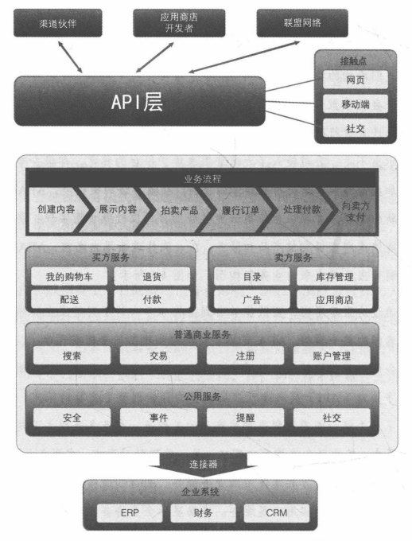

架构师应该在投身元计算之前，按大多数方法学建议的那样进行必要的摸索学习。

<!-- more -->

## 5W1H 的重要性

寻求以下问题的答案：

1. 原因。我们在试着解决什么问题？业务目标和驱动力是什么？
2. 何人。谁需要这些问题得以解决？（内部/外部）的参与者都有谁？
3. 什么。业务和技术需求都是什么？有哪些法律和/法规的约束？风险是什么？
4. 何地。将在哪里提供这些服务？当地有没有一些特定需求（法规、税收、可用性问题、语言/现场问题等）？
5. 何时。这些服务需要什么时间提供？预算是多少？与其他项目/方案有没有关联？
6. 如何。组织如何交付这些服务？组织、体系架构和客户是否都做好了准备？

一旦理清这些问题的脉络，架构师就能更好的为公司挑选最合适的服务模式和部署模式。

## 从业务架构开始

重要的云方案最好先画一个业务架构示意图，这样就能在整个企业（至少与方案对应用部门）范围内对各个接触点和业务功能有更深入的了解。

通过这张示意图，团队能够看到架构体系内的不同集成点和端点在示意图的整个顶部，定义了系统的外部参与者都有哪些，以及用户将会使用哪些接触点来与系统进行交互。所有的外部访问将会通过应用程序接口(API)层来进行。从销售的开始到整个交易的结束，AEA定义了6个核心业务流程来构成产品的工作流。在业务流程之下是一系列的服务。某些服务支撑买方需求，另一些则针对卖方。在服务层之下是各种由买方和卖方共享使用的业务服务。在这些服务的下面是类似安全、事件和提醒的实用工具服务。底层显示企业将会实现的与其他系统进行集成的点。

就任何技术的实施而言，在匆忙决定供应商和云服务模式之前，都应先专注于对架构的定义。重要的一点是，技术选择主要由商业驱动力而非技术偏好来决定。在项目初期自问“何人/什么/原因/何地/何时/如何”这几个问题，会有助于在云服务模式和部署模式上做出明智决策。

此外，在做出决定之前要了解人为和现实中都有哪些约束条件。我并没有给出一个组织回答这些问题的标准流程。表面上看起来我似乎在推荐一种瀑布工作方法，但其实不是。敏捷实践者们可以用他们喜欢的任意方式来将这些探索工作带入其中。重点在于，企业应当试着回答这些问题，并且答案应该对设计的决策及最终整个架构起到帮助。
