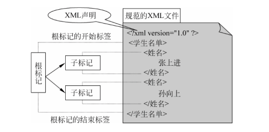

XML 文件是由标记及其所标记的内容构成的文本文件，与 HTML 文件不同的是，这些标记可自由定义，其目的是使得 Internet 网络上的数据交互更方便，让文件的内容更加通俗易懂。


<!-- more -->

## 1. XML 规范



* XML 声明
1. Version 属性
2. Encoding 属性
3. Standalone 属性
* XML 标记
1. 空标记
2. 非空标记
3. 标记名称区分大小写
4. 根标记
* CDATA 段
CDATA 段中的内容不被解析，CDATA 段不支持嵌套
* 属性
属性区分大小写
使用属性的原则：不要因为属性的频繁使用破坏 XML 的数据结构
* 注释
<! -- 注释 -->
* 命名空间
## 2. 有效的 XML 文件
一个规范的 XML 文件如果和某个 DTD 文件相关联，并遵守该 DTD 文件规定的约束条件，就称为有效的 XML 文件。

DTD（Document Type Definition） 文件是有着特殊结构的文件，简单的说，DTD 文件是由元素所构成的文本文件。在 DTD 文件中，用关键字 `ELEMENT` 来定义一个元素，格式如下：

```xml
<!-- 商店营业时间标记中只可以由若干个名字为商店的子标记 -->
<!ELEMENT 商店营业时间 (商店*)>
<!-- 商店的标记恰好顺序为商店名称、开门时间、关门时间，而且约束名称为商店的标记包含的内容不可以含有可显示的字符（允许含有空格、回车等空白类字符） -->
<!ELEMENT 商店 (商店名称,开门时间,关门时间)>
<!-- 约束标记中只能是文本数据，不可以包含子标记 -->
<!ELEMENT 商店名称 (#PCDATA)>
<!ELEMENT 开门时间 (#PCDATA)>
<!ELEMENT 关门时间 (#PCDATA)>
```

### 2.1. XML 文件与 DTD 文件相关联

* SYSTEM 格式 `<DOCTYPE 根标记名称 SYSTEM "DTD 文件 URL">`
* PUBLIC 格式 `<DOCTYPE 根标记名称 PUBLIC "正式公用标识符" "DTD 文件 URL">`

正式公用标识符（Formal Public Identifier, FPI）的格式为 “-ISO认证//单位名称//DTD说明//所用语言”

如果 URI 是一个文件名，该 DTD 文件必须和当前 XML 文件在同一目录中，否则 URI 是一个可访问的 URL 资源。

DTD 文档类型的声明必须写在 XML 声明后。

### 2.2. DTD 完整性

* ELEMENT 标记约束
  ```xml
  <!ELEMENT 标记名称 标记的约束条件>
  ```
* ATTLIST 属性约束列表

  ```xml
  <!ATTLIST 标记名称
    属性名称 属性类型 默认值情况
    属性名称 属性类型 默认值情况
    ...
  >
  ```

#### 属性类型

|属性类型|约束意义
|-|-
|CDATA|字符串
|Enumerated|枚举值
|NMTOKEN|属性中不能含有空格
|NMTOKENS|属性中可以含有空格
|ID|唯一类型，默认值情况只能是`#REQUIRED,#IMPLIED`，一个标记中只能有一个 ID 属性类型
|IDREF|ID 引用属性类型，其内容只能是已有的 ID 属性中的值
|IDREFS|ID 引用属性类型的集合，可以添加多个 ID 属性

1. Enumerated

```xml
<!ATTLIST 标记名称 属性名称 (属性值1|属性值2|...|属性值n) 默认值情况>
```

#### 默认值情况

|默认值情况|约束意义
|-|-
|字符串|标记必须有该属性，且有默认值
|#IMPLIED|标记可以没有该属性，没有默认值
|#REQUIRED|标记必须有该属性，没有默认值
|#FIXED"字符串"|标记可以没有该属性，但如果有该属性，那么属性值固定不变

### 内部 DTD

```xml
<!DOCTYPE 根标记名称 [
  内部 DTD 内容
]>
```

内部 DTD 与 外部 DTD 混合

```xml
<!DOCTYPE 根标记名称 SYSTEM "外部 DTD 的 URI" [
  内部 DTD 内容
]>
<!DOCTYPE 根标记名称 PUBLIC "正式公用标识符" "外部 DTD 的 URI" [
  内部 DTD 内容
]>
```

