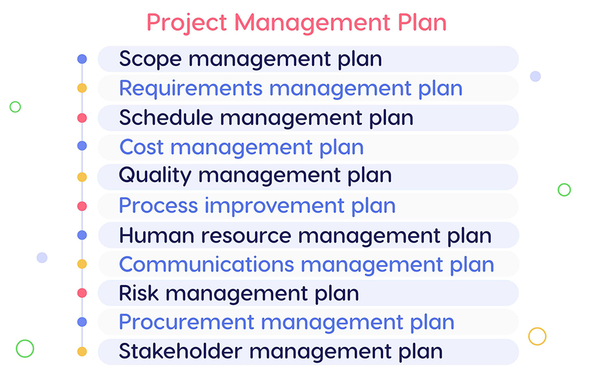
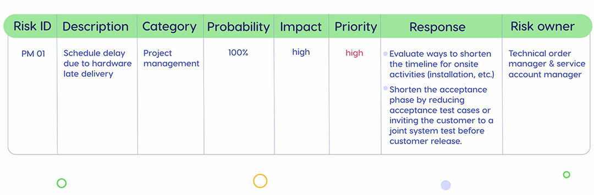
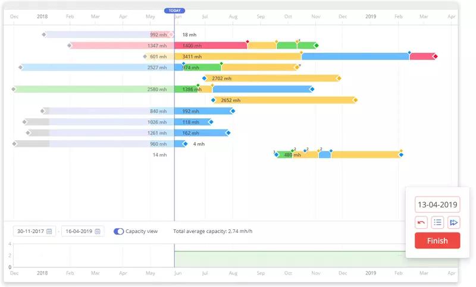

项目管理涉及创建大量文档。如果您研究项目管理标准，您会发现至少有十几个不同的计划、多种类型的报告以及许多其他文档。好消息是项目经理不必编写所有内容 - 想法是仅编译对工作流程效率至关重要且利益相关者需要的内容。

<!-- more -->

我们准备了从项目启动阶段到结束阶段最重要的项目管理文件的概述。进一步阅读以了解它们。

## 商业案例：提出项目的想法

商业案例是帮助决策者确定项目是否值得投资的文档。本文档介绍了某个业务问题以及实施项目如何解决该问题。特别是，可以根据市场需求、客户请求、组织需求、法律要求等创建业务案例。本文档的主要目的是给出启动项目的理由。

创建业务案例对于进一步的项目工作有以下好处。

* 它有助于确定组织项目的优先级，并致力于那些为公司带来最大价值的项目。
* 它有助于更​​合理地利用人力和物力——不会将其浪费在不会带来期望价值的举措上。
* 研究了业务案例后，利益相关者将对项目成果有更清晰、更现实的期望。
* 它可以用作评估项目生命周期各个阶段的项目进度的参考点。

此外，商业案例还涉及成本效益分析，目的是说明公司从项目完成中获得的收益将超过投资。

业务案例通常由项目发起人创建，但是，强烈建议项目经理参与。如果业务案例获得批准，公司就可以启动项目。

## 项目章程：从想法到实际工作

项目章程（又名项目启动文件）是在项目启动阶段创建的。 《PMBOK 指南》指出，项目章程“是正式授权项目存在的文件，并为项目经理提供将组织资源应用于项目活动的权力”。这是一份将项目想法转化为实际工作计划的文件。

项目章程具有以下功能：

* 创建项目正式记录；
* 为项目提供了明确的开始并确定了其边界；
* 允许高级管理层从头到尾正式接受并承诺项目；
* 赋予项目经理执行项目的权力。

项目章程涵盖以下信息：项目的目的、其效益和目标、衡量项目成功的标准、利益相关者列表和项目发起人的名称以及最终产品（服务）的描述与临时可交付成果。

## 项目管理计划：进一步项目工作的基础

这是一份基本文件，描述了如何执行、监视、控制和结束项目。它整合了三个基线（时间、范围和进度）以及之前制定的辅助计划，如下图所示。

项目管理计划的内容可以有所不同，并且不限于上述组成部分。它还可以包括变更管理计划、实施计划或其他文件，具体取决于项目的特殊性。同时，不一定要编写所有这些计划——以项目的需求为指导。

项目计划基于项目章程、历史数据和经验教训、模板和行业（或政府）标准。

制定项目管理计划很重要，因为：

* 它作为监控项目进度的参考点；
* 它使项目流程更具可预测性和组织性，以便每个参与者都知道对他们的期望；
* 它提高了项目管理流程的效率。

## 工作分解结构：了解项目范围

工作分解结构是对整个项目范围的描述，分为可估计、计划、监视和控制的组件。它是一个范围界定、规划、资源分配和风险识别工具。 WBS (Work BreakDown Structure) 的主要功能如下：

* 它是其他项目管理流程（例如资源规划、成本估算、进度制定、风险识别等）的关键输入；
* 它创建了一个框架，可供项目团队成员用作项目报告的基础；
* 它是变更控制流程的基线；
* 它有助于与利益相关者就项目范围进行更有效的沟通；
* 它使所有项目参与者能够更好地了解项目的最终交付成果；
* 它有助于确定资源需求（员工的知识、技能和经验）以及团队成员的角色和职责。

因此，WBS 成为进一步 PM 流程的坚实基础。

## 风险登记册：凡事有预谋

风险登记册是项目管理计划中包含的风险管理计划的组成部分。它概述了有关可能的项目风险的详细信息，指定了其优先级和影响，指出了应对风险事件的方法以及对此负责的人员。有了它，项目经理可以跟踪潜在风险并及时采取措施以尽量减少其负面影响。

定期审查和更新风险登记册并与所有利益相关者和项目团队成员分享非常重要。

下面是该文档的一个案例。

## 项目状态报告：让利益相关者了解最新情况

这些报告是在项目执行阶段定期编写的。他们概述了项目的当前状态，以便为利益相关者提供有关项目健康状况的信息。项目状态报告可以有不同的类型：利益相关者要求的报告、周/月报告、提交给项目管理办公室的报告等等。通常，这些文件涵盖以下信息：已完成的工作量、剩余工作、预算和时间表摘要、可能的风险和应对措施等。

状态报告的目的是：

* 帮助项目团队记录任务、截止日期、费用等；
* 加强与利益相关者的沟通并向他们传递重要信息；
* 检测工作流程中的问题；
* 跟踪项目的进度。

因此，状态报告是让利益相关者了解最新情况并确保项目步入正轨的重要工具。

## 经验教训报告：从经验中学习

谈到项目生命周期的最后阶段，我们想提及经验教训报告。它涵盖了已完成项目的成功和不成功经验的信息以及改进未来项目的建议。应在整个项目生命周期中记录所吸取的经验教训。然而，最终报告是在项目的最后阶段准备的，并与利益相关者和所有团队成员共享。

为什么创建此报告很重要？

* 它可以帮助项目团队从经验中学习：将其考虑在内将防止他们在未来的项目中重复同样的错误。
* 您可以检测低效的活动并找到需要改进的地方。
* 跟踪项目中运行良好的高效流程将成为开发最佳实践的基础。

最后，所有这些因素使得提高未来项目的质量成为可能。

## 项目结束文件：完成项目

这是最终的项目管理文件。未经项目发起人批准，该计划不能被视为结束。它涵盖以下信息：

* 项目成果；
* 项目在时间、预算、范围和质量方面的绩效；
* 重大风险和问题；
* 项目文件的链接。

此列表并不详尽：项目结束文件还可以包含经验教训、评论、详细的财务摘要或对特定项目重要的任何其他重要信息。

***专业提示：仅创建对您的项目最重要的文档。***

虽然如果您管理一个项目，但有多个项目正在进行中，创建文档并不是一个大问题，但这项任务变得非常具有挑战性。让我们看看资源管理软件如何提供帮助。

## 编译项目管理文档：资源管理解决方案有何帮助？

