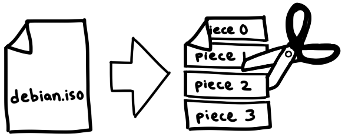

# 使用 Go 实现 BitTorrent 客户端

> 原文地址：[https://blog.jse.li/posts/torrent/](https://blog.jse.li/posts/torrent/)

BitTorrent 是一个通过网络下载和分发文件的协议。与传统的客户端/服务器关系相比，下载者连接到中央服务器（例如：在 Netflix 上观看电影，或加载您正在阅读的网页），BitTorrent 网络中的参与者（称为对等点）下载彼此之间的文件片段——这就是它成为点对点协议的原因。我们将研究其工作原理，并构建我们自己的客户端，该客户端可以找到同行并在它们之间交换数据。


## 寻找对等网络

这里有一个问题：我们想用 BitTorrent 下载一个文件，但它是一个点对点协议，我们不知道在哪里可以找到对等点来下载它。这很像搬到一个新城市并试图结交朋友——也许我们会去当地的酒吧或聚会小组！

像这样的集中位置是跟踪器背后的重要理念，跟踪器是相互介绍对等点的中央服务器。它们只是通过 HTTP* 运行的 Web 服务器，您可以在 http://bttracker.debian.org:6969/ 找到 Debian。


当然，如果这些中央服务器促进同行交换非法内容，它们很可能会受到联邦政府的袭击。您可能还记得读过有关 TorrentSpy、Popcorn Time 和 KickassTorrents 等跟踪器被查封和关闭的信息。新方法通过使对等发现成为一个分布式过程来消除中间人。我们不会实施它们，但如果您有兴趣，您可以研究一些术语，包括 DHT、PEX 和磁力链接。

## 解析 .torrent 文件

.torrent 文件描述了 torrent 文件的内容以及用于连接到跟踪器的信息。这就是我们启动 torrent 下载过程所需要的一切。 Debian 的 .torrent 文件如下所示：

``` plain
d8:announce41:http://bttracker.debian.org:6969/announce7:comment35:"Debian CD from cdimage.debian.org"13:creation datei1573903810e9:httpseedsl145:https://cdimage.debian.org/cdimage/release/10.2.0//srv/cdbuilder.debian.org/dst/deb-cd/weekly-builds/amd64/iso-cd/debian-10.2.0-amd64-netinst.iso145:https://cdimage.debian.org/cdimage/archive/10.2.0//srv/cdbuilder.debian.org/dst/deb-cd/weekly-builds/amd64/iso-cd/debian-10.2.0-amd64-netinst.isoe4:infod6:lengthi351272960e4:name31:debian-10.2.0-amd64-netinst.iso12:piece lengthi262144e6:pieces26800:�����PS�^�� (binary blob of the hashes of each piece)ee
```

这些混乱的内容以一种名为 Bencode（发音为 bee-encode）的格式进行编码，我们需要对其进行解码。

Bencode 可以编码与 JSON 大致相同类型的结构：字符串、整数、列表和字典。 Bencoded 数据不像 JSON 那样人类可读/可写，但它可以有效地处理二进制数据，并且从流中解析非常简单。字符串带有长度前缀，看起来像 4:spam。整数位于开始标记和结束标记之间，因此 7 将编码为 i7e。列表和字典的工作方式类似：l4:spami7ee 表示 ['spam', 7]，而 d4:spami7ee 表示 {spam: 7}。

在更漂亮的格式中，我们的 .torrent 文件如下所示：

```plain
d
  8:announce
    41:http://bttracker.debian.org:6969/announce
  7:comment
    35:"Debian CD from cdimage.debian.org"
  13:creation date
    i1573903810e
  4:info
    d
      6:length
        i351272960e
      4:name
        31:debian-10.2.0-amd64-netinst.iso
      12:piece length
        i262144e
      6:pieces
        26800:�����PS�^�� (binary blob of the hashes of each piece)
    e
e
```

在这个文件中，我们可以发现跟踪器的 URL、创建日期（作为 Unix 时间戳）、文件的名称和大小，以及包含每个片段的 SHA-1 哈希值的大二进制 blob，它们同样是：我们要下载的文件的大小部分。每个种子文件的确切大小各不相同，但通常在 256KB 到 1MB 之间。这意味着一个大文件可能由数千个部分组成。我们将从同行那里下载这些片段，根据我们的 torrent 文件中的哈希值检查它们，将它们组装在一起，然后，我们就得到了一个文件！



这种机制使我们能够在进行过程中验证每个部分的完整性。它使 BitTorrent 能够抵御意外损坏或故意 torrent 中毒。除非攻击者能够通过原像攻击破坏 SHA-1，否则我们将准确获得我们所要求的内容。