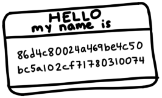
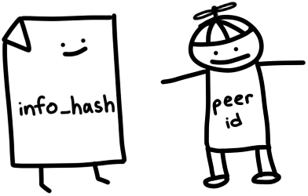
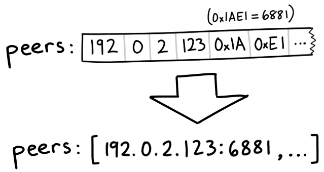
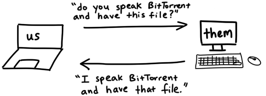
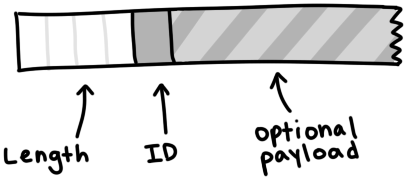
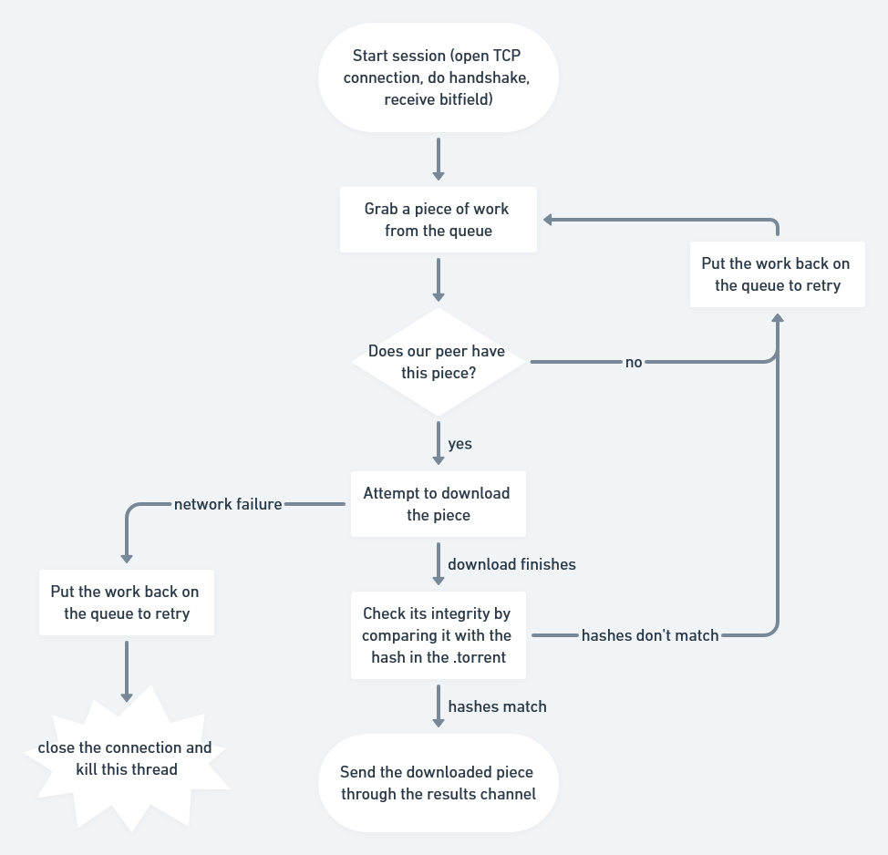
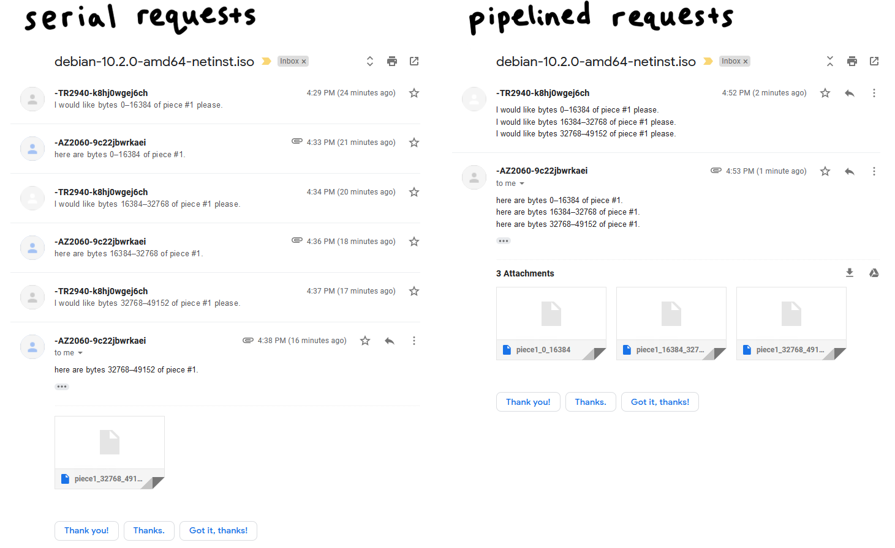

# 使用 Go 实现 BitTorrent 客户端

> 原文地址：[https://blog.jse.li/posts/torrent/](https://blog.jse.li/posts/torrent/)

BitTorrent 是一个通过网络下载和分发文件的协议。与传统的客户端/服务器关系相比，下载者连接到中央服务器（例如：在 Netflix 上观看电影，或加载您正在阅读的网页），BitTorrent 网络中的参与者（称为对等点）下载彼此之间的文件片段——这就是它成为点对点协议的原因。我们将研究其工作原理，并构建我们自己的客户端，该客户端可以找到同行并在它们之间交换数据。


<!-- more -->

## 寻找对等网络

这里有一个问题：我们想用 BitTorrent 下载一个文件，但它是一个点对点协议，我们不知道在哪里可以找到对等点来下载它。这很像搬到一个新城市并试图结交朋友——也许我们会去当地的酒吧或聚会小组！

像这样的集中位置是跟踪器背后的重要理念，跟踪器是相互介绍对等点的中央服务器。它们只是通过 HTTP* 运行的 Web 服务器，您可以在 http://bttracker.debian.org:6969/ 找到 Debian。


当然，如果这些中央服务器促进同行交换非法内容，它们很可能会受到联邦政府的袭击。您可能还记得读过有关 TorrentSpy、Popcorn Time 和 KickassTorrents 等跟踪器被查封和关闭的信息。新方法通过使对等发现成为一个分布式过程来消除中间人。我们不会实施它们，但如果您有兴趣，您可以研究一些术语，包括 DHT、PEX 和磁力链接。

### 解析 .torrent 文件

.torrent 文件描述了 torrent 文件的内容以及用于连接到跟踪器的信息。这就是我们启动 torrent 下载过程所需要的一切。 Debian 的 .torrent 文件如下所示：

``` plain
d8:announce41:http://bttracker.debian.org:6969/announce7:comment35:"Debian CD from cdimage.debian.org"13:creation datei1573903810e9:httpseedsl145:https://cdimage.debian.org/cdimage/release/10.2.0//srv/cdbuilder.debian.org/dst/deb-cd/weekly-builds/amd64/iso-cd/debian-10.2.0-amd64-netinst.iso145:https://cdimage.debian.org/cdimage/archive/10.2.0//srv/cdbuilder.debian.org/dst/deb-cd/weekly-builds/amd64/iso-cd/debian-10.2.0-amd64-netinst.isoe4:infod6:lengthi351272960e4:name31:debian-10.2.0-amd64-netinst.iso12:piece lengthi262144e6:pieces26800:�����PS�^�� (binary blob of the hashes of each piece)ee
```

这些混乱的内容以一种名为 Bencode（发音为 bee-encode）的格式进行编码，我们需要对其进行解码。

Bencode 可以编码与 JSON 大致相同类型的结构：字符串、整数、列表和字典。 Bencoded 数据不像 JSON 那样人类可读/可写，但它可以有效地处理二进制数据，并且从流中解析非常简单。字符串带有长度前缀，看起来像 4:spam。整数位于开始标记和结束标记之间，因此 7 将编码为 i7e。列表和字典的工作方式类似：l4:spami7ee 表示 ['spam', 7]，而 d4:spami7ee 表示 {spam: 7}。

在更漂亮的格式中，我们的 .torrent 文件如下所示：

```plain
d
  8:announce
    41:http://bttracker.debian.org:6969/announce
  7:comment
    35:"Debian CD from cdimage.debian.org"
  13:creation date
    i1573903810e
  4:info
    d
      6:length
        i351272960e
      4:name
        31:debian-10.2.0-amd64-netinst.iso
      12:piece length
        i262144e
      6:pieces
        26800:�����PS�^�� (binary blob of the hashes of each piece)
    e
e
```

在这个文件中，我们可以发现跟踪器的 URL、创建日期（作为 Unix 时间戳）、文件的名称和大小，以及包含每个片段的 SHA-1 哈希值的大二进制 blob，它们同样是：我们要下载的文件的大小部分。每个种子文件的确切大小各不相同，但通常在 256KB 到 1MB 之间。这意味着一个大文件可能由数千个部分组成。我们将从同行那里下载这些片段，根据我们的 torrent 文件中的哈希值检查它们，将它们组装在一起，然后，我们就得到了一个文件！


这种机制使我们能够在进行过程中验证每个部分的完整性。它使 BitTorrent 能够抵御意外损坏或故意 torrent 中毒。除非攻击者能够通过原像攻击破坏 SHA-1，否则我们将准确获得我们所要求的内容。

编写一个 Bencode 解析器真的很有趣，但解析不是我们今天的重点。但我发现 Fredrik Lundh 的 50 行解析器特别具有启发性。对于这个项目，我使用了 github.com/jackpal/bencode-go：

```go title="bencode.go"
import (
    "github.com/jackpal/bencode-go"
)

type bencodeInfo struct {
    Pieces      string `bencode:"pieces"`
    PieceLength int    `bencode:"piece length"`
    Length      int    `bencode:"length"`
    Name        string `bencode:"name"`
}

type bencodeTorrent struct {
    Announce string      `bencode:"announce"`
    Info     bencodeInfo `bencode:"info"`
}

// Open parses a torrent file
func Open(r io.Reader) (*bencodeTorrent, error) {
    bto := bencodeTorrent{}
    err := bencode.Unmarshal(r, &bto)
    if err != nil {
        return nil, err
    }
    return &bto, nil
}
```

因为我喜欢保持结构相对平坦，并且喜欢将应用程序结构与序列化结构分开，所以我导出了一个不同的、更平坦的结构，名为 TorrentFile，并编写了一些辅助函数来在两者之间进行转换。

值得注意的是，我将片段（以前是字符串）分割成哈希值片段（每个 [20] 字节），以便稍后可以轻松访问各个哈希值。我还计算了整个编码信息字典（包含名称、大小和片段哈希值的字典）的 SHA-1 哈希值。我们将其称为 infohash，当我们与跟踪器和对等点对话时，它唯一地标识文件。稍后会详细介绍这一点。



```go
type TorrentFile struct {
    Announce    string
    InfoHash    [20]byte
    PieceHashes [][20]byte
    PieceLength int
    Length      int
    Name        string
}

func (bto bencodeTorrent) toTorrentFile() (TorrentFile, error) {
// …
}
```

### 从跟踪器检索对等点

现在我们有了有关文件及其跟踪器的信息，让我们与跟踪器交谈以宣布我们作为对等点的存在并检索其他对等点的列表。我们只需要向 .torrent 文件中提供的公告 URL 发出 GET 请求，并带有一些查询参数：

```go
func (t *TorrentFile) buildTrackerURL(peerID [20]byte, port uint16) (string, error) {
    base, err := url.Parse(t.Announce)
    if err != nil {
        return "", err
    }
    params := url.Values{
        "info_hash":  []string{string(t.InfoHash[:])},
        "peer_id":    []string{string(peerID[:])},
        "port":       []string{strconv.Itoa(int(Port))},
        "uploaded":   []string{"0"},
        "downloaded": []string{"0"},
        "compact":    []string{"1"},
        "left":       []string{strconv.Itoa(t.Length)},
    }
    base.RawQuery = params.Encode()
    return base.String(), nil
}
```

重要的：

* info_hash：标识我们尝试下载的文件。这是我们之前根据编码后的信息字典计算出的信息哈希值。跟踪器将使用它来确定要向我们展示哪些对等点。

* peer_id：一个 20 字节的名称，用于向跟踪器和对等点标识我们自己。我们将为此生成 20 个随机字节。真正的 BitTorrent 客户端具有类似 -TR2940-k8hj0wgej6ch 的 ID，用于标识客户端软件和版本 - 在本例中，TR2940 代表 Transmission 客户端 2.94。



### 解析跟踪器响应

我们收到一个编码响应：

```plain
d
  8:interval
    i900e
  5:peers
    252:(another long binary blob)
e
```

Interval 告诉我们应该多久再次连接到跟踪器以刷新我们的对等点列表。值 900 意味着我们应该每 15 分钟（900 秒）重新连接一次。

Peers 是另一个长二进制 blob，包含每个对等点的 IP 地址。它由六个字节组成。每组中的前四个字节代表对等方的 IP 地址，每个字节代表 IP 中的一个数字。最后两个字节表示端口，为 big-endian uint16。 Big-endian（或网络顺序）意味着我们可以通过将一组字节从左到右压缩在一起来将它们解释为整数。例如，字节 0x1A、0xE1 构成十进制的 0x1AE1 或 6881。*



```go
// Peer encodes connection information for a peer
type Peer struct {
    IP   net.IP
    Port uint16
}

// Unmarshal parses peer IP addresses and ports from a buffer
func Unmarshal(peersBin []byte) ([]Peer, error) {
    const peerSize = 6 // 4 for IP, 2 for port
    numPeers := len(peersBin) / peerSize
    if len(peersBin)%peerSize != 0 {
        err := fmt.Errorf("Received malformed peers")
        return nil, err
    }
    peers := make([]Peer, numPeers)
    for i := 0; i < numPeers; i++ {
        offset := i * peerSize
        peers[i].IP = net.IP(peersBin[offset : offset+4])
        peers[i].Port = binary.BigEndian.Uint16(peersBin[offset+4 : offset+6])
    }
    return peers, nil
}
```

## 从对等网络中下载

现在我们有了一个同行列表，是时候与他们联系并开始下载作品了！我们可以将这个过程分解为几个步骤。对于每个同行，我们希望：

1. 启动与对等方的 TCP 连接。这就像拨打电话一样。
2. 完成双向 BitTorrent 握手。 “你好？” “你好。”
3. 交换消息以下载片段。 “我想要第 231 号作品。”

### 建立 TCP 连接

```go
conn, err := net.DialTimeout("tcp", peer.String(), 3*time.Second)
if err != nil {
    return nil, err
}
```

我设置了一个超时，这样我就不会在不允许我连接的同伴身上浪费太多时间。在大多数情况下，这是一个非常标准的 TCP 连接。

### 完成握手

我们刚刚与对等方建立了连接，但我们想要握手来验证我们对对等方的假设

1. 可以使用 BitTorrent 协议进行通信
2. 能够理解并回复我们的消息
3. 有我们想要的文件，或者至少知道我们在说什么



我父亲告诉我，良好握手的秘诀是握紧和目光接触。良好的 BitTorrent 握手的秘诀在于它由五个部分组成：

1. 协议标识符的长度，始终为 19（十六进制为 0x13）
2. 协议标识符，称为 pstr，始终是 BitTorrent 协议
3. 八个保留字节，全部设置为 0。我们将其中一些翻转为 1，以表明我们支持某些扩展。但我们不这样做，所以我们将它们保持为 0。
4. 我们之前计算的 infohash 用于识别我们想要的文件
5. 我们编写的用于识别自己身份的 Peer ID

放在一起，握手字符串可能如下所示：

```bash
\x13BitTorrent protocol\x00\x00\x00\x00\x00\x00\x00\x00\x86\xd4\xc8\x00\x24\xa4\x69\xbe\x4c\x50\xbc\x5a\x10\x2c\xf7\x17\x80\x31\x00\x74-TR2940-k8hj0wgej6ch
```

在我们向对等方发送握手信号后，我们应该收到以相同格式返回的握手信号。我们返回的信息哈希值应该与我们发送的信息哈希值相匹配，这样我们就知道我们正在谈论同一个文件。如果一切按计划进行，我们就可以出发了。如果没有，我们可以切断连接，因为出现了问题。 “你好？” “这是谁？你想要什么？”“好吧，哇，号码打错了。”

在我们的代码中，让我们创建一个结构体来表示握手，并编写一些用于序列化和读取它们的方法：

```go
// A Handshake is a special message that a peer uses to identify itself
type Handshake struct {
    Pstr     string
    InfoHash [20]byte
    PeerID   [20]byte
}

// Serialize serializes the handshake to a buffer
func (h *Handshake) Serialize() []byte {
    buf := make([]byte, len(h.Pstr)+49)
    buf[0] = byte(len(h.Pstr))
    curr := 1
    curr += copy(buf[curr:], h.Pstr)
    curr += copy(buf[curr:], make([]byte, 8)) // 8 reserved bytes
    curr += copy(buf[curr:], h.InfoHash[:])
    curr += copy(buf[curr:], h.PeerID[:])
    return buf
}

// Read parses a handshake from a stream
func Read(r io.Reader) (*Handshake, error) {
    // Do Serialize(), but backwards
    // ...
}
```

### 发送和接收消息

完成初始握手后，我们就可以发送和接收消息。好吧，不完全是——如果另一个对等方还没有准备好接受消息，我们就无法发送任何消息，直到他们告诉我们他们准备好了。在这种状态下，我们被认为是被对方窒息了。他们会向我们发送一条畅通无阻的消息，让我们知道我们可以开始向他们索要数据。默认情况下，我们假设自己被窒息了，直到事实证明并非如此。

一旦我们被解除阻塞，我们就可以开始发送对碎片的请求，他们可以向我们发送包含碎片的消息。


#### 解释消息

消息具有长度、ID 和有效负载。在电线上，它看起来像：



消息以长度指示符开头，它告诉我们消息的长度为多少字节。它是一个 32 位整数，这意味着它由按大端顺序混合在一起的四个字节组成。下一个字节，即 ID，告诉我们正在接收哪种类型的消息，例如，2 个字节表示“感兴趣”。最后，可选的有效负载填充消息的剩余长度。

```go
type messageID uint8

const (
    MsgChoke         messageID = 0
    MsgUnchoke       messageID = 1
    MsgInterested    messageID = 2
    MsgNotInterested messageID = 3
    MsgHave          messageID = 4
    MsgBitfield      messageID = 5
    MsgRequest       messageID = 6
    MsgPiece         messageID = 7
    MsgCancel        messageID = 8
)

// Message stores ID and payload of a message
type Message struct {
    ID      messageID
    Payload []byte
}

// Serialize serializes a message into a buffer of the form
// <length prefix><message ID><payload>
// Interprets `nil` as a keep-alive message
func (m *Message) Serialize() []byte {
    if m == nil {
        return make([]byte, 4)
    }
    length := uint32(len(m.Payload) + 1) // +1 for id
    buf := make([]byte, 4+length)
    binary.BigEndian.PutUint32(buf[0:4], length)
    buf[4] = byte(m.ID)
    copy(buf[5:], m.Payload)
    return buf
}
```

要从流中读取消息，我们只需遵循消息的格式即可。我们读取四个字节并将它们解释为 uint32 以获取消息的长度。然后，我们读取该字节数以获取 ID（第一个字节）和有效负载（剩余字节）。

```go
// Read parses a message from a stream. Returns `nil` on keep-alive message
func Read(r io.Reader) (*Message, error) {
    lengthBuf := make([]byte, 4)
    _, err := io.ReadFull(r, lengthBuf)
    if err != nil {
        return nil, err
    }
    length := binary.BigEndian.Uint32(lengthBuf)

    // keep-alive message
    if length == 0 {
        return nil, nil
    }

    messageBuf := make([]byte, length)
    _, err = io.ReadFull(r, messageBuf)
    if err != nil {
        return nil, err
    }

    m := Message{
        ID:      messageID(messageBuf[0]),
        Payload: messageBuf[1:],
    }

    return &m, nil
}
```

#### Bit 字段

比特字段是最有趣的信息类型之一，它是一种数据结构，同行可以用它来有效地编码他们能够发送给我们的棋子。比特字段看起来就像一个字节数组，我们只需查看设置为 1 的比特的位置，就能知道他们有哪些信息。我们从一张全为 0 的空白卡开始，然后将比特位翻转为 1，将其位置标记为 “已盖章”。


通过使用比特而不是字节，这种数据结构超级紧凑。我们可以在一个字节（一个 bool 的大小）的空间内塞入八个片段的信息。但这样做的代价是，访问数值变得有点麻烦。计算机能寻址的最小内存单位是字节，因此要访问比特，我们必须进行一些比特操作：

```go
// A Bitfield represents the pieces that a peer has
type Bitfield []byte

// HasPiece tells if a bitfield has a particular index set
func (bf Bitfield) HasPiece(index int) bool {
    byteIndex := index / 8
    offset := index % 8
    return bf[byteIndex]>>(7-offset)&1 != 0
}

// SetPiece sets a bit in the bitfield
func (bf Bitfield) SetPiece(index int) {
    byteIndex := index / 8
    offset := index % 8
    bf[byteIndex] |= 1 << (7 - offset)
}
```

### 将所有的内容整合到一起

现在，我们已经拥有了下载洪流所需的所有工具：我们有了从跟踪器获取的对等点列表，可以通过拨号 TCP 连接、启动握手以及发送和接收消息与它们通信。我们的最后一个大问题是处理同时与多个对等体通信所涉及的并发问题，以及在与对等体交互时管理对等体的状态。这些都是经典的硬件问题。

#### 管理并发性：作为队列的通道

在 Go 中，我们通过通信来共享内存，我们可以将 Go 通道视为廉价的线程安全队列。

我们将设置两个通道来同步我们的并发工作者：一个用于在对等程序之间分配工作（下载文件），另一个用于收集下载的文件。当下载的片段通过结果通道进入时，我们就可以将它们复制到缓冲区，开始组装我们的完整文件。

```go
// Init queues for workers to retrieve work and send results
workQueue := make(chan *pieceWork, len(t.PieceHashes))
results := make(chan *pieceResult)
for index, hash := range t.PieceHashes {
    length := t.calculatePieceSize(index)
    workQueue <- &pieceWork{index, hash, length}
}

// Start workers
for _, peer := range t.Peers {
    go t.startDownloadWorker(peer, workQueue, results)
}

// Collect results into a buffer until full
buf := make([]byte, t.Length)
donePieces := 0
for donePieces < len(t.PieceHashes) {
    res := <-results
    begin, end := t.calculateBoundsForPiece(res.index)
    copy(buf[begin:end], res.buf)
    donePieces++
}
close(workQueue)
```

我们将为从跟踪器接收到的每个对等点生成一个 Worker goroutine。它将连接并与对等体握手，然后开始从 workQueue 中检索工作，尝试下载工作，并通过结果通道发送下载的工作。



```go
func (t *Torrent) startDownloadWorker(peer peers.Peer, workQueue chan *pieceWork, results chan *pieceResult) {
    c, err := client.New(peer, t.PeerID, t.InfoHash)
    if err != nil {
        log.Printf("Could not handshake with %s. Disconnecting\n", peer.IP)
        return
    }
    defer c.Conn.Close()
    log.Printf("Completed handshake with %s\n", peer.IP)

    c.SendUnchoke()
    c.SendInterested()

    for pw := range workQueue {
        if !c.Bitfield.HasPiece(pw.index) {
            workQueue <- pw // Put piece back on the queue
            continue
        }

        // Download the piece
        buf, err := attemptDownloadPiece(c, pw)
        if err != nil {
            log.Println("Exiting", err)
            workQueue <- pw // Put piece back on the queue
            return
        }

        err = checkIntegrity(pw, buf)
        if err != nil {
            log.Printf("Piece #%d failed integrity check\n", pw.index)
            workQueue <- pw // Put piece back on the queue
            continue
        }

        c.SendHave(pw.index)
        results <- &pieceResult{pw.index, buf}
    }
}
```

#### 管理状态

我们将在一个结构体中跟踪每个对等点，并在读取信息时修改该结构体。它将包括我们从对等点下载了多少信息、我们向对等点请求了多少信息以及我们是否被掐断等数据。如果我们想进一步扩展，可以将其形式化为有限状态机。不过，现在有一个结构体和一个开关就足够了。

```go
type pieceProgress struct {
    index      int
    client     *client.Client
    buf        []byte
    downloaded int
    requested  int
    backlog    int
}

func (state *pieceProgress) readMessage() error {
    msg, err := state.client.Read() // this call blocks
    switch msg.ID {
    case message.MsgUnchoke:
        state.client.Choked = false
    case message.MsgChoke:
        state.client.Choked = true
    case message.MsgHave:
        index, err := message.ParseHave(msg)
        state.client.Bitfield.SetPiece(index)
    case message.MsgPiece:
        n, err := message.ParsePiece(state.index, state.buf, msg)
        state.downloaded += n
        state.backlog--
    }
    return nil
}
```

#### Time to make requests!

文件、片段和片段哈希值并不是全部，我们还可以进一步将片段分解为块。区块是片段的一部分，我们可以通过它所在片段的索引、片段内的字节偏移量和长度来完全定义一个区块。当我们向对等程序请求数据时，实际上就是在请求数据块。一个数据块通常有 16KB 大，这意味着一个 256 KB 的数据块实际上可能需要 16 次请求。

如果对等设备收到一个大于 16KB 的数据块请求，它们就会切断连接。不过，根据我的经验，它们通常完全乐意满足最大 128KB 的请求。我在使用更大的数据块时，总体速度只得到了适度的提升，因此最好还是遵守规范。

#### 流水线

网络往返的成本很高，逐个请求每个区块绝对会降低我们的下载性能。因此，我们必须对请求进行管道化处理，以保持一定数量的未完成请求的持续压力。这可以将我们连接的吞吐量提高一个数量级。



通常，BitTorrent 客户端会保留一个包含五个管道请求的队列，这也是我要使用的值。我发现增加队列大小可使下载速度提高一倍。较新的客户端使用自适应队列大小，以更好地适应现代网络速度和条件。这绝对是一个值得调整的参数，也是未来性能优化的低悬点。

```go
// MaxBlockSize is the largest number of bytes a request can ask for
const MaxBlockSize = 16384

// MaxBacklog is the number of unfulfilled requests a client can have in its pipeline
const MaxBacklog = 5

func attemptDownloadPiece(c *client.Client, pw *pieceWork) ([]byte, error) {
    state := pieceProgress{
        index:  pw.index,
        client: c,
        buf:    make([]byte, pw.length),
    }

    // Setting a deadline helps get unresponsive peers unstuck.
    // 30 seconds is more than enough time to download a 262 KB piece
    c.Conn.SetDeadline(time.Now().Add(30 * time.Second))
    defer c.Conn.SetDeadline(time.Time{}) // Disable the deadline

    for state.downloaded < pw.length {
        // If unchoked, send requests until we have enough unfulfilled requests
        if !state.client.Choked {
            for state.backlog < MaxBacklog && state.requested < pw.length {
                blockSize := MaxBlockSize
                // Last block might be shorter than the typical block
                if pw.length-state.requested < blockSize {
                    blockSize = pw.length - state.requested
                }

                err := c.SendRequest(pw.index, state.requested, blockSize)
                if err != nil {
                    return nil, err
                }
                state.backlog++
                state.requested += blockSize
            }
        }

        err := state.readMessage()
        if err != nil {
            return nil, err
        }
    }

    return state.buf, nil
}
```

#### main.go

这个很短。我们快到了

```go
package main

import (
    "log"
    "os"

    "github.com/veggiedefender/torrent-client/torrentfile"
)

func main() {
    inPath := os.Args[1]
    outPath := os.Args[2]

    tf, err := torrentfile.Open(inPath)
    if err != nil {
        log.Fatal(err)
    }

    err = tf.DownloadToFile(outPath)
    if err != nil {
        log.Fatal(err)
    }
}
```

## 这并不是故事的全部

为了简洁起见，我只包含了一些重要的代码片段。值得注意的是，我省略了所有胶水代码、解析、单元测试以及构建特性的无聊部分。如果你感兴趣，可以查看我的[完整实现](https://github.com/veggiedefender/torrent-client)。