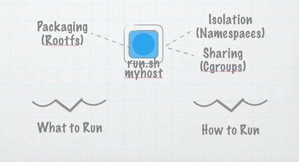

# 用不到 100 行 Go 语言构建自己的容器

> 原文地址：[https://www.infoq.com/articles/build-a-container-golang/](https://www.infoq.com/articles/build-a-container-golang/)

2013 年 3 月 Docker 的开源发布引发了软件开发行业打包和部署现代应用程序方式的重大转变。在 Docker 发布之后，许多相互竞争、相互补充和相互支持的容器技术也随之诞生，这导致了围绕这一领域的许多炒作和一些幻灭。本系列文章旨在揭示其中的一些困惑，并解释容器在企业中的实际使用情况。

本系列文章首先介绍了容器背后的核心技术以及开发人员目前的使用情况，然后探讨了在企业中部署容器所面临的核心挑战，例如将容器化集成到持续集成和持续交付管道中，以及加强监控以支持不断变化的工作负载和潜在的瞬时性。本系列最后展望了容器化的未来，并讨论了 unikernels 目前在前沿组织中发挥的作用。

<!-- more -->

类比的问题在于，当你听到类比时，往往会让你的大脑 “关机”。有些人可能会说，软件架构 “就像 ”建筑架构。不，事实并非如此，可以说，这个听起来不错的类比造成了很多伤害。与此相关的是，软件集装箱化常常被说成是提供了 “就像 ”集装箱运输货物一样移动软件的能力。其实不然。至少可以这么说，但这种类比失去了很多细节。

海运集装箱和软件集装箱确实有很多共同之处。海运集装箱具有标准的形状和尺寸，可以实现强大的规模经济和标准化。软件集装箱也有望带来许多同样的好处。但是，这只是表面上的类比--目标而非事实。

要真正理解容器在软件世界中的意义，我们需要了解容器的制作过程。这就是本文要解释的内容。在这个过程中，我们将讨论容器与容器化、Linux 容器（包括命名空间、cgroups 和分层文件系统），然后通过一些代码从头开始构建一个简单的容器，最后谈谈这一切到底意味着什么。

## 什么是容器？

对于一个词来说，这意味着很多东西！容器 "这个词已经开始用于很多概念（有时是重叠的）。它被用于容器化的类比，也被用于实现容器化的技术。如果我们把它们分开来考虑，就会有更清晰的认识。因此，让我们先谈谈为什么要使用容器，再谈谈如何使用容器。（然后我们再来谈谈为什么）。

但是，run.sh 有依赖性。它需要主机上存在某些库。而且远程运行和本地运行的效果也不尽相同。（如果你听过这首歌，请不要打断我）。于是，我们发明了 AMI（亚马逊机器映像）、VMDK（VMware 映像）和 Vagrantfiles 等等，一切都很顺利。

嗯，算是不错吧。捆绑包很大，很难有效地将它们运送到各地，因为它们不是非常标准化。于是，我们发明了缓存。



一切都很顺利。

缓存让 Docker 镜像比 vmdks 或 vagrantfiles 更有效。它让我们可以通过一些通用的基础镜像来运输 deltas，而不是把整个镜像搬来搬去。这意味着我们有能力将整个环境从一个地方运到另一个地方。这就是为什么当你 “docker run whatever ”时，它几乎会立即启动，即使 whatever 描述的是整个操作系统镜像。我们将在（第 N 节）更详细地讨论它是如何工作的。

实际上，这就是容器的意义所在。容器就是要将依赖关系捆绑起来，这样我们就能以可重复、安全的方式发送代码。但这只是一个高层次的目标，而不是定义。所以，让我们来谈谈现实。

## 构件容器

那么（这次是真的！）什么是容器？如果创建一个容器就像系统调用 create_container 一样简单就好了。但事实并非如此。不过老实说，也差不多。

要在底层讨论容器，我们必须先讨论三件事。它们是命名空间、cgroups 和分层文件系统。还有其他一些东西，但这三样构成了其中大部分的奥妙。

### 命名空间

命名空间提供了在一台机器上运行多个容器所需的隔离功能，同时让每个容器看起来都有自己的环境。在编写本报告时，共有六个命名空间。每个命名空间都可以独立请求，相当于为进程（及其子进程）提供了机器资源子集的视图。

这些命名空间是：

* PID：pid 命名空间为进程及其子进程提供了系统中进程子集的视图。把它想象成一个映射表。当 pid 命名空间中的进程向内核请求进程列表时，内核会在映射表中查找。如果进程存在于映射表中，映射 ID 就会被使用，而不是真实 ID。如果进程不存在于映射表中，内核就会假装它根本不存在。pid 命名空间会将在其中创建的第一个进程设为 pid 1（通过将其主机 ID 映射为 1），从而在容器中形成一个孤立的进程树。
* MNT：从某种意义上说，这是最重要的。挂载命名空间为其中的进程提供了自己的挂载表。这意味着它们可以挂载和卸载目录，而不会影响其他命名空间（包括主机命名空间）。更重要的是，结合 pivot_root 系统调用（我们将看到），它允许进程拥有自己的文件系统。这样，我们就能通过交换容器看到的文件系统，让进程以为自己运行在 ubuntu、busybox 或 alpine 上。
* NET：网络命名空间为使用它的进程提供了自己的网络堆栈。一般来说，只有主网络名称空间（启动计算机时启动的进程使用的名称空间）实际上才会附加任何真正的物理网卡。但我们可以创建虚拟以太网对——链接的以太网卡，其中一端可以放置在一个网络命名空间中，另一端可以放置在另一个网络命名空间中，从而在网络命名空间之间创建虚拟链接。有点像在一台主机上有多个 ip 堆栈相互通信。通过一些路由魔法，这允许每个容器与现实世界通信，同时将每个容器隔离到自己的网络堆栈。
* UTS：UTS 命名空间为其进程提供了自己的系统主机名和域名视图。进入UTS命名空间后，设置主机名或域名不会影响其他进程。
* IPC：IPC Namespace 隔离了消息队列等各种进程间通信机制。有关更多详细信息，请参阅命名空间文档。
* USER：用户命名空间是最近添加的，从安全角度来看可能是最强大的。用户命名空间将进程看到的 uid 映射到主机上的一组不同的 uid（和 gid）。这非常有用。使用用户命名空间，我们可以将容器的根用户 ID（即 0）映射到主机上的任意（且非特权）uid。这意味着我们可以让容器认为它具有根访问权限 - 我们甚至可以实际上授予它对特定于容器的资源的类似根的权限 - 而无需实际授予它根命名空间中的任何权限。容器可以自由地以 uid 0 运行进程——这通常与拥有 root 权限同义——但内核实际上在幕后将该 uid 映射到非特权的真实 uid。大多数容器系统不会将容器中的任何 uid 映射到调用命名空间中的 uid 0：换句话说，容器中根本不存在具有真正 root 权限的 uid。

大多数容器技术将用户的进程放入上述所有命名空间中，并初始化命名空间以提供标准环境。例如，这相当于在容器的隔离网络命名空间中创建一个初始网卡，并连接到主机上的真实网络。

### CGroups

老实说，Cgroups 可以写成一篇完整的文章（我保留写一篇文章的权利！）。我将在这里相当简短地讨论它们，因为一旦您理解了这些概念，您就可以直接在文档中找到很多内容。

从根本上来说，cgroup 收集一组进程或任务 ID 并对其应用限制。在命名空间隔离进程的情况下，cgroup 强制在进程之间公平（或不公平 - 这取决于你，疯狂吧）资源共享。

Cgroup 由内核公开为可以挂载的特殊文件系统。您只需将进程 ID 添加到任务文件即可将进程或线程添加到 cgroup，然后通过编辑该目录中的文件来读取和配置各种值。

### 分层文件系统

命名空间和 CGroup 是容器化的隔离和资源共享方面。他们是巨大的金属边和码头的保安。分层文件系统是我们如何有效地移动整个机器图像的方式：它们是船漂浮而不是下沉的原因。

在基本层面上，分层文件系统相当于优化为每个容器创建根文件系统副本的调用。有很多种方法可以做到这一点。 Btrfs 在文件系统层使用写时复制。 Aufs 使用“联合安装”。由于实现此步骤的方法有很多，因此本文将使用非常简单的方法：我们将真正制作一个副本。虽然很慢，但很有效。

### 开始构建容器

#### 第一步：设置骨架

让我们先把粗略的骨架放在适当的位置。假设您安装了最新版本的 golang 编程语言 SDK，然后打开编辑器，并复制以下列表。

```go
package main

import (
	"fmt"
	"os"
	"os/exec"
	"syscall"
)

func main() {
	switch os.Args[1] {
	case "run":
		parent()
	case "child":
		child()
	default:
		panic("wat should I do")
	}
}

func parent() {
	cmd := exec.Command("/proc/self/exe", append([]string{"child"}, os.Args[2:]...)...)
	cmd.Stdin = os.Stdin
	cmd.Stdout = os.Stdout
	cmd.Stderr = os.Stderr

	if err := cmd.Run(); err != nil {
		fmt.Println("ERROR", err)
		os.Exit(1)
	}
}

func child() { 
	cmd := exec.Command(os.Args[2], os.Args[3:]...)
	cmd.Stdin = os.Stdin
	cmd.Stdout = os.Stdout
	cmd.Stderr = os.Stderr

	if err := cmd.Run(); err != nil {
		fmt.Println("ERROR", err)
		os.Exit(1)
	}
}

func must(err error) {
	if err != nil {
		panic(err)
	}
}
```

那么这有什么作用呢？好吧，我们从 main.go 开始，阅读第一个参数。如果是“run”，那么我们运行parent()方法，如果是child()，我们运行child方法。父方法运行“/proc/self/exe”，这是一个特殊文件，包含当前可执行文件的内存映像。换句话说，我们重新运行自己，但将 child 作为第一个参数传递。

这是什么疯狂？嗯，现在还没有太多。它只是让我们执行另一个程序，该程序执行用户请求的程序（在 `os.Args[2:]` 中提供）。不过，通过这个简单的脚手架，我们可以创建一个容器。

#### 第二步：添加命名空间

要向我们的程序添加一些命名空间，我们只需要添加一行。在线的。在parent()方法的第二行，只需添加这一行来告诉go在运行子进程时传递一些额外的标志。

```go
cmd.SysProcAttr = &syscall.SysProcAttr{
	Cloneflags: syscall.CLONE_NEWUTS | syscall.CLONE_NEWPID | syscall.CLONE_NEWNS,
}
```

如果您现在运行您的程序，您的程序将在 UTS、PID 和 MNT 命名空间内运行！

#### 第三步：根文件系统

目前，您的进程位于一组独立的命名空间中（此时请随意尝试将其他命名空间添加到上面的克隆标志中）。但文件系统看起来与主机相同。这是因为您位于挂载命名空间中，但初始挂载是从创建命名空间继承的。

让我们改变这一点。我们需要以下四行简单的代码来交换到根文件系统。将它们放在“child()”函数的开头。

```go
must(syscall.Mount("rootfs", "rootfs", "", syscall.MS_BIND, ""))
	must(os.MkdirAll("rootfs/oldrootfs", 0700))
	must(syscall.PivotRoot("rootfs", "rootfs/oldrootfs"))
	must(os.Chdir("/"))
```

最后两行是重要的一点，它们告诉操作系统将 `/` 处的当前目录移动到 `rootfs/oldrootfs` ，并将新的 rootfs 目录交换到 `/` 。 `pivotroot` 调用完成后，容器中的 / 目录将引用 rootfs。 （需要绑定挂载调用来满足 `pivotroot` 命令的一些要求 - 操作系统要求使用 `pivotroot` 来交换不属于同一树的两个文件系统，这可以将 rootfs 绑定挂载到自身实现。是，这很愚蠢）。

#### 第四步：初始化容器世界

此时，您有一个进程在一组隔离的命名空间中运行，并具有您选择的根文件系统。我们跳过了设置 cgroup，尽管这非常简单，并且我们跳过了根文件系统管理，它可以让您有效地下载和缓存我们“pivotroot”编辑的根文件系统映像。

我们还跳过了容器设置。您在这里拥有的是隔离命名空间中的新容器。我们通过转向 rootfs 设置了挂载命名空间，但其他命名空间有其默认内容。在真实的容器中，我们需要在运行用户进程之前为容器配置“世界”。例如，我们会设置网络，在运行进程之前交换到正确的 uid，设置我们想要的任何其他限制（例如删除功能和设置 rlimits）等等。这很可能会推动我们超过 100 行。

#### 第五步：把它们放在一起

这就是一个超级超级简单的容器，只有不到 100 行代码。显然这是故意简单的。如果你在生产中使用它，你会发疯，更重要的是，你自己会发疯。但我认为看到一些简单而古怪的东西可以让我们对正在发生的事情有一个非常有用的了解。让我们看一下清单 A。

```go
package main

import (
	"fmt"
	"os"
	"os/exec"
	"syscall"
)

func main() {
	switch os.Args[1] {
	case "run":
		parent()
	case "child":
		child()
	default:
		panic("wat should I do")
	}
}

func parent() {
	cmd := exec.Command("/proc/self/exe", append([]string{"child"}, os.Args[2:]...)...)
	cmd.SysProcAttr = &syscall.SysProcAttr{
		Cloneflags: syscall.CLONE_NEWUTS | syscall.CLONE_NEWPID | syscall.CLONE_NEWNS,
	}
	cmd.Stdin = os.Stdin
	cmd.Stdout = os.Stdout
	cmd.Stderr = os.Stderr

	if err := cmd.Run(); err != nil {
		fmt.Println("ERROR", err)
		os.Exit(1)
	}
}

func child() {
	must(syscall.Mount("rootfs", "rootfs", "", syscall.MS_BIND, ""))
	must(os.MkdirAll("rootfs/oldrootfs", 0700))
	must(syscall.PivotRoot("rootfs", "rootfs/oldrootfs"))
	must(os.Chdir("/"))

	cmd := exec.Command(os.Args[2], os.Args[3:]...)
	cmd.Stdin = os.Stdin
	cmd.Stdout = os.Stdout
	cmd.Stderr = os.Stderr

	if err := cmd.Run(); err != nil {
		fmt.Println("ERROR", err)
		os.Exit(1)
	}
}

func must(err error) {
	if err != nil {
		panic(err)
	}
}
```

## 那么，这意味着什么呢？

这就是我要说的有点争议的地方。对我来说，容器是一种很好的方式来运送东西并以低廉的成本运行代码并具有良好的隔离性，但这并不是对话的结束。容器是一种技术，而不是一种用户体验。

作为一名用户，我不想将集装箱投入生产，就像​​使用 amazon.com 的购物者不想实际打电话给码头来组织货物运输一样。容器是一项非常棒的构建技术，但我们不应该因为移动机器镜像的能力而分心，而忽略了构建真正出色的开发人员体验的需要。

构建在容器之上的平台即服务 (PaaS)（例如 Cloud Foundry）从基于代码而不是容器的用户体验开始。对于大多数开发人员来说，他们想做的就是推送代码并让它运行。在幕后，Cloud Foundry - 以及大多数其他 PaaSes - 获取该代码并创建一个可扩展和管理的容器化映像。对于 Cloud Foundry，这使用构建包，但您也可以跳过此步骤并推送从 Dockerfile 创建的 Docker 映像。

使用 PaaS，容器的所有优势仍然存在 - 一致的环境、高效的资源管理等 - 但通过控制用户体验，PaaS 既可以为开发人员提供更简单的用户体验，又可以执行一些额外的技巧，例如修补根目录文件系统存在安全漏洞时。此外，平台提供数据库和消息队列等服务作为您可以绑定到应用程序的服务，从而无需将所有内容视为容器。

因此，我们已经研究了容器是什么。现在，我们该怎么处理它们呢？
