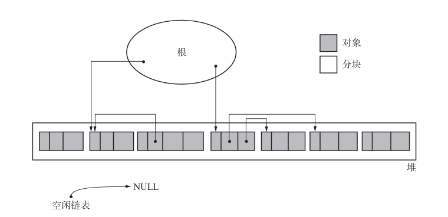
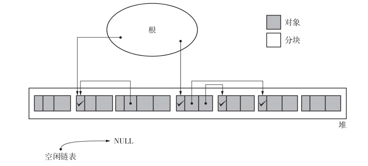
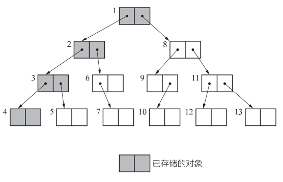
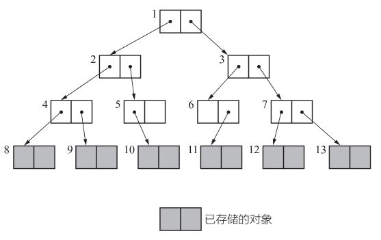
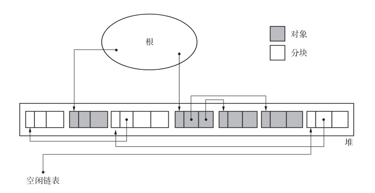

# GC 垃圾回收算法

## 评价标准

评价 GC 算法的性能时，我们采用以下 4 个标准。

* 吞吐量
* 最大暂停时间
* 堆使用效率
* 访问的局部性

## GC 标记 - 清除算法（Mark Sweep GC）

GC 标记 - 清除算法由标记阶段和清除阶段构成。标记阶段是把所有活动对象都做上标记的阶段。清除阶段是把那些没有标记的对象，也就是非活动对象回收的阶段。通过这两个阶段，就可以令不能利用的内存空间重新得到利用。

<!-- more -->

### 标记阶段

在标记阶段中，collector 会为堆里的所有活动对象打上标记。为此，我们首先要标记通过根直接引用的对象。首先我们标记这样的对象，然后递归地标记通过指针数组能访问到的对象。这样就能把所有活动对象都标记上了。

标记完所有活动对象后，标记阶段就结束了。

!!! tip "深度优先搜索与广度优先搜索"

    我们在搜索对象并进行标记时使用的是深度优先搜索（depth-first search）。这是尽可能从深度上搜索树形结构的方法。

    

    另一方面，还有广度优先搜索（breadth -first search）方法。这是尽可能从广度上搜索树形结构的方法。

    

    GC 会搜索所有对象。不管使用什么搜索方法，搜索相关的步骤数（调查的对象数量）都不会有差别。

    另一方面，比较一下内存使用量（已存储的对象数量）就可以知道，深度优先搜索比广度优先搜索更能压低内存使用量。**因此我们在标记阶段经常用到深度优先搜索。**

### 清除阶段

在清除阶段中，collector 会遍历整个堆，回收没有打上标记的对象（即垃圾），使其能再次得到利用。

我们必须把非活动对象回收再利用。回收对象就是把对象作为分块，连接到被称为“空闲链表”的单向链表。在之后进行分配时只要遍历这个空闲链表，就可以找到分块了。

在清除阶段，程序会遍历所有堆，进行垃圾回收。也就是说，所花费时间与堆大小成正比。堆越大，清除阶段所花费的时间就会越长。

---
编辑于 2024-12-12 18:35

### 分配

如前文所述，我们在清除阶段已经把垃圾对象连接到空闲链表了。搜索空闲链表并寻找大小合适的分块，这项操作就叫作分配。执行分配的函数 `new_obj` 如代码清单所示：

=== "缺点"

1. 分配速度：GC 标记-清除算法中分块是不连续的，因为每次分配都必须遍历空闲链表，找到足够大的分块。最糟糕的情况就是每次进行分配都得把空闲链表遍历到最后。
2. 与写时复制不兼容：写时复制技术（copy-on-write）是在 Linux 等众多 UNIC 操作系统的虚拟存储中用到的高速化方法。

### 优点