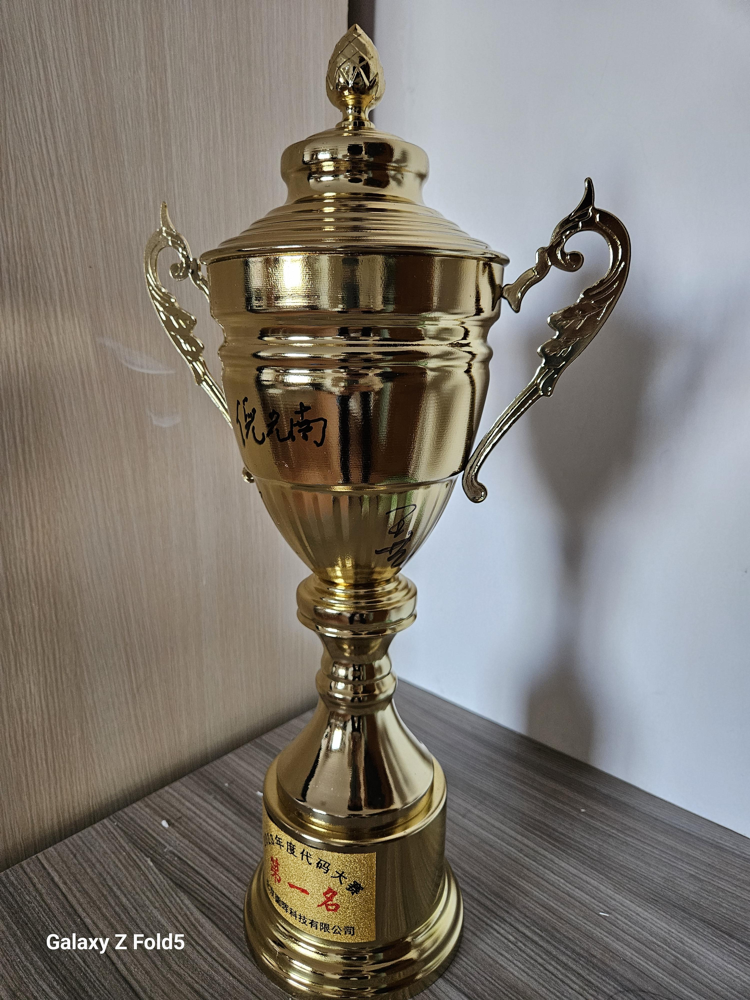

# 当时只道是寻常

!!! Note "浣溪沙 纳兰容若"

    谁念西风独自凉，萧萧黄叶闭疏窗，沉思往事立残阳。

    被酒莫惊春睡重，赌书消得泼茶香，当时只道是寻常。

那些我们习以为常的日子，那些眼前的普通人，可能在某一天，都是你人生回忆里的美好，所以朋友啊，珍稀当下，珍惜眼前人。

<!-- more -->

2024年，平凡的一天，我参与了公司举办的年度算法大赛。就在这一刻，命运的齿轮悄然转动，我的人生轨迹也开始悄然改变。

这个瞬间不仅是对我的成就的认可，更是一个难得的缘分，铭刻着我与这位杰出人物的特别联系。

- <figure markdown="span">
    { width="300" align="left" }
  </figure>

- <figure markdown="span">
    { width="300" align="left" }
  </figure>

