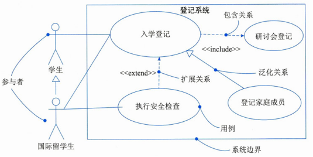
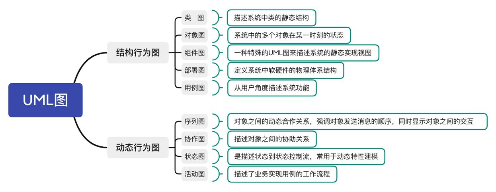
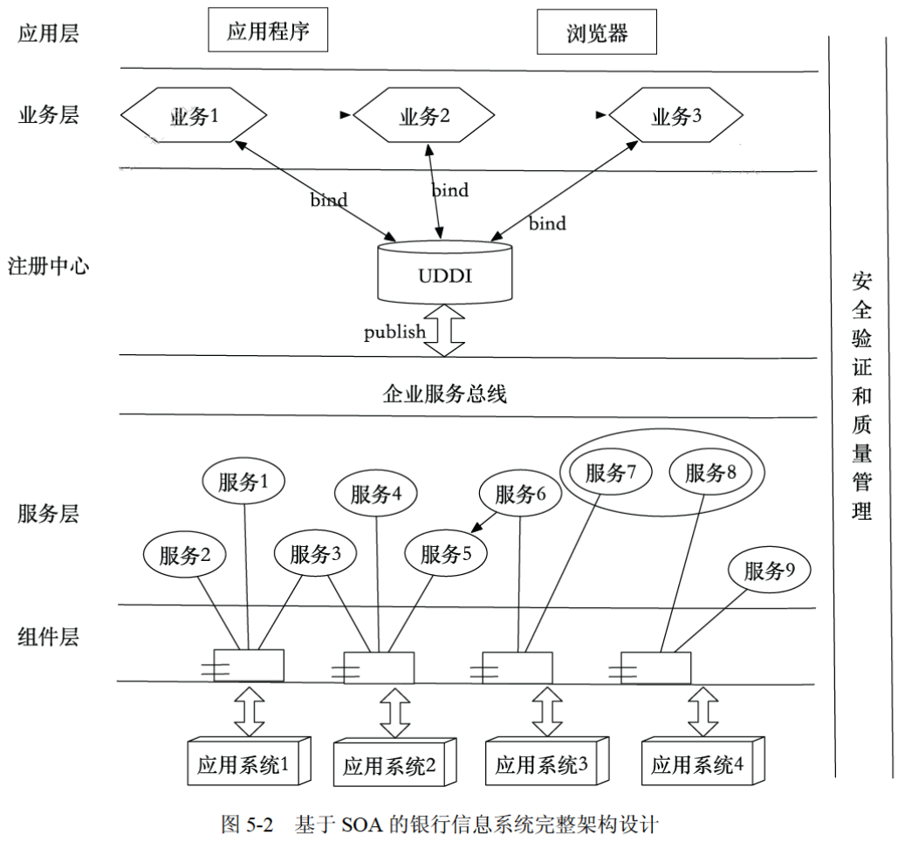
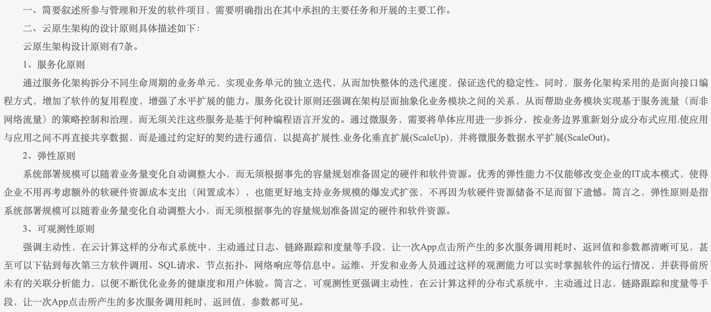
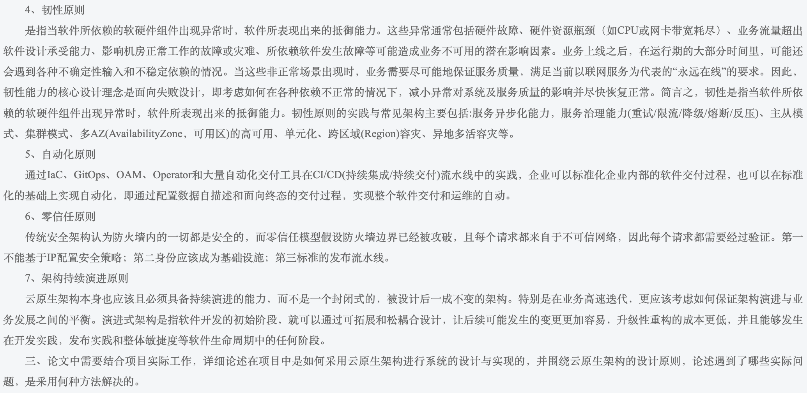

# 高级架构师高频题型总结

## 选择题

### 面向对象

1. 在 UML 用例图中，参与者之间存在 __ 关系。

    A. 聚合 B. 包含 C. 继承/泛化 (✅) D. 扩展

    ??? note

        用例图描述了一组用例、参与者以及它们之间的关系。这里没考察用例之间的关系，而是考察了参与者之间的关系

        

        参与者、国际留学生与参与者、学生之间的关系是泛化关系

        * 用例与参与者之间有 **扩展和包含** 关系
        * 参与者与用例之间有 **关联** 关系
        * 用例与用例、参与者与参与者之间有 **泛化** 关系

        

2. 数据资产的特性包括：可控制、可量化、可变现、虚拟性、共享性、时效性、安全性、交换性和规模性。

<!-- more -->

### 英文题

1. Accelerated analysis approaches emphasize the construction of _1_ to more rapidly identify business and user requirements fo a new system. As an accelerated analysis technology, _2_ reads the program code and automatically generates the equivalent system model, and the code can be obtained from _3_. All system analysis approaches requires some from of _4_ which includes those techniques to be used to identify or extract system problems and solution requirements from user community. _5_ is a classical set of techniques used to collect information about system problems, opportunities, solution requirements, and priorities.

      1.  A. object models 

          B. prototypes (✅)

          C. use cases 

          D. components

      2.  A. eXtreme programming 
          
          B. model driven 
          
          C. reverse engineering (✅) 
          
          D. agile Method

      3.  A. existing database and application program 

          B. application program and user interface 
          
          C. existing database and user interface 
          
          D. existing database, application program and user interface (✅)

      4.  A. requirement discovery (✅)
          
          B. business process redesign 
          
          C. cause-and-effect analysis 
          
          D. total quality management

      5.  A. Continuous process improvement

          B. Joint Requirements planning

          C. Fact-finding (✅)

          D. Structured engineering

2. The purpos of systems design is to specify a(n) _1_, which defines the technologies to be used to build the proposed infomation systems. This task is accomplished by analyzing the data models and process models that were initially created during _2_. The _3_ is used to establish physical processes and data stores across a network. To complete this activity, the analyst may involve a number of system designers and _4_, which maybe involved in this activity to help address bussness data, process, and location issues. The key inputs to this task are the facts, recommendations, and opinions that are solicited from various sources and the approved _5_ from the decision analysis phase.

      1.  A. pyhsical model

          B. application architecture (✅)

          C. prototype system 

          D. database schema

      2.  A. requirements analysis (✅)

          B. problem analysis 

          C. cause-effect analysis 

          D. decision analysis 

      3.  A. entity-relation ship diagram

          B. physical data flow diagram (✅)

          C. data flow diagram 

          D. physical database model

      4.  A. system analysts 

          B. system owner

          C. system managers 

          D. system users (✅)

      5.  A. system architecture 

          B. system model 

          C. system proposal 

          D. system operation (✅)

## 简答题

### Web 系统架构设计

1. 请用 200 字以内的文字说明什么是面向服务架构（SOA）以及 ESB 在 SOA 中的作用与特点。

    * 什么是面向服务架构（SOA）
    
        面向服务的体系架构（SOA）是一种粗粒度、松耦合服务架构，服务之间通过简单、精确定义接口进行通信。它可以根据需求通过网络对松散耦合粗粒度应用组件进行分布式部署、组合和使用。SOA 能帮助企业系统架构设计者以更迅速、更可靠、更高重用性设计整个业务系统架构，基于 SOA 的系统能够更加从容地面对业务的急剧变化。

    * ESB 在 SOA 中的作用与特点

        企业服务总线（ESB）是由中间件技术实现的全面支持面向服务架构的基础软件平台，支持异构环境中的服务以及基于消息和事件驱动模式的交互，并且具有适当的服务质量和可管理性。

2. 基于 SOA 的系统架构设计图

    

3. 列举 3 种可以实现信息系统安全保障的措施

    XML 加密模块、WS-Security、防火墙系统、安全检测、网路扫描

4. MVC 架构中包含哪三种元素，它们的作用分别是什么？

    MVC 架构包含的三种元素是：模型、视图、控制器。模型负责提供操作数据对象；视图负责提供用户操作界面；控制器负责按照输入指令和业务逻辑操作数据对象，并产生输出。

5. 请说明 EJB 构件中的 Bean（构件）分为哪三种类型，每种类型 Bean 的职责是什么？

    EJB 构件中的 Bean 分为三种类型：会话 Bean、实体 Bean 和消息驱动 Bean。会话 Bean 负责处理客户端请求，实体 Bean 负责存储和管理数据，消息驱动 Bean 负责处理异步消息。

## 论文

### 架构设计

#### 论模型驱动架构设计方法及其应用写作要点

领域驱动设计（Domain-Driven Design, DDD）与模型驱动软件开发方法（Model-Driven Software Development, MDSD）是两种注重软件开发质量和效率的方法论。下面分别概述两者的核心概念，并探讨它们如何相互作用以提升软件项目的成功概率。

=== "领域驱动设计（DDD）"

    1. 核心领域：识别并聚焦于业务中最关键、最具价值的部分；
    2. 界限上下文：划分不同的领域边界，确保领域内的模型一致性；
    3. 领域模型：通过实体、值对象、聚合根等元素精确表达业务逻辑
    4. 通用语言：建立业务和技术团队间等共同语言，减少误解；
    5. 分层架构：常见的有战略设计、战术设计分层，确保领域逻辑的纯净性。

=== "模型驱动软件开发方法（MDSD）"

    1. 抽象模型：从不同的视角（如业务、技术）建立软件的抽象示例；
    2. 模型转换：适用转换引擎或代码生成工具将高级模型转换为可执行代码或配置；
    3. 元模型与元数据：定义模型的结构和规则，支持模型的标准化复用；
    4. 工具支持：依赖于建模工具、代码生成器等自动化工具链来提高开发效率；
    5. 迭代与反馈：模型不是静态的，需要在开发过程中不断迭代优化，以反映真实需求。

**DDD 与 MDSD 的协同**

* 领域模型作为起点：DDD 的领域模型可作为 MDSD 中高层次抽象模型的基础，确保模型直接反映业务本质；
* 模型驱动的领域实现：利用 MDSD 工具将 DDD 中定义的领域模型转换为具体的实现代码，提高开发效率，减少错误；
* 复杂性管理：DDD 组识别和管理软件的复杂性，而 MDSD 支持模型的块数迭代和演化，二者结合促进了软件的持续优化；
* 标准化与复用：MDSD 的元模型和元数据管理有助于 DDD 中核心领域模型的标准化表达和跨项目复用。

结合领域设计与模型驱动软件开发方法更加贴合业务需求，易于维护和扩展的软件系统。DDD 确保软件设计深度契合业务领域，而 MDSD 则通过自动化工具链提升开发效率和质量，两者相辅相成，共同促进软件工程实践的现代化和高效性。在实践中，需要根据项目特点灵活运用这两种方法，平和业务理解的深度与技术实现的效率。

---

MDA 是由对象管理组织（Object Management Group, OMG）于 2001 年提出的一种基于模型的软件开发框架。它旨在解决传统软件开发中重复劳动和低效率问题，通过模型的转换和自动化工具来实现软件的工厂化生产。MDA 是一种开放、中立的系统开发方法和一组建模语言标准的集合，最终目的是构建可执行模型。

MDA 包含三个核心元素：计算独立模型（Computational Independence Model, CIM）、平台独立模型（Platform Independent Model, PIM）和平台特定模型（Platform Specific Model, PSM）。

计算独立模型 CIM：是对系统需求和业务逻辑的高层次描述，与具体的技术和平台无关。它通常由业务分析人员创建，展示了系统的业务模型，可以理解为系统需求。为了捕捉企业系统的确切需求，需要绘制 **用例图、活动图和序列图**。

平台独立模型 PIM：这是根据 CIM 创建的更加具体的模型，描述了系统的结构和行为，但仍然与特定的技术和平台无关。它通常由系统架构师创建，关注系统功能，可以理解为分析模型。PIM 在技术上捕捉了领域的关键概念，并通过不同的建模语言（如 UML）来表示这些概念，包括 **类图、对象图、时序图、和通信图**。

平台特定模型 PSM：这是基于 PIM 进一步细化和特定于具体技术和平台的模型，用于生成最终的代码和配置。它关注于如何在特定平台（如 JavaEE、 .Net 等）下实现业务逻辑，可以理解为设计模型。

MDA 等开发流程通常包括以下几个阶段：

1. 需求分析：明确系统的功能和性能要求，以及用户和业务需求；
2. CIM 构建：根据需求分析结果，构件计算独立模型（CIM），描述系统的业务逻辑和需求；
3. PIM 构件：将 CIM 转换为平台独立模型（PIM），描述系统的结构和行为，但不涉及具体的实现技术；
4. PSM 构件：基于 PIM 针对不同的实现环境，构件平台特定模型（PSM），考虑具体的平台特性（如编程语言、操作系统等）；
5. 代码生成：适用自动化工具将 PSM 转化为可执行的代码；
6. 部署于测试：将生成的代码部署到目标平台上，并进行测试和调试，确保系统满足需求并稳定运行。

#### 论云原生架构及其应用

#### 论面向对象分析

#### 论基于构件的软件开发方法及应用

#### 论微服务架构及其应用

#### 论系统安全架构设计及其应用

#### 论软件设计方法及其应用

#### 论软件系统架构评估及其应用

#### 论负载均衡技术在 web 系统中的应用

#### 论软件开发过程 RUP 及其应用

#### 论软件体系结构的演化

#### 论面向服务架构设计及其应用

#### 论软件系统建模方法及其应用

#### 论软件架构风格

#### 论软件设计模式及其应用

### 大数据

#### 论数据访问层设计技术及其应用

#### 论 NoSQL 数据库技术及其应用

#### 论大数据 lambda 架构

#### 论湖仓一体架构及其应用

#### 论多数据源集成

#### 论数据分片技术及其应用

### 测试与维护

#### 论软件测试中缺陷管理及其应用

#### 论单元测试

#### 论可靠性分析与评价方法

#### 论软件维护方法及应用

### 嵌入式/物联网

#### 论边云协同

### 新兴技术

#### 论区块链技术及其应用