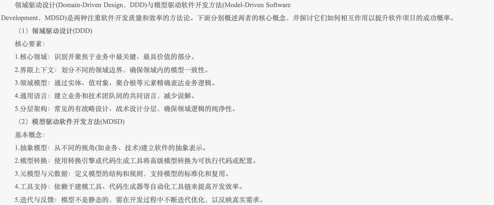
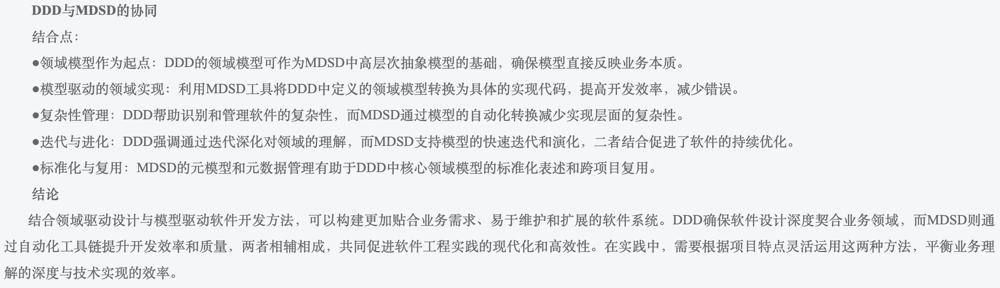

# 高级架构师高频题型总结

## 选择题

### 面向对象

1. 在 UML 用例图中，参与者之间存在 __ 关系。

    A. 聚合 B. 包含 C. 继承/泛化 (✅) D. 扩展

    ??? note

        用例图描述了一组用例、参与者以及它们之间的关系。这里没考察用例之间的关系，而是考察了参与者之间的关系

        

        参与者、国际留学生与参与者、学生之间的关系是泛化关系

2. 数据资产的特性包括：可控制、可量化、可变现、虚拟性、共享性、时效性、安全性、交换性和规模性。

<!-- more -->

### 英文题

1. Accelerated analysis approaches emphasize the construction of _1_ to more rapidly identify business and user requirements fo a new system. As an accelerated analysis technology, _2_ reads the program code and automatically generates the equivalent system model, and the code can be obtained from _3_. All system analysis approaches requires some from of _4_ which includes those techniques to be used to identify or extract system problems and solution requirements from user community. _5_ is a classical set of techniques used to collect information about system problems, opportunities, solution requirements, and priorities.

      1.  A. object models 

          B. prototypes (✅)

          C. use cases 

          D. components

      2.  A. eXtreme programming 
          
          B. model driven 
          
          C. reverse engineering (✅) 
          
          D. agile Method

      3.  A. existing database and application program 

          B. application program and user interface 
          
          C. existing database and user interface 
          
          D. existing database, application program and user interface (✅)

      4.  A. requirement discovery (✅)
          
          B. business process redesign 
          
          C. cause-and-effect analysis 
          
          D. total quality management

      5.  A. Continuous process improvement

          B. Joint Requirements planning

          C. Fact-finding (✅)

          D. Structured engineering

## 简答题

### Web 系统架构设计

1. 请用 200 字以内的文字说明什么是面向服务架构（SOA）以及 ESB 在 SOA 中的作用与特点。

    * 什么是面向服务架构（SOA）
    
        面向服务的体系架构（SOA）是一种粗粒度、松耦合服务架构，服务之间通过简单、精确定义接口进行通信。它可以根据需求通过网络对松散耦合粗粒度应用组件进行分布式部署、组合和使用。SOA 能帮助企业系统架构设计者以更迅速、更可靠、更高重用性设计整个业务系统架构，基于 SOA 的系统能够更加从容地面对业务的急剧变化。

    * ESB 在 SOA 中的作用与特点

        企业服务总线（ESB）是由中间件技术实现的全面支持面向服务架构的基础软件平台，支持异构环境中的服务以及基于消息和事件驱动模式的交互，并且具有适当的服务质量和可管理性。

2. 基于 SOA 的系统架构设计图

    

3. 列举 3 种可以实现信息系统安全保障的措施

    XML 加密模块、WS-Security、防火墙系统、安全检测、网路扫描

## 论文

### 论模型驱动架构设计方法及其应用写作要点

