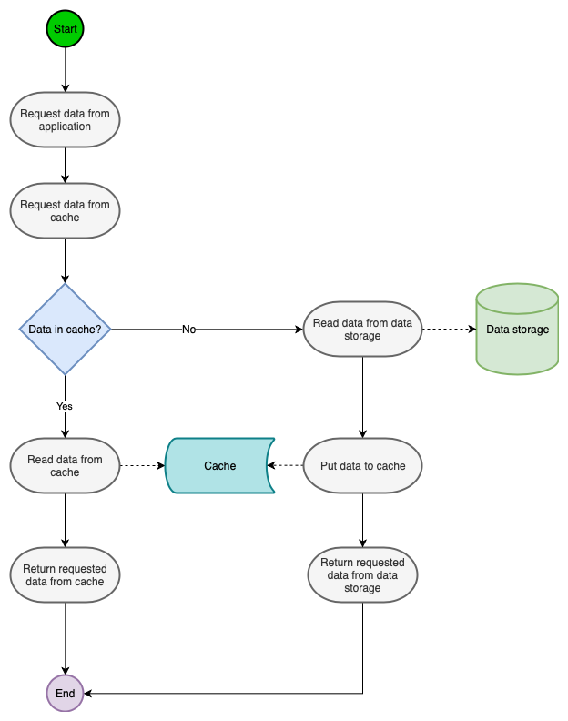
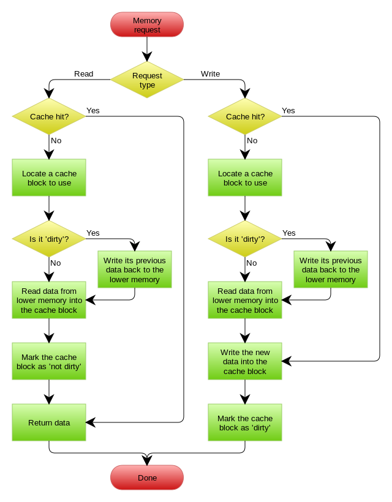

# 高频 `R/W` 场景下的性能设计方案

对于这个问题我们需要回归到计算机读写的核心上，计算机的读写速度是有限的，所以需要把数据缓存起来，来提高读写速度。为什么要使用缓存呢？从硬件角度我们知道计算机是有多级缓存架构的，每一级存储设备的读写速度是指数级下降的，越靠近终端存储设备（机械硬盘、固态硬盘）其读写速度越慢，越靠近 CPU 的存储设备其读写速度越快。

缓存是一个有着更快的查询速度的存储技术，这里的更快是指比起从初始的数据源查询（比如数据库，以下都称作数据库）而言。我们经常会把频繁请求的或是耗时计算的数据缓存起来，在程序收到请求这些数据的时候可以直接从缓存中查询数据返回给客户端来提高系统的吞吐量，现在我们来看看有哪些缓存模式可以考虑。

<!-- more -->

## Cache-Aside

`Cache-Aside` 是最广泛使用的缓存模式之一，如果能正确使用 `Cache-Aside` 的话，能极大的提升应用性能，`Cache-Aside` 可用来读或写操作。

我们先来看看读操作时的数据流：

1. 应用程序发起读请求
2. 应用程序先查询缓存，如果缓存中有数据，则直接返回缓存中的数据
3. 如果缓存中没有数据，则查询数据库，并将查询到的数据返回给应用程序
4. 应用程序将查询到的数据写入缓存

如果程序需要更新数据库中的数据且该数据也在缓存上，此时缓存中的数据也需要做相应的处理。为了解决这个不同步的问题来确认数据的一致性和操作性能，有两个方式可按需使用。

1. 缓存失败：该情况下，当请求需要更新数据库数据的时候，缓存中的值需要被删除掉（删除掉就表示旧值不可用了），当下次该key被再次查询到就去数据库中查出最新的数据；
2. 缓存更新：缓存数据也可以在数据库更新的时候被更新，从而在一次操作中让之后的查询有更快的查询体验和更好的数据一致性。

为了应对不用类型的数据需要，有以下缓存加载策略可被选择：

1. 使用时加载缓存：当需要使用缓存数据时，就从数据库中把它查询出来，第一次查询之后，接下来的请求都能从缓存中查询到数据；
2. 预加载缓存：在项目启动的时候，预加载类似“国家信息、货币信息、用户信息，新闻信息”等不是经常变更的数据。

!!! example "[应用案例](https://learn.microsoft.com/en-us/azure/architecture/patterns/cache-aside)"

!!! quote

    这是标准的 `design pattern`，包括 `Facebook` 的论文 [《Scaling Memcache at Facebook》](https://www.usenix.org/system/files/conference/nsdi13/nsdi13-final170_update.pdf) 也使用了这个策略。为什么不是写完数据库后更新缓存？你可以看一下 `Quora` 上的这个问答 [《Why does Facebook use delete to remove the key-value pair in Memcached instead of updating the Memcached during write request to the backend?》](https://www.quora.com/Why-does-Facebook-use-delete-to-remove-the-key-value-pair-in-Memcached-instead-of-updating-the-Memcached-during-write-request-to-the-backend)，主要是怕两个并发的写操作导致脏数据。

    那么，是不是 `Cache Aside` 这个就不会有并发问题了？不是的，比如，一个是读操作，但是没有命中缓存，然后就到数据库中取数据，此时来了一个写操作，写完数据库后，让缓存失效，然后，之前的那个读操作再把老的数据放进去，所以，会造成脏数据。

    但，这个 `case` 理论上会出现，不过，实际上出现的概率可能非常低，因为这个条件需要发生在读缓存时缓存失效，而且并发着有一个写操作。而实际上数据库的写操作会比读操作慢得多，而且还要锁表，而读操作必需在写操作前进入数据库操作，而又要晚于写操作更新缓存，所有的这些条件都具备的概率基本并不大。

    所以，这也就是 `Quora` 上的那个答案里说的，要么通过 `2PC` 或是 `Paxos` 协议保证一致性，要么就是拼命的降低并发时脏数据的概率，而 `Facebook` 使用了这个降低概率的玩法，因为 `2PC` 太慢，而 `Paxos` 太复杂。当然，最好还是为缓存设置上过期时间。

## Read-Through

`Read-Through` 和 `Cache-Aside` 很相似，不同点在于程序不需要再去管理从哪去读数据（缓存还是数据库）。相反它会直接从缓存中读数据，该场景下是缓存去决定从哪查询数据。当我们比较两者的时候这是一个优势因为它会让程序代码变得更简洁。

!!! tip

    使用解偶的设计思想，客户端无需关注底层实现，只需要关注接口即可。详细可以了解面向对象的设计范式。

## Write-Through

`Write-Through` 下所有的写操作都经过缓存，每次我们向缓存中写数据的时候，缓存会把数据持久化到对应的数据库中去，且这两个操作都在一个事务中完成。因此，只有两次都写成功了才是最终写成功了。这的确带来了一些写延迟但是它保证了数据一致性。

同时，因为程序只和缓存交互，编码会变得更加简单和整洁，当你需要在多处复用相同逻辑的时候这点变的格外明显。

当使用 `Write-Through` 的时候一般都配合使用 `Read-Through`。`Write-Through` 适用情况有：

1. 需要频繁读取相同数据；
2. 不能忍受数据丢失（相对 `Write-Behind` 而言）和数据不一致

!!! tip

    `Write-Through` 的潜在使用例子是银行系统。

## Write-Behind

`Write-Behind` 和 `Write-Through` 在“程序只和缓存交互且只能通过缓存写数据”这一点上很相似。不同点在于 `Write-Through` 会把数据立即写入数据库中，而 `Write-Behind` 会在一段时间之后（或是被其他方式触发）把数据一起写入数据库，这个异步写操作是`Write-Behind` 的最大特点。

数据库写操作可以用不同的方式完成，其中一个方式就是收集所有的写操作并在某一时间点（比如数据库负载低的时候）批量写入。另一种方式就是合并几个写操作成为一个小批次操作，接着缓存收集写操作（比如 5 个）一起批量写入。

异步写操作极大的降低了请求延迟并减轻了数据库的负担。同时也放大了数据不一致的。比如有人此时直接从数据库中查询数据，但是更新的数据还未被写入数据库，此时查询到的数据就不是最新的数据。

!!! note

    这个设计的好处就是可以让数据的 `I/O` 快到飞起，因为异步，写操作和可以合并对同一个数据的多次操作，所以性能是相当可观的。对于数据不一致的问题，我们可以采用一些其他策略来保证，但是需要理解的是没有什么方案是完美无缺的，总是得有妥协，就像算法设计中空间换时间一个道理，有时候强一致和高性能是有冲突的。软件设计从来都是取舍。

    另外，`Write Behind` 实现逻辑比较复杂，因为他需要 `track` 有哪数据是被更新了的，需要刷到持久层上。操作系统的 `write back` 会在仅当这个 `cache` 需要失效的时候，才会被真正持久起来，比如，内存不够了，或是进程退出了等情况，这又叫 `lazy write`。

    在 `Wikeipedia` 上有一张 `Write Behind` 的流程图，基本逻辑如下：

    

## 总结

上面讲的这些 `Design Pattern`，其实并不是软件架构里的 `mysql` 数据库和 `memcache/redis` 的更新策略，这些东西都是计算机体系结构里的设计，比如 `CPU` 的缓存，硬盘文件系统中的缓存，硬盘上的缓存，数据库中的缓存。基本上来说，这些缓存更新的设计模式都是非常老古董的，而且历经长时间考验的策略，所以这也就是，工程学上所谓的 `Best Practice`，遵从就好了。

有时候，我们觉得能做宏观的系统架构的人一定是很有经验的，其实，宏观系统架构中的很多设计都来源于这些微观的东西。比如，云计算中的很多虚拟化技术的原理，和传统的虚拟内存不是很像么？`Unix` 下的那些 `I/O` 模型，也放大到了架构里的同步异步的模型，还有 `Unix` 发明的管道不就是数据流式计算架构吗？`TCP` 的好些设计也用在不同系统间的通讯中，仔细看看这些微观层面，你会发现有很多设计都非常精妙……所以，请允许我在这里放句观点鲜明的话——如果你要做好架构，首先你得把计算机体系结构以及很多老古董的基础技术吃透了。

在软件开发或设计中，我非常建议在之前先去参考一下已有的设计和思路，看看相应的 `guideline，best practice` 或 `design pattern`，吃透了已有的这些东西，再决定是否要重新发明轮子。千万不要似是而非地，想当然的做软件设计。

!!! note

    真实的系统中需求都不太一样，我们应该根据自己的需要来选择一个或组合几个模式来完成实现。