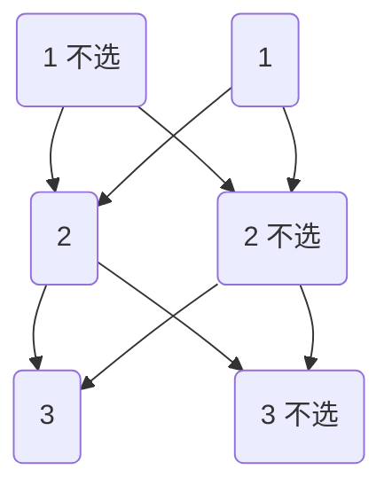

# 关于组合问题的算法设计

昨天做了力扣编号为 [`2597`](https://leetcode.cn/problems/the-number-of-beautiful-subsets/description/) 的算法题，需要遍历数组的所有集合，并从集合中选出符合要求的集合。了解后发现需要使用回溯算法解决，特此记录。

递归 + 回溯是一种非常强大的算法设计技巧，特别适合解决组合问题（如遍历所有子集）。它的核心思路是通过递归探索所有的可能，并通过回溯撤销选择，从而覆盖所有可能的组合。

它是如何工作的，本质上子集问题的目标是找到所有可能的自己。对于一个长度为 $n$ 的数组，总共有 $2n$ 个子集（包括空集）。比如 ${1, 2, 3}$ 的子集是：

$$
\{1\}、\{2\}、\{3\}、\{1, 2\}、\{1, 3\}、\{2, 3\}、 \{\}
$$

这是一个非常简单的例子，每个人都可以轻松的列出任何一个数组的子集，但是我们的思维过程是如何的？因为过于简单我们往往忽略了这个思维过程，在选择一个数组子集时，我们会观察数组中的每个数字，对于每个数组我们都有两种选择：

1. 选择该数字包含在子集中；
2. 选择该数字不包含在子集中。

递归 + 回溯正是基于这种 “选择” 的思想，通过递归调用枚举所有可能的选择。核心思想是 **通过递归调用，逐步构建子集。在递归返回时，撤销之前的选择，尝试其他可能性。** 具体来说：

1. 对于每个元素，我们有两个选择：选或不选；
2. 递归调用会分别处理这两种选择；
3. 当递归到达数组末尾时，当前的选择路径就是一个完整的子集。

那程序应该如何实现呢？我们尝试用伪代码模拟这个思维过程：

??? Example "伪代码"

    1. 选择数字 $1$
    2. 判断是否存在这个组合，如果存在执行步骤三；如果不存在记录改组合，执行步骤三
    3. 继续在此基础上遍历下一个数字