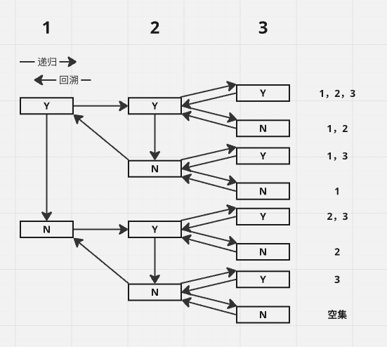

# 关于组合问题的算法设计

昨天做了力扣编号为 [`2597`](https://leetcode.cn/problems/the-number-of-beautiful-subsets/description/) 的算法题，需要遍历数组的所有集合，并从集合中选出符合要求的集合。了解后发现需要使用回溯算法解决，特此记录。

递归 + 回溯是一种非常强大的算法设计技巧，特别适合解决组合问题（如遍历所有子集）。它的核心思路是通过递归探索所有的可能，并通过回溯撤销选择，从而覆盖所有可能的组合。

它是如何工作的，本质上子集问题的目标是找到所有可能的自己。对于一个长度为 $n$ 的数组，总共有 $2n$ 个子集（包括空集）。比如 ${1, 2, 3}$ 的子集是：

$$
\{1\}、\{2\}、\{3\}、\{1, 2\}、\{1, 3\}、\{2, 3\}、 \{\}
$$

<!-- more -->

这是一个非常简单的例子，每个人都可以轻松的列出任何一个数组的子集，但是我们的思维过程是如何的？因为过于简单我们往往忽略了这个思维过程，在选择一个数组子集时，我们会观察数组中的每个数字，对于每个数组我们都有两种选择：

1. 选择该数字包含在子集中；
2. 选择该数字不包含在子集中。

递归 + 回溯正是基于这种 “选择” 的思想，通过递归调用枚举所有可能的选择。核心思想是 **通过递归调用，逐步构建子集。在递归返回时，撤销之前的选择，尝试其他可能性。** 具体来说：

1. 对于每个元素，我们有两个选择：选或不选；
2. 递归调用会分别处理这两种选择；
3. 当递归到达数组末尾时，当前的选择路径就是一个完整的子集。



我们可以通过图片了解如何通过 **递归+回溯** 遍历所有的子集，调用过程可以用一颗二叉树来表示，每个节点代表一个选择（选或不选）。

递归 + 回溯能覆盖所有子集的原因在于：

1. 完全枚举：对于每个元素，递归调用会分别处理“选”和“不选”两种情况，确保所有可能性都被探索；
2. 回溯撤销选择：在递归返回时，撤销当前的选择，确保不会遗漏其他可能性；
3. 递归终止条件：当递归到达数组末尾时，当前的选择路径就是一个完整的子集。

以下是递归 + 回溯遍历所有子集的代码实现（以 Go 为例）：

```go
func subsets(nums []int) [][]int {
    var result [][]int
    var dfs func(index int, path []int)
    dfs = func(index int, path []int) {
        if index == len(nums) {
            // TODO: 我们可以在递归终止条件时根据具体场景撤销选择该子集
            result = append(result, append([]int{}, path...)) // 保存当前子集
            return
        }
        dfs(index+1, path) // 不选当前元素
        dfs(index+1, append(path, nums[index])) // 选当前元素
    }
    dfs(0, []int{})
    return result
}
```

这种方法不仅适用于子集问题，还可以推广到其他组合问题（如排列、组合、棋盘问题）。