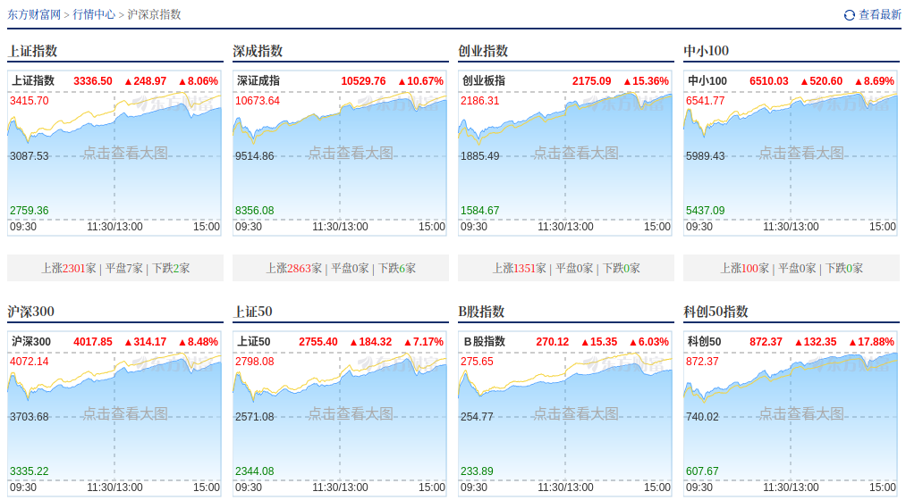

# 爱在深秋

今年中国的十一假期可谓是来的五味杂陈，就在假期前的头两个星期还是一片愁云惨雾，在经济上没有什么好消息，没人能提得起度假的心情，可是在就月份的最后一个星期——9 月 26 号的政治局会议之后，大陆的 A 股迎来了历史性的大涨，再次冲向了三千点。

9 月 30 号这天央视网登出了一则题为[《股市大涨、文旅火热……金秋丰收时节，各行业满载希望喜迎国庆》](https://news.cctv.com/2024/09/30/ARTI4mhujEYOd0A3fsYmGPUL240930.shtml)的文章，当日上证指数大涨 **8.06%**，创造了自 2015 年股灾以来最大的单日涨幅，深成指这天的涨幅也达到了 **10.67%**，为低迷的股市注入了新的动能，我愿称此次上涨为 **爱在深秋**。

<!-- more -->
