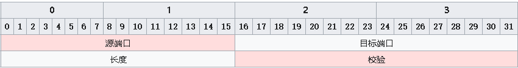

> 文章引自·知乎·[微光倾城](https://zhuanlan.zhihu.com/p/357080855)

## 简介

UDP（UserDatagramProtocol）是一个简单的面向消息的传输层协议，尽管 UDP 提供`标头`和有效负载的`完整性验证`（通过校验和），但它`不保证向上层协议提供消息传递`，并且 UDP 层在发送后不会保留 UDP 消息的状态。因此，UDP 有时被称为不可靠的数据报协议。**如果需要传输可靠性，则必须在用户应用程序中实现。**

UDP 使用具有最小协议机制的简单无连接通信模型。UDP 提供数据完整性的校验和，以及用于在数据报的源和目标寻址不同函数的端口号。它没有握手对话，因此将用户的程序暴露在底层网络的任何不可靠的方面。如果在网络接口级别需要纠错功能，应用程序可以使用为此目的设计的传输控制协议（TCP）。
<!-- more -->

## UDP 协议

UDP是基于IP的简单协议，建议先看一下IP协议[《IP协议详解》](https://mp.weixin.qq.com/s?__biz=MzIxNTg1NzQwMQ==&mid=2247485204&idx=1&sn=f451dae4f4ada4b6ec2f55075df72c27&chksm=9790a682a0e72f9497c13001c215883298c9e7137d160c58c5e417939962e1abb96c0972be17&scene=21#wechat_redirect)相关内容。

* **源端口和目的端口：**端口号理论上可以有 `2^16` 这么多。因为它的长度是 16 个 bit。

* **Length：**占用 2 个字节，标识 UDP 头的长度，包括首部长度和数据长度。可以有 65535 字节那么长。但是一般网络在传送的时候，一次一般传送不了那么长的协议（涉及到 MTU 的问题），就只好对数据分片。

* **Checksum：**校验和，包含 UDP 头和数据部分。这是一个可选的选项，并不是所有的系统都对 UDP 数据包加以检验和数据(相对 TCP 协议的必须来说)，但是 RFC 中标准要求，发送端应该计算检验和。

UDP 检验和覆盖 UDP 协议头和数据，这和 IP 的检验和是不同的，IP 协议的检验和只是覆盖 IP 数据头，并不覆盖所有的数据。UDP 和 TCP 都包含一个伪首部，这是为了计算检验和而设置的。

伪首部甚至还包含 IP 地址这样的 IP 协议里面都有的信息，目的是让 UDP 两次检查数据是否已经正确到达目的地。**如果发送端没有打开检验和选项，而接收端计算检验和有差错，那么 UDP 数据将会被悄悄的丢掉（不保证送达），而不产生任何差错报文。**

## 端口

端口号是 16 位的非负整数，它的范围是 `0 - 65535` 之间，这个范围会分为三种不同的端口号段，由端口号是由互联网分配号码管理局（IANA）进行分配

* **周知/标准端口号：**它的范围是 `0 - 1023`。在 Unix 的操作系统上，使用这些端口之一需要超级用户操作权限

* **注册端口号：**范围是 `1024 - 49151`。是用于IANA 注册服务的注册端口。

* **私有端口号：**范围是 `49152 - 65535`。未正式指定用于任何特定服务，可用于任何目的。这些端口也可以用作临时端口，在主机上运行的软件可以使用这些端口根据需要动态创建通信终结点。

端口的作用，简单说就是为了区分不同应用程序的，当电脑接收到一个数据报，将根据不同的端口将数据送给不同的应用程序。所以上面说到互联网分配号码管理局（IANA）分配。

当然端口并不是唯一用来区分不同应用程序的因素，假如来到达服务器的两个 80 端口的数据报，但实际上，这两个数据报需要送给不同的应用程序。所以仅凭端口号来确定某一条报文显然是不够的。互联网上一般使用源 IP 地址、目标 IP 地址、源端口号、目标端口号来进行区分。如果其中的某一项不同，就被认为是不同的报文段。这些也是多路分解和多路复用的基础，关于多路分解和多路复用本文不再详细讲解。

> 这部分内容同样适用于 TCP 协议中的端口部分。

## UDP 和 ARP 之间的交互

这是不常被人注意到的一个细节，这是针对一些系统地实现来说的。当 ARP 缓存还是空的时候。UDP 在被发送之前一定要发送一个 ARP 请求来获得目的主机的 MAC 地址，如果这个 UDP 的数据包足够大，大到 IP 层一定要对其进行分片的时候，想象中，该 UDP 数据包的第一个分片会发出一个 ARP 查询请求，所有的分片都会等到这个查询完成以后再发送。事实上是这样吗？

结果是，某些系统会让每一个分片都发送一个 ARP 查询，所有的分片都在等待，但是接受到第一个回应的时候，主机却只发送了最后一个数据片而抛弃了其他，这实在是让人匪夷所思。这样，因为分片的数据不能被及时组装，接收主机将会在一段时间内将永远无法组装的 IP 数据包抛弃，并且发送组装超时的 ICMP 报文（其实很多系统不产生这个差错），以保证接收主机自己的接收端缓存不被那些永远得不到组装的分片充满。

## UDP 适用的场景

UDP 协议一般作为**流媒体应用、语音交流、视频会议**所使用的传输层协议，还有许多基于互联网的电话服务使用的 VOIP（基于IP的语音）也是基于 UDP 运行的，实时视频和音频流协议旨在处理偶尔丢失的数据包，因此，如果重新传输丢失的数据包，则只会发生质量略有下降，而不是出现较大的延迟。

我们大家都知道的 DNS 协议底层也使用了 UDP 协议，这些应用或协议之所以选择 UDP 主要是因为以下这几点：

1. **速度快**：采用 UDP 协议时，只要应用进程将数据传给 UDP，UDP 就会将此数据打包进 UDP 报文段并立刻传递给网络层，然而 TCP 有拥塞控制的功能，它会在发送前判断互联网的拥堵情况，如果互联网极度阻塞，那么就会抑制 TCP 的发送方。使用 UDP 的目的就是希望`**实时性**`。

2. **无须建立连接**：TCP 在数据传输之前需要经过三次握手的操作，而 UDP 则无须任何准备即可进行数据传输。因此 UDP 没有建立连接的时延。

3. **无连接状态**：TCP 需要在端系统中维护连接状态，连接状态包括接收和发送缓存、拥塞控制参数以及序号和确认号的参数，在 UDP 中没有这些参数，也没有发送缓存和接受缓存。因此，某些专门用于某种特定应用的服务器当应用程序运行在 UDP 上，一般能支持更多的活跃用户

4. **分组首部开销小**：每个 TCP 报文段都有 20 字节的首部开销，而 UDP 仅仅只有 8 字节的开销。

## UDP 洪水

**UDP 洪水**是一种拒绝服务攻击，攻击者将大量用户数据报协议（UDP）数据包发送到目标服务器，旨在让该设备的处理和响应能力无力承担。由于 UDP 洪水攻击，保护目标服务器的防火墙也可能不堪重负，导致对正常流量拒绝服务。

**UDP 洪水攻击的工作原理**主要是利用服务器响应发送到其端口之一的 UDP 数据包时所采取的步骤。在正常情况下，服务器在特定端口上收到 UDP 数据包时，将通过以下两个步骤进行响应：

1. 服务器首先检查是否有任何当前侦听指定端口请求的程序正在运行。

    如果该端口上没有程序正在接收数据包，则服务器将以 ICMP (ping) 数据包作为响应，以告知发送方目标不可达。

UDP 洪水就好比酒店接待员转接呼叫的情况。首先，接待员接到电话，呼叫者要求将其连接到特定客房。然后，接待员需要查看所有房间的列表，以确保客人在客房内，并愿意接听电话。如果接待员了解到客人没有接听电话，他们就必须重新接听电话，并告诉呼叫者客人不会接听电话。如果所有电话线路都突然同时发出类似请求，他们很快就会变得不堪重负。

2. 由于目标服务器利用资源来检查并响应每个接收到的 UDP 数据包，当收到大量 UDP 数据包时，目标资源会很快耗尽，从而导致对正常流量拒绝服务。

### 如何防护 UDP 洪水攻击？

大多数操作系统限制 ICMP 数据包的响应速率，部分原因是为了中断需要 ICMP 响应的 DDoS 攻击。这种防护措施的一个缺点是，在攻击期间，合法数据包也可能在此过程中被过滤。如果 UDP 洪水的大小足以使目标服务器的防火墙的状态表饱和，则在服务器级别发生的任何防护都将是不够的，因为瓶颈将发生在目标设备的上游。
