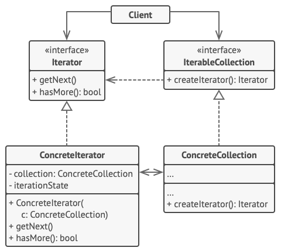

迭代器模式是一种行为设计模式， 让你能在不暴露集合底层表现形式 （列表、 栈和树等） 的情况下遍历集合中所有的元素。

## 模式结构



1. **迭代器 （Iterator）** 接口声明了遍历集合所需的操作： 获取下一个元素、 获取当前位置和重新开始迭代等。
2. **具体迭代器 （Concrete Iterators）** 实现遍历集合的一种特定算法。 迭代器对象必须跟踪自身遍历的进度。 这使得多个迭代器可以相互独立地遍历同一集合。
3. **集合 （Collection）** 接口声明一个或多个方法来获取与集合兼容的迭代器。 请注意， 返回方法的类型必须被声明为迭代器接口， 因此具体集合可以返回各种不同种类的迭代器。
4. **具体集合 （Concrete Collections）** 会在客户端请求迭代器时返回一个特定的具体迭代器类实体。 你可能会琢磨， 剩下的集合代码在什么地方呢？ 不用担心， 它也会在同一个类中。 只是这些细节对于实际模式来说并不重要， 所以我们将其省略了而已。
5. **客户端 （Client）** 通过集合和迭代器的接口与两者进行交互。 这样一来客户端无需与具体类进行耦合， 允许同一客户端代码使用各种不同的集合和迭代器。

    客户端通常不会自行创建迭代器， 而是会从集合中获取。 但在特定情况下， 客户端可以直接创建一个迭代器 （例如当客户端需要自定义特殊迭代器时）。

## 应用场景

* **当集合背后为复杂的数据结构， 且你希望对客户端隐藏其复杂性时 （出于使用便利性或安全性的考虑）， 可以使用迭代器模式。**

    迭代器封装了与复杂数据结构进行交互的细节， 为客户端提供多个访问集合元素的简单方法。 这种方式不仅对客户端来说非常方便， 而且能避免客户端在直接与集合交互时执行错误或有害的操作， 从而起到保护集合的作用。

* **使用该模式可以减少程序中重复的遍历代码。**

    重要迭代算法的代码往往体积非常庞大。 当这些代码被放置在程序业务逻辑中时， 它会让原始代码的职责模糊不清， 降低其可维护性。 因此， 将遍历代码移到特定的迭代器中可使程序代码更加精炼和简洁。

* **如果你希望代码能够遍历不同的甚至是无法预知的数据结构，可以使用迭代器模式。**

    该模式为集合和迭代器提供了一些通用接口。 如果你在代码中使用了这些接口， 那么将其他实现了这些接口的集合和迭代器传递给它时， 它仍将可以正常运行。

## 实现方式

迭代器模式的主要思想是将集合背后的迭代逻辑提取至不同的、 名为迭代器的对象中。 此迭代器提供了一种泛型方法， 可用于在集合上进行迭代， 而又不受其类型影响。

1. 声明迭代器接口。 该接口必须提供至少一个方法来获取集合中的下个元素。 但为了使用方便， 你还可以添加一些其他方法， 例如获取前一个元素、 记录当前位置和判断迭代是否已结束。

    === "iterator.go: 迭代器"

        ```go 
        package main

        type Iterator interface {
            hasNext() bool
            getNext() *User
        }
        ```

2. 声明集合接口并描述一个获取迭代器的方法。 其返回值必须是迭代器接口。 如果你计划拥有多组不同的迭代器， 则可以声明多个类似的方法。

    === "collection.go: 集合"
        
        ```go 
        package main

        type Collection interface {
            createIterator() Iterator
        }
        ```

3. 为希望使用迭代器进行遍历的集合实现具体迭代器类。 迭代器对象必须与单个集合实体链接。 链接关系通常通过迭代器的构造函数建立。

    === "userIterator.go: 具体迭代器"

        ```go 
        package main

        type UserIterator struct {
            index int
            users []*User
        }

        func (u *UserIterator) hasNext() bool {
            if u.index < len(u.users) {
                return true
            }
            return false

        }
        func (u *UserIterator) getNext() *User {
            if u.hasNext() {
                user := u.users[u.index]
                u.index++
                return user
            }
            return nil
        }
        ```

4. 在你的集合类中实现集合接口。 其主要思想是针对特定集合为客户端代码提供创建迭代器的快捷方式。 集合对象必须将自身传递给迭代器的构造函数来创建两者之间的链接。

    === "userCollection.go: 具体集合"

        ```go 
        package main

        type UserCollection struct {
            users []*User
        }

        func (u *UserCollection) createIterator() Iterator {
            return &UserIterator{
                users: u.users,
            }
        }
        ```

5. 检查客户端代码， 使用迭代器替代所有集合遍历代码。 每当客户端需要遍历集合元素时都会获取一个新的迭代器。

    === "user.go: 客户端代码"

        ```go 
        package main

        type User struct {
            name string
            age  int
        }
        ```

    === "main.go: 客户端代码"

        ```go 
        package main

        import "fmt"

        func main() {

            user1 := &User{
                name: "a",
                age:  30,
            }
            user2 := &User{
                name: "b",
                age:  20,
            }

            userCollection := &UserCollection{
                users: []*User{user1, user2},
            }

            iterator := userCollection.createIterator()

            for iterator.hasNext() {
                user := iterator.getNext()
                fmt.Printf("User is %+v\n", user)
            }
        }
        ```

    === "output.txt: 执行结果"

        ```go 
        User is &{name:a age:30}
        User is &{name:b age:20}
        ```

## 优缺点

=== "优点"

    * 单一职责原则。 通过将体积庞大的遍历算法代码抽取为独立的类， 你可对客户端代码和集合进行整理。
    * 开闭原则。 你可实现新型的集合和迭代器并将其传递给现有代码， 无需修改现有代码。 
    * 你可以并行遍历同一集合， 因为每个迭代器对象都包含其自身的遍历状态。 

=== "缺点"

    * 如果你的程序只与简单的集合进行交互， 应用该模式可能会矫枉过正。 
    * 对于某些特殊集合， 使用迭代器可能比直接遍历的效率低。
    * 相似的， 你可以暂停遍历并在需要时继续。

## 与其他模式的关系

* 你可以使用 **迭代器模式** 来遍历 **组合模式** 树。
* 你可以同时使用 **工厂方法模式** 和 **迭代器** 来让子类集合返回不同类型的迭代器， 并使得迭代器与集合相匹配。
* 你可以同时使用 **备忘录模式** 和 **迭代器** 来获取当前迭代器的状态， 并且在需要的时候进行回滚。
* 可以同时使用 **[访问者模式](./visitor.md)** 和 **迭代器** 来遍历复杂数据结构， 并对其中的元素执行所需操作， 即使这些元素所属的类完全不同。