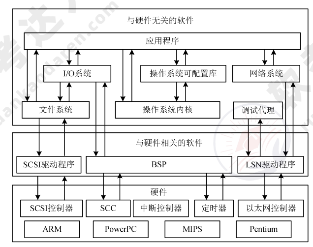

# 嵌入式系统架构设计理论与实践（编制中）

## 嵌入式系统发展历程

## 嵌入式系统硬件

## 嵌入式系统软件

1. 嵌入式操作系统的定义及特点

    嵌入式操作系统（Embedded Operating System，EOS）是指用于嵌入式系统的操作系统。与通用的操作系统相比，嵌入式操作系统具有：可剪裁性，可移植性，强实时性，强紧凑性，高质量代码，强定制性，标准接口，强稳定性，弱交互性，强确定性，操作简捷、方便，较强的硬件适应性，可固化性的特点。

2. 嵌入式系统的架构

    嵌入式操作系统分为面向控制、通信领域以及面向消费电子产品两类。嵌入式操作系统的架构如图所示。

    

### 嵌入式操作系统的基本功能

操作系统内核架构包括：

1. 宏内核。用于管理用户程序和硬件间的系统资源，在宏内核中用户服务和内核服务在同一空间中实现，代码耦合度非常高，内核的功能组件代码可以互相调用。
2. 微内核。微内核管理所有系统资源，在微内核中用户服务和内核服务在不同空间中实现，系统结构清晰，代码量少。

**任务管理。** 任务是嵌入式操作系统调度最小单位，类似于计算机操作系统中进程的概念。任务有 3 种工作状态：

1. 执行状态：任务获得处理机，程序在处理机中执行。
2. 就绪状态：任务已获得处理机以外资源，待获得处理机即可执行。
3. 阻塞状态：执行状态任务因等待事件发生无法执行而放弃处理机。

**嵌入式操作系统大都支持优先级抢占调度算法和时间片轮转调度算法。** 在实时系统的任务调度中，存在大量的实时调度方法，大致可以分为：

1. 离线调度算法：系统运行前确定调度信息，如时间驱动，确定性，缺乏灵活性。
2. 在线调度算法：系统运行中动态获得调度信息，如优先级驱动，灵活性较大。
3. 抢占调度算法：运行任务可能被打断，更复杂，更耗资源。
4. 非抢占调度算法：运行任务不被打断。
5. 静态调度算法：任务优先级在设计时确定，不变化，简单，缺乏灵活性。
6. 动态调度算法：任务优先级在运行中确定，不断变化，灵活，耗资源。

实时调度算法中还有强实时调度算法，具体可以分为：

1. 最早截止时间优先（Earliest Deadline First，EDF）调度算法：根据任务截止时间确定优先级，截止时间越早，其优先级越高。
2. 最低松弛度优先（Least Laxity First，LLF）调度算法：根据任务紧急或松弛程度确定优先级，紧急程度越高，优先级越高。
3. 单调速率（Rate Monotonic Scheduling，RMS）调度算法：根据任务周期确定有限期，周期越短，优先级越高。这种算法被认为是最优的。

**存储管理。** 存储管理的主要目的是解决多个用户使用主存的问题，存储管理方法主要包括分区、分页、分段、段页式存储管理以及虚拟存储管理等。

**任务间通信。** 任务间通信管理也是嵌入式操作系统的关键功能之一。它主要为操作系统
的应用程序提供多种类型的数据传输、任务同步/异步操作等手段。

### 嵌入式数据库

嵌入式数据库具有嵌入式、实时性、移动性、伸缩性的特点。嵌入式数据库可以按照如下方式分类：

1. 按嵌入对象分为：软件嵌入数据库、设备嵌入数据库、内存数据库。
2. 按系统结构分为：嵌入数据库、移动数据库、小型 C/S 结构数据库。
3. 按存储位置分为：

      1. 基于内存的数据库系统：采用内存存储，属于实时事务最佳技术；
      2. 基于文件的数据库：以文件方式磁盘存储，安全性低；
      3. 基于网络的数据库：远程服务器存储，无须解析 SQL，支持更多 SQL 操作，客户端小，便于代码重用。

#### 嵌入式数据库架构

数据库管理系统与嵌入式数据库对比见表：

| 对比项     | 数据库管理系统               | 嵌入式数据库              |
|------------|------------------------------|---------------------------|
| 操作用户   | 允许非开发人员操作            | 只允许应用程序访问和控制  |
| 访问控制   | 数据与程序分离，便于访问控制 | 应用程序负责访问和控制    |
| 发布部署   | 独立安装、部署和管理          | 与应用程序一同发布        |

1. 基于内存的数据库系统。典型产品是 eXtremeDB 嵌入式数据库，它具有：最小化资源消耗、保持极小堆空间、维持极小代码体积、消除额外代码层、提供动态数据结构本地支持等特点。
2. 基于文件的嵌入式数据库系统架构。典型产品是 SQLite，它的特点是：开源的内嵌式关系型数据库、集成在程序中，无须配置管理，服务器客户端同进程，简化管理，减少网络开销、对数据类型有独特处理。
3. 基于网络的嵌入式数据库系统架构。C/S 架构的数据库、B/S 架构的数据库以及云数据库等都属于这种类型。

#### 嵌入式数据库主要功能

除了具有与通用数据库相似的功能外，嵌入式数据库还具有的功能包括：足够高效的数据存储机制、数据安全控制（锁机制）、实时事务管理机制、数据库恢复机制（历史数据存储）。

### 嵌入式中间件

嵌入式中间件是在嵌入式系统中处于嵌入式应用和操作系统之间层次的中间软件，其主要作用是对嵌入式应用屏蔽底层操作系统的异构性，常见功能有网络通信、内存管理和数据处理等。典型的嵌入式中间件有消息中间件、分布式对象中间件。

### 嵌入式系统软件开发环境

嵌入式系统软件开发环境的特点是：集成开发环境，交叉开发，开放式架构，可扩展性，可操作性，可移植性，可配置性，实时性，可维护性，用户界面友好。

## 嵌入式系统软件架构设计方法

## 嵌入式系统软件架构实践