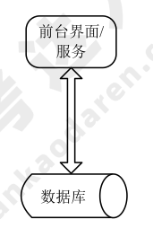
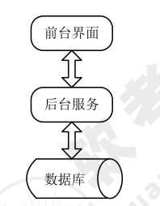
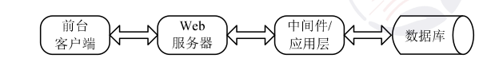

# 信息系统架构设计理论与实践

## 信息系统架构风格与分类

## 信息系统常用架构模型

### 单体应用
### 客户机/服务器

客户机/服务器是信息系统中最常见的模式，这种模式下客户端和服务器之间通过 TCP/UDP 进行请求和应答。常见的客户机/服务器形式有以下几种：

1. **二层 C/S（Client/Server）。** 这是一种 **胖客户端**，主要是指前台客户端 + 后台数据库的形式。

    

2. **三层 C/S 和 B/S（Browser/Server）**

    

      1. **三层 C/S：** 前台客户端+后台服务器+后台数据库；
      2. **瘦客户端：** 前台界面和业务逻辑处理分离，前台客户端仅含前台界面；
      3. **三层 B/S：** Web 浏览器+Web 服务器+后台数据库。

        B/S 本质是浏览器与服务器采用基于 TCP/IP 或 UDP 的 HTTP 协议。前台客户端与后台服务端通信协议有：TCP/IP 协议，基于 TCP/IP 协议通过 Socket 自定义实现的协议，RPC 协议，CORBA/IIOP 协议，JAVA RMI 协议，J2EE JMS 协议， HTTP 协议。

3. **多层 C/S 和 B/S 结构。**
      1. **多层 C/S：** 是指三层以上的结构。形式是前台客户端+后台服务端+中间件/应用层+数据库，其中，中间件/应用层的作用有以下 3 点：

          * 提高并发性能和可伸缩性；
          * 请求转发，业务逻辑处理；
          * 增加数据安全性。

           

      1. **多层 B/S：** 是指三层以上的结构，形式是 Web 浏览器+Web 服务器+中间件/应用层+数据库。

    !!! info "2010 综合知识 40"

        客户机/服务器系统开发时可以采用不同的分布式计算架构：
        
        * 分布式表示架构是将表示层和表示逻辑层迁移到客户机，应用逻辑层、数据处理层和数据层仍保留在服务器上；
        * 分布式数据架构是将数据层和数据处理层放置于服务器，应用逻辑层、表示逻辑层和表示层放置于客户机；
        * 分布式数据和应用架构是将数据层和数据处理层放置在数据服务器上，应用逻辑层放置在应用服务器上，表示逻辑层和表示层放置在客户机上。

4. **模型-视图-控制器（Model-View-Controller，MVC）。** 在 J2EE 架构中，形式是：Web 浏览器（View）+ Web 服务器（Controller 也可以是加上中间件/应用层的形式）+数据库，关于模型层可根据实际情况与 MV 一起置于 Web 服务器，或单独置于应用层。

### 面向服务架构（SOA）

在 SOA 中服务的概念是指能提供一组整体功能的独立应用系统。这个应用系统被去掉任何一层服务，都将不能正常工作。在实践中，要实现 SOA 可以借助诸如消息中间件、交易中间件等中间件 来实现。SOA 的应用模式最典型、最流行的就是 Web Service，即两个互联网应用之间可以互相向对方开放一些功能模块、函数、过程等“服务”，然后通过消息机制或远程过程调用（Remote Procedure Call，RPC）这样的中间件去调用对方的服务。**面向服务架构主要实践有异构系统集成、同构系统聚合、联邦架构等。**

### 企业服务总线（ESB）/企业数据总线（EDB）

企业总线是企业应用间信息交换的公共通道，具有如下特征：

* 连接软件系统，主要提供 **服务代理功能** 和 **服务注册表**。
* 按照协议消息头进行数据、请求、回复的接收和分发。
* 可以基于消息中间件、事务中间件、CORBA/IIOP 协议开发构建。

!!! info "2011 综合知识 20,21"

    针对题干描述，该企业进行系统集成时，“业务系统的运行平台和开发语言差异较大，而且系统所使用的通信协议和数据格式各不相同“。在这种情况下，需要采用总线技术对传输协议和数据格式进行转换与适配。当需 要集成并灵活定义系统功能之间的协作关系时，应该釆用基于工作流的功能关系定义方式。

## 企业信息系统总体框架

## 信息系统架构设计方法