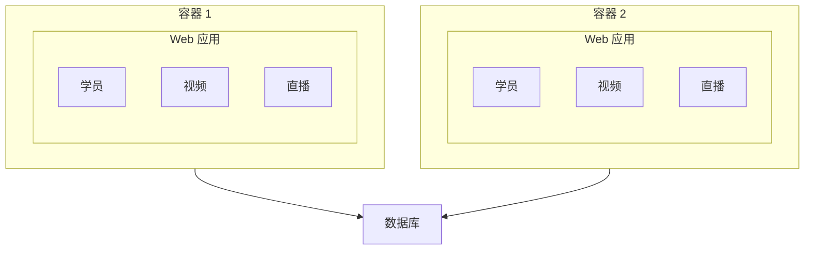
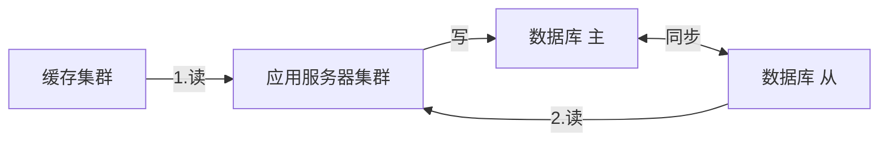
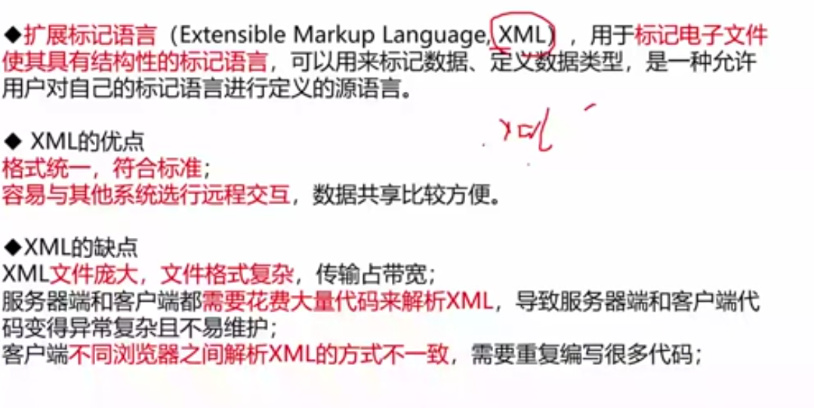

# Web 应用开发（重要）

| 纬度|涉及技术架构|
|--|--|
| 从架构来看 | MVC、MVP、MVVM、REST、Webservice、微服务 |
|从缓存来看|Mem Cache、Redis、Squid|
|从并发分流来看|集群（负载均衡）、CDN|
|从数据库来看|主从库（主从复制）、内存数据库、反规范化技术、NoSQL、分区（分表）技术、视图|
|从持久化来看|Hibernate、Mybatis|
|从分布式存储来看|Hadoop、FastDFS、区块链|
|从数据编码来看|XML、JSON|
|从 Web 应用服务器来看|Apache、WebSphere、Weblogic、Tomcat、JBOSS、IIS|
|其他|有状态与无状态、响应式 Web 设计等|

## Web 技术演变

* 单台机器到数据库与 Web 服务器分离
* 应用服务器集群

    存在问题：用户请求由谁来转发到具体的应用服务器；用户如果每次访问的服务器都不一致，那么如何维护 session 的一致性。

    解决方案：

      1. 设置 session 服务器，统一管理 session 会话信息

      2. 负载均衡，客户端保存 cookie 信息，每次访问携带 cookie 信息

* 数据库集群，分为主从库
* 用缓存缓解从库读取压力

## 面向服务架构 SOA

SOA 是一个组件模型，它将应用程序的不同功能单元（称为服务）通过这些服务之间定义良好的接口和契约联系起来。接口是采用中立方式进行定义的，它应该独立于实现服务的硬件平台、操作系统和编程语言。这使得构建在各种各样的系统中的服务可以以一种统一和通用的方式进行交互。

ESB 作用与特点：

1. SOA 的一种实现方式，ESB 在面向服务的架构中起到的是总线作用，将各种服务进行连接与整合；
2. 描述服务的元数据和服务注册管理；
3. 在服务请求者和提供者之间传递数据，以及这些数据进行转换的能力，并支持由实践中总结出来的一些模式如同步模式、异步模式等；
4. 发现、路由、匹配和选择的能力，以支持服务之间的动态交互，解偶服务请求者和服务提供者。高级一些的能力，包括对安全的支持、服务质量保证、可管理性和负责平衡等。

## Q&A

### CDN 内容分发网络

CDN （Content Delivery Network，内容分发网络）是建立并覆盖在承载网之上，由分布在不同区域的边缘节点服务器群组成的分布式网络。通过中心平台的负载均衡、内容分发、调度等功能模块，使用户就近获取所需内容，降低网络拥塞，提高用户访问响应速度和命中率。CDN 的关键技术主要有内容存储和分发技术。

CDN 的基本原理是广泛采用各种缓存服务器，将这些缓存服务器分布到用户访问相对集中的地区或网络中，在用户访问网站时，利用全局负载技术将用户的访问指向距离最近的工作正常的缓存服务器上，由缓存服务器直接响应用户请求。

### REST 表述性状态传递

REST （Representational State Transfer）是一种软件架构风格，设计风格而不是标准，只是提供了一组设计原则和约束条件。它主要用于客户端和服务器交互类的软件。基于这个风格设计的软件可以更简洁，更有层次，更易于实现缓存等机制。

**REST 的 5 个原则**

* 网络上的所有事物都被抽象为资源；
* 每个资源对应一个唯一的资源标识；
* 通过通用的连接接口对资源进行操作；
* 对资源的各种操作不会改变资源标识；
* 无状态性：所有的操作都是无状态的。

### 微服务架构

微服务架构建议将大型复杂的单体架构应用划分为一组微小的服务，每个微服务根据其负责的具体业务职责提炼为单一的业务功能；每个服务可以很容易地部署并发布到生产环境里隔离和独立的进程内部，它可以很容易的扩展和变更；对于一个具体的服务来说可以采用任何适用的语言和工具来快速实现；服务之间基于基础设施互相协同工作。

微服务的优势：

1. 解决了复杂性问题，他把庞大的单一模块应用分解为一系列的服务，同时保持总体功能不变；
2. 让每个微服务能够独立开发，开发者能够自由选择可行的技术，让服务来决定 API 约定；
3. 每个微服务都能独立配置，开发者不必协调对于本地服务配置上的变化，这种变化一旦测试完成就被配置了；
4. 让每个服务都可以独立调整，你可以给每个服务配置正好满足容量和可用性限制的实例数。

微服务架构带来的挑战：

1. 并非所有的系统都能转成微服务。例如一些数据库层的底层操作是不推荐服务化的；
2. 部署较以往架构更加复杂：系统由众多微服务搭建，每个微服务需要单独部署，从而增加部署的复杂度，容器技术能够解决这一问题；
3. 性能问题：由于微服务注重独立性，互相通信时职能通过标准接口，可能产生延迟或调用出错，例如一个服务需要访问另一个服务的数据，只能通过服务间接口来进行数据传输，如果是频繁访问，则可能带来较大的延迟；
4. 数据一致性问题：作为分布式部署的微服务，在保持数据一致性方面需要比传统架构更加复杂。

### 扩展标记语言 XML

### JSON 轻量级数据交换格式

### 无状态服务

