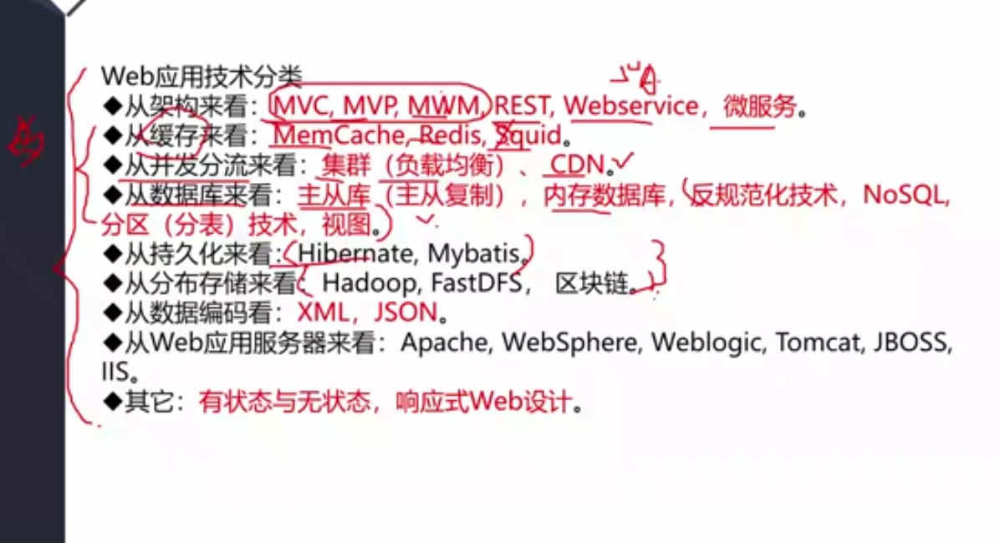
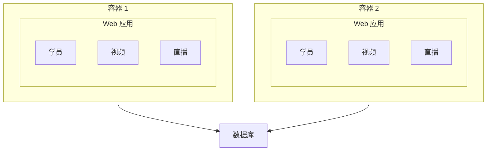
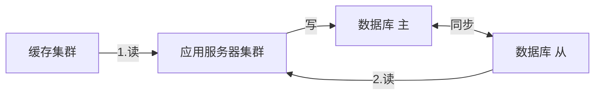
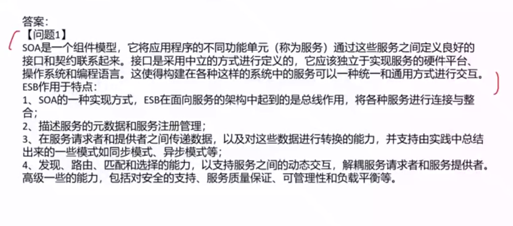
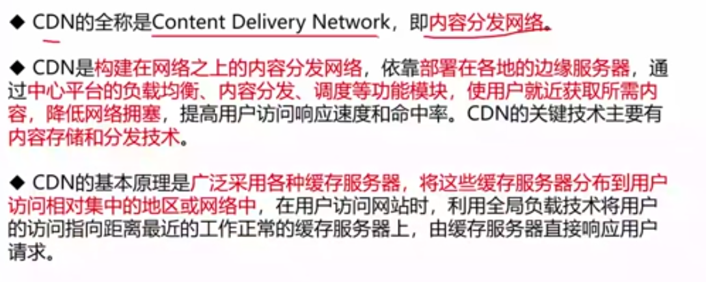
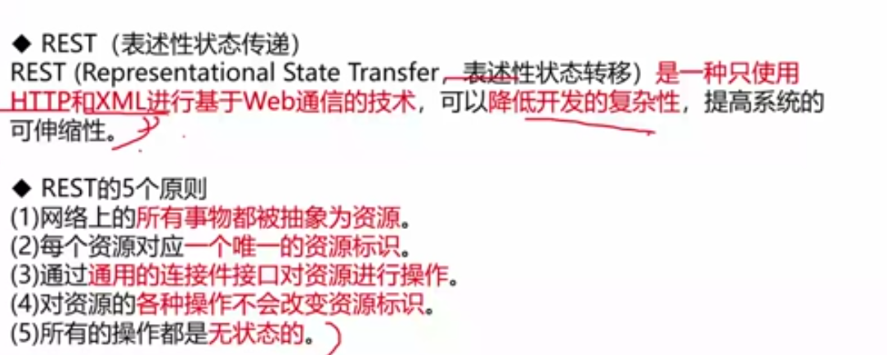
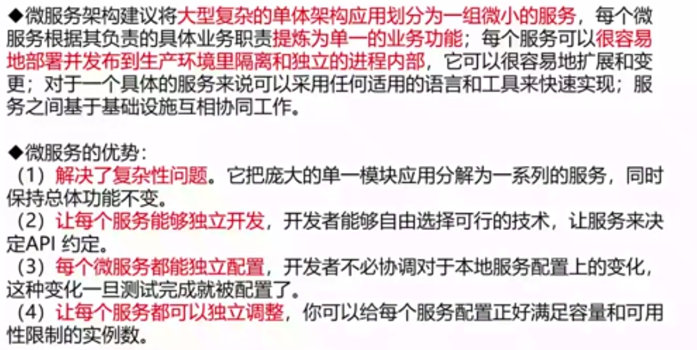
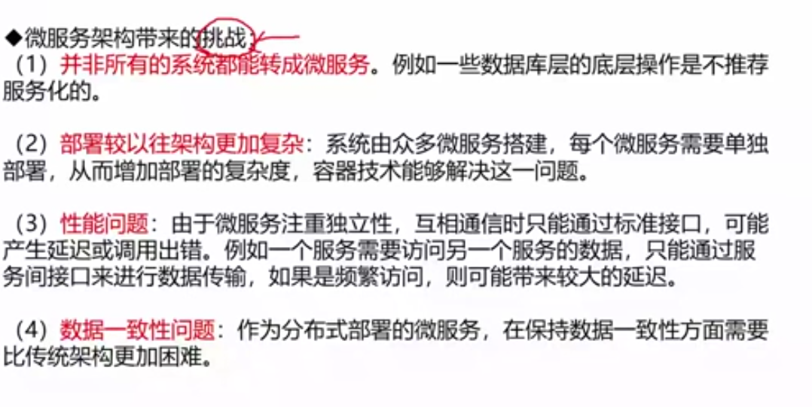
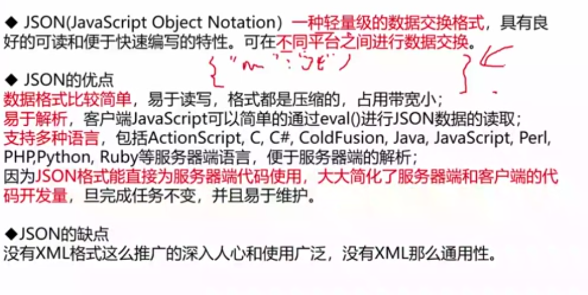
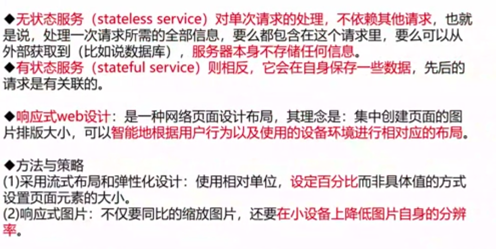

# Web 应用开发（重要）

## Web 技术演变

* 单台机器到数据库与 Web 服务器分离
* 应用服务器集群

    存在问题：用户请求由谁来转发到具体的应用服务器；用户如果每次访问的服务器都不一致，那么如何维护 session 的一致性。

    解决方案：

        1. 设置 session 服务器，统一管理 session 会话信息

        2. 负载均衡，客户端保存 cookie 信息，每次访问携带 cookie 信息

* 数据库集群，分为主从库
* 用缓存缓解从库读取压力

## 面向服务架构 SOA

## Q&A

### CDN 内容分发网络

### REST 表述性状态传递

### 微服务架构

### 扩展标记语言 XML

### JSON 轻量级数据交换格式

### 无状态服务

