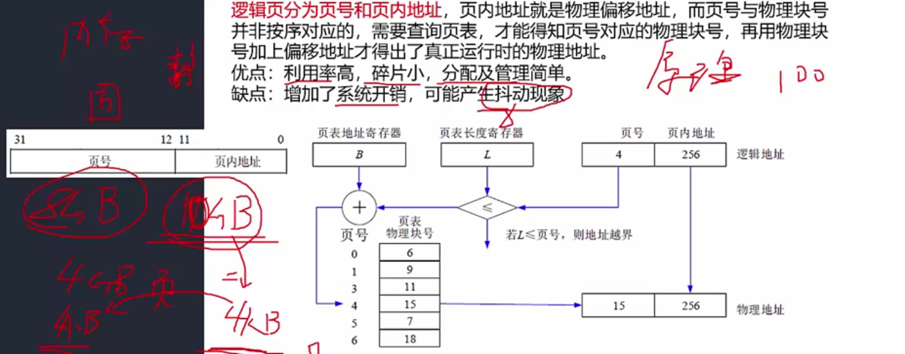
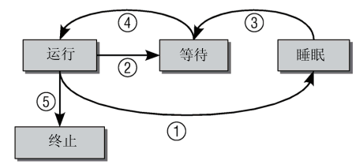
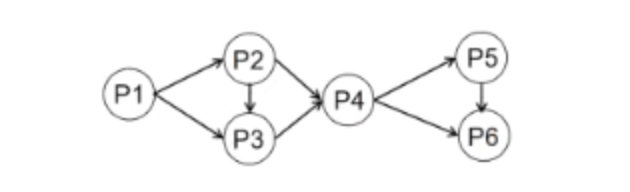

# 计算机系统

## 计算机硬件基础知识

**冯·诺依曼计算机结构**

计算机的基本硬件系统由 **运算器**、**控制器**、**存储器**、**输入设备** 和 **输出设备** 五大部分组成，这种结构称为冯·诺依曼计算机结构。

### 典型的处理器系统（运算器、控制器）

处理器主要有以下四大功能：

* 程序控制：CPU 通过执行指令来控制程序的执行顺序；
* 操作控制：一条指令功能的实现需要若干操作信号配合来完成，CPU 产生每条指令的操作信号并将操作信号送往对应的部件，控制相应的部件按指令的功能要求进行操作；
* 时间控制：CPU 对各种操作进行时间上的控制，即指令执行过程中操作信号的出现时间、持续时间及出现的时间顺序都需要进行严格控制；
* 数据处理：CPU 通过对数据进行算术运算及逻辑运算等方式进行加工处理，数据加工处理的结果被人们所利用。

此外，处理器还要对系统内部和外部的中断（异常）做出响应，进行相应的处理。

CPU 主要由运算器、控制器、寄存器组和内部总线等部件组成。

* **运算器：** 执行所有的算术运算，如加减乘除等；执行所有的逻辑运算并进行逻辑测试，如与、或、非、比较等；由以下几部分组成：
    * **算术逻辑单元 ALU**（实现对数据的算术和逻辑运算）;
    * **累加寄存器 AC**（运算结果或源操作数的存放区）;
    * **数据缓冲寄存器 DR**(暂时存放内存的指令或数据);
    * **状态条件寄存器 PSW** （保存指令运行结果的条件码内容，如溢出标志等）。
* **控制器：** 控制整个 CPU 的工作。由以下几部分组成：
    * **指令寄存器 IR**（暂存 CPU 执行指令）;
    * **程序寄存器 PC**（存放指令执行地址）;
    * **地质寄存器 AR**（保存 CPU 当前访问的内存地址）;
    * **指令译码器 ID**（分析指令操作码）。

!!! warning

    CPU 依据指令周期的不同阶段来区分二进制的指令和数据，因为在指令周期的不同阶段，指令会命令 CPU 分别去取指令和数据。

#### 微内核

在设计微内核 OS 时，采用了面向对象的技术，其中的“封装”，“继承”，“对象类” 和“多态性”，以及在对象之间采用消息传递机制等，都十分有利于提高系统的“正确性”、“可靠性”、“易修改性”、“易扩展性”等，而且还能显著地减少开发系统所付出的开销。采用微内核结构的操作系统与传统的操作系统相比，其优点是提高了系统的灵活性、可扩充性，增强了系统的可靠性，提供了对分布式系统的支持。其原因如下。

1. **灵活性和可扩展性：** 由于微内核 OS 的许多功能是由相对独立的服务器软件来实现的，当开发了新的硬件和软件时，微内核 OS 只需在相应的服务器中增加新的功能，或再增加一个专门的服务器。与此同时，也必然改善系统的灵活性，不仅可在操作系统中增加新的功能，还可修改原有功能，以及删除已过时的功能，以形成一个更为精干有效的操作系统。
2. **增强了系统的可靠性和可移植性：** 由于微内核是出于精心设计和严格测试的，容易保证其正确性；另一方面是它提供了规范而精简的应用程序接口（API）,为微内核外部的程序编制高质量的代码创造了条件。此外，由于所有服务器都是运行在用户态，服务器与服务器之间采用的是消息传递通信机制，因此，当某个服务器出现错误时，不会影响内核，也不会影响其他服务器。另外，由于在微内核结构的操作系统中，所有与特定 CPU 和 I/O 设备硬件有关的代码，均放在内核和内核下面的硬件隐藏层中，而操作系统其他绝大部分（即各种服务器）均与硬件平台无关，因而，把操作系统移植到另一个计算机硬件平台上所需作的修改是比较小的。
3. **提供了对分布式系统的支持：** 由于在微内核 OS 中，客户和服务器之间以及服务器和服务器之间的通信，是采用消息传递通信机制进行的，致使微内核 OS 能很好地支持分布式系统和网络系统。事实上，只要在分布式系统中赋予所有进程和服务器唯一的标识符，在微内核中再配置一张系统映射表（即进程和服务器的标识符与它们所驻留的机器之间的对应表），在进行客户与服务器通信时，只需在所发送的消息中标上发送进程和接收进程的标识符，微内核便可利用系统映射表将消息发往目标，而无论目标是驻留在哪台机器上。

!!! note

    

!!! info "2010 综合知识 1"

!!! info "2010 综合知识 9"

    计算机执行程序时，在一个指令周期的过程中，为了能够从内存中读指令操作码，首先是将程序计数器（PC）的内容送到地址总线上。

!!! info "2010 综合知识 12"

    CPU 访问内存通常是同步方式，CPU 与 I/O 接口交换信息通常是同步方式，CPU 与 PCI总线交换信息通常是同步方式，I/O 接口与打印机交换信息则通常采用基于缓存池的异步方式。

#### 专用处理器

    除了通用的处理器，用于专用目的的专用处理器芯片不断涌现，常见的有图形处理器（Graphics Processing Unit，GPU）、信号处理器（Digital Signal Processor，DSP）以及现场可编程逻辑门阵列（Field Programmable Gate Array，FPGA）等。GPU 常有数百个或数千个内核，经过优化可并行运行大量计算；DSP 专用于实时的数字信号处理，常采用哈佛体系结构。

#### 指令集系统

典型的处理器根据指令集的复杂程度可分为<u>复杂指令集（Complex Instruction Set Computers，CISC）</u>与<u>精简指令集（Reduced Instruction Set Computers，RISC）</u>两类。

CISC 以 Intel、AMD 的x86 CPU 为代表，RISC 以 ARM 和 Power 为代表。

国产处理器目前有龙芯、飞腾、申威等品牌，常采用 RISC-V、MIPS、ARM 等精简指令集架构。

1. 指令格式：$操作码 OP : 地址码 A$ 操作码指定要完成的操作或功能，地址码指定操作数或操作数所在的位置。
2. 指令的寻址方式：
      1. 顺序寻址：下一条指令的地址由程序计数器 PC 给出，PC 每次自增 + 1；
      2. 跳跃寻址：下一条指令的地址由指令本身给出，PC 指令中包含要跳转的地址；
3. 操作数的寻址方式：
      1. 立即数寻址：操作数直接包含在指令中；
      2.  直接寻址：操作数在内存中，指令中包含操作数的地址；
      3. 间接寻址：操作数在内存中，指令中包含操作数地址的地址；
      4. 寄存器寻址：操作数在寄存器中；
      5. 寄存器间接寻址：操作数在寄存器中，指令中包含操作数在寄存器中的地址；
      6. 相对寻址：操作数在内存中，指令中包含操作数的偏移量，地址由程序计数器中的值加上指令中的位移量给出。
      7. 基址寻址：操作数在内存中，指令中包含操作数的偏移量，地址由基址寄存器中的值加上指令中的位移量给出；
      8. 变址寻址：操作数在内存中，指令中包含操作数的偏移量，地址由变址寄存器中的值加上指令中的位移量给出；

计算机指令执行过程：取指令、分析指令、执行指令。首先将程序计数器 PC 中的指令地址取出，送入地址总线，CPU 依据指令地址去内存中取出指令内容存入指令寄存器 IR；之后由指令译码器进行分析，分析指令操作码；最后取出指令执行所需的源操作数，执行指令。

CPU 如何区分指令和数据：在指令周期的不同阶段，指令会命令 CPU 分别去取指令和数据，因此，CPU 依据指令周期的不同阶段来区分二进制的指令和数据。

**指令流水线的计算**

* 非流水执行时间：$一条指令执行的时间*指令总数$
* 流水执行时间：$第一条指令的执行时间+最长流水段时间*(n-1)$，$n$ 为指令总数
* 加速比：非流水方式与流水方式所用时间之比
* 流水线的操作周期：为最长流水段时间
* 流水线的吞吐率：为最长流水段时间的倒数
* 连续 n 条指令的吞吐率：$指令总数/总时间$

!!! info "2011 综合知识 9"

    CISC (Complex Instruction Set Computer,复杂指令集计算机）的基本思想是进一步增强原有指令的功能，用更为复杂的新指令取代原先由软件子程序完成的功能，实现软件功能的硬件化，导致机器的指令系统越来越庞大而复杂。CISC 计算机一般所含的指令数目至少 300 条以上，有的甚至超过 500 条。CISC 的主要缺点如下：

    * 微程序技术是 CISC 的重要支柱，每条复杂指令都要通过执行一段解释性微程序才能完成，这就需要多个 CPU 周期，从而降低了机器的处理速度；
    * 指令系统过分庞大，从而使高级语言编译程序选择目标指令的范围很大，并使编译程序本身冗长而复杂，从而难以优化编译使之生成真正髙效的目标代码；
    * CISC 强调完善的中断控制，势必导致动作繁多，设计复杂，研制周期长；
    * CISC 给芯片设计带来很多困难，使芯片种类增多，出错几率增大，成本提高而成品率降低。

    RISC (Reduced Instruction Set Computer,精简指令集计算机）的基本思想是通过减少指令总数和简化指令功能，降低硬件设计的复杂度，使指令能单周期执行，并通过优化编译，提高指令的执行速度，采用硬线控制逻辑，优化编译程序。实现 RISC 的关键技术有：
    
    * 重叠寄存器窗口（overlapping register windows)技术，首先应用在伯克利的 RISC 项目中；
    * 优化编译技术，RISC 使用了大量的寄存器，如何合理分配寄存器、提高寄存器的使用效率，减少访存次数等，都应通过编译技术的优化来实现；
    * 超流水及超标量技术，这是 RISC 为了进一步提高流水线速度而采用的新技术；
    * 硬线逻辑与微程序相结合在微程序技术中。

### 存储器

存储器是利用半导体、磁、光等介质制成用于存储数据的电子设备。

根据<u>存储器的硬件结构</u>可分为 SRAM、DRAM、NVRAM、Flash、EPROM、Disk 等。

按照<u>与处理器的物理距离</u>可分为 4 个层次：片上缓存、片外缓存、主存（内存）、外存。其访问速度依次降低，而容量依次提高。

!!! Tip

    在计算机系统中，常选用生产与运行成本、存储容量和读写速度各不相同的多种存储介质，组成一个统一管理的存储器系统，使每种介质充分发挥各自在速度、容量、成本方面的优势，从而达到最优性能价格比，满足使用要求。

#### 高速缓存 Cache

高速缓存 Cache 用来存放当前最活跃的程序和数据，作为主存局部域的副本，其特点是：容量一般在几 KB 到几 MB 之间；速度一般比主存快 5 到 10 倍，由快速半导体存储器构成；其内容是主存局部域的副本，对程序员来说是透明的。

**替换算法的目标** 就是使 Cache 获得最高的命中率。常用算法有 **随机替换算法、先进先出算法、近期最少使用算法和优化替换算法。**

Cache 的性能是计算机系统性能的重要方面。命中率是 Cache 的一个重要指标，但不是最主要的指标。Cache 设计的目标是 **在成本允许的条件下达到较高的命中率，使存储系统具有最短的平均访问时间。**

**Cache 的命中率与 Cache 容量的关系是：** Cache 容量越大，则命中率越高，随着 Cache容量的增加，其命中率逐渐接近 100%。但是增加 Cache 容量意味着增加 Cache 的成本和增加 Cache 的命中时间。

Cache 的功能是解决 CPU 和主存间速度不匹配的问题。

Cache 的理论依据是：程序的局部性原理。

CPU 对主存中指令和数据的访问，在一段时间内，总是集中在一小块存储空间里。

* 时间局部性：最近访问过的指令和数据很可能会被再次访问；
* 空间局部性：最近访问过的指令和数据往往集中在一小片存储区域。

=== "主存与 Cache 的地址映射"

    在 CPU 工作时，送出的是主存单元的地址，而应从 Cache 存储器中读写信息。因此，必须将 CPU 送出的主存单元地址转换为 Cache 存储器中的单元地址，这个过程称为地址映射。

    * 全相联映射：主存中的任何一块存储单元都可以映射到 Cache 中的任何一块存储单元。这种映射方式具有最大的灵活性，但需要比较复杂的硬件。
    * 直接映射：主存中的任何一块存储单元只能映射到 Cache 中的固定一块存储单元。这种映射方式具有最简单的硬件，但灵活性较差。
    * 组相联映射：主存中的任何一块存储单元可以映射到 Cache 中的固定一组存储单元中的任意一块。这种映射方式介于全相联映射和直接映射之间，既具有全相联映射的优点，又具有直接映射的优点，但需要中等复杂度的硬件。

=== "替换策略"

    Cache 替换算法的目的是使 Cache获得尽可能高的命中率。

    * 随机替换算法：将 Cache 中任意一块存储单元替换出去。这种算法实现简单，但命中率不高。
    * FIFO（First In First Out）算法：将 Cache 中最早进入 Cache 的数据先替换出去。这种算法实现简单，但命中率不高。
    * LFU（Least Frequently Used）算法：将 Cache 中访问次数最少的存储单元替换出去。这种算法命中率较高，但实现复杂。
    * LRU（Least Recently Used）算法：将 Cache 中最近最少使用的数据替换出去。这种算法命中率较高，但实现复杂。

=== "性能指标"

    Cache 的性能指标主要有 **命中率、平均访问时间、替换策略等。**

    * 命中率：指 CPU 欲访问的信息在 Cache 中能找到的比例。命中率越高，则 Cache 的性能越好。在一个程序执行期间，设 $N_c$ 表示 cache 完成存取的次数，$N_m$ 表示主存完成存取的次数，则 Cache 的命中率 $H$ 为：$H = \frac{N_c}{N_c + N_m}$
    * 平均访问时间：指 CPU 访问一次 Cache 或主存所需的时间。平均访问时间越短，则 Cache 的性能越好。
    * 替换策略：指当 Cache 满时，如何选择被替换的 Cache 块。替换策略的好坏直接影响到 Cache 的命中率。

!!! info "2010 综合知识 11"

!!! info "2010 综合知识 10"

!!! info "2011 综合知识 10"
    
#### 磁盘

磁盘正反有两个盘面，每个盘面有多个同心圆，每个同心圆是一个 **磁道**，每个同心圆又被划分为多个 **扇区**，数据就被存储在一个个扇区中。

磁头首先要寻找到对应的磁道，然后等待磁盘进行周期旋转，旋转到指定的扇区，才能读取到对应的数据，因此，会产生 **寻道时间** 和 **等待时间**。公式为：$\text{存取时间} = \text{寻道时间} + \text{等待时间}$ （平均定位时间 + 转动延迟）

!!! tip

      1. 寻道时间是指磁头移动到磁道所需的时间
      2. 等待时间是指等待读写的扇区转到磁头下方所用的时间

磁盘调度算法

| 磁盘调度算法           | 描述 |
| ---------------------- | ---- |
| 先来先服务 FCFS        |   根据进程请求访问磁盘的先后顺序进行调度   |
| 最短寻道时间优先 SSTF  | 请求访问的磁道与当前磁道最近的进程优先调度，使得每次的寻道时间最短。会产生“饥饿”现象，即远处进程可能永远无法访问
| 扫描算法 SCAN          | 又称为“电梯算法”，磁头在磁盘上双向移动，其会选择离磁头当前所在磁道最近的请求访问的磁道，并且与磁头移动方向一致，磁头永远都是从里向外或从外向里一直移动完才掉头，与电梯类似
| 单向扫描调度算法 CSCAN | 与 SCAN 不同的是，其只做单向移动，即只能从里向外或从外向里。

!!! info "2010 综合知识 11"

### 输入输出技术

#### 中断

1. 程序查询方式：CPU 查询 IO 设备是否准备好，若准备好则进行数据传送，否则继续查询。这种方式 CPU 的工作效率很低。
2. 中断方式：当 IO 设备准备好后，向 CPU 发出中断请求，CPU 暂停当前程序，转去处理 IO 设备的中断服务程序，待 IO 设备完成数据传送后，再继续执行被中断的程序。这种方式提高了 CPU 的工作效率。
3. DMA（直接存储器访问）方式：DMA 控制器接管总线控制权，当 IO 设备准备好后，向 DMA 发出请求，DMA 控制器将 IO 设备的数据直接送入内存，待 IO 设备完成数据传送后，再继续执行被中断的程序。这种方式进一步提高了 CPU 的工作效率。
5. I/O 处理器（IOP）方式（通道方式）：当 IO 设备准备好后，向 I/O 处理器发出请求，I/O 处理器将 IO 设备的数据送入内存，待 IO 设备完成数据传送后，再继续执行被中断的程序。这种方式进一步提高了 CPU 的工作效率。

!!! note "访管中断"

    ![alt text](images/image-13.png

#### 总线

总线（Bus）是指计算机部件间遵循某一特定协议实现数据交换的形式，即以一种特定格式按照规定的控制逻辑实现部件间的数据传输。

按照总线在计算机中所处的位置划分为<u>内总线、系统总线和外部总线。</u>

目前，计算机总线存在许多种类，常见的有 **并行总线** 和 **串行总线**。

| 名称     | 数据线                         | 特点                       | 应用                                       |
| -------- | ------------------------------ | -------------------------- | ------------------------------------------ |
| 并行总线 | 多条双向数据线                 | 有传输延迟，适合近距离连接 | 系统总线（计算机各部件）                   |
| 串行总线 | 一条双向数据线或两条单向数据线 | 速率不高，但适合长距离连接 | 通信总线（计算机之间或计算机与其他系统间） |

!!! info "2011 综合知识 12"

    总线是一组能为多个部件分时共享的信息传送线，用来连接多个部件并为之提供信息交换通路。所谓共享，指连接到总线上的所有部件都可通过它传递信息；分时性指某一时刻只允许一个部件将数据发送到总线上。因此，共享是通过分时实现的。

#### 接口

接口是指同一计算机不同功能层之间的通信规则。计算机接口有多种，常见的有输入输出接口如 HDMI、SATA、RS-232 等；网络接口如 RJ45、FC 等；以及 A/D 转换接口等非标准接口。

#### 外部设备

外部设备也称为外围设备，是计算机结构中的非必要设备，但从功能上又常常不可缺少，例如键盘、鼠标、显示器等。虽然种类多样，但都是通过接口实现与计算机主体的连接，并通过指令、数据实现预期的功能。

## 计算机软件基础知识

### 操作系统

操作系统是计算机系统的资源管理者，包含对系统软、硬件资源实施管理的一组程序。操作系统通常由操作系统的内核（Kernel）和其他许多附加的配套软件所组成，如用户界面、管理工具、开发工具和常用应用程序等。操作系统的重要作用如下：

1. 管理计算机中运行的程序和分配各种软、硬件资源。
2. 为用户提供友善的人机界面。
3. 为应用程序的开发和运行提供一个高效率的平台。

操作系统具有 **并发性、共享性、虚拟性和不确定性** 的特征。

操作系统的分类：

| 操作系统       | 描述                                                                                                                                                                                                                                                                                           |
| -------------- | ---------------------------------------------------------------------------------------------------------------------------------------------------------------------------------------------------------------------------------------------------------------------------------------------- |
| 批处理操作系统 | 根据同时执行的作业数又分为单道批处理和多道批处理。一个作业由用户程序、数据和作业说明书（作业控制语言）3 个部分组成。                                                                                                                                                                           |
| 分时操作系统   | 将 CPU 的工作时间划分为许多很短的时间片，每个时间片分别为一个终端的用户提供服务或者执行一个作业。分时系统主要有 4 个特点：多路性、独立性、交互性和及时性。                                                                                                                                     |
| 实时操作系统   | 对于外来信息能够以足够快的速度进行处理，并在被控对象允许的时间范围内快速做出反应，对可靠性要求很高，并且不强制要求用户交互。实时系统的应用非常广泛。                                                                                                                                           |
| 网络操作系统   | 使联网计算机能有效地共享网络资源，为网络用户提供各种服务和接口。特征包括硬件独立性和多用户支持等。                                                                                                                                                                                             |
| 分布式操作系统 | 指为分布式计算机系统配置的操作系统。分布式操作系统是网络操作系统的更高级形式，它保持网络系统所拥有的全部功能，同时又有透明性、可靠性和高性能等特性。                                                                                                                                           |
| 嵌入式操作系统 | 运行在嵌入式智能设备环境中，对整个智能硬件以及它所操作、控制                                                                                                                                                                                                                                   |
| 嵌入式操作系统 | 的各种部件装置等资源进行统一协调、处理、指挥和控制，特点是微型化、可定制、可靠性和易移植性。常采用硬件抽象层（Hardware Abstraction Layer，HAL）和板级支撑包（Board Support Package，BSP）来提高易移植性，常见的嵌入式实时操作系统有 VxWorks、μClinux、PalmOS、WindowsCE、μC/OS-II 和 eCos 等。 |

!!! info "2011 综合知识 1"

    操作系统为用户提供了两类接口：操作一级的接口和程序控制一级的接口。其中，操作一级接口包括 **操作控制命令、菜单命令** 等；程序控制一级的接口包括 **系统调用。**

!!! info "2012 综合知识 9"

    由于资源共享与进程合作，并发执行的任务（进程）之间可能产生相互制约关系，这些制约关系可分为两类：竞争与协作。并发进程之间的竞争关系为互斥，并发进程之间的协作关系体现为同步。
    
    同步是因合作进程之间协调彼此的工作而控制 S 己的执行速度，即因相互合作，相互等待而产生的制约关系。而互斥是进程之间竞争临界资源而禁止两个 y 上的进程同时进入临界区所发生的制约关系。

!!! info "2012 综合知识 12"

    任务是 RTOS 中最重要的操作对象，每个任务在 RTOS 的调度下由 CPU 分时执行。任务的调度目前主要有 **时间分片式、轮流查询式和优先抢占式** 三种，不同的 RTOS 可能支持其中一种或几种，其中优先抢占式对实时性的支持最好。
    
    在非实时系统中，**调度的主要目的是缩短系统平均响应时间，提高系统资源的利用率，或优化某一项指标；** 
    
    而实时系统中调度的目的则是要 **尽可能地保证每个任务满足他们的时间约束，及时对外部请求做出响应。**

### 存储管理

#### 分区存储管理

所谓分区存储组织，就是整存，将某进程运行所需的内存整体一起分配给它，然后再执行。主要有以下三种分区方式：

* **固定分区：** 静态分区方法，将主存分为若干个固定的分区，将要运行的作业装配进取，由于分区固定，大小和作业需要的大小不匹配，会产生内部碎片碎片造成内存的浪费。
* **可变分区：** 动态分区方法，主存空间的分区是在作业转入时划分，根据作业的大小动态地分配内存，当作业执行完毕后，释放其占用的分区，这样可变分区可以有效地利用内存，但会产生碎片问题，但容易将主存空间切割成许多块，会产生外部碎片。可变分区的算法如下：

    1. 首次适应算法：从低地址开始查找，找到第一个能满足要求的空闲区。
    2. 最佳适应算法：从低地址开始查找，找到第一个能满足要求的空闲区，其大小为要求大小最接近的空闲区。
    3. 最差适应算法：从低地址开始查找，找到第一个能满足要求的空闲区，其大小为要求大小最大的空闲区。
    4. 循环首次适应法：从上次找到的空闲区开始查找，不用每次都从头查找，这是与首次适应算法不同的地方，找到第一个能满足要求的空闲区。

* **可重定位分区：** 可以解决碎片问题，移动所有已经分配好的区域，使其成为一个连续的区域，这样其他外部细小的分区碎片可以合并为大的分区，满足作业要求。只在外部作业请求空间得不到满足时进行。

#### 分段存储管理

将进程空间分为一个个段，每个段有段号和段内地址，与页式存储不同的是，每段物理大小不同，分段是根据逻辑整体分段的，因此，段表也与页表的内容不同，页表中直接是逻辑页号对应物理块号，段表有段长和基址两个属性，才能确定一个逻辑段在物理段中的位置。

优点：段长可以根据需要动态改变，段与段之间相互独立，互不影响，可以共享，可以动态链接，可以动态增长。    

缺点：由于段长不固定，因此会产生碎片，且段表比页表复杂，需要更多的内存空间来存储段表。
 
#### 分页存储管理

逻辑页分为页号和页内地址，页内地址就是物理偏移地址，而页号与物理块好并非按顺序对应的，需要查询页表，才能得知页号对应的物理块号，再用物理块号加上偏移地址才的处理了真正运行时的物理地址。

优点：利用率高，碎片小，分配及管理简单

缺点：增加了系统开销，可能产生抖动现象

=== "页面置换算法"

    1. 最优算法：OPT，理论上的算法，无法实现，是在进程执行完后进行的最佳效率计算，用来让其他算法比较差距。原理是选择未来最长时间内不被访问的页面置换，这样可以保证未来执行的都是马上要访问的。
    2. 先进先出算法：FIFO，选择最先进入内存的页面置换，如果该页面在未来的某个时间点被访问，那么它将再次被加载到内存中。会产生抖动现象，即分配的页数越多，缺页率可能越多（即效率越低）。
    3. 最近最少使用：LRU，选择最近最少使用的页面置换，如果该页面在未来的某个时间点被访问，那么它将再次被加载到内存中。根据局部性原理，最近被访问的页面很可能在将来再次被访问，因此，LRU 算法可以有效地减少缺页率。这种方式效率搞，且不会产生抖动现象，使用大量计数器，但是没有 LFU 多。
    4. 淘汰原则：优先淘汰最近未访问的，而后淘汰最近未被修改的页面。

=== "快表"

    快表是一块小容量的相联存储器，由快速存储器组成，按内容访问，速度快，并且可以从硬件上保证按内容并行查找，一般用来存放当前访问最频繁的少数活动页面的页号。

    快表是将页表存于 Cache 中；慢表是将页表存储内存上。慢表需要访问两次内存才能取出页号，而快表只需要访问一次 Cache 就能取出页号，因此快表的速度比慢表快。

#### 段页式存储管理

段页式存储结合了段式存储和分页存储的优点，既支持灵活的段管理，又避免了段式存储中的外部碎片问题。

=== "工作原理"

    * **程序分段：** 程序首先被划分为多个段（如代码段、数据段、堆栈段等）。每个段可能具有不同的大小。
    * **每个段分页：** 每个段内部再被划分为大小相同的页面。这些页面可以在物理内存中不必是连续的，这样就避免了外部碎片。

        ??? example

            假设一个程序被分成三个段：代码段、数据段和堆栈段。

            代码段的大小可能较大，数据段的大小较小，堆栈段动态增长。

            每个段内部再划分成多个固定大小的页面。代码段的页面可能比数据段的更多，但它们依然是固定大小的。

=== "段页式存储的优点"

    * **灵活性：** 通过段来组织内存，能够反映程序的逻辑结构，例如代码和数据分别存储，便于管理和保护。

    * **内存利用率高：** 通过分页，可以避免段式存储中的外部碎片问题，使得内存空间得以更有效利用。

    * **内存保护：** 可以在段的层次上进行访问控制（例如，只读、只写等），保护不同段之间的内存不被非法访问。

=== "段页式存储的缺点"

    * **复杂性：** 相比单一的分页或段式管理，段页式存储的管理方式较为复杂，需要维护两个层级的地址映射（段表和页表）。

    * **额外的开销：** 需要额外的段表和页表来存储映射关系，增加了管理开销。

=== "段页式存储的地址转换过程"

    段页式存储的地址转换需要两个映射：

    1. **段表：** 用于将逻辑地址的段号映射到物理地址中的某个段起始地址。
    2. **页表：** 每个段内部都有一个页表，用于将段内的页面编号映射到实际物理内存地址。

    **逻辑地址：** `(段号, 段内偏移)`通过段号找到段表，获取该段在物理内存中的起始地址。然后，段内的偏移地址通过页表转换成物理页面的地址。

    示例：

    假设一个程序有三个段：代码段（段 0）、数据段（段 1）和堆栈段（段 2）。

    1. 段表（Segment Table）：

        段 0（代码段）：映射到物理内存中的某个位置。
        段 1（数据段）：映射到物理内存中的另一个位置。
        段 2（堆栈段）：映射到物理内存中的另一个位置。

    2. 页表（Page Table）：

        每个段内部，地址会被划分为多个页面。例如，代码段有 4 个页面，数据段有 2 个页面，堆栈段有 3 个页面。

    逻辑地址 (段号, 页号, 偏移) 转换过程：

    1. 找到段表中的段号，得到物理内存中段的起始地址。
    2. 根据页号和段内偏移，在该段的页表中找到对应的物理页面。
    3. 通过物理页面和偏移量，最终得到物理地址。

???+ info "2010 综合知识 2"

    操作系统为了实现“按名存取”，必须为每个文件设置用于描述和控制文件的数据结构，专门用于文件的检索，因此至少要包括文件名和存放文件的物理地址，该数据结构称为文件控制块（Hie Control Block, FCB),文件控制块的有序集合称为文件目录，或称系统目录文件。若操作系统正在将修改后的系统目录文件写回磁盘时系统发生崩溃，则对系统的影响相对较大。

???+ info "2011 综合知识 11"

    虚拟存储器是一个容量非常大的存储器的逻辑模型，不是任何实际的物理存储器。
    
    它借助于磁盘等辅助存储器来扩大主存容量，使之为更大或更多的程序所使用。虚拟存储器管理方式分为 **页式虚拟存储器、段式虚拟存储器和段页式虚拟存储器。**

    虚拟存储器是由硬件和操作系统自动实现存储信息调度和管理的。它的工作过程包括 6 个步骤：

    1. 中央处理器访问主存的逻辑地址分解成组号 a 和组内地址 b，并对组号 a 进行地址变换，即将逻辑组号 a 作为索引，查地址变换表，以确定该组信息是否存放在主存内；
    2. 如该组号已在主存内，则转而执行 $4$；如果该组夸不在主存内，则检查主存中是否有空闲区，如果没有，便将某个暂时不用的组调出送往辅存，以便将需要访问的信息调入主存；
    3. 从辅存读出所要的组，并送到主存空闲区，然后将那个空闲的物理组号 a 和逻辑组号 a 登录在地址变换表中；
    4. 从地址变换表读出与逻辑组号 a 对应的物理组号 a；
    5. 从物理组号 a 和组内字节地址 b 得到物理地址；
    6. 根据物理地址从主存中存取必要的信息；
    
    页式调度是将逻辑和物理地址空间都分成固定大小的页。主存按页顺序编号，而每个独立编址的程序空间有自己的页号顺序，通过调度，辅存中程序的各页可以离散装入主存中不同的页面位置，并可据页表一一对应检索。

### 进程管理

#### 进程的生命周期

进程可能有以下几种状态。

* 运行：该进程此刻正在执行。
* 等待：进程能够运行，但没有得到许可，因为CPU分配给另一个进程。调度器可以在下一次任务切换时选择该进程。
* 睡眠：进程正在睡眠无法运行，因为它在等待一个外部事件。调度器无法在下一次任务切换时选择该进程。

系统将所有进程保存在一个进程表中，无论其状态是运行、睡眠或等待。但睡眠进程会特别标记出来，调度器会知道它们无法立即运行。睡眠进程会分类到若干队列中，因此它们可在适当的时间唤醒，例如在进程等待的外部事件已经发生时。

对于一个排队中的可运行进程，我们来考察其各种可能的状态转换。该进程已经就绪，但没有运行，因为CPU分配给了其他进程（因此该进程的状态是“等待”）。在调度器授予CPU时间之前，进程会一直保持该状态。在分配CPU时间之后，其状态改变为“运行”（路径④）。

在调度器决定从该进程收回CPU资源时（可能的原因稍后讲述），过程状态从“运行”改变为“等待”（路径②），循环重新开始。实际上根据是否可以被信号中断，有两种“睡眠”状态。现在这种差别还不重要，但在更仔细地考察具体实现时，其差别就相对重要了。

如果进程必须等待事件，则其状态从“运行”改变为“睡眠”（路径①）。但进程状态无法从“睡眠”直接改变为“运行”。在所等待的事件发生后，进程先变回到“等待”状态（路径③），然后重新回到正常循环。

在程序执行终止（例如，用户关闭应用程序）后，过程状态由“运行”变为“终止”（路径⑤）。上文没有列出的一个特殊的进程状态是所谓的“僵尸”状态。顾名思义，这样的进程已经死亡，但仍然以某种方式活着。实际上，说这些进程死了，是因为其资源（内存、与外设的连接，等等）已经释放，因此它们无法也决不会再次运行。说它们仍然活着，是因为进程表中仍然有对应的表项。

??? Tip "僵尸是如何产生的？"

    其原因在于UNIX操作系统下进程创建和销毁的方式。在两种事件发生时，程序将终止运行。第一，程序必须由另一个进程或一个用户杀死（通常是通过发送SIGTERM或SIGKILL信号来完成，这等价于正常地终止进程）；进程的父进程在子进程终止时必须调用或已经调用wait4（读做wait for）系统调用。 这相当于向内核证实父进程已经确认子进程的终结。该系统调用使得内核可以释放为子进程保留的资源。

    只有在第一个条件发生（程序终止）而第二个条件不成立的情况下（wait4），才会出现“僵尸”状态。在进程终止之后，其数据尚未从进程表删除之前，进程总是暂时处于“僵尸”状态。有时候（例如，如果父进程编程极其糟糕，没有发出wait调用），僵尸进程可能稳定地寄身于进程表中，直至下一次系统重启。从进程工具（如ps或top）的输出，可以看到僵尸进程。因为残余的数据在内核中占据的空间极少，所以这几乎不是问题。

进程控制块 PCB 的组织方式有：**线性表方式、索引表方式、链接表方式** 三种。

1. 线性表方式：不论进程状态如何，将所有的 PDB 连续地存放在内存的系统区。这种方式适用于系统中进程数目不多的情况。
2. 索引表方式：该方式是线性表方式的改进，系统按照进程的状态分别建立就绪索引表、阻塞索引表和终止索引表，这样就可以根据进程状态快速定位进程。
3. 链接表方式：系统按照进程的状态将进程 PCB 组成队列，从而形成就绪队列、阻塞队列和终止队列等。

#### 进程同步与互斥

* 互斥：某资源在同一时间内只能由一个任务单独使用，使用时需要加锁，使用完成后解锁才能被其他任务使用，如打印机；
* 同步：多个任务可以并发执行，只不过有速度上的差异，在一定情况下停下等待，不存在资源是否单独或共享的问题，如自行车和汽车；

进程同步和互斥中有一些概念需要我们理解。

* 临界资源：各进程间需要以互斥方式对其进行访问的资源；
* 临界区：指进程中对临界资源实施操作的那段程序。本质是一段程序代码；

信号量机制是一种有效的进程同步和互斥的工具。

* 互斥信号量：对临界资源采用互斥访问，使用互斥信号量后其他进程无法访问，初值为 1；
* 同步信号量：对共享资源的访问控制，初值一般是共享资源的数量。

PV 操作均为原子操作，是实现同步和互斥的常用方法。

$P$ 操作：申请资源，$S-=1$，若 $S\gt1$，则执行 $P$ 操作的进程继续执行；若 $S\lt0$，则置该进程为阻塞状态（因为无可用资源），并将其插入阻塞队列。

$V$ 操作：释放资源，$S+=1$，若 $S\lt1$，则执行 $V$ 操作的进程继续执行；若 $\text{S} \le \text{0}$，则从阻塞状态唤醒一个进程，并将其插入就绪队列（此时因为缺少资源被 $P$ 操作阻塞的进程可以继续执行），然后执行 $V$ 操作的进程继续。

!!! info "2011 综合知识 2,3,4"

!!! tip "2012 综合知识 1,2"

    信号量的物理意义，当 $S \gt 0$ 时，表示资源的可用数；当 $S \lt 0$ 时，其绝对值表示等待资源的进程数。 

#### 进程调度

进程调度方式是指当有更高优先级的进程到来时如何分配 CPU。调度方式分为可剥夺和不可剥夺两种。

* **可剥夺调度方式**：高优先级的进程可以剥夺正在执行的进程的 CPU，抢占 CPU 资源；
* **不可剥夺调度方式**：即低优先级的进程不能剥夺正在执行的进程的 CPU，只能等待其主动释放 CPU。

=== "三级调度"

    * **高级调度（作业调度）**：从外存中调出处于后备队列中的作业，并为它们创建进程，分配必要的资源，将它们纳入内存，为它们设置初始运行环境，使它们获得运行机会。
    * **中级调度（内存调度）**：当内存空间紧张时，将暂时不能运行的进程调至外存，以腾出足够的内存空间供内存中优先级较高的进程使用。当内存空间有空闲时，再将其调回内存。
    * **低级调度（进程调度）**：按照一定的算法从就绪队列中选取一个进程，将 CPU 分配给它。

    低级调度时操作系统中最活跃、最重要的调度程序。

=== "调度算法"

    * **先来先服务（FCFS）**：按照到达的先后顺序进行调度，即先到达的先获得 CPU 资源；
    * **短作业优先（SJF）**：优先调度估计运行时间最短的作业；
    * **优先级调度**：根据进程优先级进行调度，优先级高的进程优先获得 CPU 资源；
    * **时间片轮转（RR）**：将 CPU 时间划分为若干个时间片，按照进程到达的顺序轮流为每个进程服务一个时间片；
    * **多级反馈队列（MFQ）**：将就绪队列分为多个优先级不同的队列，每个队列对应不同的优先级，优先级越高的队列，时间片越小。进程在进入就绪队列时，首先进入优先级最高的队列。在一个时间片结束时，若进程的任务没有执行完，则将其重新放回原队列的末尾；若进程在时间片结束前执行完毕，则将其移到下一个优先级的队列的首部，若该进程再次剥夺了 CPU，则按新队列优先级执行。

#### 死锁

死锁是指多个进程在运行过程中，因争夺资源而造成的一种互相等待的现象，若无外力作用，它们都将无法推进下去。产生死锁的四个必要条件：

1. 互斥条件：指进程对所分配到的资源进行排它性使用，即在一段时间内某资源只由一个进程占用。如果此时还有其它进程请求资源，则请求者只能等待，直至占有资源的进程用毕释放。
2. 请求和保持条件：指进程已经保持至少一个资源，但又提出了新的资源请求，而该资源已被其它进程占有，此时请求进程阻塞，但又对自己已获得的其它资源保持不放。
3. 不剥夺条件：指进程已获得的资源，在未使用完之前，不能被剥夺，只能在使用完时由自己释放。
4. 循环等待条件：指在发生死锁时，必然存在一个进程——资源的环形链，即进程集合 ${P1，P2，…，Pn}$ 中的 $P1$ 正在等待一个 $P2$ 占用的资源；$P2$ 正在等待 $P3$ 占用的资源，……，Pn 正在等待已被 P1 占用的资源。

**处理策略**

1. **预防死锁**：破坏四个条件中的任意一个即可，如采用静态分配策略以破坏“不可剥夺”条件，采用资源预分配策略以破坏“请求和保持”条件，采用资源有序分配策略以破坏“循环等待”条件。
2. **死锁避免**：在资源分配过程中，防止系统进入不安全状态，以避免发生死锁。如[银行家算法](https://zh.wikipedia.org/zh-hans/%E9%93%B6%E8%A1%8C%E5%AE%B6%E7%AE%97%E6%B3%95)。
3. **检测死锁**：允许系统进入不安全状态，但由死锁检测算法检测出死锁的发生，并采取适当措施，如撤销或挂起一些进程，回收其资源，再将这些进程重新放回就绪队列。
4. **解除死锁**：当检测出死锁后，便采取一些措施将进程从死锁状态中解脱出来。如撤销或挂起一些进程，以便回收其资源，再将这些进程重新放回就绪队列。

死锁资源的计算：系统中有 n 个进程，每个进程都需要 R 个资源，死锁发生最大的资源数为 $R-1$，不发生死锁的最小资源数为 $n * (R-1) + 1$。

!!! note

    

#### 进程

进程是程序的一次执行，是系统进行资源分配和调度的一个独立单位。进程是动态的，程序是静态的。

进程由程序段、数据段、进程控制块三部分组成。

进程控制块（Process Control Block，PCB）是进程存在的唯一标志，PCB 是由操作系统内核管理的，用户无法直接访问。

线程可以共享进程的公共数据、全局变量、代码及一些进程的资源（如打开的文件和信号）等，但不能共享线程独有的资源，如线程的栈指针等标识数据。一个进程内等线程在其他进程不可见。

进程控制块包含以下信息：

* 进程标识符：唯一标识一个进程，如 PID；
* 程序段指针：指向进程的程序段；
* 数据段指针：指向进程的数据段；

引入线程的原因是进程在创建、撤销和切换中消耗大量的系统资源，而线程的创建、撤销和切换只消耗少量的系统资源。

## 计算机语言

计算机语言（Computer Language）是指人与计算机之间用于交流的一种语言，主要由一套指令组成，而这套指令一般包括表达式、流程控制和集合三大部分内容。

计算机语言分类有：

* 机器语言
* 汇编语言
* 高级语言
* 建模语言

## Q&A

### 校验码

在两个编码中，从 A 码到 B 码转换所需要改变的位数称为码距。就单个编码 $00$ 而言，其码距为 1，因为只需要改变一位就变成另一个编码。如 $00$ 要转换为 $11$ 码距为 2。一般来说，码距越大，越利于纠错和检错。

### 奇偶校验码

在编码中增加 1 位校验位来使编码中的 1 的个数为奇数/偶数，从而使得码距变为 2。

???+ example "奇校验，偶校验同理"

    编码中，含有奇数个 1，发送给接收方后，会计算到编码有多少个 1，如果是奇数个则数据未发生改变，否则传输过程中数据发生改变。

### 循环冗余校验码（CRC）

!!! warning "CRC 只能检错，不能纠错"

需要先约定一个生成多项式 $G(x)$。生成多项式的最高位和最低位必须是 1。假设原始信息有 $m$ 位，则对应多项式 $M(x)$。

1. 在原始信息位后添加 0, 假设生成多项式的阶为 r，则在原始信息位后添加 r 个 0；
2. 由多项式得到除数，多项式中 x 的幂指数存在的位置为 1，不存在的位置为 0；
3. 生成 CRC 校验码，将前两步得出的被除数和除数进行模二除法运算（即不进位也不借位的除法运算）；

    !!! warning "余数不足 $r$，则余数左边用 $0$ 补齐"

4. 生成最终发送信息串，将剩余数添加到原始信息后；
5. 接收方进行校验。接收方的 CRC 校验过程与生成过程类似，接收方接收了带校验和的帧后，用多项式 $G(x)$ 来除。余数为 $0$ 表示信息无误，否则需要重传。

生成校验码的思想就是在原始信息位后追加若干校验位，使得追加的信息能被 $G(x)$ 整除。

接收方收到带校验位的信息，然后用 $G(x)$ 整除，如果余数为 $0$，则没有错误信息；反之发生错误。

???+ example

    假设原始信息串为 $10110$ CRC 生成的多项式为 $G(x)=x^4+x+1$，求 CRC 校验码。

    1. 本例中 $G(x)$ 阶为 4，在原始信息后加 4 个 0，得到新串为 $101100000$；
    2. x 的幂指数为 0,1,4 的变量都存在，而幂指数为 2,3 的不存在，因此得到的串为 $10011$；
    3. 按运算得到余数为 $1111$；
    4. 发送方发送拼接好的校验和串 $101101111$；
    5. 接收方接受后进行模二运算，得到余数为 0。

### 前驱图-进程调度

前驱图用来表示任务之间的顺序关系、并行执行关系，如下图：

其中 P2、P3 可以并行执行，但是必须 P1、P2 执行后才能执行 P4，这就确定了两点：任务间的并行、任务间的先后顺序。
