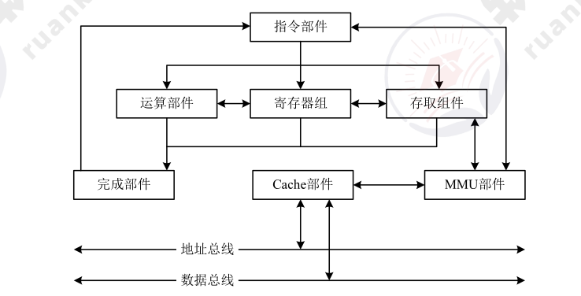
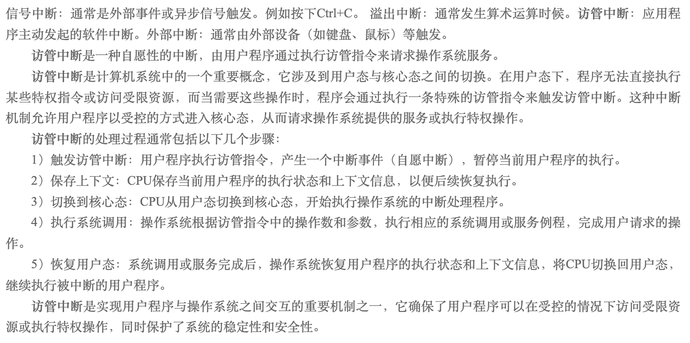
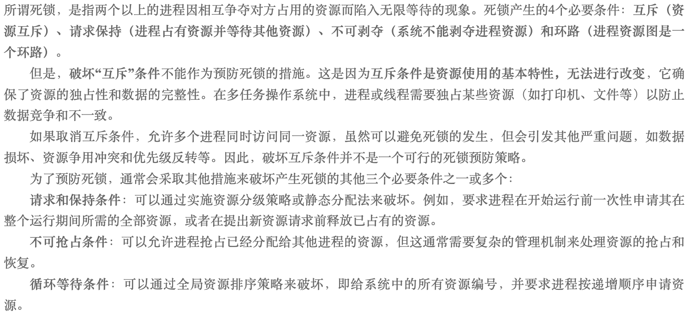
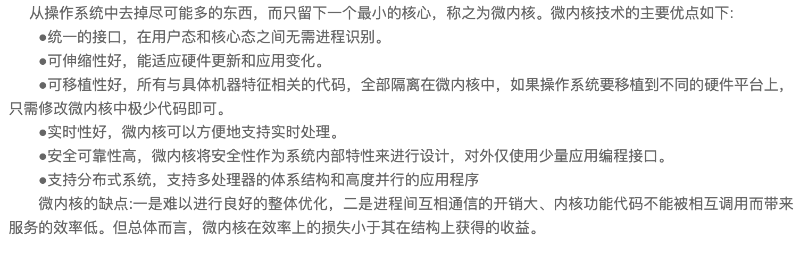
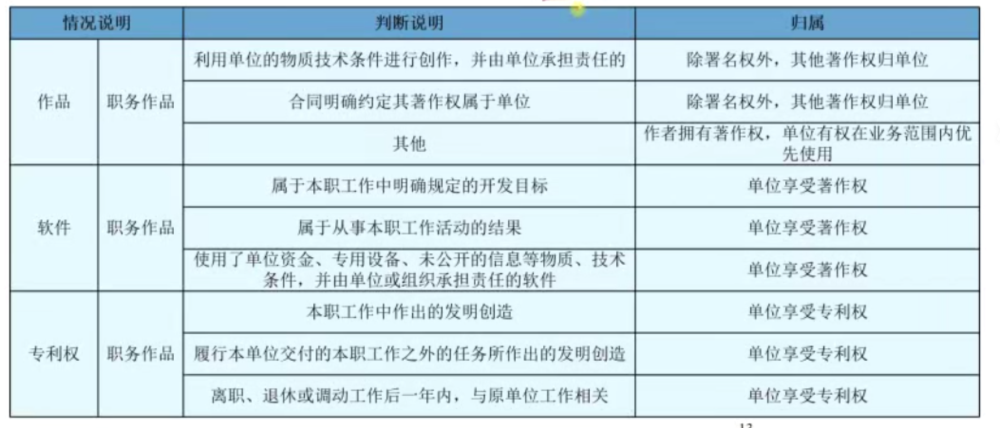
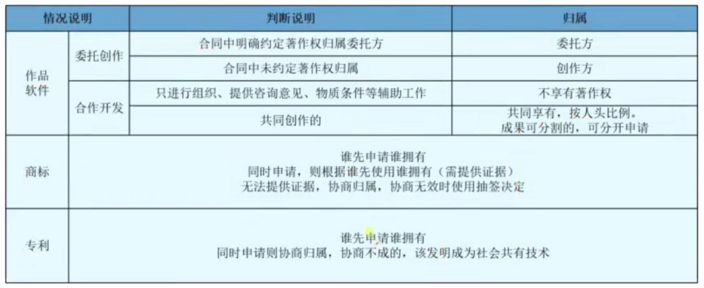
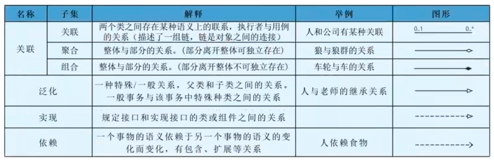

# 计算机系统（编制中）

## 计算机系统概述

## 计算机硬件基础知识

1. 冯·诺依曼计算机结构
2. 典型的处理器系统

    处理器主要有以下四大功能：

    * 程序控制：CPU 通过执行指令来控制程序的执行顺序；
    * 操作控制：一条指令功能的实现需要若干操作信号配合来完成，CPU 产生每条指令的操作信号并将操作信号送往对应的部件，控制相应的部件按指令的功能要求进行操作；
    * 时间控制：CPU 对各种操作进行时间上的控制，即指令执行过程中操作信号的出现时间、持续时间及出现的时间顺序都需要进行严格控制；
    * 数据处理：CPU 通过对数据进行算术运算及逻辑运算等方式进行加工处理，数据加工处理的结果被人们所利用。

    此外，处理器还要对系统内部和外部的中断（异常）做出响应，进行相应的处理。

    CPU 主要由运算器、控制器、寄存器组和内部总线等部件组成。

    

    * **运算器：** 由 **算术逻辑单元 ALU**（实现对数据的算术和逻辑运算）、**累加寄存器 AC**（运算结果或源操作数的存放区）、**数据缓冲寄存器 DR**(暂时存放内存的指令或数据)、**状态条件寄存器 PSW** （保存指令运行结果的条件码内容，如溢出标志等）组成。执行所有的算术运算，如加减乘除等；执行所有的逻辑运算并进行逻辑测试，如与、或、非、比较等；
    * **控制器：** 由 **指令寄存器 IR**（暂存 CPU 执行指令）、**程序寄存器 PC**（存放指令执行地址）、**地质寄存器 AR**（保存 CPU 当前访问的内存地址）、**指令译码器 ID**（分析指令操作码）组成。控制整个 CPU 的工作。

    !!! warning

        CPU 依据指令周期的不同阶段来区分二进制的指令和数据，因为在指令周期的不同阶段，指令会命令 CPU 分别去取指令和数据。

    ???+ info "2010 综合知识 1"

        在设计微内核 OS 时，采用了面向对象的技术，其中的“封装”，“继承”，“对象类” 和“多态性”，以及在对象之间采用消息传递机制等，都十分有利于提高系统的“正确性”、“可靠性”、“易修改性”、“易扩展性”等，而且还能显著地减少开发系统所付出的开销。采用微内核结构的操作系统与传统的操作系统相比，其优点是提高了系统的灵活性、可扩充性，增强了系统的可靠性，提供了对分布式系统的支持。其原因如下。

        1. **灵活性和可扩展性：** 由于微内核 OS 的许多功能是由相对独立的服务器软件来实现的，当开发了新的硬件和软件时，微内核 OS 只需在相应的服务器中增加新的功能，或再增加一个专门的服务器。与此同时，也必然改善系统的灵活性，不仅可在操作系统中增加新的功能，还可修改原有功能，以及删除已过时的功能，以形成一个更为精干有效的操作系统。
        2. **增强了系统的可靠性和可移植性：** 由于微内核是出于精心设计和严格测试的，容易保证其正确性；另一方面是它提供了规范而精简的应用程序接口（API),为微内核外部的程序编制高质量的代码创造了条件。此外，由于所有服务器都是运行在用户态，服务器与服务器之间采用的是消息传递通信机制，因此，当某个服务器出现错误时，不会影响内核，也不会影响其他服务器。另外，由于在微内核结构的操作系统中，所有与特定 CPU 和 I/O 设备硬件有关的代码，均放在内核和内核下面的硬件隐藏层中，而操作系统其他绝大部分（即各种服务器）均与硬件平台无关，因而，把操作系统移植到另一个计算机硬件平台上所需作的修改是比较小的。
        3. **提供了对分布式系统的支持：** 由于在微内核 OS 中，客户和服务器之间以及服务器和服务器之间的通信，是采用消息传递通信机制进行的，致使微内核 OS 能很好地支持分布式系统和网络系统。事实上，只要在分布式系统中赋予所有进程和服务器唯一的标识符，在微内核中再配置一张系统映射表（即进程和服务器的标识符与它们所驻留的机器之间的对应表)，在进行客户与服务器通信时，只需在所发送的消息中标上发送进程和接收进程的标识符，微内核便可利用系统映射表将消息发往目标，而无论目标是驻留在哪台机器上。

!!! info "2010 综合知识 9"

    计算机执行程序时，在一个指令周期的过程中，为了能够从内存中读指令操作码，首先是将程序计数器（PC)的内容送到地址总线上。

!!! info "2010 综合知识 12"

    CPU 访问内存通常是同步方式，CPU 与 I/O 接口交换信息通常是同步方式，CPU 与 PCI总线交换信息通常是同步方式，I/O 接口与打印机交换信息则通常采用基于缓存池的异步方式。

!!! info "2011 综合知识 9"

    CISC (Complex Instruction Set Computer,复杂指令集计算机）的基本思想是进一步增强原有指令的功能，用更为复杂的新指令取代原先由软件子程序完成的功能，实现软件功能的硬件化，导致机器的指令系统越来越庞大而复杂。CISC 计算机一般所含的指令数目至少 300 条以上，有的甚至超过 500 条。CISC 的主要缺点如下：

    * 微程序技术是 CISC 的重要支柱，每条复杂指令都要通过执行一段解释性微程序才能完成，这就需要多个 CPU 周期，从而降低了机器的处理速度；
    * 指令系统过分庞大，从而使高级语言编译程序选择目标指令的范围很大，并使编译程序本身冗长而复杂，从而难以优化编译使之生成真正髙效的目标代码；
    * CISC 强调完善的中断控制，势必导致动作繁多，设计复杂，研制周期长；
    * CISC 给芯片设计带来很多困难，使芯片种类增多，出错几率增大，成本提高而成品率降低。

    RISC (Reduced Instruction Set Computer,精简指令集计算机）的基本思想是通过减少指令总数和简化指令功能，降低硬件设计的复杂度，使指令能单周期执行，并通过优化编译，提高指令的执行速度，采用硬线控制逻辑，优化编译程序。实现 RISC 的关键技术有：
    
    * 重叠寄存器窗口（overlapping register windows)技术，首先应用在伯克利的 RISC 项目中；
    * 优化编译技术，RISC 使用了大量的寄存器，如何合理分配寄存器、提高寄存器的使用效率，减少访存次数等，都应通过编译技术的优化来实现；
    * 超流水及超标量技术，这是 RISC 为了进一步提高流水线速度而采用的新技术；
    * 硬线逻辑与微程序相结合在微程序技术中。
1. 专用处理器

    除了通用的处理器，用于专用目的的专用处理器芯片不断涌现，常见的有图形处理器（Graphics Processing Unit，GPU）、信号处理器（Digital Signal Processor，DSP）以及现场可编程逻辑门阵列（Field Programmable Gate Array，FPGA）等。GPU 常有数百个或数千个内核，经过优化可并行运行大量计算；DSP 专用于实时的数字信号处理，常采用哈佛体系结构。

2. 指令集系统

    典型的处理器根据指令集的复杂程度可分为<u>复杂指令集（Complex Instruction Set Computers，CISC）</u>与<u>精简指令集（Reduced Instruction Set Computers，RISC）</u>两类。
    
    CISC 以 Intel、AMD 的x86 CPU 为代表，RISC 以 ARM 和 Power 为代表。
    
    国产处理器目前有龙芯、飞腾、申威等品牌，常采用 RISC-V、MIPS、ARM 等精简指令集架构。

### 存储器

存储器是利用半导体、磁、光等介质制成用于存储数据的电子设备。

根据<u>存储器的硬件结构</u>可分为 SRAM、DRAM、NVRAM、Flash、EPROM、Disk 等。

按照<u>与处理器的物理距离</u>可分为 4 个层次：片上缓存、片外缓存、主存（内存）、外存。其访问速度依次降低，而容量依次提高。

!!! info "2011 综合知识 10"

    在计算机系统中，常选用生产与运行成本、存储容量和读写速度各不相同的多种存储介质，组成一个统一管理的存储器系统，使每种介质充分发挥各自在速度、容量、成本方面的优势，从而达到最优性能价格比，满足使用要求。
    
    高速缓存 Cache 用来存放当前最活跃的程序和数据，作为主存局部域的副本，其特点是：容量一般在几 KB 到几 MB 之间；速度一般比主存快 5 到 10 倍，由快速半导体存储器构成；其内容是主存局部域的副本，对程序员来说是透明的。
    
    **替换算法的目标** 就是使 Cache 获得最高的命中率。常用算法有 **随机替换算法、先进先出算法、近期最少使用算法和优化替换算法。**

    Cache 的性能是计算机系统性能的重要方面。命中率是 Cache 的一个重要指标，但不是最主要的指标。Cache 设计的目标是 **在成本允许的条件下达到较高的命中率，使存储系统具有最短的平均访问时间。**

    **Cache 的命中率与 Cache 容量的关系是：** Cache 容量越大，则命中率越高，随着 Cache容量的增加，其命中率逐渐接近 100%。但是增加 Cache 容量意味着增加 Cache 的成本和增加 Cache 的命中时间。

#### 磁盘

磁盘正反有两个盘面，每个盘面有多个同心圆，每个同心圆是一个 **磁道**，每个同心圆又被划分为多个 **扇区**，数据就被存储在一个个扇区中。

磁头首先要寻找到对应的磁道，然后等待磁盘进行周期旋转，旋转到指定的扇区，才能读取到对应的数据，因此，会产生 **寻道时间** 和 **等待时间**。公式为：$\text{存取时间} = \text{寻道时间} + \text{等待时间}$ （平均定位时间 + 转动延迟）

!!! tip

      1. 寻道时间是指磁头移动到磁道所需的时间
      2. 等待时间是指等待读写的扇区转到磁头下方所用的时间

磁盘调度算法

| 磁盘调度算法           | 描述 |
| ---------------------- | ---- |
| 先来先服务 FCFS        |      |
| 最短寻道时间有限 SSTF  |
| 扫描算法 SCAN          |
| 单向扫描调度算法 CSCAN |

!!! info "2010 综合知识 11"

### 总线

    总线（Bus）是指计算机部件间遵循某一特定协议实现数据交换的形式，即以一种特定格式按照规定的控制逻辑实现部件间的数据传输。
    
    按照总线在计算机中所处的位置划分为<u>内总线、系统总线和外部总线。</u>
    
    目前，计算机总线存在许多种类，常见的有 **并行总线** 和 **串行总线**。

    | 名称     | 数据线                         | 特点                       | 应用                                       |
    | -------- | ------------------------------ | -------------------------- | ------------------------------------------ |
    | 并行总线 | 多条双向数据线                 | 有传输延迟，适合近距离连接 | 系统总线（计算机各部件）                   |
    | 串行总线 | 一条双向数据线或两条单向数据线 | 速率不高，但适合长距离连接 | 通信总线（计算机之间或计算机与其他系统间） |

!!! info "2011 综合知识 12"

    总线是一组能为多个部件分时共享的信息传送线，用来连接多个部件并为之提供信息交换通路。所谓共享，指连接到总线上的所有部件都可通过它传递信息；分时性指某一时刻只允许一个部件将数据发送到总线上。因此，共享是通过分时实现的。

### 接口

    接口是指同一计算机不同功能层之间的通信规则。计算机接口有多种，常见的有输入输出接口如 HDMI、SATA、RS-232 等；网络接口如 RJ45、FC 等；以及 A/D 转换接口等非标准接口。

### 外部设备

    外部设备也称为外围设备，是计算机结构中的非必要设备，但从功能上又常常不可缺少，例如键盘、鼠标、显示器等。虽然种类多样，但都是通过接口实现与计算机主体的连接，并通过指令、数据实现预期的功能。

## 计算机软件基础知识

### 操作系统

操作系统是计算机系统的资源管理者，包含对系统软、硬件资源实施管理的一组程序。操作系统通常由操作系统的内核（Kernel）和其他许多附加的配套软件所组成，如用户界面、管理工具、开发工具和常用应用程序等。操作系统的重要作用如下：

1. 管理计算机中运行的程序和分配各种软、硬件资源。
2. 为用户提供友善的人机界面。
3. 为应用程序的开发和运行提供一个高效率的平台。

操作系统具有 **并发性、共享性、虚拟性和不确定性** 的特征。

操作系统的分类：

| 操作系统       | 描述                                                                                                                                                                                                                                                                                           |
| -------------- | ---------------------------------------------------------------------------------------------------------------------------------------------------------------------------------------------------------------------------------------------------------------------------------------------- |
| 批处理操作系统 | 根据同时执行的作业数又分为单道批处理和多道批处理。一个作业由用户程序、数据和作业说明书（作业控制语言）3 个部分组成。                                                                                                                                                                           |
| 分时操作系统   | 将 CPU 的工作时间划分为许多很短的时间片，每个时间片分别为一个终端的用户提供服务或者执行一个作业。分时系统主要有 4 个特点：多路性、独立性、交互性和及时性。                                                                                                                                     |
| 实时操作系统   | 对于外来信息能够以足够快的速度进行处理，并在被控对象允许的时间范围内快速做出反应，对可靠性要求很高，并且不强制要求用户交互。实时系统的应用非常广泛。                                                                                                                                           |
| 网络操作系统   | 使联网计算机能有效地共享网络资源，为网络用户提供各种服务和接口。特征包括硬件独立性和多用户支持等。                                                                                                                                                                                             |
| 分布式操作系统 | 指为分布式计算机系统配置的操作系统。分布式操作系统是网络操作系统的更高级形式，它保持网络系统所拥有的全部功能，同时又有透明性、可靠性和高性能等特性。                                                                                                                                           |
| 嵌入式操作系统 | 运行在嵌入式智能设备环境中，对整个智能硬件以及它所操作、控制                                                                                                                                                                                                                                   |
| 嵌入式操作系统 | 的各种部件装置等资源进行统一协调、处理、指挥和控制，特点是微型化、可定制、可靠性和易移植性。常采用硬件抽象层（Hardware Abstraction Layer，HAL）和板级支撑包（Board Support Package，BSP）来提高易移植性，常见的嵌入式实时操作系统有 VxWorks、μClinux、PalmOS、WindowsCE、μC/OS-II 和 eCos 等。 |

!!! info "2011 综合知识 1"

    操作系统为用户提供了两类接口：操作一级的接口和程序控制一级的接口。其中，操作一级接口包括 **操作控制命令、菜单命令** 等；程序控制一级的接口包括 **系统调用。**

!!! info "2012 综合知识 9"

    由于资源共享与进程合作，并发执行的任务（进程）之间可能产生相互制约关系，这些制约关系可分为两类：竞争与协作。并发进程之间的竞争关系为互斥，并发进程之间的协作关系体现为同步。
    
    同步是因合作进程之间协调彼此的工作而控制 S 己的执行速度，即因相互合作，相互等待而产生的制约关系。而互斥是进程之间竞争临界资源而禁止两个 y 上的进程同时进入临界区所发生的制约关系。

!!! info "2012 综合知识 12"

    任务是 RTOS 中最重要的操作对象，每个任务在 RTOS 的调度下由 CPU 分时执行。任务的调度目前主要有 **时间分片式、轮流查询式和优先抢占式** 三种，不同的 RTOS 可能支持其中一种或几种，其中优先抢占式对实时性的支持最好。
    
    在非实时系统中，**调度的主要目的是缩短系统平均响应时间，提高系统资源的利用率，或优化某一项指标；** 
    
    而实时系统中调度的目的则是要 **尽可能地保证每个任务满足他们的时间约束，及时对外部请求做出响应。**

#### 存储管理

1. 分区存储管理

    

    所谓分区存储组织，就是整存，将某进程运行所需的内存整体一起分配给它，然后再执行。主要有以下三种分区方式：

    * **固定分区：**
    * **可变分区：**

    

    * **可重定位分区：** 可以解决碎片问题，移动所有已经分配好的区域，使其成为一个连续的区域，这样其他外部细小的分区碎片可以合并为大的分区，满足作业要求。只在外部作业请求空间得不到满足时进行。
 
2. 分页存储管理
    

    

    |页面置换算法|描述|
    |--|--|
    |最优算法|
    |先进先出算法|
    |最近最少使用|
    |淘汰原则|

    **快表**

    

3. 分段存储管理 

      

4. 段页式存储管理

    

???+ info "2010 综合知识 2"

    操作系统为了实现“按名存取”，必须为每个文件设置用于描述和控制文件的数据结构，专门用于文件的检索，因此至少要包括文件名和存放文件的物理地址，该数据结构称为文件控制块（Hie Control Block, FCB),文件控制块的有序集合称为文件目录，或称系统目录文件。若操作系统正在将修改后的系统目录文件写回磁盘时系统发生崩溃，则对系统的影响相对较大。

???+ info "2011 综合知识 11"

    虚拟存储器是一个容量非常大的存储器的逻辑模型，不是任何实际的物理存储器。
    
    它借助于磁盘等辅助存储器来扩大主存容量，使之为更大或更多的程序所使用。虚拟存储器管理方式分为 **页式虚拟存储器、段式虚拟存储器和段页式虚拟存储器。**

    虚拟存储器是由硬件和操作系统自动实现存储信息调度和管理的。它的工作过程包括 6 个步骤：

    1. 中央处理器访问主存的逻辑地址分解成组号 a 和组内地址 b，并对组号 a 进行地址变换，即将逻辑组号 a 作为索引，查地址变换表，以确定该组信息是否存放在主存内；
    2. 如该组号已在主存内，则转而执行 $4$；如果该组夸不在主存内，则检查主存中是否有空闲区，如果没有，便将某个暂时不用的组调出送往辅存，以便将需要访问的信息调入主存；
    3. 从辅存读出所要的组，并送到主存空闲区，然后将那个空闲的物理组号 a 和逻辑组号 a 登录在地址变换表中；
    4. 从地址变换表读出与逻辑组号 a 对应的物理组号 a；
    5. 从物理组号 a 和组内字节地址 b 得到物理地址；
    6. 根据物理地址从主存中存取必要的信息；
    
    页式调度是将逻辑和物理地址空间都分成固定大小的页。主存按页顺序编号，而每个独立编址的程序空间有自己的页号顺序，通过调度，辅存中程序的各页可以离散装入主存中不同的页面位置，并可据页表一一对应检索。

#### 进程同步与互斥

* 临界资源：各进程间需要以互斥方式对其进行访问的资源；
* 临界区：指进程中对临界资源实施操作的那段程序。本质是一段程序代码;
* 互斥：某资源在同一时间内只能由一个任务单独使用，使用时需要加锁，使用完成后解锁才能被其他任务使用，如打印机;
* 同步：多个任务可以并发执行，只不过有速度上的差异，在一定情况下停下等待，不存在资源是否单独或共享的问题，如自行车和汽车；
* 互斥信号量：对临界资源采用互斥访问，使用互斥信号量后其他进程无法访问，初值为 1；
* 同步信号量：对共享资源的访问控制，初值一般是共享资源的数量。

$P$ 操作：申请资源，$S-=1$，若 $S\gt1$，则执行 $P$ 操作的进程继续执行；若 $S\lt0$，则置该进程为阻塞状态（因为无可用资源），并将其插入阻塞队列。

$V$ 操作：释放资源，$S+=1$，若 $S\lt1$，则执行 $V$ 操作的进程继续执行；若 $\text{S} \le \text{0}$，则从阻塞状态唤醒一个进程，并将其插入就绪队列（此时因为缺少资源被 $P$ 操作阻塞的进程可以继续执行），然后执行 $V$ 操作的进程继续。

!!! info "2011 综合知识 2,3,4"

!!! tip "2012 综合知识 1,2"

    信号量的物理意义，当 $S \gt 0$ 时，表示资源的可用数；当 $S \lt 0$ 时，其绝对值表示等待资源的进程数。 

## 计算机语言

计算机语言（Computer Language）是指人与计算机之间用于交流的一种语言，主要由一套指令组成，而这套指令一般包括表达式、流程控制和集合三大部分内容。

计算机语言分类有：

* 机器语言
* 汇编语言
* 高级语言
* 建模语言

## Q&A

### 校验码

在两个编码中，从 A 码到 B 码转换所需要改变的位数称为码距。就单个编码 $00$ 而言，其码距为 1，因为只需要改变一位就变成另一个编码。如 $00$ 要转换为 $11$ 码距为 2。一般来说，码距越大，越利于纠错和检错。

#### 奇偶校验码

在编码中增加 1 位校验位来使编码中的 1 的个数为奇数/偶数，从而使得码距变为 2。

???+ example "奇校验，偶校验同理"

    编码中，含有奇数个 1，发送给接收方后，会计算到编码有多少个 1，如果是奇数个则数据未发生改变，否则传输过程中数据发生改变。

#### 循环冗余校验码（CRC）

!!! warning "CRC 只能检错，不能纠错"

需要先约定一个生成多项式 $G(x)$。生成多项式的最高位和最低位必须是 1。假设原始信息有 $m$ 位，则对应多项式 $M(x)$。

1. 在原始信息位后添加 0, 假设生成多项式的阶为 r，则在原始信息位后添加 r 个 0；
2. 由多项式得到除数，多项式中 x 的幂指数存在的位置为 1，不存在的位置为 0；
3. 生成 CRC 校验码，将前两步得出的被除数和除数进行模二除法运算（即不进位也不借位的除法运算）；

    !!! warning "余数不足 $r$，则余数左边用 $0$ 补齐"

4. 生成最终发送信息串，将剩余数添加到原始信息后；
5. 接收方进行校验。接收方的 CRC 校验过程与生成过程类似，接收方接收了带校验和的帧后，用多项式 $G(x)$ 来除。余数为 $0$ 表示信息无误，否则需要重传。

生成校验码的思想就是在原始信息位后追加若干校验位，使得追加的信息能被 $G(x)$ 整除。

接收方收到带校验位的信息，然后用 $G(x)$ 整除，如果余数为 $0$，则没有错误信息；反之发生错误。

???+ example

    假设原始信息串为 $10110$ CRC 生成的多项式为 $G(x)=x^4+x+1$，求 CRC 校验码。

    1. 本例中 $G(x)$ 阶为 4，在原始信息后加 4 个 0，得到新串为 $101100000$；
    2. x 的幂指数为 0,1,4 的变量都存在，而幂指数为 2,3 的不存在，因此得到的串为 $10011$；
    3. 按运算得到余数为 $1111$；
    4. 发送方发送拼接好的校验和串 $101101111$；
    5. 接收方接受后进行模二运算，得到余数为 0。
