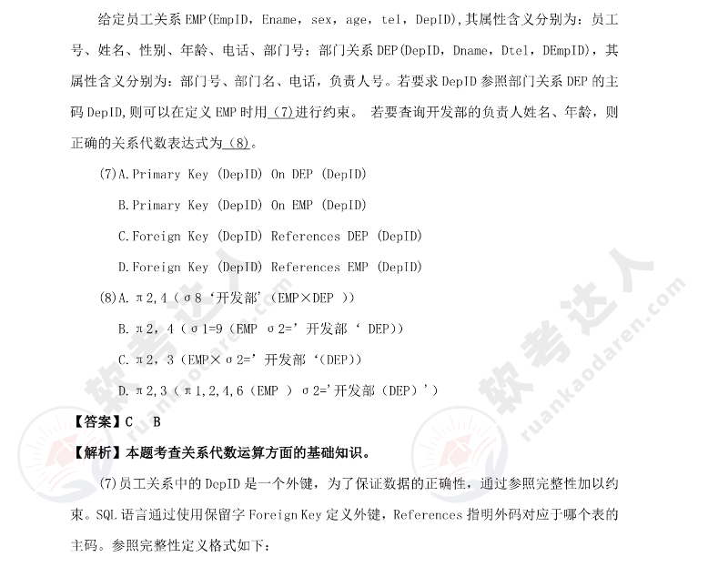
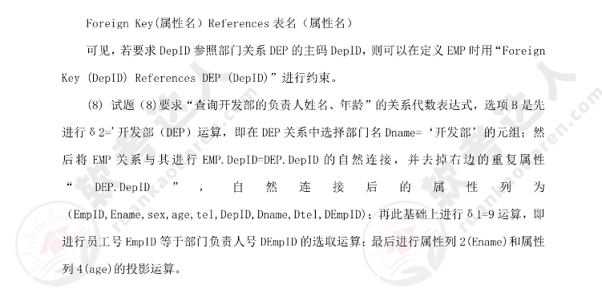
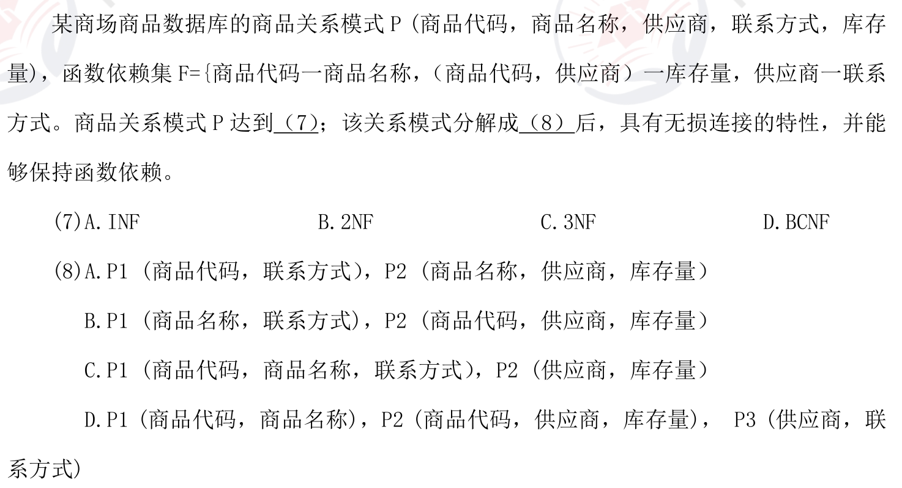
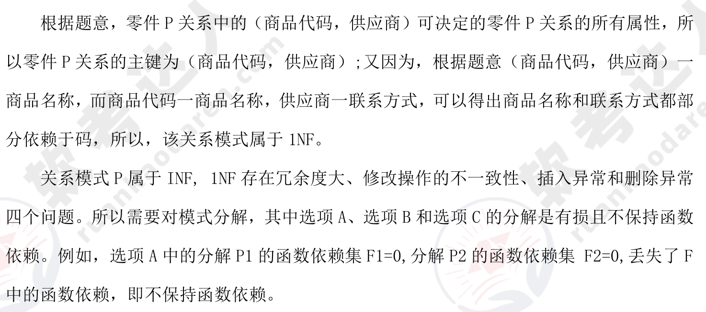
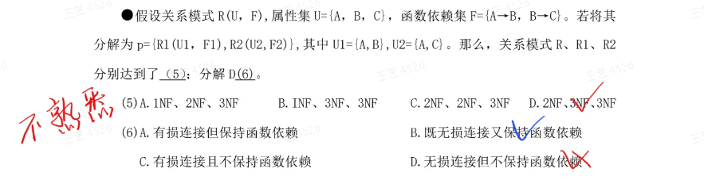
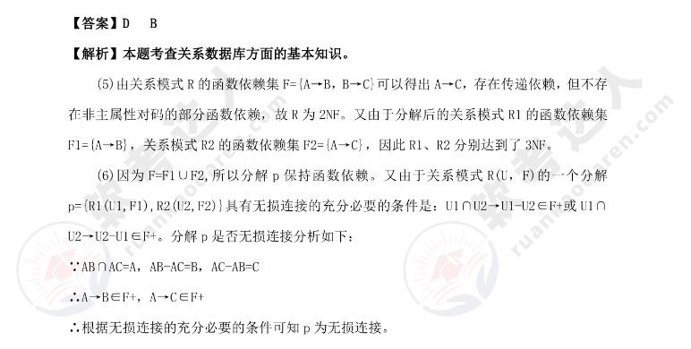
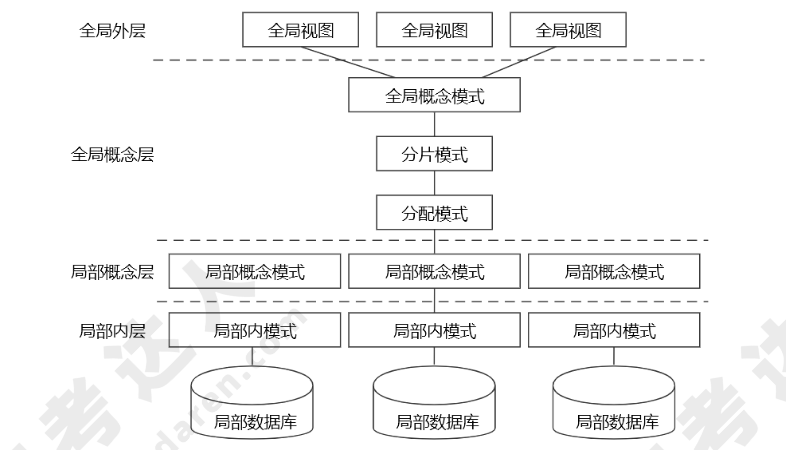
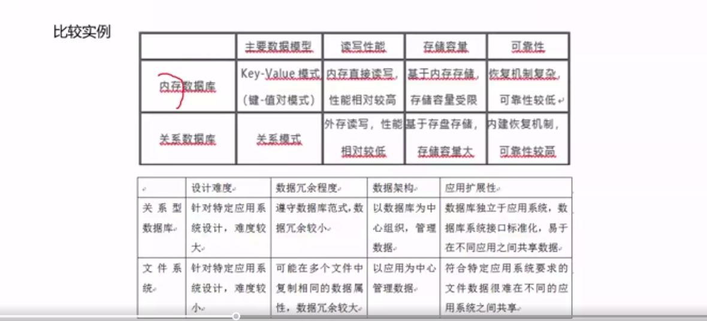

# 数据库设计（重要）

## 数据基础概念

### 数据模型

数据模型三要素：**数据结构、数据操作、数据的约束条件**。其中，数据的约束条件包括：

* 实体完整性：实体完整性是指实体的主属性不能取空值。
* 参照完整性：在关系数据库中主要是指外键参照的完整性。若 A 关系中的某个或者某些属性参照 B 关系或其他几个关系中的属性，那么在关系 A 中该属性要么为空，要么必须出现在 B关系或者其他的关系的对应属性中。
* 用户定义完整性：用户定义完整性反映的是某一个具体应用所对应的数据必须满足一定的约束条件。例如，软考成绩不能小于 0，也不能大于 75。

!!! info "2010 综合知识 6"

### 数据库三级模式两级映像（编制中）

数据库一般采用三级模式，系统开发人员需要通过视图层、逻辑层和物理层三个层次上的抽象来降低用户屏蔽系统的复杂性，简化用户与系统的交互。从数据库管理系统的角度，数据库也分为外模式、概念模式和内模式。


内模式定义的是存储记录的类型、存储域的表示、存储记录的物理顺序，指引元、索引和存储路径等数据等存储组织。

## 关系数据库

### 关系代数运算

关系代数的运算符有 4 类：**集合运算符、专门的关系运算符、算术比较符和逻辑运算符**，系统架构设计师考试重点考查 **集合运算符与专门的关系运算符**。集合运算符、专门的关系运算符的含义及解释详见表如下：

| 运算符 | 含义     | 解释                                                                                                                                                                                                                                                                                              |
| ------ | -------- | ------------------------------------------------------------------------------------------------------------------------------------------------------------------------------------------------------------------------------------------------------------------------------------------------- |
|        |          | **集合运算**                                                                                                                                                                                                                                                                                      |
| ∪      | 并       | 关系 R 与 S 的并是由属于 R 或属于 S 的元组构成的集合                                                                                                                                                                                                                                              |
| −      | 差       | 关系 R 与 S 的差是由属于 R 但不属于 S 的元组构成的集合                                                                                                                                                                                                                                            |
| ∩      | 交       | 关系 R 与 S 的交是由属于 R 同时又属于 S 的元组构成的集合                                                                                                                                                                                                                                          |
| ×      | 笛卡儿积 | 两个关系分别为 n 列和 m 列的关系 R 和 S 的笛卡儿积是一个 (n+m) 列的元组的集合。其中的前 n 列是关系 R 的一个元组，后 m 列是关系 S 的一个元组。记作 R×S。如果 R 和 S 有相同的属性名，可在属性名前加关系名作为限定，以示区别。若 R 有 K1 个元组，S 有 K2 个元组，则 R 和 S 的笛卡儿积有 K1×K2 个元组 |
|        |          | **专门的关系运算**                                                                                                                                                                                                                                                                                |
| σ      | 选择     | 取得关系 R 中符合条件的行                                                                                                                                                                                                                                                                         |
| π      | 投影     | 取得关系 R 中符合条件的列                                                                                                                                                                                                                                                                         |
| ⋈      | 连接     | 等值连接：选取关系 R、S, 取两者笛卡儿积中属性值相等的元组。自然连接：一种特殊的等值连接，它要求比较的属性列必须是相同的属性组，并且把重复属性去掉。                                                                                                                                               |
| ÷      | 除       | 给定关系 R(X, Y) 和 S(Y, Z)，其中 X, Y, Z 为属性组。R 中的 Y 与 S 中的 Y 可以有不同的属性值，但必须由相同的属性域。R 与 S 的除运算得到一个新的关系 P(X)，是 R 中满足下列条件在 X 属性列上的投影：元组在 X 上为量值的象集 Yx 包含 S 在 Y 上投影的象集。                                            |


关系代数的运算中还有一类是属于扩展的关系代数运算，可以从基本的关系运算中导出。系统架构设计师考试关注的是 **外连接运算**，这是连接运算的一种扩展。**外连接运算包括左外连接、右外连接、完全外连接**，具体见表如下：

| 运算符   | 含义       | 名词解释                                                                                                                                 |
|----------|------------|------------------------------------------------------------------------------------------------------------------------------------------|
| ⟕        | 左外连接   | 取出左侧关系中所有与右侧关系中任一元组都不匹配的元组，用空值 null 填充所有来自右侧关系的属性，构成新的元组，将其加入自然连接的结果中          |
| ⟖        | 右外连接   | 取出右侧关系中所有与左侧关系中任一元组都不匹配的元组，用空值 null 填充所有来自左侧关系的属性，构成新的元组，将其加入自然连接的结果中          |
| ⟗        | 完全外连接 | 完成左外连接和右外连接的操作。即填充左侧关系中所有与右侧关系中任一元组都不匹配的元组，并填充右侧关系中所有与左侧关系中任一元组都不匹配的元组，将产生的新元组加入自然连接的结果中 |


#### 真题

##### 2013 年真题




### 关系数据库设计基本理论

**函数依赖：** 设 R(U)是属性 U 上的一个关系模式，X 和 Y 是 U 的子集，r 是 R 的任一关系，如果对于 r 中的任意两个元组 u 和 v，只要有 u[X]=v[X]，就有 u[Y]=v[Y]，则称 X 函数决定 Y，或称 Y 函数依赖于 X，记为 X→Y。

函数依赖是一种最重要、最基本的数据依赖。而关系数据库设计理论的核心就是数据间的函数依赖。

具体来说，如果在一个关系（表）中，属性集 X 的值能够唯一地决定属性集 Y 的值，那么就说 Y 对 X 函数依赖，记作：$X \rightarrow Y$

**非平凡的函数依赖：** 如果 X→Y，Y⊆X，则称 X→Y 是非平凡的函数依赖。

**平凡的函数依赖：** 如果 X→Y，但 Y⊆X，则称 X→Y 是平凡的函数依赖。

**完全函数依赖：** 属性集 Y 完全依赖于 X，并且不存在 X 的真子集可以决定 Y。例如，复合主键中的所有属性共同决定其他属性。

例如，有学生关系模式（学号，系号，系主任，课程号，成绩），该关系模式的主码是学号+课程号，（学号，课程号）→成绩是完全函数依赖。

**部分函数依赖：** 如果属性集 X 是复合键，而 Y 依赖于 X 的某个子集而非整个 X，这叫部分函数依赖。

上述例子中，（学号，课程号）→系号就属于部分函数依赖，因为对于系号来说有学号就可以推出系号。

**传递依赖：** 如果 $X \rightarrow Y$ 且 Y $\rightarrow Z$，那么存在传递依赖 $X \rightarrow Z$。

上述例子中，学号→系号，系号→系主任名，则称系主任名传递依赖于学号。

**函数依赖的公理系统（Armstrong 公理系统）**：

#### 平凡、非平凡的函数依赖

**非平凡的函数依赖**（Non-trivial Functional Dependency）是指函数依赖中，属性集 `Y` 不是属性集 `X` 的子集。换句话说，在函数依赖 `X → Y` 中，若 `Y` 的任何属性都不包含在 `X` 中，那么这个依赖就是**非平凡的**。

假设有一个关系表 `Employee`，包含以下属性：
- `EmployeeID`（员工ID）
- `Name`（员工姓名）
- `Department`（所属部门）

**平凡的函数依赖**：
    $\text{EmployeeID} \rightarrow \text{EmployeeID}$ 这是平凡的函数依赖，因为 `Y` 集合（`EmployeeID`）完全包含在 `X` 集合（`EmployeeID`）中。

**非平凡的函数依赖**：
   $\text{EmployeeID} \rightarrow \text{Name, Department}$ 这是非平凡的函数依赖，因为 `Name` 和 `Department` 不包含在 `EmployeeID` 中。

**非平凡函数依赖的重要性**

非平凡的函数依赖通常是数据库设计中的重点关注对象，因为它们反映了属性之间的实际依赖关系。而平凡的函数依赖没有实际意义，通常被忽略。

在数据库设计中，通过分析非平凡的函数依赖，能够帮助我们优化表结构，减少数据冗余，进而提升数据库的规范化水平。

### 关系数据库的规范化

关系数据库设计的方法之一就是设计满足适当范式的模式，通常可以通过判断分解后的模式达到几范式来评价模式的规范化程度。

范式包括：1NF、2NF、3NF、BCNF、4NF、5NF。

> 根据系统架构设计师考试的要求，这里重点介绍 1NF、2NF、3NF、BCNF 的基本概念。

| 范式            | 描述                                                                                           |
| --------------- | ---------------------------------------------------------------------------------------------- |
| 第一范式（1NF） | 若关系模式 $R$ 的每一个分量是不可再分的数据项，则关系模式 $R$ 属于第一范式。                   |
| 第二范式（2NF） | 若关系模式 $R \in 1NF$(1)，且每一个非主属性完全依赖主码时，则关系式 $R$ 是 $2NF$（第二范式）。 |
| 第三范式（3NF） | 当 $2NF$ 消除了非主属性对主码的传递函数依赖，则称为 $3NF$。                                    |
| BC 范式（BCNF） | 如果关系模式 $R \in 1NF$，且每个属性都不传递依赖于 $$ 的候选码，那么称 $R$ 是 $BCNF$ 模式。    |

!!! tip

    符号 `∈` 表示“属于”（is an element of），用于表示某个元素属于一个集合。例如，在表达 式 $ x \in A $ 中，意思是“元素 $ x $ 是集合 $ A $ 的一个成员”。它常用于集合论和数学中，表示元素与集合之间的关系。

上述 4 种范式之间有如下联系：$BCNF  \sub 3NF \sub 2NF \sub 1NF$。

#### 模式分解

在数据库设计中，**模式分解（Schema Decomposition）** 是指将复杂或冗余的数据库表结构分解为更小、更简洁的表，以确保数据的一致性、减少冗余和避免异常（anomalies）。这种技术通常与 **范式化（Normalization）** 过程相关，目的是创建一个结构良好的数据库设计。

模式分解的核心目的是通过分解关系表来达到更高的 **范式**（如第三范式、BCNF），从而消除数据冗余和潜在的更新异常。该过程通常包括以下步骤：

1. **识别不必要的数据冗余**：例如，重复存储相同信息。
2. **分解表**：将一个包含冗余数据的大表分解为多个更小的表，使每个表只包含单一的实体或主题。
3. **保持数据依赖**：通过定义外键保持表之间的关系，确保分解后的表能够正确关联。

##### 模式分解的步骤

1. **确定函数依赖（Functional Dependencies）**：在模式分解之前，首先需要确定关系中的函数依赖。函数依赖定义了哪些字段的值由哪些其他字段的值唯一确定。

2. **选择范式化级别**

!!! tip "典型的范式"

    * **第一范式（1NF）**：确保数据的原子性（每列只有一个值）。
    
    * **第二范式（2NF）**：消除部分依赖，使每个非主属性都完全依赖于主键。
    
    * **第三范式（3NF）**：消除传递依赖，使每个非主属性直接依赖于主键。

1. **分解表**：根据确定的函数依赖和范式，分解表。目标是将原来的表分解成多个满足范式化要求的表。例如，如果表中的某些字段存在<u>部分依赖</u>或<u>传递依赖</u>，可以通过分解这些字段到新的表中来消除这些依赖。

???+ example "例子"

    假设有一个表 `Orders`，记录订单信息：

    ```plaintext
    Orders(OrderID, CustomerName, CustomerAddress, ProductID, ProductName, Quantity)
    ```

    **问题：**

    - 该表中包含了客户信息和产品信息，存在冗余，比如同一客户可能会多次下单，导致客户信息重复存储。
    - 另外，可能还存在更新异常，如果客户的地址变化，需要修改多个记录。

    **分解过程：**

    1. 识别冗余：客户信息和产品信息在多次订单中重复存储。
    2. 分解表：

    === "订单表"

        ```plaintext
        Orders(OrderID, CustomerID, ProductID, Quantity)
        ```

    === "客户表"

        ```plaintext
        Customers(CustomerID, CustomerName, CustomerAddress)
        ```

    === "产品表"

        ```plaintext
        Products(ProductID, ProductName)
        ```

    这样，通过分解，我们消除了冗余和更新异常，数据库结构更简洁且易于维护。

##### 模式分解的优点

- **减少数据冗余**：消除重复数据，节省存储空间。
- **避免数据异常**：如插入、更新、删除异常。
- **提高数据一致性**：通过更细化的表结构，保证数据的完整性和一致性。

##### 模式分解的挑战

- **性能问题**：过度分解可能导致查询效率下降，因为需要进行多个表的连接操作。
- **理解难度**：分解后可能使得数据库设计变得复杂，特别是在跨多个表进行查询时。

总的来说，模式分解是数据库设计中重要的优化过程，目标是通过良好的范式化，确保数据库结构稳定且高效。

!!! example "我们给出一个例题来验证判定函数依赖和无损连接的不同方法"

    给定关系模式

    $$
    R<U,F> \\
    U= \{ A,B,C,D,E \} \\
    F=\{B \rightarrow A, D \rightarrow A, A \rightarrow E, AC \rightarrow B\}
    $$
    
    则 $R$ 的候选关键字为（A），分解 $\Rho=\{ R1(ABCE), R2(CD) \}$（D）。

    | 选项一                                 | 选项二                                                                                                                                                      |
    | -------------------------------------- | ----------------------------------------------------------------------------------------------------------------------------------------------------------- |
    | A. CD<br/>B. ABC<br/>C. ACD<br/>D. ADE | A. 具有无损连接性，且保持函数依赖<br/>B. 不具有无损连接性，但保持函数依赖<br/>C. 具有无损连接性，但不保持函数依赖<br/>D. 不具有无损连接性，也不保持函数依赖 |

#### 函数依赖的判定方法

要判断函数依赖是否保留在分解后的关系中，通常我们需要检查是否在每个分解的子关系中仍然可以推出给定的函数依赖。

!!! example

    对于 $R1=(ABCE)$，我们有：

    * $B \rightarrow A$ 成立，因为 $B$ 和 $A$ 都在 $R1$ 中；
    * $A \rightarrow E$ 成立，因为 $A$ 和 $E$ 都在 $R1$ 中；
    * $AC \rightarrow B$ 成立，因为 $A，C，B$ 都在 $R1$ 中。

    对于 $R2=(CD)$，我们有：

    * $D \rightarrow A$ 不成立，因为 $A$ 不在 $R2$ 中；

    因此，函数依赖 $D \rightarrow A$ 在这个分解中 **不被保留**，即 **不保持函数依赖**。


#### 无损连接的判定方法

在数据库设计中，**无损连接**（Lossless Join）是一种确保通过将分解后的关系表重新连接（Join）时，不会丢失任何数据或产生冗余的属性的特性。判定是否是无损连接，通常是通过验证表之间的**主键-外键关系**或**函数依赖**来实现的。

无损连接是数据库模式分解中的一个关键目标，确保在范式化过程中不会丢失信息。
  
**无损分解**：分解后的关系能够还原出原关系模式，不能还原就是有损分解。

无损连接判定主要通过以下几种方式进行：

##### 基于关系代数的判断方法

当分解为两个关系模式，可以通过以下定理判断是否无损分解：

定理：如果 $R$ 的分解为 $p=\{R1,R2\}$，$F$ 为 $R$ 所满足的函数依赖集合，分解 $p$ 具有无损连接性的充分必要条件是 $R1 \cap R2 \rightarrow (R1-R2)$ 或者 $R1 \cap R2 \rightarrow (R2-R1)$

!!! example

    $R1 \cap R2 \rightarrow (R1-R2)$ 结合例子信息我们可以得到 $\{ C \} \rightarrow \{ ABE \}$

    我们只需要验证根据函数依赖 $F$ 是否可以推导出这个结论，从而验证该模式分解是否是无损分解。

##### 基于函数依赖的判断方法

在某些情况下，可以根据 **函数依赖** 来判断分解是否是无损的。

对于任意分解 $R1$ 和 $R2$，如果函数依赖关系 $FD(R)$ 中的某个属性集 $X$ 可以通过连接恢复，且 $X$ 是 $R1$ 或 $R2$ 的一个候选键，则分解具有无损连接性。

!!! example

    判断公共属性是否是候选键：我们发现 $C$ 本身并不是候选键（候选键是 $CD$），因此无法直接通过公共属性来保证无损连接。

    函数依赖的推导：从 $C$ 无法通过现有的函数依赖推导出关系中的所有属性（如 $B$ 或 $E$），因此无法保证无损连接。

##### 基于 Armstrong Axioms 的无损连接检查

你可以使用 Armstrong Axioms 推导函数依赖闭包，来判断分解是否会造成信息丢失。Armstrong Axioms 是一组用于推导函数依赖的规则，包括 **反身性、传递性和扩展性** 等。通过分析函数依赖的传递关系，可以验证模式分解的无损性。

##### 无损连接算法（常用的方法之一）

1. 构建一个包含 $m$ 行（每个分解的表）和 $n$ 列（原关系表的属性）的矩阵，其中每个属性对应一列，每个子表对应一行。
2. 对于每个分解的表 $Rm$，将其包含的属性在矩阵中标记为 $a_n$，其他的属性标记为 $b_mn$。
3. 根据函数依赖，依次确认是否可以更新标记 b 为 a。
4. 确认是否某一行全部确认即为无损分解。

???+ example

    假设有关系 $R(A, B, C)$，候选键为 $A$，分解为 $R1(A, B)$ 和 $R2(A, C)$。我们根据无损连接算法构造矩阵：

    | 属性 | A   | B   | C   | D   | E   |
    | ---- | --- | --- | --- | --- | --- |
    | R1   | a1  | a2  | a3  | b14 | a5  |
    | R2   | b21 | b22 | a3  | a4  | b25 |

    查看函数依赖：

    * $B \rightarrow A$, 两行不相同，无，所以 A 列不能更新；
    * $D \rightarrow A$, 两行不相同，无，所以 A 列不能更新；
    * $A \rightarrow E$, 两行不相同，无，所以 E 列不能更新；
    * $AC \rightarrow B$, C 列相同，A 列不同，无，所以 B 列不能更新；

    没有一行全部确认，的出分解不具有无损连接。


要确保数据库分解是无损连接的，关键是确保分解后的关系表能够通过连接操作无损地恢复为原来的表结构，且不产生冗余数据或丢失信息。

???+ example "2012 综合知识 7,8"

    

    

#### 真题

##### 2012 年真题




### 事务管理

DBMS 运行的基本工作单位是事务，事务是用户定义的一个数据库操作序列，这些操作序列要么全做，要么全都不做，是一个不可分割的工作单位。事务具有的四个特性（ACID）：

1. **原子性（Atomicity）：** 事务是数据库的逻辑工作单位，事务的所有操作在数据库中要么全做，要么全都不做。
2. **一致性（Consistency）：** 事务的执行使数据库从一个一致性状态变成另一个一致性状态。
3. **隔离性（Isolation）：** 一个事务的执行不能被其他事务干扰。
4. **持久性（Durability）：** 指一个事务一旦提交，它对数据库的改变必须是永久的，即便系统出现故障时也是如此。

**相关 SQL 语句**

1. **BEGIN TRANSACTION：** 事务开始语句。
2. **COMMIT：** 事务提交语句，表示事务执行成功地结束，把事务对数据库的修改写入磁盘（事务对数据库的操作首先是在缓冲区中进行的）。
3. **ROLL BACK：** 事务回滚语句，表示事务执行不成功地结束，即把事务对数据库的修改进行恢复。

???+ info "2012 综合知识 44,45,46,47,48"

    在数据库系统中，“事务”是访问并可能更新各种数据项的一个程序执行单元。为了保证数据完整性，要求数据库系统维护事务的原子性、一致性、隔离性和持久性。
    
    题干中第 1 个架构设计场景描述了数据库设计中为了实现原子性和持久性的最为简单的策略：“影子拷贝”。该策略假设在某一个时刻只有一个活动的事务，首先对数据库做副本（称为影子副本)，并在磁盘上维护一个 dp pointer 指针，指向数据库的当前副本。对于要执行写操作的数据项，数据库系统在磁盘上维护数据库的一个副本，所有的写操作都在数据库副本上执行，而保持原始数据库不变，如果在任一时刻操作不得不中止， 系统仅需要删除新副本，原数据库副本没有受到任何影响。
    
    题干中的第 2 个架构设计场景主要考查考生对事务一致性实现机制的理解。事务的一致性要求在没有其他事务并发执行的情况下，事务的执行应该保证数据库的一致性。数据库系统通常采用完整性约束检查机制保证单个事务的一致性。
    
    题干中的第 3 个架构设计场景主要考查数据库的锁协议。两阶段锁协议是实现事务隔离性的常见方案，该协议通过定义锁的增长和收缩两个阶段约束事务的加锁和解锁过程，能够保证事务的串行化执行，但由于事务不能一次得到所有需要的锁，因此该协议会可能会导致死锁。 
    
    题干中的第 4 个架构设计场景主要考查数据库的恢复机制，主要描述了基于日志的延迟修改技术（deferred modification technique)的设计与恢复过程。该技术通过在日志中记录所有对数据库的修改操作，将一个事务的所有写操作延迟到事务提交后才执行，曰志中需要记录“事务开始”和“事务提交”时间，还需要记录数据项被事务修改后的新值，无需记录数据项被事务修改前的原始值。当系统发生故障时，如果某个事务已经开始，但没有提交，则该事务对数据项的修改尚未体现在数据库中，因此无需做任何恢复动作。

### 并发控制

???+ question "并发场景引入"

    * 丢失更新：事务 1（T1）对数据 A 进行了修改并写回，事务 2（T2）也对数据 A 进行了修改并写回，此时事务 2 写回的数据会覆盖事务 1 写回的数据，就丢失了事务 1 对 A 的更新。即数据 A 的更新会被覆盖
    * 不可重复读：此时事务 1 再次读取数据 A，发现数据不对。即一个事务重复读 A 两次，会发现数据 A 有误。
    * 读脏数据: 此时事务 2 执行回滚操作，即数据 A 恢复了原来的之，那么事务 1 读到了脏数据。

    ```mermaid
    sequenceDiagram
    autonumber
    DB->>T1: 读 A=10
    DB->>T2: 读 A=10
    T1->>DB: A-=5 写回
    T2->>DB: A-=8 写回（丢失事务 1 对数据 A 的更新）
    DB->>T1: 读 A=2（统一事务重复读取数据 A，发现数据不一致）
    T2->>DB: ROLLBACK（数据 A 变成了 5, 事务 1 读到了脏数据）
    ```

在多用户共享系统中，许多事务可能同时对同一数据进行操作，称为并发操作，此时数据库管理系统的并发控制子系统负责协调并发事务的执行，保证数据库的完整性不受破坏，同时避免用户得到不正确的数据。并发控制的主要技术是封锁，主要有两种类型的封锁，分别是 X 封锁和 S 封锁。

1. 排他型封锁（X 封锁）：如果事务 T 对数据 A（可以是数据项、记录、数据集以至整个数
据库）实现了 X 封锁，那么只允许事务 T 读取和修改数据 A，其他事务要等事务 T 解除 X 封锁以后，才能对数据 A 实现任何类型的封锁。可见 X 封锁只允许一个事务独锁某个数据，具有排他性。
1. 共享型封锁（S 封锁）：如果事务 T 对数据 A 实现了 S 封锁，那么允许事务 T 读取数据 A，但不能修改数据 A，在所有 S 封锁解除之前决不允许任何事务对数据 A 实现 X 封锁。

??? info "2015 综合知识 5"

    与操作系统一样，封锁的方法可能引起活锁和死锁。例如事务 T1 封锁了数据 R，事务 T2 请求封锁 R，于是 T2 等待。T3 也请求封锁 R，当 T1 释放了 R 上的封锁之后系统首先批准了 T3 的请求，T2 仍然等待。然后 T4 又请求封锁 R，当：T3 释放 R 上的封锁后系统又批准了 T4 的请求，……T2 有可能长期等待，这就是活锁。**避免活锁的简单方法是采用先来先服务的策略。即让封锁子系统按请求封锁的先后次序对事务排队。数据 R 上的锁一旦释放就批准申请队列中的第一个事务获得锁。**

    又如事务 T1 封锁了数据 R1，T2 封锁了数据 R2，T3 封锁了数据 R3。然后 T1 又请求封锁 R2，T2 请求封锁 R3，T3 请求封锁 R1。于是出现 T1 等待 T2 释放 R2 上的封锁，T2 等待T3 释放 R3 上的封锁，T3 等待 T1 释放 R1 上的封锁。这就使得三个事务永远不能结束。即多个事务都请求封锁别的事务已封锁的数据，导致无法运行下去的现象称为死锁。

### 数据库的备份与恢复

## 数据库设计

数据库设计的基本步骤。可以分为用户需求分析、概念结构设计、逻辑结构设计、物理结构设计、应用程序设计、运行维护。

### 需求分析

用户需求分析是综合各用户的应用需求，对现实世界要处理的对象进行详细调查，在了解先行系统的概况，确定新系统功能的过程中，协助用户明确对新系统的信息要求、处理要求和系统要求，确定新系统的边界。

???+ info "2012 综合知识 5,6"

    数据库设计主要分为用户 **需求分析**、**概念结构**、**逻辑结构** 和 **物理结构设计** 四个阶段。其中，在用户需求分析阶段中，数据库设计人员采用一定的辅助工具对应用对象的功能、性能、限制等要求所进行的科学分析，并形成 **需求说明文档**、**数据字典** 和 **数据流程图**。用户需求分析阶段形成的相关文档用以作为概念结构设计的设计依据。

### 概念结构设计

概念数据模型又称为实体-联系模型，它按照用户的观点来对数据和信息建模，主要用于数据库设计。概念模型主要用实体-联系方法（Entity-Relationship Approach）表示，简称 $E-R$ 方法。

概念结构设计工作步骤包括：选择局部应用、逐一设计分 $E-R$ 图和 $E-R$ 图合并。在进行 $E-R$ 图合并时，需解决属性冲突、命名冲突和结构冲突。$E-R$ 模型简称 $E-R$ 图，是描述概念世界、建立概念模型的实用工具。$E-R$ 图的三个要素有：

1. 实体（型）：用矩形框表示，框内标注实体名称。
2. 属性：用椭圆形表示，并用连线与实体连接起来。
3. 实体之间的联系：用菱形框表示，框内标注联系名称，用连线将菱形框分别与有关实体相连，并在连线上注明联系类型。

!!! info "2011 综合知识 5,6,7"

    多对多的联系必须转换为一个独立的关系模式。

### 逻辑结构设计

逻辑结构设计阶段主要工作步骤包括确定数据模型、将 E-R 图转换成指定的数据模型、确定完整性约束和确定用户视图。

!!! info "2010 综合知识 5"

    数据库设计分为用户需求分析、概念设计、逻辑设计和物理设计 4 个主要阶段。将抽象的概念模型转化为与选用的 DBMS 产品所支持的数据模型相符合的逻辑模型，它是物理设计的基础。包括模式初始设计、子模式设计、应用程序设计、模式评价以及模式求精。

    逻辑设计阶段的任务是将概念模型设计阶段得到的基本 E R 图转换为与选用的 DBMS 产品所支持的数据模型相符合的逻辑结构。如采用基于 E R 模型的数据库设计方法，该阶段就是将所设计的 E R 模型转换为某个 DBMS 所支持的数据模型；如采用用户视图法，则应进行模式的规范化，列出所有的关键字以及用数据结构图描述表集合中的约束与联系，汇总各用户视图的设计结果，将所有的用户视图合成一个复杂的数据库系统。

### 物理结构设计

物理设计主要工作步骤包括确定数据分布、存储结构和访问方式。

### 数据库实施

数据库实施是根据逻辑和物理设计的结果，在计算机上建立实际的数据库结构，数据加载（装入），进行试运行和评价。

### 运行维护

数据库运行维护主要包括对数据库性能的监测和改善、故障恢复、数据库的重组和重构。在数据库运行阶段，对数据库的维护主要由 DBA 完成。

### 商业智能

商业智能（Business Intelligence，BI）是企业对商业数据的搜集、管理和分析的系统过程，目的是使企业的各级决策者获得知识或洞察力，帮助他们作出对企业更有利的决策。一般认为 **数据仓库、联机分析处理（OLAP）和数据挖掘** 是商业智能的三大组成部分。

> 商业智能（BI）系统主要包括 **数据预处理、建立数据仓库、数据分析和数据展现四个主要阶段。**

!!! tip "2015 综合知识 22,23,24"

    商业智能系统的处理过程包括<u>数据预处理、建立数据仓库、数据分析及数据展现</u> 4 个主要阶段。
    
    **数据预处理** 是整合企业原始数据的第一步，包括数据的 **抽取、转换和装载** 三个过程。
    
    **建立数据仓库** 则是处理海量数据的基础。
    
    **数据分析** 是体现系统智能的关键，一般采用 **OLAP** 和 **数据挖掘** 技术。联机分析处理不仅进行数据汇总/聚集，同时还提供切片、切块、下钻、上卷和旋转等数据分析功能，用户可以方便地对海量数据进行多维分析。数据挖掘的目标则是挖掘数据背后隐藏的知识，<u>通过关联分析、聚类和分类等方法建立分析模型，预测企业未来发展趋势和将要面临的问题。</u> 
    
    在海量数据和分析手段增多的情况下，**数据展现** 则主要保障系统分析结果的可视化。

### 数据仓库

数据仓库（Data Warehouse）是一个面向主题的、集成的、相对稳定且随时间变化的数据集合，用于支持管理决策。数据仓库的关键特征是：面向主题、集成的、非易失的、时变的。

**数据仓库的结构通常包含四个层次**

1. 数据源：是数据仓库的基础，是整个系统的数据来源
2. 数据的存储与管理：是整个数据仓库的核心
3. OLAP（联机分析处理）服务器
4. 前端工具

OLTP 与 OLAP 的比较：OLTP 即联机事务处理，就是我们经常说的关系数据库的基础；OLAP 即联机分析处理，是数据仓库的核心部分。

**传统数据库与数据仓库的比较**

| 比较项目       | 传统数据库       | 数据仓库                                                 |
| -------------- | ---------------- | -------------------------------------------------------- |
| 数据内容       | 当前值           | 历史的、归档的、归纳的、计算的数据（处理过的）           |
| 数据目标       | 面向业务操作性程序，重复操作 | 面向主体域，分析应用                                  |
| 数据特性       | 动态变化，更新   | 静态，不能直接更新，只能定时添加、更新                     |
| 数据结构       | 高度结构化、复杂，适合操作计算 | 简单，适合分析                                        |
| 使用频率       | 高               | 低                                                     |
| 数据访问量     | 每个事务一般只访问少量记录   | 每个事务一般访问大量记录                                |
| 对响应时间的要求 | 计时单位小，如秒 | 计时单位相对较大，除了秒，还有分钟、小时                |

**OLTP 与 OLAP 的具体区别**

| 项目       | OLTP                           | OLAP                                           |
| ---------- | ------------------------------ | ---------------------------------------------- |
| 用户       | 操作人员、低层管理人员         | 决策人员、高级管理人员                         |
| 功能       | 日常操作处理                   | 分析决策                                      |
| DB 设计    | 面向应用                       | 面向主题                                      |
| 数据       | 当前的、最新的、细节的、二维的、分立的 | 历史的、聚集的、多维的、集成的、统一的      |
| 存取       | 读/写数十条记录                | 读上百万条记录                                |
| 工作单位   | 简单的事务                     | 复杂的查询                                    |
| 用户数     | 上千个                         | 上百个                                        |
| DB 大小    | 100MB 至 GB 级                 | 100GB 至 TB 级                                |

### 数据挖掘

数据挖掘是在没有明确假设的前提下去挖掘信息、发现知识。数据挖掘所得到的信息应具有先知、有效和实用三个特征。先前未知的信息是指该信息是预先未曾预料到的，即数据挖掘是要发现那些不能靠直觉发现的信息或知识，甚至是违背直觉的信息或知识，挖掘出的信息越是出乎意料，就可能越有价值。

!!! info "2013 综合知识 24"

    数据挖掘是从数据库的大量数据中揭示出隐含的、先前未知的并有潜在价值的信息的非平凡过程，数据挖掘的任务有 **关联分析、聚类分析、分类分析、异常分析、特异群组分析和演变分析等等。** 并非所有的信息发现任务都被视为数据挖掘。例如，使用数据库管理系统查找个别的记录，或通过因特网的搜索引擎查找特定的 Web 页面，则是信息检索领域的任务。虽然这些任务是重要的，可能涉及使用复杂的算法和数据结构，但是它们主要依赖传统的计算机科学技术和数据的明显特征来创建索引结构，从而有效地组织和检索信息。

## 应用程序与数据库的交互

## NoSQL 数据库

## 分布式数据库

分布式数据库是由一组数据组成的，这组数据分布在计算机网络的不同计算机上，网络中的每个节点具有独立处理能力（称为场地自治），它可以执行局部应用，同时，每个节点也能通过网络通信子系统执行全局应用。分布式数据库系统是在集中式数据库系统技术基础上发展起来的。

### 体系结构

分布式数据库的体系结构如图所示：

1. **全局视图：** 全局视图（全局外模式）是全局应用的用户视图，是全局概念模式的子集，该层直接与用户（或应用程序）交互。
2. **全局概念模式：** 全局概念模式定义分布式数据库中数据的整体逻辑结构，数据就如同根本没有分布一样，可用传统的集中式数据库中所采用的方法进行定义。
3. **分片模式：** 将一个关系模式分解成为几个数据片。
4. **分配模式：** 分布式数据库的本质特性就是数据分布在不同的物理位置。分配模式的主要职责是定义数据片段（即分片模式的处理结果）的存放节点。
5. **局部概念模式：** 局部概念模式是局部数据库的概念模式。
6. **局部内模式：** 局部内模式是局部数据库的内模式。



### 特点

分布式数据库具有的如下特点：

* 共享性：不同的节点的数据共享。
* 自治性：每个节点对本地数据都能独立管理。
* 可用性：某一场地故障时，可以使用其他场地上的副本而不至于使整个系统瘫痪。
* 分布性：数据分布在不同场地上存储。

### 分布透明性

分布透明性是指用户不必关心数据的逻辑分片，不必关心数据存储的物理位置分配细节，也不必关心局部场地上数据库的数据模型。**分布透明性包括分片透明性、位置透明性和局部数据模型透明性。**

1. **分片透明性** 是分布透明性的最高层次。所谓分片透明性是指用户或应用程序只对全局关系进行操作而不必考虑数据的分片。
2. **位置透明性** 是分布透明性的下一层次。所谓位置透明性是指用户或应用程序应当了解分片情况，但不必了解片段的存储场地。
3. **局部数据模型透明性（逻辑透明）** 是指用户或应用程序应当了解分片及各片断存储的场地，但不必了解局部场地上使用的是何种数据模型。

!!! tip "分布式数据库优点"

    1. 分布式数据库可以解决企业部门分散而数据需要相互联系的问题；
    2. 如果企业需要增加新的相对自主的部门来扩充机构，则分布式数据库系统可以在对当前机构影响最小的情况下进行扩充；
    3. 分布式数据库可以满足均衡负载的需要；
    4. 当企业已经存在几个数据库系统，而且实现全局应用必要性增加时，就可以由这些数据库自上而下构成分布式数据库系统；
    5. 相等规模的分布式数据库系统在出现故障的概率上不会比集中式数据库系统低，但由于其故障的影响仅限于局部数据应用，因此就整个系统来说，它的可靠性是比较高的。

!!! tip "分布式数据库两阶段提交协议"

    两阶段提交是指在计算机网络,以及数据库领域内,为了使基于分布式系统 架构下的所有节点 行事务提交时保持一致性而设计的一种算法。通 常,两阶段提交也被称为是“一种协议”。
    
    在分布式系统中,每个节点虽然可以知晓自己的操作的成功或者失败,却无法知道其他节点的操作的成功或失败。当一个事务跨越多个节点时,为了保持事务的 `ACID` 特性,需要引入一个作为协调者的组件来统一掌控所有节点（称为“参与者”）的操作结果并最终指示这些节点是否要把操作结果进行真正的提交（如将更新后的数据写入磁盘等）。因此两阶段提交的算法思路可以概括为参与者将操作成败通知协调者,再由协调者根据所有参与者的反馈决定各参与者是否要执行提交操作还是中止操作。
    
    所谓的两个阶段是指准备阶段（表决阶段）和提交阶段（执行阶段）。 
    
    1. 准备阶段:事务协调者（事务管理器）为每个参与者（资源管理器）发送 Prepare 消息,每个要么直接返回失败（如 验证失败）;要么在本地执行事务,写本地的redo 和undo 日志,但不提交。到达一种万事俱备,只欠东风的状态。 
    2. 提交阶段:如果协调者收到了参与者的失败消息或者超时,直接为每个参与者发送回滚（Rollback）消息;否则发送提交（Commit）消息。参与者根据协调者的指令执行提交或者回滚操作,释放所有事务处理过程中使用的锁资源（注意必须在最后阶段释放锁资源）。

## 数据库优化技术

## 分布式缓存技术 Redis

## Q&A

### ORM 是什么？

ORM（Object-Relation Mapping）在关系型数据库和对象之间作一个映射，我们在具体操作数据库的时候，不需要再去和复杂的 SQL 语句打交道，只要像平时操作对象一样操作即可。

面向对象编程把所有实体看成对象（object），关系型数据库则是采用实体之间的关系（relation）连接数据库。很早就有人提出，关系也可以用对象表达，这样的话，就能使用面向对象编程，来操作关系型数据库。

ORM 把数据库映射成对象，如：

```text
数据库表（table）-> 类（class）
记录（record）-> 对象（object）
字段（field）-> 对象的属性（attribute）
```

1. ORM 优点

    * 使用 ORM 可以大大降低学习和开发成本；
    * 程序员不用再写 SQL 来进行数据库操作；
    * 减少程序代码量；
    * 降低由于 SQL 代码质量差而带来的影响。
 
2. ORM 缺点

    * 不太容易处理复杂的查询语句；
    * 性能较直接用 SQL 差。

### 数据库分类比较

| 数据库类型   | 描述                                                                                                                                   |
| ------------ | -------------------------------------------------------------------------------------------------------------------------------------- |
| 关系型数据库 | 建立在关系模型基础上的数据库，借助集合代数等数学概念和方法来处理数据库中的数据。关系数据库是由多张能互相联接的二维行列表格组成的数据库 |
| NoSQL        | 泛指非关系型数据库。解决大规模数据集合多重数据种类带来的挑战，尤其是大数据应用难题，包括超大规模数据的存储                             |
| 内存数据库   | 将数据库整体存储在内存中，提高性能                                                                                                     |

**关系型数据库与 NoSQL 数据库比较**

| 特征       | 关系型数据库模式         | NoSQL 模式               |
| ---------- | ------------------------ | ------------------------ |
| 并法支持   | 支持并发、效率低         | 并发性能高               |
| 存储与查询 | 关系表方式存储、SQL 查询 | 海量数据存储、查询效率高 |
| 扩展方式   | 向上扩展                 | 向外扩展                 |
| 索引方式   | B树、哈希等              | 键值索引                 |
| 应用领域   | 面向通用领域             | 特定应用领域             |
| 数据一致性 | 实时一致性               | 弱一致性                 |
| 数据类型   | 结构化数据               | 非结构化                 |
| 事务       | 高事务性                 | 弱事务性                 |
| 水平扩展   | 弱                       | 强                       |
| 数据容量   | 有限数据                 | 海量数据                 |

**关系型数据库与内存数据库比较**

| 特征         | 关系型数据库模式         | 内存数据库               |
| ------------ | ------------------------ | ------------------------ |
| 主要数据模型 |                          | 并发性能高               |
| 读取性能     | 关系表方式存储、SQL 查询 | 海量数据存储、查询效率高 |
| 存储容量     | 向上扩展                 | 向外扩展                 |
| 可靠性       | B树、哈希等              | 键值索引                 |



### 数据库缓存技术

* MemCache 是一个高性能的分布式的内存对象缓存系统，用于动态 Web 应用以减轻数据库负载。通过在内存中维护一个统一的巨大的 HASH 表，能用来存储各种格式的数据，包括图像、视频、文件以及数据库检索结果等。
* Redis 是一个开源的使用 ANSI C 语言编写、支持网络、可基于内存亦可持久化的日志型、Key-Value 数据库，并提供多种语言的 API。

**Redis 与 MemCache 的差异**

| 数据库类型 | 优点                                                                                                         | 缺点                                                         |
| ---------- | ------------------------------------------------------------------------------------------------------------ | ------------------------------------------------------------ |
| MemCache   | 1. 支持缓存键值对、视频、图片等                                                                              | 1. 仅支持将数据存放在内存中<br/>2. 仅支持 key-value 数据类型 |
| Redis      | 1. 支持缓存键值对、list、set、hash 等数据存储<br/>2. 支持物理存储，可以将一些很久没用用到的 value 交换到磁盘 |                                                              |

### 不规范化带来的 4 大问题


1. 数据冗余
    
    数据被重复存储，如某门课程有 100 个学生选修，那么 R 的关系中就要出现 100 个元组，这门课程的任课教师姓名和地址也随之重复出现 100 次。

2. 修改一场

    修改导致数据不一致
3. 插入异常

    插入时异常
4. 删除异常

    删除了不该删除的数据

### 反规范化技术


规范花设计后，数据库设计者希望牺牲部分规范化来提高性能和复杂度。

采用规范化的益处：降低连接操作的需求、降低外码和索引的数目，还能减少表的数目，能够提高查询效率。

可能带来的问题：数据的重复存储，浪费了磁盘空间；可能出现数据的完整性问题，为了保障数据的一致性，增加了数据维护的复杂性，会降低修改速度。

* 增加冗余列
* 增加派生列
* 重新组表
* 水平分割表
* 垂直分割表
