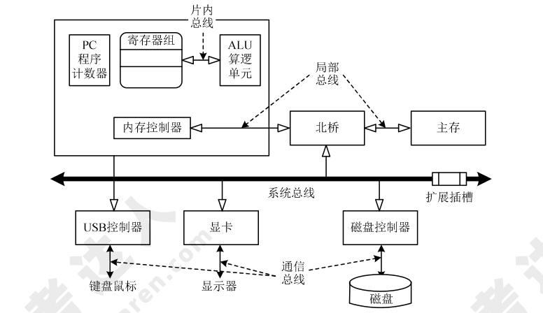

# 嵌入式基础知识

嵌入式操作系统是应用于嵌入式系统，实现软硬件资源的分配，任务调度，控制、协调并发活动等的操作系统软件。它除了具有一般操作系统最基本的功能如多任务调度、同步机制等之外，通常还会具备以下适用于嵌入式系统的特性：面向应用，可以进行检查和移植，以支持开放性和可伸缩性的体系结构；强实时性，以适应各种控制设备及系统；硬件适用性，对于不同硬件平台提供有效的支持并实现统一的设备驱动接高可靠性，运行时无须用户过多干预，并处理各类事件和故障；编码体积小，通常会固化在嵌入式系统有限的存储单元中。

!!! info "2015 综合知识 10"

## 嵌入式系统的组成及特点

嵌入式系统（Embedded System）是以特定应用为中心、以计算机技术为基础，并将可配置与可裁剪的软、硬件集成于一体的专用计算机系统。嵌入式系统的组成结构是：

1. 嵌入式处理器，除满足低功耗、体积小等需求外，工艺可分为民用、工业和军用等三个档次，民用级器件的工作温度范围是 0～70℃、工业级的是−40～85℃、军用级的是−55～150℃。其应用环境常常非常恶劣，比如有高温、寒冷、电磁、震动、烟尘等环境因素。
2. 相关支撑硬件，指除处理器以外的其他硬件，如存储器、定时器、总线等。
3. 嵌入式操作系统，与通用操作系统不同，嵌入式操作系统应具备 **实时性、可裁剪性和安全性** 等特征。
4. 支撑软件，其中的公共服务通常运行在操作系统之上，以库的方式被应用软件所引用。
5. 应用软件，是指为完成嵌入式系统的某一专用目标所开发的软件。

**嵌入式系统的特点**

1. 专用性强，常常面向特定应用需求，配备多种传感器。
2. 技术融合，将先进的计算机技术、通信技术、半导体技术和电子技术与各个行业的具体应用紧密结合难以拆分。
3. 软硬一体软件为主，在通用的嵌入式系统版本基础上裁剪冗余，高效设计。
4. 资源受限，由于低功耗、体积小和集成度高等要求，系统的资源非常少。
5. 程序代码固化在 ROM 中，以提高执行速度和系统可靠性。
6. 需专门开发工具和环境。
7. 体积小、价格低、工艺先进、性能价格比高、系统配置要求低、实时性强。
8. 对安全性和可靠性的要求高。

!!! info "2012 综合知识 10"

    在嵌入式系统开发中，由于嵌入式设备不具备足够的处理器能力和存储空间，程序开发一般用 PC (宿主机）来完成，然后将可执行文件下载到嵌入式系统（目标机）中运行。
    
    当宿主机与目标机的机器指令不同时，就需要交叉工具链（指编译、汇编、链接等一整套工具）。

## 嵌入式系统的分类

### 分类

根据不同用途可将嵌入式系统划分为 **嵌入式实时系统** 和 **嵌入式非实时系统** 两种。而实时系统又可分为 **强实时（Hard Real-Time）系统** 和 **弱实时（Weak Real-Time）系统**。从安全性要求看，嵌入式系统还可分为 **安全攸关（Safety-Critical 或 Life-Critical）系统** 和 **非安全攸关系统**。

### 实时系统

实时系统（Real-Time System，RTS）是指能够在规定的时间内完成系统功能和做出响应的系统。

!!! info "2012 综合知识 12"

    一个嵌入式实时操作系统（RTOS)的评价要从很多角度进行，如体系结构、API 的丰富程度、网络支持、可靠性等。其中，实时性是 RTOS 评价的最重要的指标之一， 实时性的优劣是用户选择操作系统的一个重要参考。
    
    严格地说，影响嵌入式操作系统实时性的因素有很多，如常用 **系统调用平均运行时间、任务切换时间、线程切换时间、信号量混洗时间（指从一个任务释放信号量到另一 个等待该信号量的任务被激活的时间延迟)、中断响应时间等。**
    
    任务执行时间不是反映 RTOS 实时性的评价指标。

### 安全攸关系统

安全攸关系统（Safety-Critical System）是指其不正确的功能或者失效会导致人员伤亡、财产损失等严重后果的计算机系统。

## 嵌入式软件的组成及特点

大多数嵌入式系统都具备实时特征，这种嵌入式系统的典型架构可概括为两种模式，即 **层次化模式架构** 和 **递归模式架构**。

嵌入式系统的最大特点就是系统的运行和开发是在不同环境中进行的，通常将运行环境称为“目标机”环境，称开发环境为“宿主机”环境，宿主机与目标机之间通过串口、网络或 JTAG 接口连接。

由于宿主机和目标机的指令往往是不同的，嵌入式系统的开发通常需要交叉平台开发环境支持，基本开发工具是<u>交叉编译器、交叉链接器和源代码调试器。</u>还需要注意 **实时性、安全性和可靠性、代码规模、软/硬件协同工作的效率和稳定性、特定领域的需求等。**

从细节上看，嵌入式系统可以分为：

1. **硬件层**，包括处理器、存储器、总线、I/O 接口及电源、时钟等。
2. **抽象层**，包括硬件抽象层（HAL），为上层应用（操作系统）提供虚拟的硬件资源；板级支持包（BSP），是一种硬件驱动软件，为上层操作系统提供对硬件进行管理的支持。
3. **操作系统层**，由嵌入式操作系统、文件系统、图形用户接口、网络系统和通用组件等可配置模块组成。
4. **中间件层**，是连接两个独立应用的桥梁，常用的有嵌入式数据库、OpenGL、消息中间件、Java 中间件、虚拟机（VM）、DDS/CORBA 和 Hadoop 等。
5. **应用层**，包括不同的应用软件。

!!! tip "2015 综合知识 9"

    在嵌入式系统中，板级支持包 Board Support Package(简称 BSP)是对硬件抽象层的实现，是介于主板的硬件和操作系统驱动程序之间的一层，为整个软件系统提供底层硬件支持，是介于底层硬件和上层软件之间的底层软件开发包，它主要的功能是给上层提供统一接口，同时屏蔽各种硬件底层的差异，以及提供操作系统的驱动及硬件驱动。简单地说，就是 BSP包含了所有与硬件有关的代码，为操作系统提供了硬件平台无关性。

嵌入式软件的主要特点有：

1. **可剪裁性：** 设计方法包括静态编译、动态库和控制函数流程实现功能控制等。
2. **可配置性：** 设计方法包括数据驱动、静态编译和配置表等。
3. **强实时性：** 设计方法包括表驱动、配置、静/动态结合、汇编语言等。
4. **安全性（Safety）：** 设计方法包括编码标准、安全保障机制、FMECA（故障模式、影响及危害性分析）。
5. **可靠性：** 设计方法包括容错技术、余度技术和鲁棒性设计等。
6. **高确定性：** 设计方法包括静态分配资源、越界检查、状态机、静态任务调度等。综上所述，嵌入式软件的开发也与传统的软件开发方法差异较大。在嵌入式系统设计时，要进行低功耗设计。主要技术有编译优化技术、软硬件协同设计、算法优化。

!!! info "2012 综合知识 11"

    硬件抽象层是位于操作系统内核与硬件电路之间的接口层，其目的在于将硬件抽象化。它隐藏了特定平台的硬件接口细节，为操作系统提供虚拟硬件平台，使其具有硬件无关性，可在多种平台上进行移植。

## 嵌入式系统硬件体系结构

### 组成结构

传统的嵌入式系统主要由嵌入式微处理器、存储器、总线逻辑、定时/计数器、看门狗电路、I/O 接口和外部设备等部件组成。

!!! info "2013 综合知识 10"

    PCI 是一种局部总线标准，它是在 CPU 和原来的系统总线之间插入的一级总线，具体由一个桥接电路实现对这一层的管理，并实现上下之间的接口以协调数据的传送。JTAG 是一个调试接口，用来供幵发人员调试 CPU 的工作状态。JTAG 软件通过该接口控制 CPU来调试 CPU 以及读写 Flash。

### 嵌入式微处理器分类

1. **微处理器（Microprocessor Unit，MPU）：** 微处理器+专门设计的电路板，集成度低、可靠性高，主要有：Am186/88、386EX、SC-400、PowerPC、68000、MIPS、ARM 系列等。
2. **微控制器（Microcontroller Unit，MCU）：** 又称单片机，把核心存储器和部分外设封装在片内。优点是单片化、体积小、功耗和成本下降，可靠性提高。包括 8501，P5IXA，MCS-251，MCS-96/196/296，C166/167，MC68HC05/11/12/16，68300 和数目众多的 ARM 系列。
3. **数字信号处理器（Digital Signal Processing，DSP）：** 采用哈佛结构，对系统结构和指令进行了特殊设计，适合执行大量数据处理。包括 TMS320 系列（含 C2000、C5000、C6000、C8000 系列）、DSP56000 系列、实时 DSP 处理器等。
4. **图形处理器（Graphics Processing Unit，GPU）：** 与 CPU 相比大幅加强了浮点运算能力和多核并行计算能力，因此常用于 AI 技术的深度学习的数据运算。
5. **片上系统（System on Chip，SoC）：** 由多个具有特定功能的集成电路组合在一个芯片上形成的系统或产品，其中包含完整的硬件系统，如处理器、IP（Intellectual Property）核、存储器等及其承载的嵌入式软件，如操作系统和定制的用户软件。

### 存储器分类

#### 随即存储器

随即存储器（Random Access Memory，RAM）。工作需要持续电力提供，可随机读写。

1. 动态随机存取存储器（Dynamic RAM，DRAM），采用电容存储信息，优点是集成度高、容量大、成本低，缺点是访问速度较慢、需要定期刷新。常作主存。
2. 静态随机存取存储器（Static RAM，SRAM），采用多个晶体管自锁的方式保存状态，优点是访问速度快、不需要刷新，缺点是集成度低、容量小、成本高。常用作高速缓存。

#### 只读存储器

只读存储器（Read Only Memory，ROM），存储的数据不会因掉电而丢失，读取的速度比 RAM 快，常见的有以下几种：

1. 掩膜型只读存储器（Mask Programmed ROM，MROM），优点是通过掩膜大批量制造、成本低，缺点是同批数据全部一致且不可修改，只适合大批量生产。
2. 可编程只读存储器（Programmable ROM，PROM），可以用专用编程设备一次性烧录数据，适合少量制造。
3. 可擦可编程只读存储器（Erasable Programmable ROM，EPROM），优点是写入的数据可以通过紫外线擦除重写。
4. 电可擦可编程只读存储器（Electrically Erasable Programmable ROM，EEPROM），优点是写入的数据可以通过电压来清除，但是清除的速度很慢。
5. 快闪存储器（Flash Memory），优点是可以联机擦写数据且擦写的次数多、速度快，缺点是读取的速度慢（相对其他 ROM 的速度而言）。

#### 内（外）总线逻辑

根据传输的信息种类分类，可分为以下几种。

1. 数据总线，用于传送需要处理或者需要存储的数据。
2. 地址总线，用于指定在 RAM 之中存储的数据的地址。
3. 控制总线，将微处理器控制单元的信号传送到周边设备。

根据连接部件分类，可分为以下几种。

1. 片内总线，连接芯片内部各元件。
2. 系统总线或板级总线，连接计算机系统的核心组件。
3. 局部总线，连接局部少数组件。
4. 通信总线，主机连接外设的总线。

各类总线在嵌入式系统的位置如图所示。

按照数据传输的方向，总线可以分为单工总线和双工总线。单工总线只能从一端向另一端传输而不能反向；双工总线能在两个方向传输。双工总线又分为半双工总线和全双工总线。半双工总线只能轮流向两个方向传输；全双工总线可以同时在两个方向传输。

!!! info "2015 综合知识 11"

按照总线使用的信号类型，总线可以分为并行总线和串行总线。并行总线包含多位传输线，在同一时刻可以传输多位数据，但一致性要求高，传输距离较近；而串行总线只使用一位传输线，同一时刻只传输一位数据，但距离可以较远。

#### 看门狗电路

看门狗电路，是嵌入式系统必须具备的一种 **系统恢复能力**，可防止程序出错或者死锁。**主要由输入端、寄存器、计数器和狗叫模块构成。** 通过寄存器对看门狗进行基本设置，计数器计算狗叫时间，狗叫模块决定看门狗超时后发出的中断或复位方式。程序正常运行时 MCU 会在输入端定期“喂狗”，超时不“喂狗”就会触发狗叫模块，一般是重启 MCU。

!!! info "2013 综合知识 11"

    看门狗（Watch Dog)是一个独立的定时器电路，有一个定时器控制寄存器，可以设定时间（开狗），到达时间后要置位（喂狗），如果没有的话，就认为是程序跑飞，就会发出 RESET指令。当系统工作正常时，CPU 将每隔一定时间输出一个脉冲给看门狗，即“喂狗”，若程序运行出现问题或硬件出现故障时而无法按时“喂狗”时，看门狗电路将迫使系统自动复位而重新运行程序。

## 安全攸关软件的安全性设计

IEEE 定义安全攸关软件是 **“用于一个系统中，可能导致不可接受的风险的软件”**。

### DO-178B 标准

该标准的目的是为制造机载系统和设备的机载软件提供指导，使其能够提供在满足符合适航要求的安全性水平下完成预期功能。

DO-178B 标准将软件生命周期分为 **“软件计划过程”、“软件开发过程”和“软件综合过程”**，其中软件开发过程细分为 **软件需求过程、软件设计过程、软件编码过程和集成过程** 4 个子过程；软件综合过程细分为 **软件验证过程、软件配置管理过程、软件质量保证过程、审定联络过程** 4 个子过程。DO-178B 根据软件在系统中的重要程度将软件的安全等级分为 A～E 五级，分别对应 **灾难级（A）、危害级（B）、严重级（C）、不严重级（D）和没有影响级（E）。**