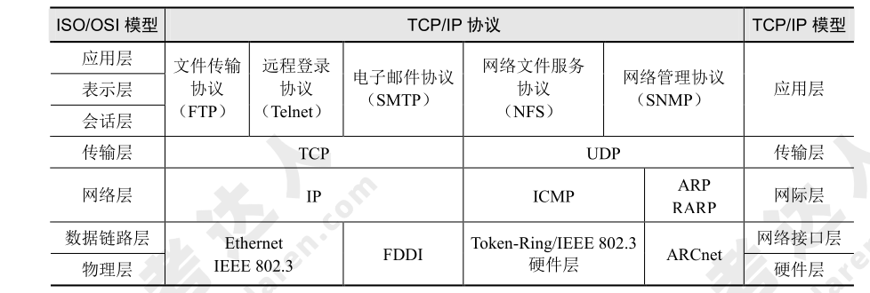

# 计算机网络

## 网络的基本概念

跟网络有关的指标分为：

1. 性能指标：从速率、带宽、吞吐量和时延等不同方面来度量计算机网络的性能。
2. 非性能指标：从费用、质量、标准化、可靠性、可扩展性、可升级性、易管理性和可维护性等来度量。

## 通信技术

1. 数据与信道：在通信中的数据包括模拟信号和数字信号，通过信道来传输，信息传输就是信源和信宿通过信道收发信息的过程。信道可分为逻辑信道和物理信道。逻辑信道是指在数据发送端和接收端之间存在的一条虚拟线路，可以是有连接的或无连接的，以物理信道为载体。信号在信源端和信宿端都需要经过信号变换，中间经过编码、交织、调制和解码等过程。
2. 复用技术：是指在一条信道上同时传输多路数据的技术，如 TDM 时分复用、FDM 频分复用和 CDM 码分复用等。即一条路上行驶多辆货车。
3. 多址技术：是指在一条线上同时传输多个用户数据的技术，在接收端把多个用户的数据分离，如 TDMA 时分多址、FDMA 频分多址和 CDMA 码分多址等。即一辆车上的货物属于不同用户。
4. 5G 通信网络。作为新一代的移动通信技术，网络结构、网络能力和应用场景等都与过去有很大不同，具有高速率、低时延、接入用户数高等优点。

## 网络技术

## 组网技术

### 网络设备及其工作层级

1. 集线器（Hub）和中继器（Repeater）工作在物理层。
2. 网桥（Bridge）和交换机（Switcher）工作在数据链路层。
3. 路由器（Router）和防火墙（Firewall）主要工作在网络层。防火墙是网络中一种重要的安全设备，作为网络对外的门户。

### 网络协议

OSI/RM 七层模型见表如下：

| 层的名称   | 主要功能                   | 详细说明                                                                                     |
| ---------- | -------------------------- | -------------------------------------------------------------------------------------------- |
| 应用层     | 处理网络应用               | 直接为终端用户服务，提供各类应用过程的接口和用户接口                                         |
| 表示层     | 管理数据表示方式           | 使应用层可以根据其服务解释数据的含义。通常包括数据编码、加密等，使不同类型的终端可以互相通信 |
| 会话层     | 建立和维护会话连接         | 负责管理远程用户进程间的通信，提供安全验证和机密性保护                                       |
| 传输层     | 端到端传输                 | 实现发送端和接收端的端到端数据透明传送，保障数据的无差错、按顺序、无丢失传输                 |
| 网络层     | 在源节点和目的节点之间传输 | 虚拟路由与交换报文组织交付，路由选择、阻塞控制及对网络的诊断                                 |
| 数据链路层 | 提供点到点的帧传输         | 将网络层收发数据块的传输进行帧控制，并提供误差检测和流量控制                                 |
| 物理层     | 在物理链路上传输比特流     | 通过一系列协议定义了物理链路的具体电气特性、功能特性及机械特性                               |

Internet 协议的组要协议及其层次关系见表如下：

#### 应用层协议

1. 文件传输协议（File Transport Protocol，FTP）：是网络上两台计算机传送文件的协议，运行在 TCP 之上，是通过 Internet 将文件从一台计算机传输到另一台计算机的一种途径。FTP 在客户机和服务器之间需建立两条 TCP 连接，一条用于传送控制信息（使用 21 号端口），另一条用于传送文件内容（使用 20 号端口）。
2. 简单文件传输协议（Trivial File Transfer Protocol，TFTP）：是用来在客户机与服务器之间进行简单文件传输的协议，提供不复杂、开销不大的文件传输服务。TFTP 建立在 UDP 之上，69 号端口；提供不可靠的数据流传输服务，不提供存取授权与认证机制，使用超时重传方式来保证数据的到达。
3. 超文本传输协议（Hypertext Transfer Protocol，HTTP）：是用于从 WWW 服务器传输超文本到本地浏览器的传送协议。HTTP 建立在 TCP 之上，使用 80 号端口。
4. 安全超文本传输协议（Hypertext Transfer Protocol Secure，HTTPS）：是以安全为目标的 HTTP 通道，在 HTTP 的基础上通过传输加密和身份认证保证了传输过程的安全性。HTTPS 在 HTTP 的基础下加入安全套接层（Secure Socket Layer，SSL）或 TLS，HTTPS 使用的 443 号端口。
5. 动态主机配置协议（Dynamic Host Configuration Protocol，DHCP）：通常被应用在大型的局域网络环境中，主要作用是集中地管理、分配 IP 地址，使网络环境中的主机动态地获得 IP 地址、网关地址、DNS 服务器地址等信息，并能够提升地址的使用率。在网络范围内可能存在多个 DHCP 服务器，各自负责不同的网段，也可能由同一个 DHCP 服务器，负责多个不同网段的地址分配。如果网络中有多个 DHCP 服务器发送 OFFER 报文，客户端只根据第一个收到的 OFFER 报文，返回 REQUEST 报文。
6. 域名系统（Domain Name System，DNS）：DNS 把主机域名解析为 IP 地址的系统，而 PTR（Pointer Record）负责将 IP 地址映射到域名的解析。

    DNS 查询过程有两种方法

    | 迭代查询                                                                       | 递归查询                                               |
    | ------------------------------------------------------------------------------ | ------------------------------------------------------ |
    | 查询得到的是其他服务器的引用，本地服务器就要访问被引用的服务器，做进一步的查询 | 查询方式要求服务器彻底地进行名字解析，并返回最后的结果 |

!!! info "2013 综合知识 15"

    DNS 查询过程分为两种查询方式：递归查询和迭代査询。
    
    递归查询的查询方式为：当用户发出查询请求时，本地服务器要进行递归杳询。这种查询方式要求服务器彻底地进行名字解析，并返回最后的结果 IP 地址或错误信息。如果查询请求在本地服务器中不能完成，那么服务器就根据它的配置向域名树中的上级服务器进行查询，在最坏的情况下可能要查询到根服务器。每次查询返回的结果如果是其他名字服务器的 IP 地址，则本地服务器要把查询请求发送给这些服务器，故进一步的查询。
    
    迭代查询的查询方式为：服务器与服务器之间的查询采用迭代的方式进行，发出查询请求的服务器得到的响应可能不是目标的 IP 地址，而是其他服务器的引用（名字和地址），那么本地服务器就要访问被引用的服务器，做进一步的查询。如此反复多次，每次都更接近目标的授权服务器，直至得到最后的结果 目标的 IP 地址或错误信息。
    
    根域名服务器为众多请求提供域名解析，若采用递归方式会大大影响性能。

#### 传输层协议

1. **传输控制协议（Transmission Control Protocol，TCP）。** TCP 是可靠的、面向连接的网络协议。具有差错校验和重传、流量控制、拥塞控制等功能。适用于数据量比较少，且对可靠性要求高的场合。

    !!! info "2012 综合知识 13"

        TCP 采用可变大小的滑动窗口协议进行流量控制。**在前向纠错系统中**，当接收端检测到错误后就根据纠错编码的规律自行纠错；**在后向纠错系统中**，接收方会请求发送方重发出错分组。IP 协议不预先建立虚电路，而是对每个数据报独立地选择路由并一站一站地进行转发，直到送达目标地。

2. **用户数据报协议（User Datagram Protocol，UDP）。** UDP 是不可靠的、无连接的网络协议。UDP 适合数据量大，对可靠性要求不是很高，但要求速度快的场合。

#### 网络层协议

IPv6 被称为“下一代互联网协议”，IP 数据报的目的地址有单播、多播/组播、任播。IPv4 to IPv6 过渡技术主要有：双协议栈技术、隧道技术、NAT-PT 技术。

!!! tip "2015 综合知识 15"

    IPv6 地址增加到 128 位，并且能够支持多级地址层次；地址自动配置功能简化了网络地址的管理；在组播地址中增加了范围字段，改进了组播路由的可伸缩性；增加的任意播地址比 IPv4 中的广播地址更加实用。
    
    IPv6 地址是一个或一组接口的标识符。IPv6 地址被分配到接口，而不是分配给结点。IPv6 地址有三种类型：
    
    1. 单播(Unicast)地址
    2. 任意播(AnyCast)地址
    3. 组播(Multicast)地址
    
    在 IPv6 地址中，任何全“0”和全“1”字段都是合法的，除非特别排除的之外。特别是前缀可以包含“0”值字段，也可以用“0”作为终结字段。一个接口可以被赋予任何类型的多个地址(单播、任意播、组播)或地址范围。

    与 IPv4 相比，IPv6 首部有下列改进：
    
    * **分组头格式得到简化：** IPv4 头中的很多字段被丢弃，IPv6 头中字段的数量从 12 个降到了8 个，中间路由器必须处理的字段从 6 个降到了 4 个，这样就简化了路由器的处理过程，提高了路由选择的效率。
    * **改进了对分组头部选项的支持：** 与 IPv4 不同，路由选项不再集成在分组头中，而是把扩展头作为任选项处理，仅在需要时才插入到 IPv6 头与负载之间。这种方式使得分组头的处理更灵活，也更流畅。以后如果需要，还可以很方便地定义新的扩展功能。
    * **提供了流标记能力：** IPv6 增加了流标记，可以按照发送端的要求对某些分组进行特别的处理，从而提供了特别的服务质量支持，简化了对多媒体信息的处理，可以更好地传送具有实时需求的应用数据。

### 交换机

交换机功能包括集线功能、中继功能、桥接功能、隔离冲突域功能。交换机协议有：

1. 生成树协议（STP），可以很好地解决链路环路问题。
2. 链路聚合协议，可以提升与邻接交换设备之间的端口带宽和提高链路可靠性。

### 路由器

路由功能由路由器（Router）来提供，包括异种网络互连、子网协议转换、数据路由、速率适配、隔离网络、报文分片和重组、备份和流量控制。路由器协议主要有：

1. 内部网关协议（Interior Gateway Protocol，IGP）：指在一个自治系统（Autonomous System，AS）内运行的路由协议。
2. 外部网关协议（Exterior Gateway Protocol，EGP）：指在 AS 之间的路由协议。EGP 是为简单的树型拓扑结构设计的。
3. 边界网关协议（Border Gateway Protocol，BGP）：Internet 的网络规模庞大，网络情况复杂，EGP 已不适用，在 EGP 的经验之上制定了新的网关协议即 BGP，也是 Internet 上唯一的网关协议。

## 网络工程

!!! info "2011 综合知识 14"

    结构化布线系统分为六个子系统：**工作区子系统、水平子系统、干线（垂直）子系统、设备间子系统、管理子系统和建筑群子系统。**
    
    干线（垂直）子系统是由主设备间（如计算机房、程控交换机房等）提供建筑中最重要的铜线或光纤线主干线路构成，是整个建筑的信息交通枢纽。一般它提供位于不同楼层的设备间和布线框间的多条连接路径，也可以连接单层楼的大片地区。

### 网络建设工程

可分为网络规划、网络设计和网络实施 3 个环节。

#### 网络规划

网络规划以需求为导向，兼顾技术和工程可行性。

!!! info "2013 综合知识 14"

    网络需求分析包括 **网络总体需求分析、综合布线需求分析、网络可用性与可靠性分析、网络安全性需求分析**，此外还需要进行 **工程造价估算**。

#### 网络设计

网络设计包括逻辑设计和物理设计。

* **逻辑设计** 指网络结构设计、网络技术选型、IP 地址和路由设计、网络冗余设计以及网络安全设计等。

!!! info "2010 综合知识 14"

    根据网络系统设计的一般规则，在逻辑网络设计阶段的任务通常是根据需求规范和通信规范，实施资源分配和安全规划。

!!! info "2011 综合知识 15"

    一个网络系统从构思开始，到最后被淘汰的过程称为网络生命周期。一般来说，网络生命周期应包括系统的 **构思和计划、分析和设计、以及运行和维护的全过程。** 网络系统的生命周期是一个循环迭代的过程，每次迭代的动力都来自于网络应用需求的变更。每一个迭代周期都是网络重构的过程。常见的迭代周期可分为以下五个阶段：**需求规范、通信规范、逻辑网络设计、物理网络设计、实施阶段。**
    
    逻辑网络设计是指根据用户需要确定网络建设的方案，包括拓扑结构规划、地址分配等、网络技术和服务器的选择等。
    
    物理网络设计的任务是选择符合逻辑性能要求的传输介质、设备、部件、部件和场所等，并将它们搭建成一个可以正常运行的网络。

* **物理设计** 指布线设计、机房设计、设备选型等。

* **网络冗余设计** 的目的就是避免网络组件单点失效造成应用失效；备用路径是在主路径失效时启用，其和主路径承担不同的网络负载；负载分担是网络冗余设计中的一种设计方式，其通过并行链路提供流量分担来提高性能；网络中存在备用链路时，可以考虑加入负载分担设计来减轻主路径负担。

!!! info "2010 综合知识 15"

    网络系统生命周期可以划分为 5 个阶段，实施这 5 个阶段的合理顺序是 **需求规范、通信规范、逻辑网络设计、物理网络设计、实施阶段**。

#### 网络实施

网络实施包括工程实施计划、网络设备验收、设备安装和调试、系统试运行和切换、用户培训等。

### 分层设计

网络设计一般采用分层的方式，分为接入层、汇聚层、核心层。

* **接入层：** 直接面向用户连接或访问网络的部分，***主要解决相邻用户之间的互访需求，并且为这些访问提供足够的带宽***，接入层还应当适当负责一些用户管理功能（如地址认证、用户认证、计费管理等），以及用户信息收集工作（如用户的 IP 地址、MAC 地址、访问日志等）。
* **汇聚层：** 是核心层和接入层的分界面，***完成网络访问策略控制、数据包处理、过滤、寻址，以及其他数据处理的任务***。汇聚层的存在与否要视网络规模大小而定。
* **核心层：** 网络主干部分称为核心层，核心层的 ***主要目的在于通过高速转发通信***，提供优化、可靠的骨干传输结构，因此，核心层交换机应拥有更高的可靠性、性能和吞吐量。核心层的设备采用双机冗余热备份是非常必要的，也可以使用负载均衡功能来改善网络性能。

!!! tip
    在设计核心层设备的功能时，应尽量避免使用数据包过滤、策略路由等降低数据包 转发处理的特性，以优化核心层获得低延迟和良好的可管理性。
    
    核心层应具有有限的和一致的范围，如果核心层覆盖的范围过大，连接的设备过多，必然引起网络的复杂度加大，导致网络管理性降低；同时，如果核心层覆盖的范围不一致，必然导致大量处理不一致情况的功能都在核心层网络设备中实现，会降低核心网络设备的性能。对于那些需要连接因特网和外部网络的网络工程来说，核心层应包括一条或多条连接到外部网络的连接，这样可以实现外部连接的可管理性和高效性。

!!! info "2010 综合知识 13"

    大型局域网通常划分为核心层、汇聚层和接入层，其中核心层在逻辑上只有一个，它连接多个分布层交换机，通常是一个园区中连接多个建筑物的总交换机的核心网络设备；汇聚层定义网络的访问策略；接入层提供局域网络接入功能，可以使用集线器代替交换机。

!!! info "2011 综合知识 13"

    核心层交换机一般都是三层或者三层以上的交换机，采用机箱式的外观，具有很多冗余的部件。在进行网络规划设计时，核心层的设备通常要占大部分投资，因为核心层是网络的高速主干，需要转发非常庞大的流量，对于冗余能力、可靠性和传输速度方面要求较髙。核心层交换机还需要支持链路聚合功能，以确保为分布层交换机发送到核心层交换机的流量提供足够的带宽。核心层交换机还应支持聚合万兆链接。这样可以让对应的分布层交换机尽可能高效的向核心层传送流量。**QoS 是核心层交换机提供的重要服务之一。**
    
    策略路由是一种比基于目标网络进行路由更加灵活的数据包路由转发机制。应用了策略路由，路由器将通过路由图决定如何对需要路由的数据包进行处理，路由图决定了一个数据包的下一跳转发路由器。

!!! info "2013 综合知识 13"

    层次化网络设计应该遵循一些简单的原则，这些原则可以保证设计出来的网络更加具有层次的特性：

    1. 在设计时，设计者应该尽量控制层次化的程度，一般情况下，由核心层、汇聚层、接入层三个层次就足够了，过多的层次会导致整体网络性能的下降，并且会提高网络的延迟，但是方便网络故障排查和文档编写。
    2. 在接入层应当保持对网络结构的严格控制，接入层的用户总是为了获得更大的外部网络访问带宽，而随意申请其他的渠道访问外部网络是不允许的。
    3. 为了保证网络的层次性，不能在设计中随意加入额外连接，额外连接是指打破层次性，在不相邻层次间的连接，这些连接会导致网络中的各种问题，例如缺乏汇聚层的访问控制和数据报过滤等。
    4. 在进行设计时，应当首先设计接入层，根据流量负载、流量和行为的分析，对上层进行更精细的容量规划，再依次完成各上层的设计。
    5. 除去接入层的其他层次，应尽量采用模块化方式，每个层次由多个模块或者设备集合构成，每个模块间的边界应非常清晰。
