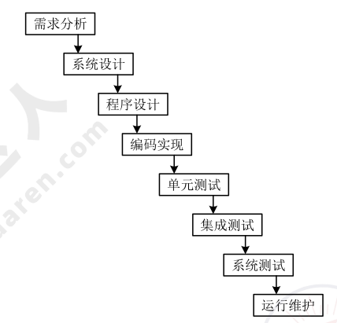
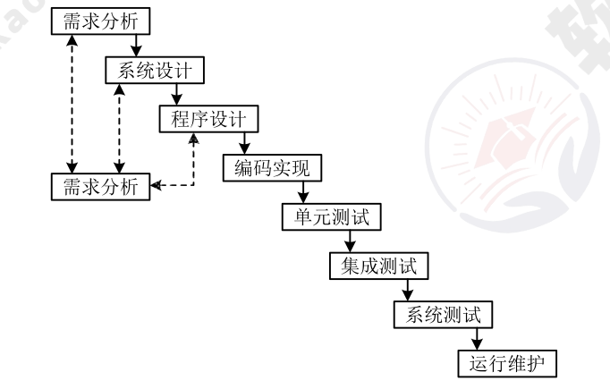
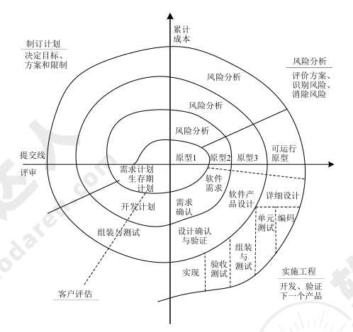
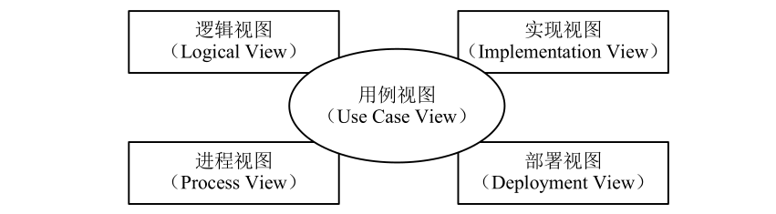
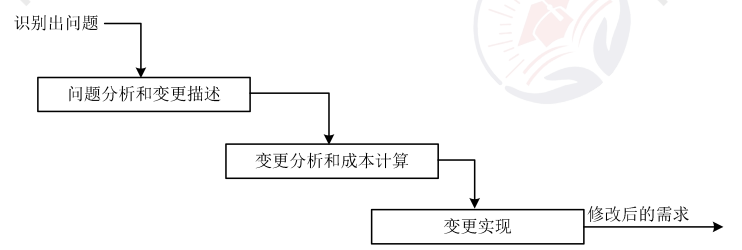
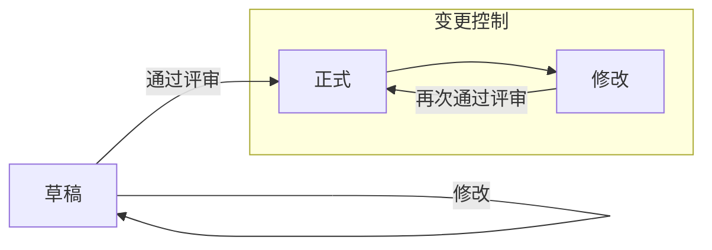
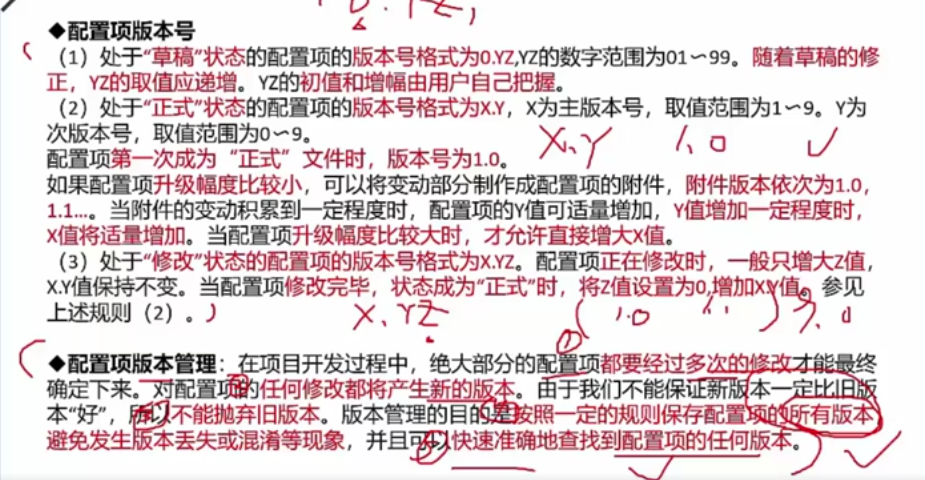
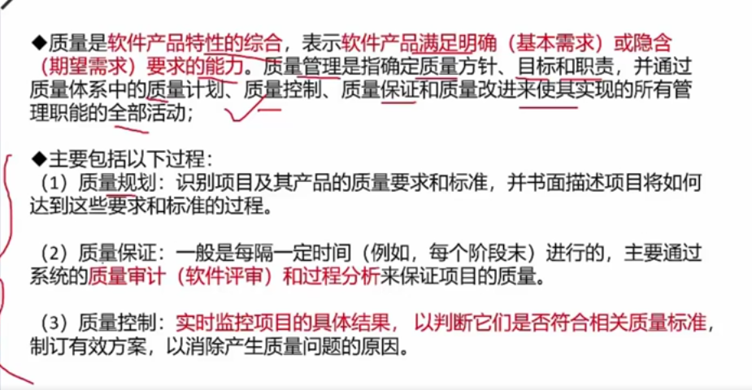
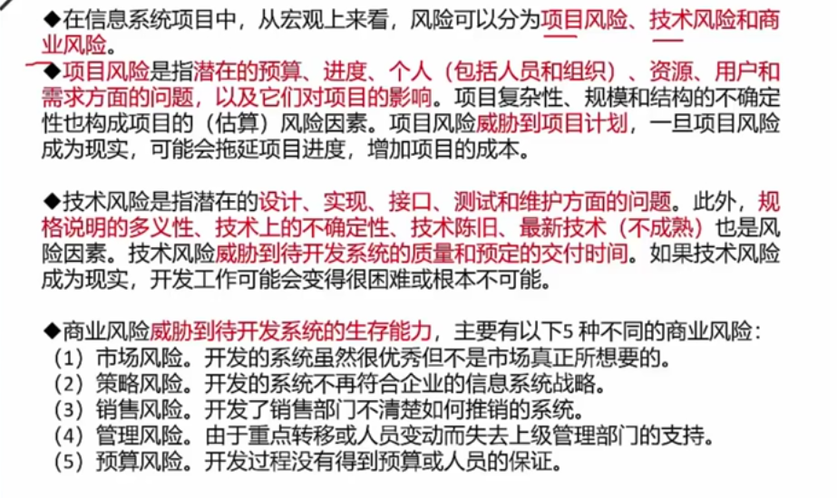

# 软件工程（编制中）

## 软件工程

软件危机（Software Crisis）。具体表现为：软件开发进度难以预测、软件开发成本难以控制、软件功能难以满足用户期望、软件质量无法保证、软件难以维护和软件缺少适当的文档资料。

!!! tip "2012 综合知识 32,33,34"

    软件开发环境（Software Development Environment, SDE)是指支持软件的工程化开发和维护而使用的一组软件，由软件工具集和环境集成机制构成。软件开发环境应支持多种集成机制，根据功能的不同，集成机制可以划分为环境信息库、过程控制与消息服务器、环境用户界面三个部分。
    
    1. 环境信息库。环境信息库是软件开发环境的核心，用以存储与系统开发有关的信息，并支持信息的交流与共享。环境信息库中主要存储两类信息，一类是开发过程中产生的有关被开发系统的信息，例如分析文档、设计文档和测试报告等；另一类是环境 提供的支持信息，如文档模板、系统配置、过程模型和可复用构件等。
    2. 过程控制与消息服务器。过程控制与消息服务器是实现过程集成和控制集成的基础。过程集成时按照具体软件开发过程的要求进行工具的选择与组合，控制集成使各工具之间进行并行通信和协同工作。
    3. 环境用户界面。环境用户界面包括环境总界面和由它实行统一控制的各环境部件及工具的界面。统一的、具有一致性的用户界面是软件开发环境的重要特征，是充分发挥环境的优越性、高效地使用工具并减轻用户的学习负担的保证。

### 软件过程模型

软件过程模型。软件要经历从需求分析、软件设计、软件开发、运行维护，直至被淘汰这样的全过程，这个全过程就是软件的生命周期。软件生命周期描述了软件从生到死的全过程。为了使软件生命周期中的各项任务能够有序地按照规程进行，需要一定的工作模型对各项任务给予规程约束，这样的工作模型被称为软件过程模型，有时也称为软件生命周期模型。

!!! tip "2012 综合知识 25"

    软件产品从形成概念开始，经过开发、使用和维护，直到最后退役的全过程成为软件生存周期。一个完整的软件生存周期是以需求为出发点，从提出软件开发计划的那一刻开始，直到软件在实际应用中完全报废为止。软件生存周期的提出了是为了更好地管理、维护和升级软件，其中更大的意义在于管理软件开发的步骤和方法。

    软件生存周期模型又称软件开发模型（software develop model)或软件过程模型(software process model),它是从某个特定角度提出的软件过程的简化描述。软件生存周期模型主要有 **瀑布模型、演化模型、原型模型、螺旋模型、喷泉模型和基于可重用构件的模型等。**
    
    **瀑布模型** 是最早使用的软件生存周期模型之一。瀑布模型的特点是因果关系紧密相连，前一个阶段工作的结果是后一个阶段工作的输入。或者说，每一个阶段都是建立在前一个阶段的正确结果之上，前一个阶段的错误和疏漏会隐蔽地带入后一个阶段。这种错误有时甚至可能是灾难性的，因此每一个阶段工作完成后，都要进行审查和确认。
    
    **演化模型** 主要针对事先不能完整定义需求的软件开发，是在快速开发一个原型的基础上，根据用户在调用原型的过程中提出的反馈意见和建议，对原型进行改进，获得原型的新版本，重复这一过程，直到演化成最终的软件产品。演化模型的主要优点是，任何功能一经开发就能进入测试，以便验证是否符合产品需求，可以帮助引导出高质量的产品要求。其主要缺点是，如果不控制地让用户接触开发中尚未稳定的功能，可能对开发人员及永固都会产生负面的影响。

!!! tip "软件过程"

    软件过程是制作人阿unjian产品的一组活动，以及结果，这些活动主要由软件人员来完成，软件活动主要包括如下内容。

    1. 软件描述：定义软件功能，以及使用的限制；
    2. 软件开发：软件的设计和实现，软件工程人员制作出能满足描述的软件；
    3. 软件有效性验证：软件必须经过严格的验证，以保证能够满足客户的需求；
    4. 软件进化：软件随着客户需求的变化不断的改进。

#### 瀑布模型

瀑布模型（Waterfall Model），如图所示，是结构化开发方法使用的软件过程模型。瀑布模型的特点是因果关系紧密相连，前一个阶段工作的输出结果，是后一个阶段工作的输入。每一个阶段工作完成后都伴随着一个里程碑。缺点是需求难以一次确定、变更的代价高、结果难以预见、各阶段工作不能并行。

{ width="500" }

#### 原型模型

{ align=left width="300" }

原型模型（Prototype Model），如图所示，又称快速原型，是原型方法使用的生命周期模型。原型模型解决了瀑布模型需求难以一次确定、结果难以预见的缺点。

原型模型有 **原型开发** 和 **目标软件开发** 两个阶段。

抛弃型原型将原型作为需求确认的手段，在需求确认结束后就被抛弃不用，继续用瀑布模型。

演化性原型在需求确认结束后，不断补充和完善原型，直至形成一个完整的产品。

???+ info "2011 综合知识 40"

    原型是软件系统的初始版本，用来演示概念并尝试设计选择，通常用来发现更多的问题和可能的解决方案。快速迭代式的原型开发能够有效控制成本，根据原型与最终产品之间的关系，原型开发分为三类：
    
    * 抛弃式原型开发利用原型验证和澄清系统的需求描述，重新构造系统；
    * 演化式原型开发逐步改进和细化原型，将原型进化直至产生出目标系统；
    * 增量式原型开发在建立软件总体设计的基础上，采用增量开发方法，使原型成为最终系统。

#### 螺旋模型

螺旋模型（Spiral Model），如图所示，是在快速原型的基础上结合瀑布模型扩展而成。把整个软件开发流程分成多个阶段，每一个阶段都由 **目标设定、风险分析、开发和有效性验证、评审** 4 部分组成。支持大型软件开发，适用于 **面向规格说明、面向过程和面向对象** 的软件开发方法，强调其他模型忽视的风险分析。

{ align=left width="300" }

!!! info "2012 综合知识 26"

1. **目标设定。** 为该项目进行需求分析，定义和确定这一个阶段的专门目标，指定对过程和产品的约束，并且制定详细的管理计划。
2. **风险分析。** 对可选方案进行风险识别和详细分析，制定解决办法，采取有效的措施避免这些风险。
3. **开发和有效性验证。** 风险评估后，可以为系统选择开发模型，并且进行原型开发，即开发软件产品。
4. **评审。** 对项目进行评审，以确定是否需要进入螺旋线的下一次回路，如果决定继续，就要制定下一阶段计划。

#### 敏捷模型

敏捷（Agile）模型，属于敏捷方法使用的模型。敏捷模型主要有<u>极限编程（Extreme Programming，XP）、水晶系列方法、并列争球法（Scrum）、特征驱动开发方法（Feature Driven Development，FDD）</u>等具体的敏捷方法，这些方法的显著特征如下：

* 极限编程（XP）：高效、低风险、测试先行（先写测试代码，再编写程序）。
* 水晶系列方法：不同的项目，采用不同的策略。
* 并列争球法（Scrum）：该方法侧重于项目管理。Scrum 包括一系列实践和预定义角色的过程骨架（是一种流程、计划、模式，用于有效率地开发软件）。在 Scrum 中，使用产品 Backlog 来管理产品的需求，产品 Backlog 是一个按照商业价值排序的需求列表。根据 Backlog 的内容，将整个开发过程分为若干个短的迭代周期（Sprint），在 Sprint 中，Scrum 团队从产品 Backlog 中挑选最高优先级的需求组成 Sprint Backlog。在每个迭代结束时，Scrum 团队将递交潜在可交付的产品增量。当所有 Sprint 结束时，团队提交最终的软件产品。
* 开放式源码指的是开放源码界使用的一种运作方式，开放式源码项目的一个特别之处就是程序开发人员在地域上分布很广。这使得它和其他敏捷方法不同，因为一般的敏捷方法都强调项目组成员在同一地点工作。开放源码的一个突出特点就是查错排障的高度并行性，任何人发现了错误都可将改正源码的“补丁”文件发给维护者，然后由维护者将这些“补丁”或新增的代码并入源码库。
* 特征驱动开发方法：该方法会将开发人员分类，分为指挥者（首席程序员）、类程序员等。功能驱动开发方法（FFD）由 Jeff De Luca 和大师 Peter Coad 提出，它致力于短时的迭代阶段和可见可用的功能，在 FDD 中一个迭代周期一般是两周。在 FDD 中程序开发人员分成两类，即首席程序员和“类”程序员（Class Owner）。首席程序员是最富有经验的开发人员，他们是项目的协调者、设计者和指导者；“类”程序员则主要做源码编写。
* 自适应软件开发（ASD）方法由 Jim Highsmith 提出，其核心是 3 个非线性且重叠的开发阶段，即猜测、合作与学习。

#### 快速应用开发模型

> 2012 综合知识 29,30

快速应用开发（Rapid Application Development，RAD)是一种比传统生存周期法快得多的开发方法，它强调极短的开发周期。RAD 模型是瀑布模型的一个高速变种，通过使用 **基于构件的开发方法** 获得快速开发。如果需求理解得很好，且约束了项目范围，利用这种模型可以很快地开发出功能完善的信息系统。但是 RAD 也具有以下局限性：

1. 并非所有应用都适合 RAD。RAD 对模块化要求比较高，如果有哪一项功能不能被模块化，那么 RAD 所需要的构建就会有问题；如果高性能是一个指标，且该指标必须通过调整接口使其适应系统构件才能获得，则 RAD 也有可能不能奏效。
2. 开发者和客户必须在很短的时间完成一系列的需求分析，任何一方配合不当，都会导致 RAD 项目失败。
3. RAD 只能用于管理信息系统的开发，不适合技术风险很高的情况。例如，当一个新系统要采用很多新技术，或当新系统与现有系统有较高的互操作性时，就不适合使用 RAD。

#### 软件统一过程模型

软件统一过程（Rational Unified Process，RUP）模型。RUP 是一种重量级过程模型，属于构件化开发使用的软件过程模型。其生命周期是一个二维的软件开发模型，划分为多个循环（Cycle），每个循环生成产品的一个新的版本，每个循环依次由 **初始、细化、构造和移交** 4 个连续的阶段（Phase）组成，每个阶段完成确定的任务。

RUP 中有 9 个核心工作流，这 9 个核心工作流分别是：**业务建模、需求、分析与设计、实现、测试、部署、配置与变更管理、项目管理、环境。**

RUP 的特点是 **用例驱动的、以架构为中心的、迭代和增量** 的软件开发过程。

RUP 用“4+1”视图模型来描述架构，如图所示，后被 UML 吸收采纳。



* **逻辑视图：** 对应最终用户，主要支持功能性需求，即在为用户提供服务方面系统所应该提供的功能。**逻辑视图常用类图、对象图、状态图、协作图表示。**
* **实现视图：** 又称为开发视图，对应程序员，关注软件开发环境下实际模块的组织，描述系统的各部分如何被组织为模块和组件即开发环境中软件的静态组织结构。**该视图通常包含包图和组件图。**
* **进程视图：** 又叫过程视图，对应系统集成人员，考虑一些非功能性的需求，如性能和可用性，它可以解决并发性、分布性、系统完整性、容错性的问题。**进程视图常用活动图表示。**
* **部署视图：** 又叫物理视图，对应系统工程师。描述如何将前三个视图中所述的系统设计实现为一组现实世界的实体。展示了如何把软件映射到硬件上，它通常要考虑到系统性能、规模、可靠性等。解决系统拓扑结构、系统安装、通信等问题。**部署视图常用部署图表示。**
* **用例视图：** 所有其他视图都依靠用例视图（场景）来指导它们，这就是将模型称为“4+1” 的原因。

RUP 在每次迭代中，只考虑系统的一部分需求，进行 **分析、设计、实现、测试和部署** 等过程。

!!! info "2011 综合知识 29"

!!! tip "2011 综合知识 46,47,48"

    1995 年 Kruchten 提出了著名的“4+1” 视图，用来描述软件系统的架构。在“4+1”视图中，逻辑视图用来描述设计的对象模型和对象之间的关系；开发视图描述了软件模块的组织与管理；过程视图描述设计的并发和同步特征。

!!! tip "2013 综合知识 33,34"

    RUP 中的软件过程在时间上被分解为 4 个顺序的阶段，分别是初始阶段、细化阶段、构建阶段和移交阶段。

    初始阶段的任务是为系统建立业务模型并确定项目的边界。
    
    细化阶段的任务是分析问题领域，建立完善的架构，淘汰项 H 中最高风险的元素。
    
    在构建阶段，要开发所有剩余的构件和应用程序功能，把这些构件集成为产品。
    
    移交阶段的重点是确保软件对最终用户是可用的。
    
    基于 RUP 的软件过程是一个迭代过程，通过初始、细化、构建和移交 4 个阶段就是一个开发周期，每次经过这 4 个阶段就会产生一代产品，在每一轮迭代中都要进行测试与集成。

### 软件能力成熟度模型

软件能力成熟度模型（Capability Maturity Model for Software，CMM）。CMM 是一个概念模型，模型框架和表示是刚性的，不能随意改变，但模型的解释和实现有一定弹性。

### 软件能力成熟度模型集成

软件能力成熟度模型集成（Capability Maturity Model Integration for Software，CMMI）。CMMI 是在 CMM 的基础上发展而来的。CMMI 提供了一个软件能力成熟度的框架，它将软件过程改进的步骤组织成 5 个成熟度等级：初始级、已管理级、已定义级、量化管理级、优化级。量化管理级与已定义级的区别是对过程性能的可预测。

## 需求工程

???+ info "2011 综合知识 39"

    外部设计处于软件设计的开始阶段，主要是按系统需求说明来确定此系统的软件结构和对应于系统需求说明，设计出各个功能部分的功能和接口。内部设计处于软件工程中的概要设计阶段，按照外部设计中确立的系统软件结构，来细化此系统各个功能部件以及各个部件接口的设计，并且详细给出各个功能部件详细的数据输入、输出设计。内部设计细化外部设计中的各种功能。

软件需求包括 3 个不同的层次。

1. 业务需求（Business Requirement），反映了组织机构或客户对系统、产品高层次的目标要求；
2. 用户需求（User Requirement），描述了用户使用产品必须要完成的任务，是用户对该软；
3. 功能需求（functional requirement），从系统操作的角度定义了开发人员必须实现的软件功能，来满足业务需求和用户需求。

需求工程（Requirement Engineering，RE）是指应用已证实有用的原理、方法，通过合适的工具和记号，系统地描述待开发系统及其行为特征和相关约束。需求工程由 ** 需求获取、需求分析、形成需求规格（或称为需求文档化）、需求确认与验证、需求管理** 5 个阶段组成。

### 需求获取

需求获取是获得系统必要的特征，或者是获得用户能接受的、系统必须满足的约束。需求获取的基本步骤：

1. 开发高层的业务模型。
2. 定义项目范围和高层需求。
3. 识别用户角色和用户代表。
4. 获取具体的需求。
5. 确定目标系统的业务工作流。
6. 需求整理与总结。
   
需求获取的方法包括用户面谈、需求专题讨论会、问卷调查、现场观察、原型化方法和头脑风暴法等。

### 软件需求规格说明书

软件需求规格说明书（Software Requirement Specification，SRS）具体包括功能需求、非功能需求和约束。约束包括设计约束和过程约束。批准的 SRS 是需求开发和需求管理之间的桥梁。

???+ info "2011 综合知识 25"

    需求定义的过程也就是形成需求规格说明书的过程，通常有两种需求定义的方法：**严格定义方法和原型方法。**

    严格定义方法也称为预先定义，需求的严格定义建立在以下基本假设之上：

    * 所有需求都能够被预先定义。这意味着在没有实际系统运行经验的情况下，全部的系统需求均可通过逻辑推断得到。但这种假设在许多场合是不能成立的。
    * 开发人员与用户之间能够准确而清晰地交流。
    * 采用图形（或文字）可以充分体现最终系统。在使用严格定义需求的开发过程中，开发人员与用户之间交流与沟通的主要工具是定义报告，包括文字、图形、逻辑规则和数据字典等技术工具。

    原型化的需求定义过程是一个开发人员与用户通力合作的反复过程。从一个能满足用户基本需求的原型系统开始，允许在开发过程中提出更好的要求，根据用户的要求不断地对系统进行完善，它实质上是一种迭代的循环型的开发方式。采用原型方法时需注意一下几个问题：

    * 并非所有的需求都能在系统开发前被准确地说明。
    * 项目干系人之间通常都存在交流上的困难。
    * 需要实际的、可供用户参与的系统模型。
    * 有合适的系统开发环境。
    * 反复是完全需要和值得提倡的。需求一旦确定，就应该遵从严格定义方法。

???+ info "2013 综合知识 25"

    在初始项目范围说明书和已文档化的主要的可交付物、假设和约束条件的基础上准备详细的项目范围说明书，是项目成功的关键。范围定义的输入包括以下内容：
    
    1. 项目章程。如果项目章程或初始的范围说明书没有在项目执行组织中使用，同样的信息需要进一步收集和开发，以产生详细的项目范围说明书。
    2. 项目范围管理计划。
    3. 组织过程资产。
    4. 批准的变更申请。

### 需求管理

需求管理是一个对系统需求变更、了解和控制的过程，包括 **变更控制、版本控制、需求跟踪** 等活动。

???+ info "2011 综合知识 25"

    软件需求工程是包括创建和维护软件需求文档所必须的一切活动的过程，可以分为需求开发和需求管理两大工作。需求开发包括需求获取、需求分析、编写需求规格说明书（需求定义）和需求验证 4 个阶段。在需求开发阶段需要确定软件所期望的用户类型， 获取各种用户类型的需求，了解实际的用户任务和目标，以及这些任务所支持的业务 需求。
    
    需求管理是一个对系统需求变更、了解和控制的过程，逋常包括定义需求基线、处理需求变更和需求跟踪方面的工作。需求管理强调：控制对需求基线的变动；保持项目计划与需求的一致；控制单个需求和需求文档的版本情况；管理需求和联系链，或者管理单个需求和其他项目可交付产品之间的依赖关系；跟踪基线中的需求状态。
    
    需求开发与需求管理是相辅相成的，需求开发是主线、目标；需求管理是支持、保障。

### 需求变更

需求变更管理过程如图所示：



### 变更控制委员会

变更控制委员会（Change Control Board，CCB）由项目所涉及的多方成员共同组成，通常包括用户和实施方的决策人员。CCB 是决策机构，不是作业机构，通常 CCB 的工作是通过评审手段来决定项目是否能变更，但不提出变更方案。过程及操作步骤为制定决策、交流情况、重新协商约定。

### 需求跟踪

需求跟踪提供了由需求到产品实现整个过程范围的明确查阅的能力。需求跟踪的目的是建立与维护需求—设计—编程—测试”之间的一致性，确保所有的工作成果符合用户需求。需求跟踪有 **正向跟踪** 和 **逆向跟踪** 两种方式，合称为“双向跟踪”。不论采用何种跟踪方式，都要建立与维护 **需求跟踪矩阵**。

!!! info "2011 综合知识 24"

    需求跟踪包括编制每个需求与系统元素之间的联系文档，这些元素包括别的需求、体系结构、其他设计部件、源代码模块、测试、帮助文件和文档等。跟踪能力信息使变更使变更影响分析十分便利，有利于确认和评估实现某个建议的需求变更所必须的工作。

    利用需求跟踪能力链(traceability link)可以跟踪一个需求使用的全过程，也就是从初始需求到实现的前后生存期。跟踪能力是优秀需求规格说明书的一个特征，为了实现跟踪能力，必须统一地标识出每一个需求，以便能明确地进行查阅。

    ```mermaid
    flowchart LR
        A["客户需求"]
        B[软件需求]
        C[下一级工作产品]
        A -->|追溯到需求从需求回溯| B
        B -->|回溯到需求从需求追溯| C
    ```

    客户需求向前追溯到软件需求。这样就能区分出开发过程中或者开发结束后，由于客户需求变更受到影响的软件需求，这也就可以确保软件需求规格说明包括了所有客户需求。从软件需求回溯响应的客户需求。这也就是确认每个软件需求的源头。如果使用实例的形式来描述客户需求，那么客户需求与软件需求之间的跟踪情况就是使用实例和功能性需求。从软件需求向前追溯到下一级工作产品。由于开发过程中系统需求转变为软件需求、设计、编码等，所以通过定义单个需求和特定的产品元素之间的（联系）链，可以从需求向前追溯到下一级工作产品。这种联系链告诉我们每个需求对应的产品部件，从而确保产品部件满足每个需求。
    
    从产品部件回溯到软件需求。说明了每个部件存在的原因。如果不能把设计元素、代码段或测试回溯到一个需求，可能存在“画蛇添足”的程序。然而，如果这些孤立的元素表明了一个正当的功能，则说明需求规格说明书漏掉了一项需求。

!!! info "2010 综合知识 22"

    在初步项目范围说明书中己文档化的主要的可交付物、假设和约束条件的基础上准备详细的项目范围说明书，是项目成功的关键。范围定义的输入包括以下内容：
    
    1. 项目章程。如果项目章程或初始的范围说明书没有在项目执行组织中使用，同样的信息需要进一步收集和开发，以产生详细的项目范围说明书。
    2. 项目范围管理计划。
    3. 组织过程资产。
    4. 批准的变更申请。

!!! info "2010 综合知识 24"

    对许多项目来说，系统软件总需要不断完善，一些需求的改进是合理的而且不可避免，要使得软件需求完全不变更，也许是不可能的，但毫无控制的变更是项目陷入混乱、不能按进度完成或者软件质量无法保证的主要原因之一。
    
    一个好的变更控制过程，给项目风险承担者提供了正式的建议需求变更机制。可以通过需求变更控制过程来跟踪已建议变更的状态，使已建议的变更确保不会丢失或疏忽。 在实际中，人们总是希望使用自动工具来执行变更控制过程。有许多人使用商业问题跟踪工具来收集、存储、管理需求变更；可以使用工具对一系列最近提交的变更建议产生一个列表给变更控制委员会开会时做议程用。问题跟踪工具也可以随时按变更状态分类包裹变更请求的数目。
    
    挑选工具时可以考虑以下几个方面：
    
    1. 可以定义变更请求的数据项。
    2. 可以定义变更请求生存期的状态转换图。
    3. 可以加强状态转换图，使经授权的用户仅能做出所允许的状态变更。
    4. 记录每一种状态变更的数据，确认做出变更的人员。
    5. 可以定义在提交新请求或请求状态被更新后应该自动通知的设计人员。
    6. 可以根据需要生成标准的或定制的报告和图表。

!!! info "2010 综合知识 25"

    过程能力成熟度模型（Capability Maturity Model, CMM）在软件开发机构中被广泛用来指导软件过程改进。该模型描述了软件过程能力的 5 个成熟度级别，每一级都包含若干关键过程域（Key Process Areas，KPA）。

    CMM 的第二级为可重复级，它包括了 6 个关键过程域，分别是：需求管理、软件项目计划、软件项目跟踪和监督、软件分包合同管理、软件质量保证和软件配置管理。
    
    需求管理的目标是为软件需求建立一个基线，提供给软件工程和管理使用：软件计划、产品和活动与软件需求保持一致。
    
## 系统分析与设计

### 结构化方法

结构化方法（Structured Analysis and Structured Design，SASD）又称为<u>面向功能的软件开发方法</u>或<u>面向数据流的软件开发方法</u>。针对软件生存周期各个不同的阶段，有 **结构化分析**、**结构化设计** 和 **结构化编程** 等方法。

!!! info "2010 综合知识 32"

#### 结构化分析 

结构化分析（Structured Analysis, SA）利用图形表达用户需求中的功能需求，使用的手段主要有<u>数据流图（Data Flow Diagram, DFD）、数据字典、结构化语言、判定表及判定树等</u>。

数据流图（DFD）由 4 种基本元素组成：<u>数据流、处理/加工、数据存储和外部项</u>。

结构化分析具体的建模过程及步骤为<u>明确目标、确定系统范围、建立顶层 DFD 图、构建第一层 DFD 分解图、开发 DFD 层次结构图、检查确认 DFD 图</u>。

数据字典（Data Dictionary）是一种标记用户可以访问的数据项和元数据的目录，是对系统中使用的所有数据元素定义的集合，包括数据项、数据结构、数据流、数据存储和处理过程。

结构化方法分析模型的核心是数据字典，围绕这个核心，有 3 个层次的模型，分别是<u>数据模型、功能模型和行为模型（也称为“状态模型”）</u>。在实际工作中一般使用 E-R 图表示数据模型；用 DFD 表示功能模型；用状态转换图表示行为模型。这 3 个模型有密切的关系，他们建立不具有严格的时序性，而是一个迭代的过程。

DFD 图需要满足规则：

* 父图数据流必须在子图中出现；
* 一个处理至少有一个输入流和一个输出流；
* 一个存储必定有流入和流出；
* 一个数据流至少有一端是处理端；
* 模型表达的信息是全面的、完整的、正确的和一致的。

#### 结构化设计

结构化设计（Structured Design, SD）是一种面向数据流的设计方法，以 SRS 和 SA 阶段所产生的数据流图和数据字典等文档为基础，是一个<u>自顶向下、逐步求精和模块化</u>的过程。SD 分为 **概要设计** 和 **详细设计** 两个阶段。

* 概要设计的主要任务是确定软件系统的结构，对系统进行模块划分，确定每个模块的功能、接口和模块之间的调用关系；
* 详细设计的主要任务是为每个模块设计实现的细节。

在 SD 中，模块是实现功能的基本单位，一般具有 **功能、逻辑和状态** 3 个基本属性。

耦合表示模块之间的联系的程度，耦合度从低到高依次如表所示：

| 耦合类型   | 描述 |
| ---------- | ---- |
| 非直接耦合 |  两个模块之间没有直接关系，互相不依赖对方    |
| 数据耦合   |     一组模块借助参数表传递简单数据 |
| 标记耦合   |     一组模块通过参数表传递记录等复杂信息（数据结构） |
| 控制耦合   |     模块之间传递的信息中包含用于直接控制模块内部逻辑的信息 |
| 通信耦合   |     一组模块共享了输入或输出 |
| 公共耦合   |     多个模块都访问同一个公共数据环境，公共的数据环境可以是全局数据结构、共享的通信区、内存的公共覆盖区等 |
| 内容耦合   |     一个模块直接访问另一个模块的内部数据、一个模块不通过正常入口跳转 |

内聚表示模块内部个代码成分之间联系的紧密程度，内聚从高到底依次如表所示：

| 内聚类型 | 描述                                                               |
| -------- | ------------------------------------------------------------------ |
| 功能内聚 | 各个部分协同完成一个单一功能，缺一不可                             |
| 顺序内聚 | 处理元素相关，而且必须顺序执行，通常前一任务的输出是后一任务的输入 |
| 通信内聚 | 所有处理元素集中在一个数据结构的区域上                             |
| 过程内聚 | 处理元素相关，而且必须按特定的次序执行                             |
| 时间内聚 | 所包含的任务必须在同一时间间隔内执行                               |
| 逻辑内聚 | 完成逻辑上相关的一组任务，互相存在调用关系                         |
| 偶然内聚 | 完成一组没有关系或松散关系的任务，或者仅仅代码相似 |

模块分解中应遵循“高内聚、低耦合”的设计原则。

概要设计使用系统结构图（Structure Chart，SC），又称为模块结构图，反映了系统的总体结构。

详细设计的主要任务是设计每个模块的实现算法、所需的局部数据结构。详细设计的表示工具有图形工具、表格工具和语言工具。图形有业务流图、程序流程图、问题分析图（Problem Analysis Diagram，PAD）、NS 流程图等。

!!! tip "2013 综合知识 37"

    自顶向下方法是一种决策策略。软件开发涉及作什么决策、如何决策和决策顺序等决策问题。
    
    自顶向下方法在任何时刻所作的决定都是当时对整个设计影响最大的那些定。如果把所有决定分组或者分级，那么决策顺序是首先作最高级的决定，然后依次地作较低级的决定。同级的决定则按照随机的顺序或者按别的方法。一个决策的级别是看它距离要达到的最终目的（因此是软件的实际实现）的远近程度。从问题本身来看，或是由外(用户所见的）向内（系统的实现）看，以距离实现近的决定为低级决定，远的为高级决定。
    
    在这个自顶向下的过程中，一个复杂的问题（任务）被分解成若干个较小较简单的问题（子任务），并且一直继续下去，直到每个小问题（子任务）都简单到能够直接解决（实现）为止。

    <div class="grid cards" markdown>

    - 自顶向下方法的优点是：

        ---
    
        * 可为企业或机构的重要决策和任务实现提供信息。
        * 支持企业信息系统的整体性规划，并对系统的各子系统的协调和通信提供保证。
        * 方法的实践有利于提高企业人员整体观察问题的能力，从而有利于寻找到改进企业组织的途径。

    - 自顶向下方法的缺点是：

        ---

        * 对系统分析和设计人员的要求较高。
        * 开发周期长，系统复杂，一般属于一种高成本、大投资的工程。
        * 对于大系统而言，自上而下的规划对于下层系统的实施往往缺乏约束力，
        * 从经济角度来看，很难说自顶向下的做法在经济上是合算的。 

    </div>

#### 结构化编程

结构化编程（Structured Programming, SP）通过顺序、分支和循环三种基本控制结构可以构造出任何单入口单出口程序。

<div class="grid cards" markdown>

- 结构化编成强调

    ---

    自顶向下，逐步细化；
    
    清晰第一，效率第二；
    
    书写规范，缩进格式；
    
    基本结构，组合而成。

- 编程原则

    ---
    
    程序 =（算法）+（数据结构）。
    
    两者分开设计，以算法（函数或过程）为主。
</div>


#### 数据库设计（概念结构设计部分）

概念结构设计建立抽象的概念数据模型，通常采用实体-联系图（Entity Relationship Diagram, E-R 图）来表示。

???+ info "2011 综合知识 32"

    结构化方法也称为生命周期法，是一种传统的信息系统开发方法，由 **结构化分析、结构化设计和结构化程序设计** 三部分组成，其精髓是 **自顶向下、逐步求精和模块化设计。** 

    结构化方法的主要特点是：开发目标清晰化、开发工作阶段化、开发文档规范化和设计方法结构化。结构化方法特别适合于数据处理领域的问题，但是不适应于规模较大、比较复杂的系统开发。

    结构化方法的缺点是开发周期长、难以适应需求的变化、很少考虑数据结构。

    面向对象方法是目前比较主流的开发方法。面向对象方法是系统的描述及信息模型的表示与客观实体相对应，符合人们的思维习惯，有利于系统开发过程中用户与开发人员的交流和沟通，缩短开发周期，提高系统开发的正确性和效率。可以把结构化方法和面向对象方法结合起来进行系统开发。

    首先使用结构化方法进行自顶向下的整体划分；然后再自底向上地采用面向对象方法开发系统。

    敏捷方法是从 20 世纪 90 年代开始逐渐引起广泛关注的一种新型软件开发方法，以应对快速变化的需求。敏捷方法是一种以人为核心、迭代、循序渐进的开发方法。敏捷方法强调，让客户满意和软件尽早增量发布：小而高度自主的项目团队；非正式 g 方法：最小化软件工程工作产品以及整体精简开发。与传统方法相比，敏捷开发方法比较适合需求变化较大或者开发前期需求不是很清晰的项目，以它的灵活性来适应需求的变化。

    面向服务的方法以粗粒度、松散耦合和基于标准的服务为基础，增强了系统的灵活性、可复用性和可演化性。

### 面向对象方法

#### 面向对象的分析方法

面向对象的分析方法（Object-Oriented Analysis，OOA）。OOA 模型由 5 个层次（**主题层、对象类层、结构层、属性层和服务层**）和 5 个活动（**标识对象类、标识结构、定义主题、定义属性和定义服务**）组成。
    
OOA 的基本原则有 **抽象、封装、继承、分类、聚合、关联、消息通信、粒度控制和行为分析。**
    
OOA 的 5 个基本步骤：**确定对象和类、确定结构、确定主题、确定属性、确定方法。**

**UML 2.0**

UML 对系统架构的定义是系统的组织结构，包括系统分解的组成部分，以及他们的关联性、交互机制和指导原则等提供系统设计的信息。具体来说，就是指以下 5 个系统视图：逻辑视图、进程视图、实现视图、部署视图、用例视图。（[详细](#_9)）

UML **交互图** 包括：<u>交互概览图、定时图、顺序图（序列图）与通信图（协作图）</u>，除此之外，**动态模型** 还包括：状态图和活动图等。

> UML 关系：依赖、关联、泛化、实现、组合、聚合

在 UML 用例图中，**用例与用例** 之间关系有 **扩展、包含和泛化（继承）** 三种

!!! info "2012 综合知识 27,28"

    基于 UML 的需求分析过程大致可分为以下步骤：
    
    1. **利用用例及用例图表示需求。** 从业务需求描述出发获取执行者和场景；对场景进行汇总、分类、抽象，形成用例；确定执行者与用例、用例与用例图之间的关系，生成用例图。
    2. **利用包图和类图表示目标软件系统的总体框架结构。** 根据领域知识、业务需求描述和既往经验设计目标软件系统的顶层架构；从业务需求描述中提取“关键概念”，形成领域概念模型；从概念模型和用例出发，研究系统中主要的类之间的关系，生成类图。

<div class="grid cards" markdown>

- 用例模型

    ---

    * 识别参与者
    * 合并需求获得用例
    * 细化用例描述
        * 用例名称
        * 简要说明
        * 事件流
        * 非功能需求
        * 前置条件
        * 后置条件
        * 扩展点
        * 优先级
    * 调整用例模型
        * 包含关系
        * 扩展关系
        * 泛化关系

- 分析模型

    ---

    * 定义概念类
    * 识别类之间的关系
        * 依赖关系
        * 关联关系
        * 聚合关系
        * 组合关系
        * 泛化关系
        * 实现关系
    * 为类添加职责
    * 建立交互图

</div>

#### 面向对象设计方法

在面向对象设计方法（Object-Oriented Design，OOD）中，数据结构和在数据结构上定义的操作算法封装在一个对象之中。类封装了信息和行为，是具有相同属性、方法和关系的对象集合的总称。类可以分为 3 种类型：

1. **实体类：** 一般来说是一个名词，通常都是永久性需要存储的，例如教师、学生。
2. **控制类：** 是用于控制用例工作的类，控制对象（控制类的实例）通常控制其他对象或协调其他对象的行为，例如登录验证。
3. **边界类：** 用于封装在用例内、外流动的信息或数据流，例如窗口、通信协议、接口等。

???+ info "2011 综合知识 29,30"

    类封装了信息和行为，是面向对象的重要组成部分。设计类是面向对象设计过程中最重要的组成部分，也是最复杂和最耗时的部分。在面向对象设计过程中，类可以分为三种类型：实体类、边界类和控制类。

    实体类映射需求中的每个实体。实体类保存需要存储在永久存储体中的信息。实体类是对用户来说最有意义的类，通常采用业务领域术语命名，一般来说是一个名词，在用例模型向领域模型的转化中，参与者一般对应于实体类。

    控制类是用于控制用例工作的类，一般是由动宾结构的短语（“动词+名词”或“名词+动词”）转化而来的名词。控制类用于对一个或几个用例所特有的控制行为进行建模，控制对象（控制类的实例）通常控制其他对象。因此它们的行为具有协调性。
    
    边界类用于封装在用例内、外流动的信息或数据流。边界类是一种用于对系统外部环境与其内部运作之间的交互进行建模的类，用于实现目标软件系统与外部系统或外部设备之间的信息交流和互操作。

???+ info "2011 综合知识 31"

    常用的面向对象设计原则包括 **开闭原则、里氏替换原则、依赖倒置原则、组合/聚合复用原则、接口隔离原则和最少知识原则等。** 这些设计原则首先都是面向复用的原则，遵循这些设计原则可以有效地提高系统的复用性，同时提高系统的可维护性。

    最少知识原则（也称为迪米特法则）是面向对象设计原则之一，指一个软件实体应当尽可能少地与其他实体发生相互作用。这样，当一个实体被修改时，就会尽可能少地影响其他的实体。

    最少知识原则主要用于控制信息的过载。在将最少知识原则运用到系统设计中时，要注意以下几点：

    1. 在类的划分上，应当尽量创建松耦合的类，类之间的耦合度越低，就越有利于复用。一个处在松稱合中的类一旦被修改，不会对关联的类造成太大波动。
    2. 在类的结构设计上，每个类都应当尽量降低其属性和方法的访问权限。
    3. 在类的设计上，只要有可能，一个类型应当设计成不变类。
    4. 在对其他类的引用上，一个对象对其他对象的引用应当降到最低。

???+ info "2013 综合知识 31,32"

    类封装了信息和行为，是面向对象的重要组成部分。在面向对象设计中，类可以分为三种类型：实体类、边界类和控制类。
    
    1. 实体类映射需求中的每个实体，实体类保存需要存储在永久存储体中的信息。实体类是对用户来说最有意义的类，通常采用业务领域术语命名，一般来说是一个名词，在用例模型向领域模型转化中，一个参与者一般对应于实体类。
    2. 控制类是用于控制用例工作的类，一般是由动宾结构的短语（“动词+名词”或“名词+动词”）转化来的名词。控制类用于对一个或几个用例所特有的控制行为进行建模，控制对象通常控制其他对象，因此它们的行为具有协调性。
    3. 边界类用于封装在用例内、外流动的信息或数据流。边界类是一种用于对系统外部环境与其内部运作之间的交互进行建模的类。边界对象将系统与其外部环境的变更隔离开，使这些变更不会对系统其他部分造成影响。

#### 面向对象程序设计

面向对象程序设计（Object-Oriented Programming，OOP）。以对象为核心，该方法认为程序由一系列对象组成。OOP 的基本特点有封装、继承和多态。封装是指将一个计算机系统中的数据以及与这个数据相关的一切操作组装到一起。继承是指一个对象针对于另一个对象的某些独有的特点、能力进行复制或者延续。继承可以分为 4 类，分别为 **取代继承、包含继承、受限继承和特化继承。** 多态指同一操作作用于不同的对象，可以产生不同的结果。

#### 数据持久化与数据库。

永久保存对象的状态，需要进行对象的持久化（Persistence），把内存中的对象保存到数据库或可永久保存的存储设备中。在多层软件设计和开发中采用持久层（Persistence Layer）专注于实现数据持久化，将对象持久化到关系数据库中，需要进行对象/关系的映射（Object/Relation Mapping，ORM）。目前主流的持久化技术框架包括 Hibernate、iBatis/Mybatis和 JDO 等。

1. **Hibernate：** 是一个开源的全自动的 ORM 框架，对 JDBC 进行了非常轻量级的对象封装，提供抽象的 HQL 可以自动生成不同数据库的 SQL 语句，优点是具有跨数据库平台的特性。
2. **iBatis/Mybatis：** 提供手动的 ORM 实现，需要程序员手写 SQL，优点是可以结合特定的数据库特性深度优化。
3. **Java 数据对象（Java Data Object，JDO）：** 是 Java 标准中的持久化 API，提供了透明的对象存储，并且不仅仅支持关系数据库，还支持普通文件、XML 文件和对象数据库等。

!!! info "2012 综合知识 35"

    里氏替换原则是面向对象设计原则之一，由 Barbara liskov 提出，其基本思想是，一个软件实体如果使用的是一个基类对象，那么一定适用于其子类对象，而且觉察不出基类对象和子类对象的区别，即把基类都替换成它的子类，程序的行为没有变化。反过来则不一定成立，如果一个软件实体使用的是一个子类对象，那么它不一定适用于基类对象。
    
    在运用里氏替换原则时，尽量将一些需要扩展的类或者存在变化的类设计为抽象类 或者接口，并将其作为基类，在程序中尽量使用基类对象进行编程。由于子类继承基类并实现其中的方法，程序运行时，子类对象可以替换基类对象，如果需要对类的行为进行修改，可以扩展基类，增加新的子类，而无需修改调用该基类对象的代码。

### 其他设计方法

其他设计方法如构件与软件重用。软件重用是使用已有软件产品来开发新的软件系统的过程，分为 **水平式重用** 和 **垂直式重用** 两种类型。

| 名称       | 对象                     | 举例       |
| ---------- | ------------------------ | ---------- |
| 水平式重用 | 不同应用领域中的软件元素 | 标准函数库 |
| 垂直式重用 | 共性应用领域间的软部件   | 区块链 |

!!! info "2010 综合知识 31"

    软件重用是指在两次或多次不同的软件开发过程中重复使用相同或相似软件元素的过程。按照重用活动是否跨越相似性较少的多个应用领域，软件重用可以区别为横向重用和纵向重用。
    
    横向重用是指重用不同应用领域中的软件元素，例如数据结构、分类算法和人机界面构建等。标准函数是一种典型的、原始的横向重用机制。
    
    纵向重用是指在一类具有较多公共性的应用领域之间进行软部件重用。纵向重用活动的主要关键点是域分析：根据应用领域的特征及相似性预测软部件的可重用性。

### 逆向工程

逆向工程是通过分析已有的程序，寻求比源代码更高级的抽象表现形式（比如文档）的活动，是在不同抽象层级中进行的溯源行为。

逆向工程得出的设计称为设计恢复（Design Recovery），但不一定能够抽象还原到原设计。

重构（Restructuring）是在同一抽象层级中转换系统描述的活动。对逆向工程所形成的系统进行修改或重构，生成的新版本称为重构工程。逆向工程信息恢复的级别：

| 级别   | 内容                       | 抽象级别 | 逆向工程恢复难度 | 工具支持可能性 | 人工参与程度 |
| ------ | -------------------------- | -------- | ---------------- | -------------- | ------------ |
| 实现级 | 语法树、符号表             | 递增     | 递增             | 递减           | 递增         |
| 结构级 | 程序分量间的关系，如调用图 |       递增     | 递增             | 递减           | 递增         |
| 功能级 | 功能和程序段之间的关系     |     递增     | 递增             | 递减           | 递增         |
| 领域级 | 实体与应用域之间的关系 |         递增     | 递增             | 递减           | 递增         |

!!! tip

    设计恢复（Design Recovery）指借助工具从已有程序中抽象初有关数据设计、总体结构设计和过程设计的信息（不一定是原设计）。

    再工程（Re-engineering）也称为“修复和改造工程”，他是在逆向工程所获信息的基础上修改或重构已有的系统，产生系统的一个版本。

!!! info "2013 综合知识 29,30"

    逆向工程与重构工程是目前预防性维护采用的主要技术。所谓软件的逆向工程就是分析已有的程序，寻求比源代码更高级的抽象表现形式。一般认为，凡是在软件生命周期内将软件某种形式的描述转换成更为抽象形式的活动都可称为逆向工程。逆向工程导出的信息可以分为如下 4 个抽象层次。
    
    1. 实现级：包括程序的抽象语法树、符号表等信息。
    2. 结构级：包括反映程序分量之间相互依赖关系的信息，例如调用图、结构图等。③功能级：包括反映程序段功能及程序段之间关系的信息。
    3. 领域级：包括反映程序分量或程序诸实体与应用领域概念之间对应关系的信息。显然，上述信息的抽象级别越高，它与代码的距离就越远，通过逆向工程恢复的难度亦越大，而自动工具支持的可能性相对变小，要求人参与判断和推理的工作增多。

!!! info "2013 综合知识 39"

    面向对象系统的测试目标与传统信息系统的测试目标是一致的，但面向对象系统的测试策略与传统结构化系统的测试策略有很大的不同，这主要体现在两个方面，<u>分别是测试的焦点从模块移向了类，以及测试的视角扩大到了分析和设计模型。</u>
    
    与传统的结构化系统相比，面向对象系统具有三个明显特征，即封装性、继承性与多态性。
    
    封装性决定了面向对象系统的测试必须考虑到信息隐蔽原则对测试的影响，以及对象状态与类的测试序列，因此在测试一个类时，仅对该类的每个方法进行测试是不够的；
    
    继承性决定了面向对象系统的测试必须考虑到继承对测试充分性的影响，以及误用引起的错误；
    
    多态性决定了面向对象系统的测试必须考虑到动态绑定对测试充分性的影响、抽象类的测试以及误用对测试的影响。

## 软件测试

测试是确保软件的质量，确认软件以正确的方式做了用户所期望的事情。软件测试通常在规定的时间和成本内完成，以尽量多地发现漏洞，但不能保证发现所有的漏洞。

| 分类方式                       | 分类                                                                |
| ------------------------------ | ------------------------------------------------------------------- |
| 根据软件执行状态               | 静态测试（Static Testing, ST）和动态测试（Dynamic Testing, DT）     |
| 根据是否关注具体实现和内部结构 | 黑盒测试、白盒测试、灰盒测试                                        |
| 根据程序执行的方式来分类       | 人工测试（Manual Testing, MT）和自动化测试（Automatic Testing, AT） |
| 从阶段上来分                   | 单元测试、集成测试、系统测试、验收测试                              |
| 其他                           | AB 测试、Web 测试、链接测试和表单测试等 |

!!! tip "2012 综合知识 37"

    测试工具根据工作原理不同可分为静态测试工具和动态测试工具。
    
    其中静态测试工具是对代码进行语法扫描，找到不符合编码规范的地方，根据某种质量模型评价代码的质量，生成系统的调用关系图等。它直接对代码进行分析，不需要运行代码，也不需要对代码编译链接和生成可执行文件，静态测试工具可用于对 **软件需求、结构设计、详细设计和代码进行评审、走审和审查**，也可用于对软件的 **复杂度分析、数据流分析、控制流分析和接口分析** 提供支持；
    
    动态测试工具与静态测试工具不同，它需要运行被测试系统，并设置探针，向代码生成的可执行文件中插入检测代码，可用于软件的 **覆盖分析和性能分析**，也可用于软件的 **模拟、建模、仿真测试和变异测试等。**


### 单元测试

**单元测试** 主要是对该软件的模块进行测试，往往由程序员自己完成。常采用 **白盒的静态测试** 如静态分析、代码审查等，也可以采用 **自动化的动态测试**。

???+ info "2011 综合测试 41"

    静态分析通过解析程序文本从而识别出程序语句的各个部分，审查可能的缺陷和异常之处，静态分析包括五个阶段：
    
    1. 控制流分析阶段找出并突出显示那些带有多重出口或入口的循环以及不可达到的代码段；
    2. 数据使用分析阶段突出程序中变量的使用情况；
    3. 接口分析阶段检查子程序和过程声明及它们使用的一致性；
    4. 信息流分析阶段找出输入变量和输出变量之间的依赖关系：
    5. 路径分析阶段找出程序中所有可能的路径并画出在此路径中执行的语句。

!!! tip "2013 综合知识 38"

    白盒测试也称为结构测试，主要用于软件单元测试阶段，测试人员按照程序内部逻辑结构设计测试用例，检测程序中的主要执行通路是否都能按预定要求正确丁作。白盒测试方法主要有 **控制流测试、数据流测试和程序变异测试等。**
    
    控制流测试根据程序的内部逻辑结构设计测试用例，常用的技术是逻辑覆盖。**主要的覆盖标准有语句覆盖、判定覆盖、条件覆盖、条件/判定覆盖、条件组合覆盖、修正的条件/判定覆盖和路径覆盖等。**
    
    **语句覆盖** 是指选择足够多的测试用例，使得运行这些测试用例时，被测程序的每个语句至少执行一次。
    
    **判定覆盖** 也称为分支覆盖，它是指不仅每个语句至少执行一次，而且每个判定的每种可能的结果（分支）都至少执行一次。
    
    **条件覆盖** 是指不仅每个语句至少执行一次，而且使判定表达式中的每个条件都取得各种可能的结果。
    
    **条件/判定覆盖** 同时满足判定覆盖和条件覆盖。它的含义是选取足够的测试用例，使得判定表达式中每个条件的所有可能结果至少出现一次，而且每个判定本身的所有可能结果也至少出现一次。
    
    **条件组合覆盖** 是指选取足够的测试用例，使得每个判定表达式中条件结果的所有可能组合至少出现一次。

    **修正的条件/判定覆盖。** 需要足够的测试用例来确定各个条件能够影响到包含的判定结果。
    
    **路径覆盖** 是指选取足够的测试用例，使得程序的每条可能执行到的路栏都至少经过一次（如果程序中有环路，则要求每条环路路径至少经过一次)。

### 集成测试

**集成测试** 对通过单元测试的模块进行组装测试，以验证组装的正确性，一般采用 **白盒测试和黑盒测试结合** 的方法。

!!! note "2012 综合知识 36"

    黑盒测试也称为功能测试，主要用于 **集成测试，确认测试和系统测试** 阶段。黑盒测试根据软件需求规格说明所规定的功能来设计试用例，一般包括 **功能分解、等价类划分、边界值分析、判定表、因果图、状态图、随机测试、错误推测和正交试验法等。**
    
    在设计测试用例时，等价类划分是用得最多的一种黑盒测试方法。所谓等价类就是某个输入域的集合，对每一个输入条件确定若干个有效等价类和若干个无效等价类，分别设计覆盖有效等价类和无效等价类的测试用例。无效等价类是用来测试非正常的输入数据的，所以要为每个无效等价类设计一个测试用例。
    
    边界值分析通过选择等价类边界作为测试用例，不仅重视输入条件边界，而且也必须考虑输出域边界。在实际测试工作中，将等价类划分法和边界值分析结合使用，能更有效地发现软件中的错误。
    
    因果图方法是从用自然语言书写的程序规格说明的描述中找出因（输入条件）和果 (输出或程序状态的改变)，可以通过因果图转换为判定表。
    
    正交试验设计法，就是使用已经造好了的正交表格来安排试验并进行数据分析的一种方法，目的是用最少的测试用例达到最高的测试覆盖率。

### 系统测试

**系统测试** 检查组装完成的系统是否符合 SRS 的要求。主要测试内容包括 **功能测试、性能测试、健壮性测试、安全性测试等**，*结束标志是测试工作已满足测试目标所规定的需求覆盖率，并且测试所发现的缺陷都已全部归零。*

!!! note "2009 综合知识 43"

    系统测试是将已经确认的软件、计算机硬件、外设和网络等其他因素结合在一起， 进行信息系统的各种 **集成测试和确认测试**，其目的是通过与系统的需求相比较，发现所开发的系统与用户需求不符或矛盾的地方。系统测试是根据系统方案说明书来设计测试用例，常见的系统测试主要有恢复测试、安全性测试、压力测试、性能测试、可靠性测试、可用性测试、可维护性测试和安装测试。

!!! note "2010 综合知识 42,43"

    系统测试是将已经确认的软件、计算机硬件、外设和网络等其他因素结合在一起，进行信息系统的各种组装测试和确认测试，其目的是通过与系统的需求相比较，发现开发的系统与用户需求不符或矛盾的地方。系统测试是根据系统方案说明书来设计测试例子的，常见的系统测试主要有以下内容：

    1. **恢复测试：** 恢复测试监测系统的 **容错能力**。检测方法是采用各种方法让系统出现故障，检验系统是否按照要求能从故障中恢复过来，并在约定的时间内开始事务处理，而且不对系统造成任何伤害。如果系统的恢复是自动的（由系统自动完成），需要验证重新初始化、检查点、数据恢复等是否正确。如果恢复需要人工干预，就要对恢复的平均时间进行评估并判断它是否在允许的范围内。
    2. **安全性测试：** 系统的安全性测试是检测系统的安全机制、保密措施是否完善，主要是为了检验系统的 **防范能力**。测试的方法是测试人员模拟非法入侵者，采用各种方法冲破防线。系统安全性设计准则是使非法入侵者所花费的代价比进入系统后所得到的好处要大，此时非法入侵已无利可图。
    3. **强度测试：** 是对系统在异常情况下的承受能力的测试，是检查系统在极限状态下运行时，性能下降的幅度是否在允许的范围内。因此，强度测试要求系统在非正常数量、频率或容量的情况下运行。强度测试主要是为了发现在有效的输入数据中可能引起不稳定或不正确的数据组合。例如，运行使系统处理超过设计能力的最大允许值的测试例子；使系统传输超过设计最大能力的数据，包括内存的写入和读出等。
    4. **性能测试：** 检査系统是否满足系统设计方案说明书对性能的要求。性能测试覆盖了软件测试的各阶段，而不是等到系统的各部分都组装之后，才确定系统的真正性能。通常与强度测试结合起来进行，并同时对软件、硬件进行测试。软件方面主要从响应时间、处理速度、吞吐量、处理精度等方面来检测。
    5. **可靠性测试：** 通常使用以下两个指标来衡量系统的可靠性：平均失效间隔时间 MTBF(mean time between failures)是否超过了规定的时限，因故障而停机时间 MTTR (mean timeto repairs)在一年中不应超过多少时间。
    6. **安装测试：** 在安装软件系统时，会有多种选择。安装测试就是为了检测在安装过程中是否有误、是否容易操作等。主要监测系统的每一个部分是否齐全，硬件的配置是否合理，安装中需要产生的文件和数据库是否已产生，其内容是否正确等。

!!! note "2011 综合知识 42"

    **确认测试** 主要用于验证软件的功能、性能和其他特性是否与用户需求一致。根据用户的参与程度，通常包括以下 4 种类型。
    
    * **内部确认测试。** 内部确认测试主要由软件开发组织内部按照软件需求规格说明书进行测试。
    * **$\alpha 测试和 \beta 测试$。** 对于通用产品型的软件开发而言，$\alpha$ 测试是指由用户在开发环境下进行测试，通过 $\alpha$ 测试以后的产品通常称为 $\alpha$ 版；$\beta$ 测试是指由用户在实际使用环境下进行测试，通过 $\beta$ 测试的产品通常称为 $\beta$ 版。一般在通过 $\beta$ 测试后，才能把产品发布或交付给用户。
    * **验收测试。** 验收测试是指针对软件需求规格说明书，在交付前以用户为主进行的测试。其测试对象为完整的、集成的计算机系统。验收测试的目的是，在真实的用户工作环境下，检验软件系统是否满足开发技术合同或软件需求规格说明书。验收测试的结论是用户确定是否接收该软件的主要依据。
    * **系统测试** 的目的是在真实系统工作环境下，验证完整的软件配置项能否和系统正确连接，并满足系统/子系统设计文档和软件开发合同规定的要求。系统测试的主要内容包括功能测试、健壮性测试、性能测试、用户界面测试、安全性测试、安装与反安装测试等。其中性能测试包括负载测试、压力测试、可靠性测试和并发测试。

### 验收测试

**验收测试** 是确认系统满足用户需求或者协议的要求，确保系统能支撑业务运行。

???+ info "2011 综合知识 43"

    在系统交付使用后，改变系统的任何工作，都可以被称为维护。在系统运行过程中，软件需要维护的原因是多样的，根据维护的原因不同，可以将软件维护分为以下 4 种：
    
    1. **正确性（改正性）维护。** 改正在系统开发阶段已发生而系统测试阶段尚未发现的错误。
    2. **适应性维护。** 在使用过程中，外部环境（新的硬、软件配置)、数据环境（数据库、数据格式、数据输入/输出方式、数据存储介质）可能发生变化。为使软件适应这种变化，而去修改软件的过程就称为适应性维护。
    3. **完善性维护。** 在软件的使用过程中，用户往往会对软件提出新的功能与性能要求。为了满足这些要求，需要修改或再开发软件，以扩充软件功能、增强软件性能、改进加工效率、提高软件的可维护性。这种情况下进行的维护活动称为完善性维护。
    4. **预防性维护。** 这是指为了适应未来的软硬件环境的变化，应主动增加预防性的新的功能，以使应用系统适应各类变化而不被淘汰。

## 净室软件工程

净室软件工程（Cleanroom Software Engineering, CSE）是一种在软件开发过程中 **强调在软件中建立正确性的需要的方法。** CSE 的理论基础主要是 **函数理论** 和 **抽样理论。** 

CSE 使用盒子结构规约进行分析和设计建模，并且强 **调将正确性验证（而不是测试）作为发现和消除错误的主要机制，可以生成质量非常高的软件。** CSE 的缺点是太理论化、忽视测试、带有传统软件工程的弊端。

!!! info "2012 综合知识 31"

    软件开发方法是指软件开发过程所遵循的办法和步骤，从不同的角度可以对软件开发方法进行不同的分类。
    
    形式化方法是一种具有坚实数学基础的方法，从而允许对系统和开发过程做严格处理和论证，适用于那些系统安全级别要求极高的软件的开发。形式化方法的主要优越性在于它能够数学地表述和研究应用问题及软件实现。但是它要求开发人员具备良好的数学基础。用形式化语言书写的大型应用问题的软件规格说明往往过于细节化，并且难于为用户和软件设计人员所理解。由于这些缺陷，形式化方法在目前的软件开发实践中并未得到普遍应用。
    
    净室软件工程（Cleanroom Software Engineering, CSE)是软件开发的一种形式化方法，可以开发较高质量的软件。它使用盒结构规约进行分析和建模，并且将正确性验证作为发现和排除错误的主要机制，使用统计测试来获取认证软件可靠性所需要的信息。CSE 强调在规约和设计上的严格性，还强调统计质量控制技术，包括基于客户对软件的预期使用测试。

## 基于构建的软件工程（重要）

基于构建的软件工程（Component-Based Software Engineering, CBSE）是一种基于分布对象技术、强调通过可复用构建设计与构造软件系统的软件复用途径。用于 CBSE 的构件应该具备以下特征：

1. 可组装型：所有外部交互必须通过公开定义的接口进行；
2. 可部署形：必须能作为一个独立实体在提供其构件模型实现的构件平台上运行；
3. 文档化：构件必须是完全文档化的；
4. 独立化：构件应该是独立的，如确实需要其他构件提供服务，则应显式声明；
5. 标准化：必须符合某种标准化的构件模型。

!!! info "2010 综合知识 35"

    在基于构件的开发中，构件包含并扩展了 **模块化程序设计** 中子程序、**面向对象系统** 中对象或类和系统模型中包的思想，它是系统设计、实现和维护的基础。构件定义为通过接口访问服务的一个独立可交付的功能单元。

### 构件模型

构件模型定义了构件实现、文档化以及开发的标准。目前主流的构件模型是 **Web Services 模型**、Sun 公司的 **EJB 模型** 和微软的 **.NET 模型**。构件模型包含了一些模型要素如 **接口、使用信息和部署信息**。构件模型提供了一组被构件使用的通用服务，包括<u>平台服务和支持服务。</u>容器是构件模型基础设施，是支持服务的一个实现加上一个接口定义，构件必须提供该接口定义以便和容器整合在一起。

!!! tip "2010 综合知识 36,37"

    在基于构件的软件开发中，**逻辑构件模型** 用功能包描述系统的抽象设计，用接口描述每个服务集合，以及功能之间如何交互以满足用户需求，它作为系统的设计蓝图以保证系统提供适当的功能。**物理构件模型** 用技术设施产品、硬件分布和拓扑结构，以及用于绑定的网络和通信协议描述系统的物理设计，这种架构用于了解系统的性能、吞吐率等许多非功能性属性。

!!! tip "2010 综合知识 38"

    对象管理组织（OMG)基于 CORBA 基础设施定义了 4 种构件标准。
    
    * 实体（Entity) 构件需要长期持久化并主要用于事务性行为，由容器管理其持久化。
    * 加工（Process)构件同样需要容器管理其持久化，但没有客户端可访问的主键。
    * 会话（Session)构件不需要容器管理其持久化，其状态信息必须由构件自己管理。
    * 服务（Service)构件是无状态的。

!!! info "CBSE 过程"

    支持基于构件组装的软件开发过程主要包括：

    1. 系统需求概述；
    2. 识别候选构件；
    3. 根据发现的构件修改需求；
    4. 体系结构设计；
    5. 构件定制与适配；
    6. 组装构件，创建系统。

    CBSE 过程与传统的软件开发过程的不同点：

    7. 早期需要完整的需求，以便经可能多的识别出可复用的构件；
    8. 早期阶段根据可利用的构件来细化和修改需求以匹配 CBSE；
    9. 架构设计完成后，可能需要修改构件以适合功能和架构的需求；
    10. 开发过程就是组装构件的过程，有时需要开发适配器；
    11. CBSE 中的架构设计阶段特别重要，决定和限制了可选构件的范围。

### 构件组装

常见的构件组装有 **顺序组装、层次组装和叠加组装** 3 种组装方式。构件组装可能面临接口不兼容的问题，常见的有 **参数不兼容、操作不兼容和操作不完备** 3 种。这时需要编写适配器构件来解决不兼容的问题。

## 软件项目管理

1. 软件进度管理一般包括活动定义、活动排序、活动资源估计、活动历时估计、制定进度计划和进度控制 6 个过程。
2. 工作分解结构（Work Breakdown Structure，WBS）是把一个项目，按一定的原则分解成任务，任务再分解成一项项工作，再把一项项工作分配到每个人的活动中，直到分解不下去为止。以可交付成果为导向，对项目要素进行的分组，总是处于计划过程的中心。

    !!! info "2010 综合知识 22"

        项目时间管理包括使项目按时完成所必需的管理过程。项目时间管理中的过程包括：活动定义、活动排序、活动的资源估算、活动历时估算、制定进度计划以及进度控制。
        
        为了得到工作分解结构（Work Breakdown Structure，WBS）中最底层的交付物，必须执行一系列的活动。对这些活动的识别以及归档的过程就是活动定义。
        
        鱼骨图（也称为 Ishikawa 图）是一种发现问题“根本原因”的方法，通常用来进行因果分析。


    !!! info "2010 综合知识 26"

        项目时间管理包括使项目按时完成所必须的管理过程。项目时间管理中的过程包括：**活动定义、活动排序、活动的资源估算、活动历时估算、制定进度计划以及进度控制。** 为了得到工作分解结构（Work Break down Structure,WBS)中最底层的交付物，必须执行一系列的活动，对这些活动的识别以及归档的过程就叫做活动定义。

3. 活动定义是指确定完成项目的各个可交付成果所必须进行的各项具体活动，还需要明确每个活动的前驱、持续时间、必须完成日期、里程碑或可交付成果。
4. 任务活动图是项目进度管理、项目成本管理等一系列项目管理活动的基础，通常采用甘特图等方式来展示和管理项目活动。
5. 软件配置管理（Software Configuration Management，SCM）是一种标识、组织和控制修改的技术。SCM 的目的是使错误降为最小并最有效地提高生产效率。SCM 的核心内容包括版本控制和变更控制。版本控制（Version Control）是指对软件开发过程中各种文件变更的管理，最主要的功能就是追踪和记录文件的变更、并行开发。变更控制（Change Control）是指对变更进行管理，确保变更有序进行。
6. 软件质量管理。软件质量就是软件与明确地和隐含地定义的需求相一致的程度。软件质量保证（Software Quality Assurance，SQA）的目的是使软件过程对于管理人员来说是可见的。

    !!! tip "SQA 的主要任务是"

        1. SQA **审计与评审**，包括对软件工作产品、软件工具和设备的审计，评审开发组的行为符合预定的过程。
        2. SQA 报告。
        3. 处理不符合问题。
        
        软件质量认证，国内软件企业主要采用的是 ISO 9001 和 CMM。

    ???+ info "2011 综合知识 23"

        软件质量是指反映软件系统或软件产品满足规定或隐含需求的能力的特征和特性全体。**软件质量管理** 是指对软件开发过程进行的独立的检查活动，由 **质童保证、质量规划和质量控制** 三个主要活动构成。软件质量保证是指为保证软件系统或软件产品充分满足用户要求的质量而进行的有计划、有组织的活动，其目的是生产髙质量的软件。**软件评审是软件质量保证的主要活动之一。**

7. 软件风险管理。软件项目风险是指在软件开发过程中遇到的预算和进度等方面的问题以及这些问题对软件项目的影响。风险管理的主要目标是预防风险，及应对发生的风险。风险管理活动可以分为：

    1. Bochm 把风险管理活动分成风险估计（风险辨识、风险分析、风险排序）和风险控制（风险管理计划、风险处理、风险监督）两大阶段。
    2. Charette 把风险分成分析（辨识、估计、评价）和管理（计划、控制、监督）两大阶段。

---

* **PERT** 图是一种图形化的网络模型，描述了一个项目中任务和任务之间的关系，每个节点表示一个任务，通常包括任务编号、名称、开始和结束时间、持续时间和松弛时间。
* **Gantt** 图是一种简单的水平条形图，他以一个日历为基准描述项目任务，横坐标表示时间，纵坐标表示任务
!!! info 
        PERT 图主要描述不同任务之间的依赖关系；Gantt 图主要描述不同任务之间的重叠关系。

### 关键路径


**总浮动时间：** 在不延误 **项目完工时间** 且不违反进度约束因素的前提下，活动可以从最早开始时间推迟或延迟的时间量，就是该活动的进度灵活性。正常情况下关键活动的总浮动时间为零。

!!! info "总浮动时间计算方法"

        最迟开始（LS）-最早开始（ES）或 最迟完成（LF）-最早完成（EF）或 关键路径-非关键路径时长

**自由浮动时间：** 在不延误任何 **紧后活动** 的最早开始时间且不违反进度制度约束因素的前提下，活动可以从最早开始时间推迟或拖延的时间量。

!!! info "自由浮动时间的计算方法"

        紧后活动最早开始时间的最小值-本活动的最早完成时间

### 配置管理

配置管理是为了系统的控制配置变更，在系统整个生命周期中维持配置的完整性和可跟踪性，而标识系统在不同时间点上配置的学科。在 `GB/T11457-2006` 中将配置管理正式定义为：应用技术和管理的指导和监控方法以 *标识和说明配置项的功能和物理特征*，控制这些特征的变更，记录和报告变更处理和实现状态并验证与规定的需求的遵循性。

配置管理主要包括 6 个活动：制定配置管理计划、配置标识、配置控制、配置状态报告、配置审计、发布管理和交付。

#### 配置项

配置项是配置管理设计的硬件、软件或二者的集合，在配置管理中作为一个单一实体来对待。典型的配置项包括项目计划书、需求文档、设计文档、源代码、可执行代码、测试用例、运行软件所需的各类数据，它们经过 *评审和检查* 后进入配置管理。每个配置项的主要属性有：名称、标识符、文件状态、版本、作者、日期等。

配置项可以分为基线配置项和非基线配置项两类，例如：基线配置项包括所有的设计文档和源程序等；非基线配置项包括项目的各类计划和报告等。所有配置项的操作权限应由 CMO（配置管理员）严格管理，基本原则是，基线配置项向开发人员开放读取的权限；非基线配置项向 PM、CCB 及相关人员开放。

???+ info "2011 综合知识 22"

    软件产品配置是指一个软件产品在生存周期各个阶段所产生的各种形式和各种版本的文档、计算机程序、部件及数据的集合。该集合的每一个元素称为该产品配置中的 个配置项。配置项主要有以下两大类。
    
    属于产品组成部分的工作成果，如需求文档、设计文档、源代码和测试用例等。
    
    属于项目管理和机构支撑过程域产生的文档，如工作计划、项目质量报、项目跟踪报告等。这些文档虽然不是产品的组成部分，但是值得保存。

#### 配置项的状态

配置项的状态分为草稿、正式、修改三种。配置项刚建立时状态是草稿，通过评审后，状态变为正式。此后若配置项变更，其状态变为修改，当修改的配置项修改完毕并重新通过评审，其状态恢复为正式。如图所示：



#### 配置项的版本



### 质量管理




### 风险管理

风险管理是要对项目进行认真分析和科学的管理，这样是能够避开不利条件、少受损失、取得预期的结果并实现项目目标，能够争取避免风险的发生或尽量减小风险发生后的影响。完全避开或消除风险，或只享受权益而不承担风险是不可能的。

* 风险管理计划编制
* 风险识别
* 风险定性分析
* 风险定量分析
* 风险应对计划编制
* 风险监控：监控风险计划的执行，检测参与风险


在信息系统项目中，从宏观上看风险可以分为项目风险、技术风险和商业风险。

* 项目风险：指*潜在的预算、进度、个人（包括人员和组织）、资源、用户和需求方面的问题，以及他们对项目的影响。*
* 技术风险
* 商业风险

