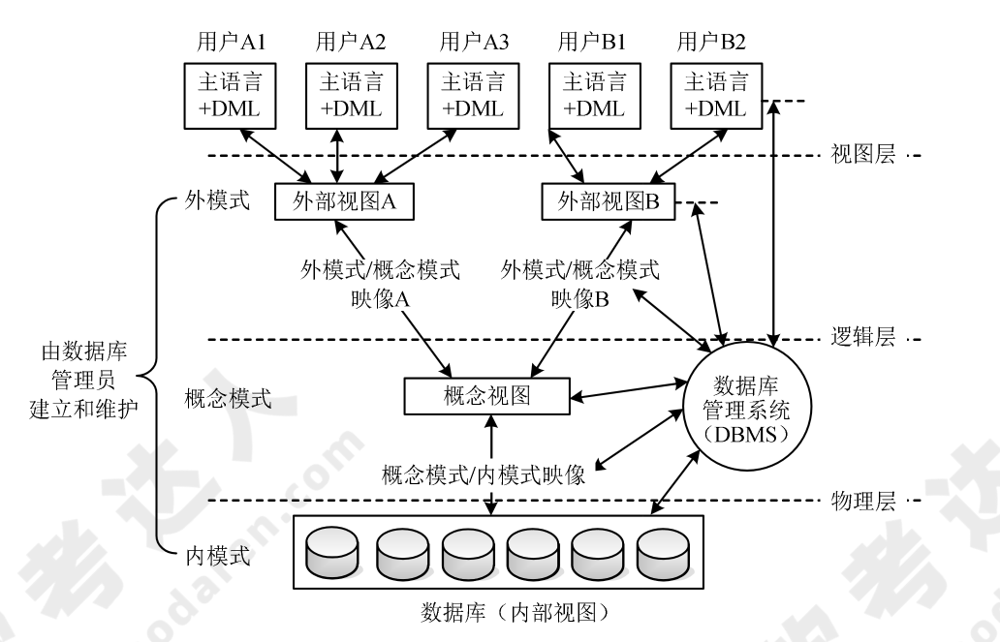

# 系统工程

!!! info "2013 综合知识 27"

    可行性分析是所有项目投资、工程建设或重大改革在开始阶段必须进行的一项工作。项目的可行性分析是对多因素、多目标系统进行的分析、评价和决策的过程。可行性研究通常从经济可行性、技术可行性、法律可行性和用户使用可行性 4 个方面来进行分析。
    
    经济可行性也称为投资收益分析或成本效益分析，主要评价项目的建设戍本、运行成本和项目建成后可能的经济收益。经济收益可以分为直接收益、间接收益、有形收益和无形收益等。
    
    技术可行性也称为技术风险分析，研究的对象是信息系统需要实现的功能和性能，以及技术能力约束。
    
    法律可行性也称为社会可行性，具有比较广泛的内容，它需要从政策、法律、道德、制度等社会因素来论证信息系统建设的现实性。

    用户使用可行性也称为执行可行性，是从信息系统用户的角度来评估系统的可行性，包括企业的行政管理和工作制度、使用人员的素质和培训要求等。

## 一、系统工程

系统工程是运用系统方法，对系统进行规划、研究、设计、制造、试验和使用的组织管理技术，是人们用科学方法解决复杂问题的一门技术。系统工程方法的特点是<u>整体性、综合性、协调性、科学性和实践性</u>。系统工程方法可以分为：

=== "霍尔的三维结构"

    霍尔的三维结构是美国系统工程专家霍尔（A.D.Hall）等人于 1969 年提出的一种系统工程方法论，形成了由 **时间维、逻辑维和知识维** 组成的三维空间结构。
    
    时间维分为 **规划、拟订方案、研制、生产、安装、运行、更新 7 个时间阶段；** 
    
    逻辑维包括 **明确问题、确定目标、系统综合、系统分析、优化、决策、实施 7 个逻辑步骤；** 
    
    知识维包括 **工程、医学、建筑、商业、法律、管理、社会科学、艺术等知识和技能。**

=== "切克兰德方法"

    切克兰德方法的核心不是“最优化”而是“比较”与“探寻”。将工作过程分为认识问题、根底定义、建立概念模型、比较及探寻、选择、设计与实施、评估与反馈 7 个步骤。

=== "并行工程"

    并行工程（Concurrent Engineering）方法是对产品及其相关过程（包括制造过程和支持过程）进行并行、集成化处理的系统方法和综合技术，目标是提高质量、降低成本、缩短产品开发周期和产品上市时间。

=== "综合集成法"

    钱学森等提出从系统的本质出发可以把系统分为 **简单系统和巨系统** 两大类。开放的复杂巨系统的一般基本原则：**整体论、相互联系、有序性、动态，主要性质是开放性、复杂性、进化与涌现性、层次性和巨量性。**

=== "WSR 系统方法"

    WSR 系统方法是物理—事理—人理方法论的简称。具有中国传统哲学的思辨思想，是多种方法的综合统一，属于定性与定量分析综合集成的东方系统思想。一般工作过程可理解为理解意图、制定目标、调查分析、构造策略、选择方案、协调关系和实现构想 7 步。
  
### 系统工程的生命周期

对系统工程生命周期进行定义的目的是以有序而且高效的方式建立一个满足利益攸关者需求的框架。系统工程的生命周期阶段包括 **探索研究、概念阶段、开发阶段、生产阶段、使用阶段、保障阶段和退役阶段。** 生命周期方法有 **计划驱动方法、渐进迭代式开发、精益开发和敏捷开发。**

### 基于模型的系统方

基于模型的系统工程（Model-Based Systems Engineering，MBSE）是建模方法的形式化应用，以使建模方法支持系统需求、分析、设计、验证和确认等活动，持续贯穿到所有生命周期阶段。产物包括：在需求分析阶段，产生需求图、用例图及包图；在功能分析与分配阶段，产生顺序图、活动图及状态机（State Machine）图；在设计综合阶段，产生模块定义图、内部块图及参数图等。系统工程的三大支柱：建模语言、建模工具和建模思路。

## 二、 系统性能

### 2.1 系统性能评价

系统性能评价指标是软件、硬件的性能指标的继承。其中：

* 评价 **计算机** 的主要性能指标有<u>时钟频率（主频）、运算速度、运算精度、数据处理速率（Processing Data Rate，PDR）、吞吐率等</u>。
* 评价 **路由器** 的主要性能指标有<u>设备吞吐量、端口吞吐量、全双工线速转发能力、路由表能力、背板能力、丢包率、时延、时延抖动、协议支持等</u>。
* 评价 **交换机** 所依据的性能指标有<u>端口速率、背板吞吐量、缓冲区大小、MAC 地址表大小等</u>。
* 评价 **网络** 的性能指标有<u>设备级性能指标、网络级性能指标、应用级性能指标、用户级性能指标和吞吐量</u>。
* 评价 **操作系统** 的性能指标有<u>系统上下文切换、系统响应时间、系统的吞吐率（量）、系统资源利用率、可靠性和可移植性</u>。
* 衡量 **数据库** 管理系统的主要性能指标有<u>最大并发事务处理能力、负载均衡能力、最大连接数等</u>。
* 评价 **Web 服务器** 的主要性能指标有<u>最大并发连接数、响应延迟和吞吐量</u>。

!!! info "2010 综合知识 17"

    对运行系统进行评估的主要目的是评价信息系统在性能方面的表现，找出系统可能存在的性能瓶颈。
    
    * 常见的 Web 服务器性能评估方法有基准测试、压力测试和可靠性测试等;
    * 评价 Web 服务器的主要性能指标有最大并发连接数、响应延迟和吞吐量等。
    * 当系统性能降到基本水平时，需要查找影响性能的瓶颈并消除该瓶颈。

### 2.2 性能指标计算

### 2.3 性能调整

**性能调整由查找和消除瓶颈组成。** 

对于数据库系统，性能调整主要包括 <u>CPU/内存使用状况、优化数据库设计、优化数据库管理以及进程/线程状态、硬盘 I/O 及剩余空间、日志文件大小等。</u>

对于应用系统，性能调整主要包括应用系统的<u>可用性、响应时间、并发用户数以及特定应用的系统资源占用等。</u>

### 2.4 阿姆达尔（Amdahl）解决方案

阿姆达尔定律（Amdahl's Law）是计算机科学中用来预测采用某种技术后系统性能的公式。阿姆达尔定律指出，在并行计算中，性能提高的速度取决于串行部分所占比例。阿姆达尔定律的公式为：

加速比：$\frac{使用增强部件时完成整个任务的时间}{不实用增强部件时完成整个任务的时间}$

新的执行时间：$\frac{原来的执行时间*[1-增强比例]+增强比例}{增强加速比}$

总加速比：$\frac{原来的执行时间}{新的执行时间}=\frac{1}{[(1-增强比例)+\frac{增强比例}{增强加速比}]}$

加速比主要取决于两个因素：在原有的计算机上，能被改进并增强的部分在总执行时间中所占的比例，这个值称为增强比例，它永远小于等于1；通过增强的执行方式所取得的改进，即如果整个程序使用了增强的执行方式，那么这个任务的执行速度会有多少提高，这个值是在原来条件下程序的执行时间与使用增强功能后程序的执行时间只比。

### 2.5 性能评估

性能评估是按照一定的步骤，选用一定的度量项目，通过建模和实验，对一个系统的性能进行各项检测，对测试结果做出解释，并形成一份文档的技术。性能评估的一个个目的是为性能的优化提供参考。

性能评估主要包括：

* 基准测试程序（Benchmark）定义：应用程序中用得最多、最频繁的那部分**核心程序**。基准测试程序中，评测的准确程度依次递减：<u>真实的程序、核心程序、小型基准程序和合成基准程序。</u>基准测试程序有整数测试程序 Dhrystone、浮点测试程序 Linpack、Whetstone 基准测试程序、SPEC 基准测试程序和 TPC 基准程序。
* Web 服务器的性能评测方法有基准性能测试、压力测试和可靠性测试。
* 系统监视的方法通常有系统内置命令、查阅系统日志、可视化技术 3 种方式。

#### 基准测试程序

整数测试程序：同一厂家的机器，采用相同的体系结构，用相同的基准程序测试，得到的 MIPS 值越大，一般说明机器速度越快。

浮点测试程序：指标 MFLOPS（理论峰值浮点速度）。

SPEC 基准程序（SPEC Benchmark）：重点面向处理器性能的基准程序集，将被测计算机的执行时间标准化，即将被测计算机的执行时间除以一个参考处理器的执行时间。

TPC 基准程序（TPC Benchmark）：用于测评计算机在事务处理、数据库处理、企业管理与决策支持系统等方面的性能。其中，TPC-C 是在线事务处理（On-line Transaction Processing，OLTP）的基准程序，TPC-D 是决策支持的基准程序，TPC- E 作为大型企业信息服务的基准程序。

大多数情况下，为测试新系统的性能，用户必须依靠评价程序来评价机器的性能，下面列出 4 种评价程序，他们评价的准确程度依次递减：**真实的程序、核心程序、小型基准程序、合成基准程序。**

#### Web 服务器的性能评测方法

基准性能测试：基准性能测试是模拟一定数量的用户并发访问 Web 服务器，测试 Web 服务器的**响应时间、吞吐量、并发连接数**等性能指标。

常见的 Web 服务器性能评测方法有：**基准性能测试、压力测试和可靠性测试。**

!!! info "2013 综合知识 16,17"

    把应用程序中应用最频繁的那部分核心程序作为评价计算机性能的标准程序，称为 **基准测试程序**。作为承载 Web 应用的 Web 服务器，对其进行性能评估时，主要关注 **最大并发连接数、响应延迟、吞吐量等指标。** 相对来说，对个别数据的丢包率并不是很关心。

!!! tip

    等效指令速度法：也称为吉普森混合法（Gibson mix）或混合比例计算法，是通过各类指令在程序中所占的比例（Wi）进行计算得到的。

    基准程序法：把应用程序中用的最多、最频繁的那部分核心程序作为评估计算机系统性能的标准程序，称为i基准测试程序（benchmark）。基准程序法不但考虑到 CPU（有时包括主存）的性能，还将 I/O 结构、操作系统、编译程序的效率等对系统性能的影响考虑进来了，所以它是目前一致承认的测试系统性能的较好方法。