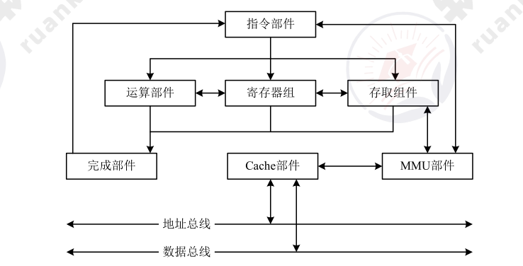

# 计算机系统基础知识（编制中）

## 计算机系统概述

## 计算机硬件基础知识

1. 冯·诺依曼计算机结构
2. 典型的处理器系统

    处理器主要有以下四大功能：

    * 程序控制：CPU 通过执行指令来控制程序的执行顺序；
    * 操作控制：一条指令功能的实现需要若干操作信号配合来完成，CPU 产生每条指令的操作信号并将操作信号送往对应的部件，控制相应的部件按指令的功能要求进行操作；
    * 时间控制：CPU 对各种操作进行时间上的控制，即指令执行过程中操作信号的出现时间、持续时间及出现的时间顺序都需要进行严格控制；
    * 数据处理：CPU 通过对数据进行算术运算及逻辑运算等方式进行加工处理，数据加工处理的结果被人们所利用。

    此外，处理器还要对系统内部和外部的中断（异常）做出响应，进行相应的处理。

    CPU 主要由运算器、控制器、寄存器组和内部总线等部件组成。

    

    * **运算器：** 由 **算术逻辑单元 ALU**（实现对数据的算术和逻辑运算）、**累加寄存器 AC**（运算结果或源操作数的存放区）、**数据缓冲寄存器 DR**(暂时存放内存的指令或数据)、**状态条件寄存器 PSW** （保存指令运行结果的条件码内容，如溢出标志等）组成。执行所有的算术运算，如加减乘除等；执行所有的逻辑运算并进行逻辑测试，如与、或、非、比较等；
    * **控制器：** 由 **指令寄存器 IR**（暂存 CPU 执行指令）、**程序寄存器 PC**（存放指令执行地址）、**地质寄存器 AR**（保存 CPU 当前访问的内存地址）、**指令译码器 ID**（分析指令操作码）组成。控制整个 CPU 的工作。

    !!! warning

        CPU 依据指令周期的不同阶段来区分二进制的指令和数据，因为在指令周期的不同阶段，指令会命令 CPU 分别去取指令和数据。

3. 专用处理器

    除了通用的处理器，用于专用目的的专用处理器芯片不断涌现，常见的有图形处理器（Graphics Processing Unit，GPU）、信号处理器（Digital Signal Processor，DSP）以及现场可编程逻辑门阵列（Field Programmable Gate Array，FPGA）等。GPU 常有数百个或数千个内核，经过优化可并行运行大量计算；DSP 专用于实时的数字信号处理，常采用哈佛体系结构。

4. 指令集系统

    典型的处理器根据指令集的复杂程度可分为<u>复杂指令集（Complex Instruction Set Computers，CISC）</u>与<u>精简指令集（Reduced Instruction Set Computers，RISC）</u>两类。
    
    CISC 以 Intel、AMD 的x86 CPU 为代表，RISC 以 ARM 和 Power 为代表。
    
    国产处理器目前有龙芯、飞腾、申威等品牌，常采用 RISC-V、MIPS、ARM 等精简指令集架构。

5. 存储器

    存储器是利用半导体、磁、光等介质制成用于存储数据的电子设备。
    
    根据<u>存储器的硬件结构</u>可分为 SRAM、DRAM、NVRAM、Flash、EPROM、Disk 等。
    
    按照<u>与处理器的物理距离</u>可分为 4 个层次：片上缓存、片外缓存、主存（内存）、外存。其访问速度依次降低，而容量依次提高。

6. 总线

    总线（Bus）是指计算机部件间遵循某一特定协议实现数据交换的形式，即以一种特定格式按照规定的控制逻辑实现部件间的数据传输。
    
    按照总线在计算机中所处的位置划分为<u>内总线、系统总线和外部总线。</u>
    
    目前，计算机总线存在许多种类，常见的有 **并行总线** 和 **串行总线**。

    | 名称     | 数据线                         | 特点                       | 应用                     |
    | -------- | ------------------------------ | -------------------------- | ------------------------ |
    | 并行总线 | 多条双向数据线                 | 有传输延迟，适合近距离连接 | 系统总线（计算机各部件） |
    | 串行总线 | 一条双向数据线或两条单向数据线 | 速率不高，但适合长距离连接 | 通信总线（计算机之间或计算机与其他系统间） |

7. 接口

    接口是指同一计算机不同功能层之间的通信规则。计算机接口有多种，常见的有输入输出接口如 HDMI、SATA、RS-232 等；网络接口如 RJ45、FC 等；以及 A/D 转换接口等非标准接口。

8. 外部设备

    外部设备也称为外围设备，是计算机结构中的非必要设备，但从功能上又常常不可缺少，例如键盘、鼠标、显示器等。虽然种类多样，但都是通过接口实现与计算机主体的连接，并通过指令、数据实现预期的功能。

## 计算机语言

计算机语言（Computer Language）是指人与计算机之间用于交流的一种语言，主要由一套指令组成，而这套指令一般包括表达式、流程控制和集合三大部分内容。

计算机语言分类有：

* 机器语言
* 汇编语言
* 高级语言
* 建模语言

## Q&A

### 校验码

在两个编码中，从 A 码到 B 码转换所需要改变的位数称为码距。就单个编码 $00$ 而言，其码距为 1，因为只需要改变一位就变成另一个编码。如 $00$ 要转换为 $11$ 码距为 2。一般来说，码距越大，越利于纠错和检错。

#### 奇偶校验码

在编码中增加 1 位校验位来使编码中的 1 的个数为奇数/偶数，从而使得码距变为 2。

???+ example "奇校验，偶校验同理"

    编码中，含有奇数个 1，发送给接收方后，会计算到编码有多少个 1，如果是奇数个则数据未发生改变，否则传输过程中数据发生改变。

#### 循环冗余校验码（CRC）

> CRC 只能检错，不能纠错
