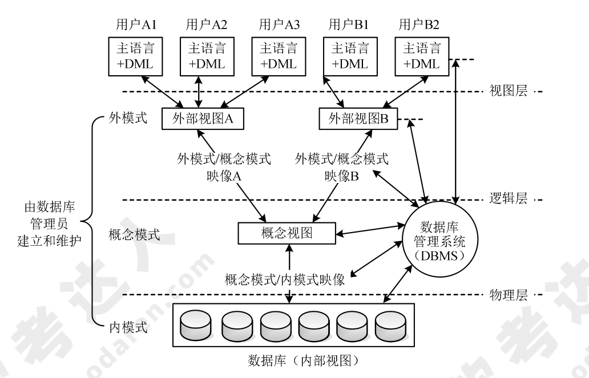
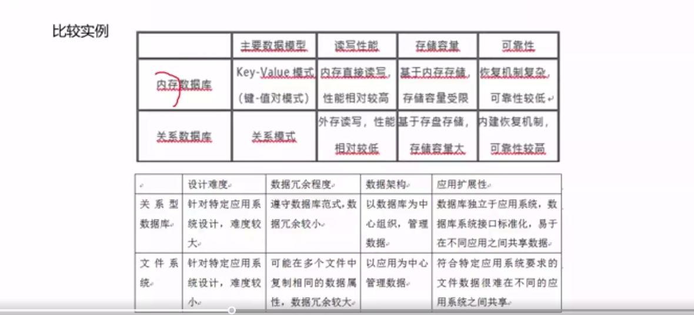
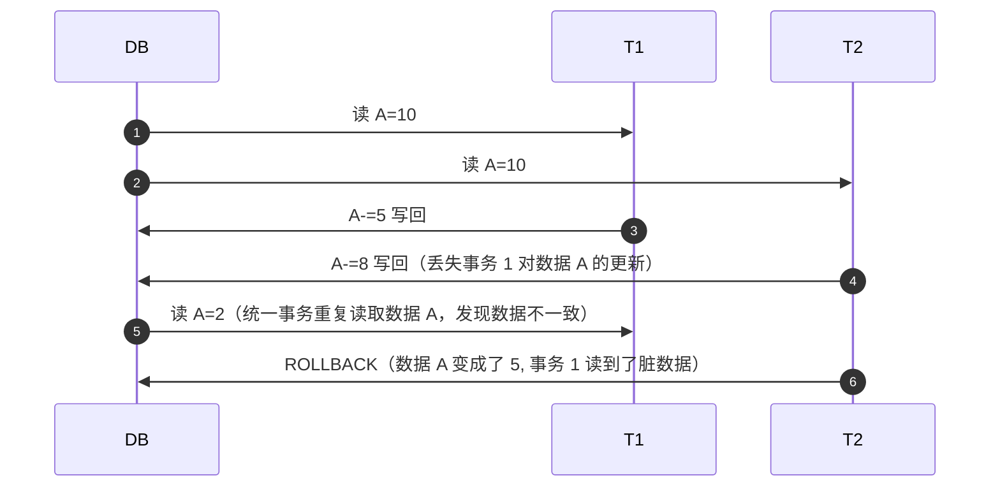
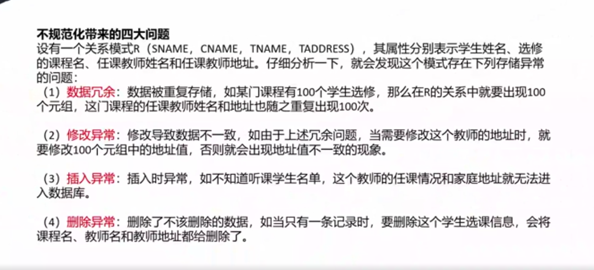
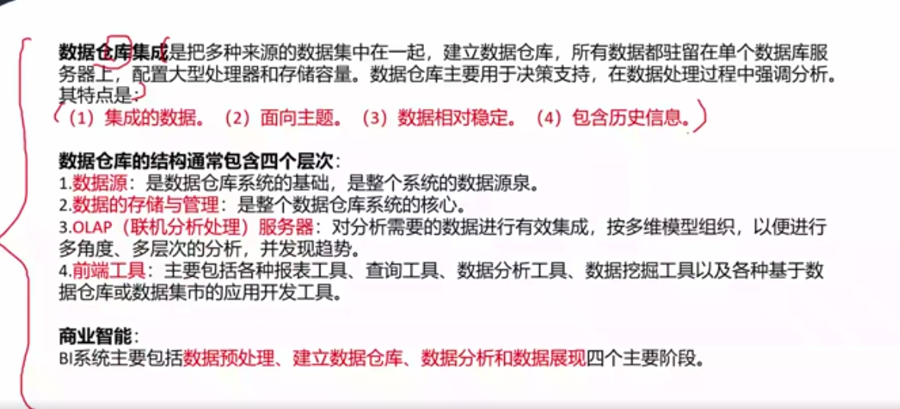

# 数据库设计基础（重要）

## 数据基础概念

### 数据模型

数据模型三要素：**数据结构、数据操作、数据的约束条件**。其中，数据的约束条件包括：

* 实体完整性：实体完整性是指实体的主属性不能取空值。
* 参照完整性：在关系数据库中主要是指外键参照的完整性。若 A 关系中的某个或者某些属性参照 B 关系或其他几个关系中的属性，那么在关系 A 中该属性要么为空，要么必须出现在 B关系或者其他的关系的对应属性中。
* 用户定义完整性：用户定义完整性反映的是某一个具体应用所对应的数据必须满足一定的约束条件。例如，软考成绩不能小于 0，也不能大于 75。

### 数据库三级模式两级映像（编制中）

数据库一般采用三级模式，系统开发人员需要通过视图层、逻辑层和物理层三个层次上的抽象来降低用户屏蔽系统的复杂性，简化用户与系统的交互。从数据库管理系统的角度，数据库也分为外模式、概念模式和内模式。



## 关系数据库

### 关系代数运算

### 关系数据库设计基本理论

**函数依赖：** 设 R(U)是属性 U 上的一个关系模式，X 和 Y 是 U 的子集，r 是 R 的任一关系，如果对于 r 中的任意两个元组 u 和 v，只要有 u[X]=v[X]，就有 u[Y]=v[Y]，则称 X 函数决定 Y，或称 Y 函数依赖于 X，记为 X→Y。

函数依赖是一种最重要、最基本的数据依赖。而关系数据库设计理论的核心就是数据间的函数依赖。

具体来说，如果在一个关系（表）中，属性集 X 的值能够唯一地决定属性集 Y 的值，那么就说 Y 对 X 函数依赖，记作：$X \rightarrow Y$

**非平凡的函数依赖：** 如果 X→Y，Y⊆X，则称 X→Y 是非平凡的函数依赖。

**平凡的函数依赖：** 如果 X→Y，但 Y⊆X，则称 X→Y 是平凡的函数依赖。

**完全函数依赖：** 属性集 Y 完全依赖于 X，并且不存在 X 的真子集可以决定 Y。例如，复合主键中的所有属性共同决定其他属性。

例如，有学生关系模式（学号，系号，系主任，课程号，成绩），该关系模式的主码是学号+课程号，（学号，课程号）→成绩是完全函数依赖。

**部分函数依赖：** 如果属性集 X 是复合键，而 Y 依赖于 X 的某个子集而非整个 X，这叫部分函数依赖。

上述例子中，（学号，课程号）→系号就属于部分函数依赖，因为对于系号来说有学号就可以推出系号。

**传递依赖：** 如果 $X \rightarrow Y$ 且 Y $\rightarrow Z$，那么存在传递依赖 $X \rightarrow Z$。

上述例子中，学号→系号，系号→系主任名，则称系主任名传递依赖于学号。

**函数依赖的公理系统（Armstrong 公理系统）**：

#### 平凡、非平凡的函数依赖

**非平凡的函数依赖**（Non-trivial Functional Dependency）是指函数依赖中，属性集 `Y` 不是属性集 `X` 的子集。换句话说，在函数依赖 `X → Y` 中，若 `Y` 的任何属性都不包含在 `X` 中，那么这个依赖就是**非平凡的**。

假设有一个关系表 `Employee`，包含以下属性：
- `EmployeeID`（员工ID）
- `Name`（员工姓名）
- `Department`（所属部门）

**平凡的函数依赖**：
    $\text{EmployeeID} \rightarrow \text{EmployeeID}$ 这是平凡的函数依赖，因为 `Y` 集合（`EmployeeID`）完全包含在 `X` 集合（`EmployeeID`）中。

**非平凡的函数依赖**：
   $\text{EmployeeID} \rightarrow \text{Name, Department}$ 这是非平凡的函数依赖，因为 `Name` 和 `Department` 不包含在 `EmployeeID` 中。

**非平凡函数依赖的重要性**

非平凡的函数依赖通常是数据库设计中的重点关注对象，因为它们反映了属性之间的实际依赖关系。而平凡的函数依赖没有实际意义，通常被忽略。

在数据库设计中，通过分析非平凡的函数依赖，能够帮助我们优化表结构，减少数据冗余，进而提升数据库的规范化水平。

### 关系数据库的规范化

关系数据库设计的方法之一就是设计满足适当范式的模式，通常可以通过判断分解后的模式达到几范式来评价模式的规范化程度。

范式包括：1NF、2NF、3NF、BCNF、4NF、5NF。

> 根据系统架构设计师考试的要求，这里重点介绍 1NF、2NF、3NF、BCNF 的基本概念。

| 范式            | 描述                                                                                       |
| --------------- | ------------------------------------------------------------------------------------------ |
| 第一范式（1NF） | 若关系模式 $R$ 的每一个分量是不可再分的数据项，则关系模式 $R$ 属于第一范式。               |
| 第二范式（2NF） | 若关系模式 $R \in 1NF$(1)，且每一个非主属性完全依赖主码时，则关系式 $R$ 是 $2NF$（第二范式）。 |
| 第三范式（3NF） | 当 $2NF$ 消除了非主属性对主码的传递函数依赖，则称为 $3NF$。                                    |
| BC 范式（BCNF） | 如果关系模式 $R \in 1NF$，且每个属性都不传递依赖于 $$ 的候选码，那么称 $R$ 是 $BCNF$ 模式。           |

!!! tip

    符号 `∈` 表示“属于”（is an element of），用于表示某个元素属于一个集合。例如，在表达 式 $ x \in A $ 中，意思是“元素 $ x $ 是集合 $ A $ 的一个成员”。它常用于集合论和数学中，表示元素与集合之间的关系。

上述 4 种范式之间有如下联系：$BCNF  \sub 3NF \sub 2NF \sub 1NF$。

#### 模式分解

在数据库设计中，**模式分解（Schema Decomposition）** 是指将复杂或冗余的数据库表结构分解为更小、更简洁的表，以确保数据的一致性、减少冗余和避免异常（anomalies）。这种技术通常与 **范式化（Normalization）** 过程相关，目的是创建一个结构良好的数据库设计。

模式分解的核心目的是通过分解关系表来达到更高的 **范式**（如第三范式、BCNF），从而消除数据冗余和潜在的更新异常。该过程通常包括以下步骤：

1. **识别不必要的数据冗余**：例如，重复存储相同信息。
2. **分解表**：将一个包含冗余数据的大表分解为多个更小的表，使每个表只包含单一的实体或主题。
3. **保持数据依赖**：通过定义外键保持表之间的关系，确保分解后的表能够正确关联。

##### 模式分解的步骤

1. **确定函数依赖（Functional Dependencies）**：在模式分解之前，首先需要确定关系中的函数依赖。函数依赖定义了哪些字段的值由哪些其他字段的值唯一确定。

2. **选择范式化级别**

!!! tip "典型的范式"

    * **第一范式（1NF）**：确保数据的原子性（每列只有一个值）。
    
    * **第二范式（2NF）**：消除部分依赖，使每个非主属性都完全依赖于主键。
    
    * **第三范式（3NF）**：消除传递依赖，使每个非主属性直接依赖于主键。

1. **分解表**：根据确定的函数依赖和范式，分解表。目标是将原来的表分解成多个满足范式化要求的表。例如，如果表中的某些字段存在<u>部分依赖</u>或<u>传递依赖</u>，可以通过分解这些字段到新的表中来消除这些依赖。

???+ example "例子"

    假设有一个表 `Orders`，记录订单信息：

    ```plaintext
    Orders(OrderID, CustomerName, CustomerAddress, ProductID, ProductName, Quantity)
    ```

    **问题：**

    - 该表中包含了客户信息和产品信息，存在冗余，比如同一客户可能会多次下单，导致客户信息重复存储。
    - 另外，可能还存在更新异常，如果客户的地址变化，需要修改多个记录。

    **分解过程：**

    1. 识别冗余：客户信息和产品信息在多次订单中重复存储。
    2. 分解表：

    === "订单表"

        ```plaintext
        Orders(OrderID, CustomerID, ProductID, Quantity)
        ```

    === "客户表"

        ```plaintext
        Customers(CustomerID, CustomerName, CustomerAddress)
        ```

    === "产品表"

        ```plaintext
        Products(ProductID, ProductName)
        ```

    这样，通过分解，我们消除了冗余和更新异常，数据库结构更简洁且易于维护。

##### 模式分解的优点

- **减少数据冗余**：消除重复数据，节省存储空间。
- **避免数据异常**：如插入、更新、删除异常。
- **提高数据一致性**：通过更细化的表结构，保证数据的完整性和一致性。

##### 模式分解的挑战

- **性能问题**：过度分解可能导致查询效率下降，因为需要进行多个表的连接操作。
- **理解难度**：分解后可能使得数据库设计变得复杂，特别是在跨多个表进行查询时。

总的来说，模式分解是数据库设计中重要的优化过程，目标是通过良好的范式化，确保数据库结构稳定且高效。

#### 无损连接的判定方法

在数据库设计中，**无损连接**（Lossless Join）是一种确保通过将分解后的关系表重新连接（Join）时，不会丢失任何数据或产生冗余的属性的特性。判定是否是无损连接，通常是通过验证表之间的**主键-外键关系**或**函数依赖**来实现的。

无损连接是数据库模式分解中的一个关键目标，确保在范式化过程中不会丢失信息。
  
4. **无损分解**：分解后的关系能够还原出原关系模式，不能还原就是有损分解。

    当分解为两个关系模式，可以通过以下定理判断是否无损分解：

    定理：如果 $R$ 的分解为 $p=\{R1,R2\}$，$F$ 为 $R$ 所满足的函数依赖集合，分解 $p$ 具有无损连接性的充分必要条件是 $R1 \cap R2 \rightarrow (R1-R2)$ 或者 $R1 \cap R2 \rightarrow (R2-R1)$

    当分解关系为三个及以上的关系模式时，可以通过表格法求解：

    

无损连接判定主要通过以下几种方式进行：

##### 基于关系代数的判断方法

如果一个关系表 `R` 被分解成多个子表 `R1, R2, ..., Rn`，要判断这个分解是否具有无损连接性质，可以使用以下原则：
   
对关系 `R`，如果分解成 `R1` 和 `R2`，若 **`R1` 和 `R2` 的公共属性包含`R`的一个候选键**，则分解是无损连接的。
   
**公共属性包含候选键**：意味着通过分解后的表可以通过连接操作无损地还原为原来的关系表。

??? example

    假设有一个关系 $R(A, B, C)$，候选键为 $A$，我们将 $R$ 分解为 $R1(A, B)$ 和 $R2(A, C)$。

    在分解后的表 $R1(A, B)$ 和 $R2(A, C)$ 中，公共属性是 $A$，而 $A$ 是原关系 $R$ 的候选键，因此，这个分解是无损的。通过连接 $R1$ 和 $R2$，可以无损地恢复原来的表 $R$。

##### 基于函数依赖的判断方法

在某些情况下，可以根据**函数依赖**来判断分解是否是无损的。

对于任意分解 `R1` 和 `R2`，如果函数依赖关系 `FD(R)` 中的某个属性集 `X` 可以通过连接恢复，且 `X` 是 `R1` 或 `R2` 的一个候选键，则分解具有无损连接性。

##### 基于 Armstrong Axioms 的无损连接检查

你可以使用 Armstrong Axioms 推导函数依赖闭包，来判断分解是否会造成信息丢失。Armstrong Axioms 是一组用于推导函数依赖的规则，包括反身性、传递性和扩展性等。通过分析函数依赖的传递关系，可以验证模式分解的无损性。

##### 无损连接算法**（常用的方法之一）

* 构建一个包含 `m` 行（每个分解的表）和 `n` 列（原关系表的属性）的矩阵，其中每个属性对应一列，每个子表对应一行。
* 对于每个分解的表 `Ri`，将其包含的属性在矩阵中标记为 `a_i`，其他的属性标记为 `b_i`。
* 对于任意两个子表，如果公共属性列的所有标记都可以对应相等（相同属性可以对应），则说明分解是无损连接的。

**例子**

假设有关系 `R(A, B, C)`，候选键为 `A`，分解为 `R1(A, B)` 和 `R2(A, C)`。我们根据无损连接算法构造矩阵：

| 属性 | A   | B   | C   |
| ---- | --- | --- | --- |
| R1   | a1  | a2  | b   |
| R2   | a1  | b   | a3  |

- 检查 `A` 列：因为 `A` 是公共属性，且在所有行中的标记都相同（均为 `a1`），所以这是无损连接的分解。

要确保数据库分解是无损连接的，关键是确保分解后的关系表能够通过连接操作无损地恢复为原来的表结构，且不产生冗余数据或丢失信息。

### 事务管理

### 并发控制

### 数据库的备份与恢复

## 数据库设计

数据库设计的基本步骤。可以分为用户需求分析、概念结构设计、逻辑结构设计、物理结构设计、应用程序设计、运行维护。

### 需求分析

### 概念结构设计

### 逻辑结构设计

### 物理结构设计

### 应用程序设计

### 运行维护

## 应用程序与数据库的交互

## NoSQL 数据库

## 分布式数据库

## 数据库优化技术

## 分布式缓存技术 Redis

## Q&A

### ORM 是什么？

ORM（Object-Relation Mapping）在关系型数据库和对象之间作一个映射，我们在具体操作数据库的时候，不需要再去和复杂的 SQL 语句打交道，只要像平时操作对象一样操作即可。

面向对象编程把所有实体看成对象（object），关系型数据库则是采用实体之间的关系（relation）连接数据库。很早就有人提出，关系也可以用对象表达，这样的话，就能使用面向对象编程，来操作关系型数据库。

ORM 把数据库映射成对象，如：

```text
数据库表（table）-> 类（class）
记录（record）-> 对象（object）
字段（field）-> 对象的属性（attribute）
```

1. ORM 优点

    * 使用 ORM 可以大大降低学习和开发成本；
    * 程序员不用再写 SQL 来进行数据库操作；
    * 减少程序代码量；
    * 降低由于 SQL 代码质量差而带来的影响。
 
2. ORM 缺点

    * 不太容易处理复杂的查询语句；
    * 性能较直接用 SQL 差。

### 数据库分类比较

| 数据库类型   | 描述                                                                                                                                   |
| ------------ | -------------------------------------------------------------------------------------------------------------------------------------- |
| 关系型数据库 | 建立在关系模型基础上的数据库，借助集合代数等数学概念和方法来处理数据库中的数据。关系数据库是由多张能互相联接的二维行列表格组成的数据库 |
| NoSQL        | 泛指非关系型数据库。解决大规模数据集合多重数据种类带来的挑战，尤其是大数据应用难题，包括超大规模数据的存储                             |
| 内存数据库   | 将数据库整体存储在内存中，提高性能                                                                                                     |

**关系型数据库与 NoSQL 数据库比较**

| 特征       | 关系型数据库模式         | NoSQL 模式               |
| ---------- | ------------------------ | ------------------------ |
| 并法支持   | 支持并发、效率低         | 并发性能高               |
| 存储与查询 | 关系表方式存储、SQL 查询 | 海量数据存储、查询效率高 |
| 扩展方式   | 向上扩展                 | 向外扩展                 |
| 索引方式   | B树、哈希等              | 键值索引                 |
| 应用领域   | 面向通用领域             | 特定应用领域             |
| 数据一致性 | 实时一致性               | 弱一致性                 |
| 数据类型   | 结构化数据               | 非结构化                 |
| 事务       | 高事务性                 | 弱事务性                 |
| 水平扩展   | 弱                       | 强                       |
| 数据容量   | 有限数据                 | 海量数据                 |

**关系型数据库与内存数据库比较**

| 特征         | 关系型数据库模式         | 内存数据库               |
| ------------ | ------------------------ | ------------------------ |
| 主要数据模型 |                          | 并发性能高               |
| 读取性能     | 关系表方式存储、SQL 查询 | 海量数据存储、查询效率高 |
| 存储容量     | 向上扩展                 | 向外扩展                 |
| 可靠性       | B树、哈希等              | 键值索引                 |



### 数据库缓存技术

* MemCache 是一个高性能的分布式的内存对象缓存系统，用于动态 Web 应用以减轻数据库负载。通过在内存中维护一个统一的巨大的 HASH 表，能用来存储各种格式的数据，包括图像、视频、文件以及数据库检索结果等。
* Redis 是一个开源的使用 ANSI C 语言编写、支持网络、可基于内存亦可持久化的日志型、Key-Value 数据库，并提供多种语言的 API。

**Redis 与 MemCache 的差异**

| 数据库类型 | 优点                                                                                                         | 缺点                                                         |
| ---------- | ------------------------------------------------------------------------------------------------------------ | ------------------------------------------------------------ |
| MemCache   | 1. 支持缓存键值对、视频、图片等                                                                              | 1. 仅支持将数据存放在内存中<br/>2. 仅支持 key-value 数据类型 |
| Redis      | 1. 支持缓存键值对、list、set、hash 等数据存储<br/>2. 支持物理存储，可以将一些很久没用用到的 value 交换到磁盘 |                                                              |

### 数据库并发

* 丢失更新：事务 1（T1）对数据 A 进行了修改并写回，事务 2（T2）也对数据 A 进行了修改并写回，此时事务 2 写回的数据会覆盖事务 1 写回的数据，就丢失了事务 1 对 A 的更新。即数据 A 的更新会被覆盖
* 不可重复读：此时事务 1 再次读取数据 A，发现数据不对。即一个事务重复读 A 两次，会发现数据 A 有误。
* 读脏数据: 此时事务 2 执行回滚操作，即数据 A 恢复了原来的之，那么事务 1 读到了脏数据。



### 不规范化带来的 4 大问题



1. 数据冗余
    
    数据被重复存储，如某门课程有 100 个学生选修，那么 R 的关系中就要出现 100 个元组，这门课程的任课教师姓名和地址也随之重复出现 100 次。

2. 修改一场

    修改导致数据不一致
3. 插入异常

    插入时异常
4. 删除异常

    删除了不该删除的数据

### 反规范化技术


规范花设计后，数据库设计者希望牺牲部分规范化来提高性能和复杂度。

采用规范化的益处：降低连接操作的需求、降低外码和索引的数目，还能减少表的数目，能够提高查询效率。

可能带来的问题：数据的重复存储，浪费了磁盘空间；可能出现数据的完整性问题，为了保障数据的一致性，增加了数据维护的复杂性，会降低修改速度。

* 增加冗余列
* 增加派生列
* 重新组表
* 水平分割表
* 垂直分割表

### 分布式数据库


是由一组数据组成的，这组数据分布在计算机网络的不同计算机上，网络中的每个节点具有独立处理能力（称为场地自治），它可以执行局部应用，同时，每个节点也能通过网络通信子系统执行全局应用。分布式数据库系统是在集中式数据库系统技术基础上发展起来的，具有如下特点：

1. 数据独立性
2. 集中与自治共享结合的控制结构
3. 适当增加数据冗余度
4. 全局一致性、可串行性和可恢复性

**分布式数据库优点**


### 商业智能

商业智能（Business Intelligence，BI）是企业对商业数据的搜集、管理和分析的系统过程，目的是使企业的各级决策者获得知识或洞察力，帮助他们作出对企业更有利的决策。一般认为 **数据仓库、联机分析处理（OLAP）和数据挖掘** 是商业智能的三大组成部分。

商业智能（BI）系统主要包括数据预处理、建立数据仓库、数据分析和数据展现四个主要阶段。

#### 数据仓库



**数据仓库的结构通常包含四个层次**

1. 数据源：是数据仓库的基础，是整个系统的数据来源
2. 数据的存储与管理：是整个数据仓库的核心
3. OLAP（联机分析处理）服务器
4. 前端工具
