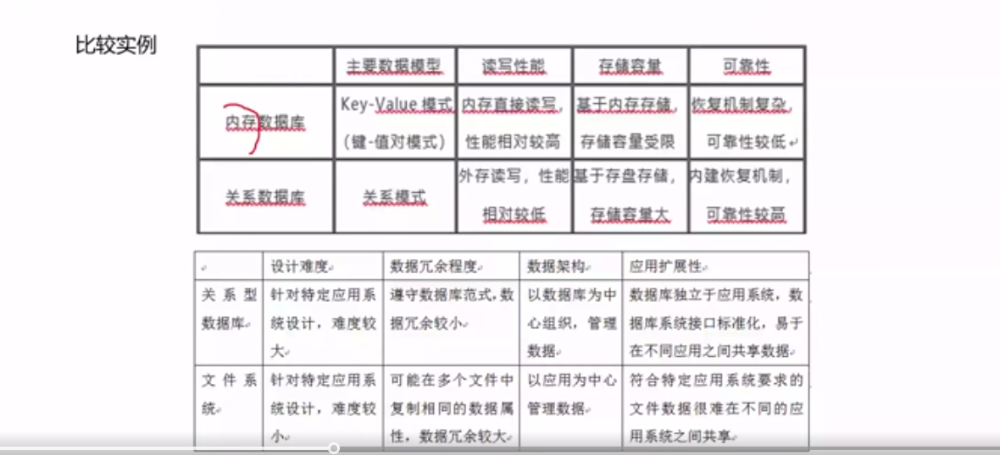
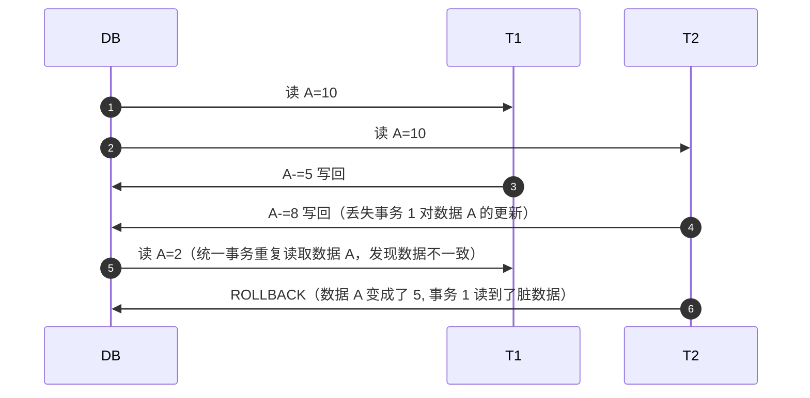
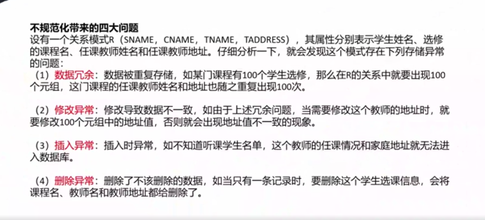
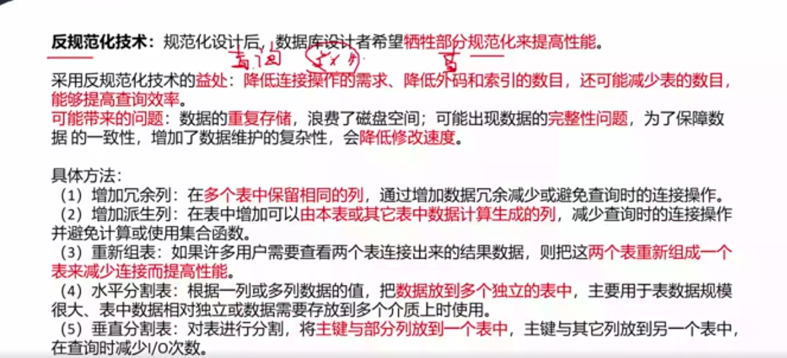
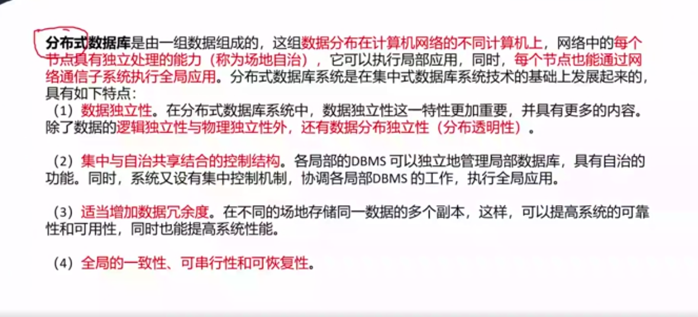
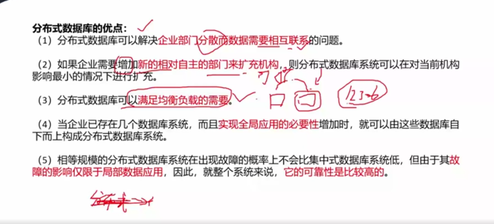
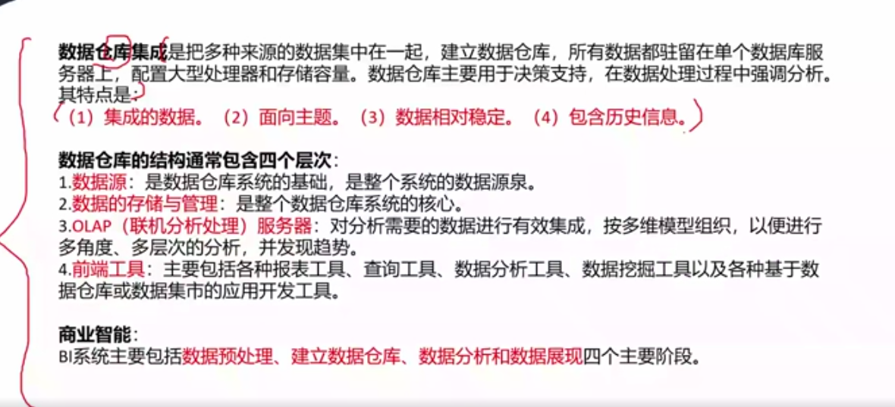

# 数据库设计基础（重要）

## Q&A

### ORM 是什么？

ORM（Object-Relation Mapping）在关系型数据库和对象之间作一个映射，我们在具体操作数据库的时候，不需要再去和复杂的 SQL 语句打交道，只要像平时操作对象一样操作即可。

面向对象编程把所有实体看成对象（object），关系型数据库则是采用实体之间的关系（relation）连接数据库。很早就有人提出，关系也可以用对象表达，这样的话，就能使用面向对象编程，来操作关系型数据库。

ORM 把数据库映射成对象，如：

```text
数据库表（table）-> 类（class）
记录（record）-> 对象（object）
字段（field）-> 对象的属性（attribute）
```

1. ORM 优点

    * 使用 ORM 可以大大降低学习和开发成本；
    * 程序员不用再写 SQL 来进行数据库操作；
    * 减少程序代码量；
    * 降低由于 SQL 代码质量差而带来的影响。
 
2. ORM 缺点

    * 不太容易处理复杂的查询语句；
    * 性能较直接用 SQL 差。

### 数据库分类比较

| 数据库类型  | 描述                                                                  |
|--------|---------------------------------------------------------------------|
| 关系型数据库 | 建立在关系模型基础上的数据库，借助集合代数等数学概念和方法来处理数据库中的数据。关系数据库是由多张能互相联接的二维行列表格组成的数据库 |
| NoSQL  | 泛指非关系型数据库。解决大规模数据集合多重数据种类带来的挑战，尤其是大数据应用难题，包括超大规模数据的存储               |
| 内存数据库  | 将数据库整体存储在内存中，提高性能                                                   |

**关系型数据库与 NoSQL 数据库比较**

| 特征    | 关系型数据库模式       | NoSQL 模式     |
|-------|----------------|--------------|
| 并法支持  | 支持并发、效率低       | 并发性能高        |
| 存储与查询 | 关系表方式存储、SQL 查询 | 海量数据存储、查询效率高 |
| 扩展方式  | 向上扩展           | 向外扩展         |
| 索引方式  | B树、哈希等         | 键值索引         |
| 应用领域  | 面向通用领域         | 特定应用领域       |
| 数据一致性 | 实时一致性          | 弱一致性         |
| 数据类型  | 结构化数据          | 非结构化         |
| 事务    | 高事务性           | 弱事务性         |
| 水平扩展  | 弱              | 强            |
| 数据容量  | 有限数据           | 海量数据         |    

**关系型数据库与内存数据库比较**

| 特征     | 关系型数据库模式       | 内存数据库        |
|--------|----------------|--------------|
| 主要数据模型 |        | 并发性能高        |
| 读取性能   | 关系表方式存储、SQL 查询 | 海量数据存储、查询效率高 |
| 存储容量   | 向上扩展           | 向外扩展         |
| 可靠性    | B树、哈希等         | 键值索引         |



### 数据库缓存技术

* MemCache 是一个高性能的分布式的内存对象缓存系统，用于动态 Web 应用以减轻数据库负载。通过在内存中维护一个统一的巨大的 HASH 表，能用来存储各种格式的数据，包括图像、视频、文件以及数据库检索结果等。
* Redis 是一个开源的使用 ANSI C 语言编写、支持网络、可基于内存亦可持久化的日志型、Key-Value 数据库，并提供多种语言的 API。

**Redis 与 MemCache 的差异**

| 数据库类型    | 优点                                                                    | 缺点                                        |
|----------|-----------------------------------------------------------------------|-------------------------------------------|
| MemCache | 1. 支持缓存键值对、视频、图片等                                                     | 1. 仅支持将数据存放在内存中<br/>2. 仅支持 key-value 数据类型 |
| Redis    | 1. 支持缓存键值对、list、set、hash 等数据存储<br/>2. 支持物理存储，可以将一些很久没用用到的 value 交换到磁盘 |                                           |

### 数据库并发

* 丢失更新：事务 1（T1）对数据 A 进行了修改并写回，事务 2（T2）也对数据 A 进行了修改并写回，此时事务 2 写回的数据会覆盖事务 1 写回的数据，就丢失了事务 1 对 A 的更新。即数据 A 的更新会被覆盖
* 不可重复读：此时事务 1 再次读取数据 A，发现数据不对。即一个事务重复读 A 两次，会发现数据 A 有误。
* 读脏数据: 此时事务 2 执行回滚操作，即数据 A 恢复了原来的之，那么事务 1 读到了脏数据。



### 不规范化带来的 4 大问题



1. 数据冗余
    
    数据被重复存储，如某门课程有 100 个学生选修，那么 R 的关系中就要出现 100 个元组，这门课程的任课教师姓名和地址也随之重复出现 100 次。

2. 修改一场

    修改导致数据不一致
3. 插入异常

    插入时异常
4. 删除异常

    删除了不该删除的数据

### 反规范化技术



规范花设计后，数据库设计者希望牺牲部分规范化来提高性能和复杂度。

采用规范化的益处：降低连接操作的需求、降低外码和索引的数目，还能减少表的数目，能够提高查询效率。

可能带来的问题：数据的重复存储，浪费了磁盘空间；可能出现数据的完整性问题，为了保障数据的一致性，增加了数据维护的复杂性，会降低修改速度。

* 增加冗余列
* 增加派生列
* 重新组表
* 水平分割表
* 垂直分割表

### 分布式数据库



是由一组数据组成的，这组数据分布在计算机网络的不同计算机上，网络中的每个节点具有独立处理能力（称为场地自治），它可以执行局部应用，同时，每个节点也能通过网络通信子系统执行全局应用。分布式数据库系统是在集中式数据库系统技术基础上发展起来的，具有如下特点：

1. 数据独立性
2. 集中与自治共享结合的控制结构
3. 适当增加数据冗余度
4. 全局一致性、可串行性和可恢复性

**分布式数据库优点**



### 数据仓库



**数据仓库的结构通常包含四个层次**

1. 数据源：是数据仓库的基础，是整个系统的数据来源
2. 数据的存储与管理：是整个数据仓库的核心
3. OLAP（联机分析处理）服务器
4. 前端工具

商业智能（BI）系统主要包括数据预处理、建立数据仓库、数据分析和数据展现四个主要阶段。