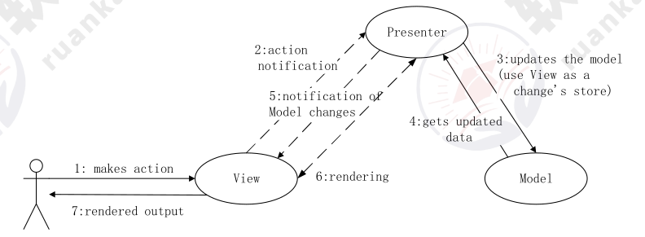
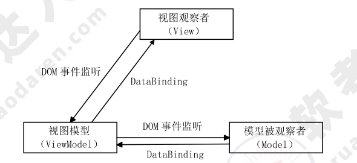
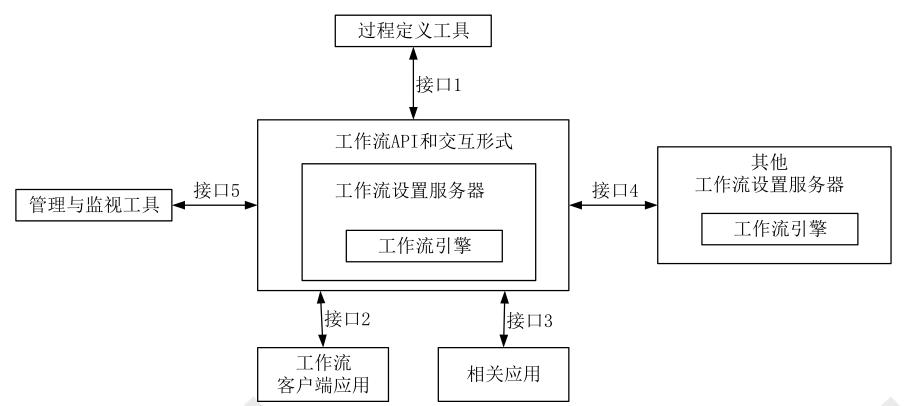

# 层次式架构设计理论与实践

## 表现层框架设计

### MVC（Model-View-Controller）模式

MVC 是一种软件设计模式。MVC 把一个应用的输入、处理、输出流程按照视图、控制、模型的方式进行分离，形成了控制器、模型、视图 3 个核心模块。其中：

* 控制器（Controller）：接受用户的输入，并调用模型和视图去完成用户的需求；
* 模型（Model）：应用程序的主体部分，表示业务数据和业务逻辑；
* 视图（View）：用户看到并与之交流的界面。

使用 MVC 来设计表现层可以有如下优点：

* 允许多种用户界面扩展；
* 易于维护；
* 易于构建功能强大的用户界面；
* 增加应用的可拓展性、强壮性、灵活性。

### MVP（Model-View-Presenter）模式

在 MVP 模式中 Model 提供数据，View 负责显示，`Controller/Presenter` 负责逻辑的处理。MVP 不仅仅避免了 View 和 Model 之间的耦合，还进一步降低了 Presenter 对 View 的依赖。

使用 MVP 模式来设计表现层，可以有以下的优点：
* 模型与视图完全分离，可以修改视图而不影响模型。
* 所有的交互都发生在一个地方—Presenter 内部，因此可以更高效地使用模型。
* 可以将一个 Presenter 用于多个视图，而不需要改变 Presenter 的逻辑。因为视图的变化总是比模型的变化频繁。
* 如果把逻辑放在 Presenter 中，就可以脱离用户接口来测试这些逻辑（单元测试）。

### MVVM 模式

MVVM 和 MVC、MVP 类似，主要目的都是为了实现视图和模型的分离。不同的是 MVVM 中，View 与 Model 的交互通过 ViewModel 来实现，也就是 View 和 Model 不能直接通信，两者的通信只能通过 ViewModel 来实现。ViewModel 是 MVVM 的核心，通过 DataBinding 实现 View 与 Model 之间的双向绑定，其内容包括数据状态处理、数据绑定及数据转换。

## 中间层框架设计

### 业务逻辑层组件设计

    业务逻辑层组件分为接口和实现类两个部分。接口用于定义业务逻辑组件，定义业务逻辑组件必须实现的方法是整个系统运行的核心。通常按模块来设计业务逻辑组件，每个模块设计一个业务逻辑组件，并且每个业务逻辑组件以多个数据访问对象（Data Access Object，DAO）组件作为基础，从而实现对外提供系统的业务逻辑服务。

### 业务逻辑层工作流设计

    工作流管理联盟（Workflow Management Coalition，WFMC）将工作流定义为：业务流程的全部或部分自动化，在此过程中，文档、信息或任务按照一定的过程规则流转，实现组织成员间的协调工作以达到业务的整体目标。

    

### 业务逻辑层实体设计

    逻辑层实体提供对业务数据及相关功能（在某些设计中）的状态编程访问。业务逻辑层实体可以使用具有复杂架构的数据来构建，这种数据通常来自数据库中的多个相关表。业务逻辑层实体数据可以作为业务过程的部分 I/O 参数传递。业务逻辑层实体是可序列化的，以保持它们的当前状态。

### 业务逻辑层框架

    业务逻辑框架位于系统架构的中间层，是实现系统功能的核心组件。采用容器的形式，便于系统功能的开发、代码重用和管理。在业务容器中，业务逻辑是按照 Domain Model-Service-Control 思想来实现的。其中：

* Domain Model 是仅仅包含业务相关的属性的领域层业务对象；
* Service 是业务过程实现的组成部分，是应用程序的不同功能单元，通过在这些服务之间定义良好的接口和契约联系起来；
* Control 服务控制器，是服务之间的纽带，不同服务之间的切换就是通过它来实现的。

## 数据访问层设计

### 数据访问模式

数据访问模式有 5 种，分别是：在线访问、Data Access Object、Data Transfer Object、离线数据模式、对象/关系映射（Object/Relation Mapping）。

1. 在线访问：最常用的方式。访问占用一个数据库连接，读取数据，每个数据库操作都会通过这个连接不断地与后台的数据源进行交互。
2. Data Access Object：DAO 是标准 J2EE 设计模式，这种方式将底层数据访问操作与高层业务逻辑分离开。一个典型的 DAO 实现通常会有一个 DAO 工厂类、一个 DAO 接口、一个实现了 DAO 接口的具体类、数据传输对象。
3. Data Transfer Object：DTO 属于 EJB 设计模式之一。DTO 是一组对象或容器，需要跨越不同的进程或是网络的边界来传输数据。
4. 离线数据模式：离线数据模式是以数据为中心，数据从数据源获取之后，将按照某种预定义的结构存放在系统中，成为应用的中心。这种方式对数据的各种操作独立于各种与后台数据源之间的连接或是事务。
5. 对象/关系映射：这种方式利用工具或平台能够帮助将应用程序中的数据转换成关系型数据库中的记录；或是将关系数据库中的记录转换成应用程序中代码便于操作的对象。

### 工厂模式在数据访问层的应用

工厂模式定义一个用于创建对象的接口，让子类决定实例化哪一个类。工厂方法使一个类的实例化延迟到其子类。这里可能会处理对多种数据库的操作，因此，需要首先定义一个操纵数据库的接口，然后根据数据库的不同，由类工厂决定实例化哪个类。

### ORM，Hibernate 与 CMP 2.0 设计思想

ORM（Object-Relation Mapping）在关系型数据库和对象之间作一个映射，这样，在具体操纵数据库时，就不需要再去和复杂的 SQL 语句打交道，只要像平时操作对象一样操作即可。Hibernate 是一个功能强大，可以有效地进行数据库数据到业务对象的 O/R 映射方案。Hibernate 推动了基于普通 Java 对象模型，用于映射底层数据结构的持久对象的开发。

### XML Schema

XML Schema 用来描述 XML 文档合法结构、内容和限制，提供丰富的数据类型。

### 事务处理设计

事 务 必 须 服 从 ISO/IEC 所 制 定 的 ACID 原 则 。 ACID 是 原 子 性 （ Atomicity ）、 一 致 性（Consistency）、隔离性（Isolation）和持久性（Durability）的缩写。

* 事务的原子性表示事务执行过程中的任何失败都将导致事务所做的任何修改失效。
* 一致性表示当事务执行失败时，所有被该事务影响的数据都应该恢复到事务执行前的状态。
* 隔离性表示在事务执行过程中对数据的修改，在事务提交之前对其他事务不可见。
* 持久性表示已提交的数据在事务执行失败时，数据的状态都应该正确。

### 连接对象管理设计

建立一个数据库连接池，提供一套高效的连接分配、使用策略，保证了数据库连接的有效复用。

## 数据架构规划与设计

## 物联网层次架构设计
