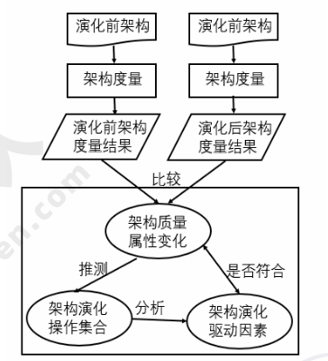
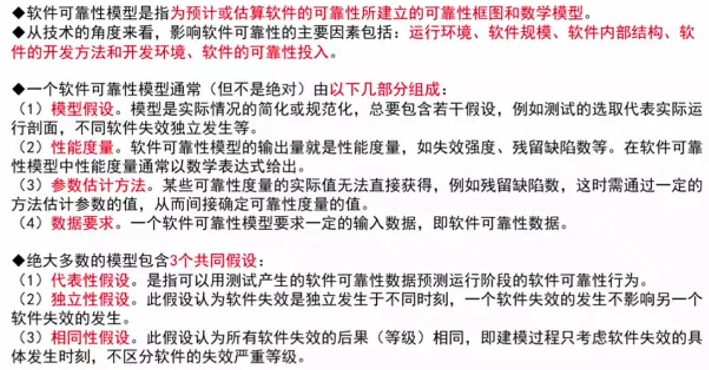
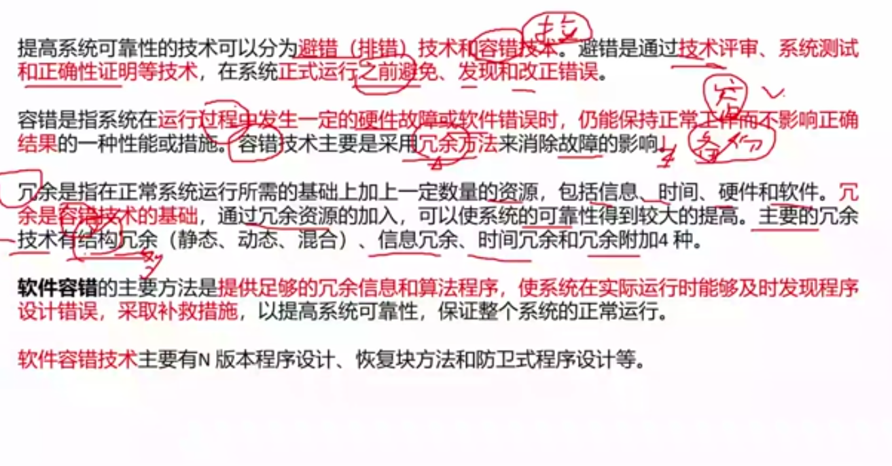

# 软件可靠性基础

## 软件可靠性基本概念（重要）

软件可靠性是软件产品在规定的条件下和规定的时间区间完成规定功能的能力。

**软件可靠性和硬件可靠性的区别**

* 复杂性：
* 物理退化：
* 唯一性：
* 版本更新周期：硬件较慢，软件较快

**软件可靠性的定量描述**

* 平均失效前时间（MTTF）：
* 平均恢复前时间（MTTR）：
* 平均故障间隔时间（MTBF）：

## 软件可靠性建模

## 软件可靠性管理

## 软件可靠性设计（重要）

软件可靠性设计技术有：容错设计技术、检错技术、降低复杂度设计、系统配置技术。

### 容错设计技术

### 检错技术

### 降低复杂度设计

### 系统配置技术

## 软件可靠性测试

## 软件可靠性评价

