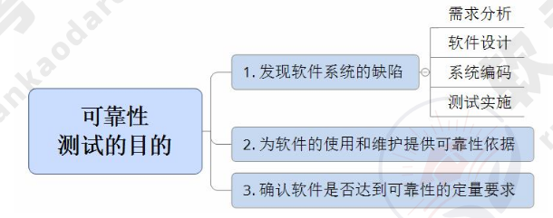
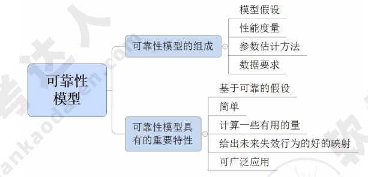
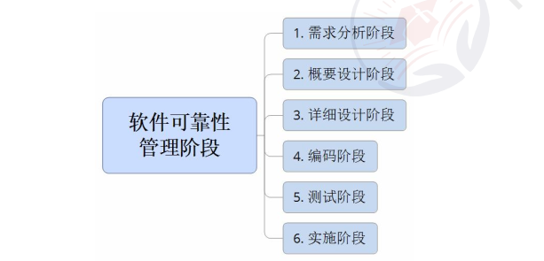
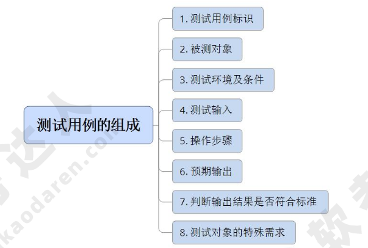
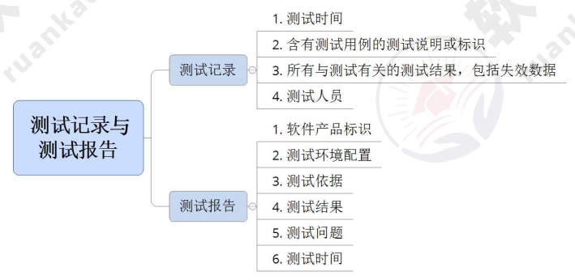

# 软件可靠性基础

## 软件可靠性基本概念（重要）

**软件可靠性的定义**

软件可靠性是指在规定的时间内，软件不引起系统失效的概率。该概率是系统输入和系统使用的函数，也是软件中存在的缺陷函数；系统输入将确定是否会遇到已存在的缺陷。

**软件可靠性的定量描述**

软件的可靠性是在软件使用条件、在规定时间内、系统的输入/输出、系统使用等变量构成的数学表达式，如图所示：

* 平均失效前时间（MTTF）：
* 平均恢复前时间（MTTR）：
* 平均故障间隔时间（MTBF）：

**可靠性的目标**

软件可靠性是指用户对所使用的软件的性能满意程度的期望。可以用可靠度、平均失效时间和故障强度等来描述。

**可靠性测试的意义与目的**

可靠性测试的意义是：

1. 软件失效可能造成灾难性的后果。
2. 软件的失效在整个计算机系统失效中的比例较高。
3. 相比硬件可靠性技术，软件可靠性技术不成熟。
4. 软件可靠性问题会造成软件费用增长。
5. 系统对软件的依赖性强，对生产活动和社会生活影响日益增大。

可靠性测试的目的如图所示：

**广义的可靠性测试与狭义的可靠性测试**

1. 广义的可靠性测试是为了最终评价软件系统的可靠性而运用建模、统计、试验、分析和评价等一系列手段对软件系统实施的一种测试。
2. 狭义的可靠性测试指为了获取可靠性数据，按预先确定好的测试用例，在软件预期使用环境中，对软件实施的一种测试。

**软件可靠性和硬件可靠性的区别**

* 复杂性：软件复杂性比硬件高，大部分失效来自于软件失效；
* 物理退化：硬件失效主要是物理退化所致，软件不存在物理退化；
* 唯一性：软件是唯一的，每个 COPY 版本都一样，而两个硬件不可能完全一样；
* 版本更新周期：硬件较慢，软件较快

## 软件可靠性建模

影响软件可靠性的因素包括：运行环境、软件规模、软件的内部结构、软件的开发方法
和开发环境、软件的可靠性投入。

软件可靠性模型的组成和特性，如图所示：

软件可靠性建模方法包括：种子法、失效率类、曲线拟合类、可靠性增长、程序结构分析、输入域分类、执行路径分析方法、非齐次泊松过程、马尔可夫过程、贝叶斯分析。

## 软件可靠性管理

软件可靠性管理的各阶段，如图所示：

在软件可靠性管理过程中，需要分析阶段应完成的是：

1. 确定软件的可靠性目标；
2. 分析可能影响可靠性的因素；
3. 确定可靠性的验收标准；
4. 制定可靠性管理框架；
5. 制定可靠性文档编写规范；
6. 制定可靠性文档编辑规范；
7. 制定可靠性活动初步计划；
8. 确定可靠性数据收集规范；

## 软件可靠性设计（重要）

软件可靠性设计技术有：容错设计技术、检错技术、降低复杂度设计、系统配置技术。

### 容错设计技术

容错设计技术：恢复块设计、N 版本程序设计、冗余设计。

1. 恢复块设计：选择一组操作作为容错设计单元，把普通的程序块变成恢复块。
2. N 版本程序设计：通过设计多个模块或不同版本，对相同初始条件和相同输入的操作结果，实行多数表决，防止其中某一软件模块/版本的故障提供错误的服务。
3. 冗余设计：在一套完整的软件系统之外，设计一种不同路径、不同算法或不同实现方式方法的模块或系统作为备份，在出现故障时可使用冗余部分进行替换。

### 检错技术

1. 检错技术代价低于容错技术和冗余技术，但是不能自动解决故障，需要人工干预。
2. 检错技术着重考虑检测对象、检测延时、实现方式、处理方式四个要素。

### 降低复杂度设计

降低复杂度设计思想是在保证实现软件功能基础上，简化软件结构、缩短程序代码长度、优化软件数据流向、降低软件复杂度、提高软件可靠性。

### 系统配置技术

系统配置技术：可以分为双机热备技术和服务器集群技术。

1. 双机热备技术。

    1. 采用“心跳”方法保证主系统与备用系统的联系。
    2. 根据两台服务器的工作方式分为双机热备模式（一台工作，一台后备）、双机互备模式（两台运行相对独立应用，互为后备）、双机双工模式（两台同时运行相同应用，互为后备）。

2. 服务器集群技术。集群内各节点服务器通过内部局域网相互通信，若某节点服务器发生故障，这台服务器运行的应用被另一节点服务器自动接管。

## 软件可靠性测试

**软件可靠性测试概述**

软件可靠性测试包括：可靠性目标的确定、运行剖面的开发、测试用例的设计、测试实施、测试结果分析等。

**定义软件运行剖面**

为软件的使用行为建模，开发使用模型，明确需测试内容。

**软件可靠性测试用例设计**

测试用例要能够反映实际的使用情况，优先测试最重要的和最频繁使用的功能，其组成如图所示。设计测试用例，针对组合功能或特定功能，编写成相关文档。

**软件可靠性测试的实施**

用时间定义的软件可靠性数据分为 4 类：失效时间数据、失效间隔时间数据、分组时间内的失效数、分组时间的累积失效数。测试记录与测试报告的组成如图所示：

## 软件可靠性评价

**软件可靠性评价概念**

评估和预测软件可靠性过程包括：

1. 选择可靠性模型。
2. 收集可靠性数据。
3. 可靠性评估和预测。

**如何选择可靠性模型**

可以从以下几方面选择可靠性模型：

1. 模型假设的适用性。
2. 预测的能力与质量。
3. 模型输出值能否满足可靠性的评价需求。
4. 模型使用的简便性。

**可靠性数据的收集**

数据收集可行的办法有：

1. 尽可能早地确定可靠性模型。
2. 数据收集计划要有较强的可操作性。
3. 重视测试数据的分析和整理。
4. 充分利用技术手段（数据库技术）来完成分析和统计。

**软件可靠性的评估和预测**

1. 软件可靠性的评估和预测的目的是评估软件系统的可靠性状况和预测将来一段时间的可靠性水平。
2. 软件可靠性的评估和预测以软件可靠性模型分析为主，以失效数据的图形分析法和试探性数据分析技术等为辅。