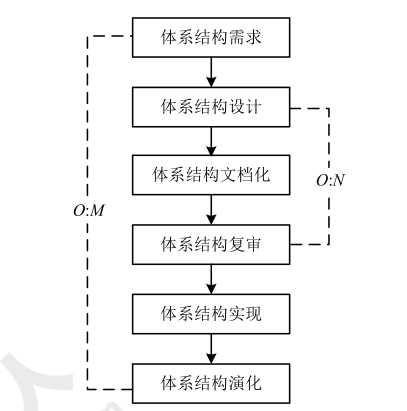
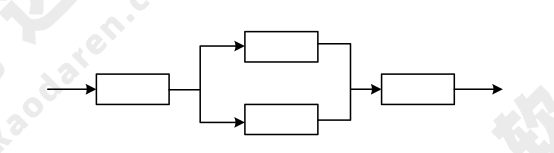
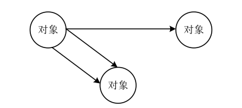
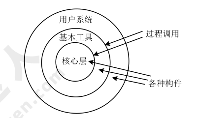
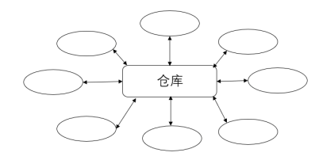
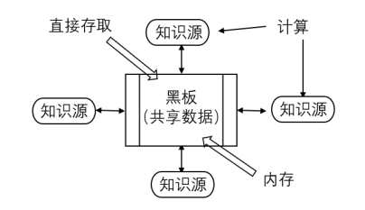
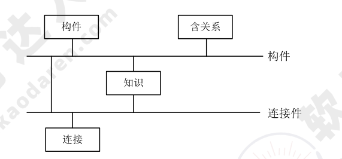

# 系统架构设计（重要）

## 基础知识点

### 软件架构的定义

软件架构（Software Architecture）或称软件体系结构，是指系统的一个或者多个结构，这些结构包括软件的构件（可能是程序模块、类或者是中间件）、构件的外部可见属性及其之间的相互关系。体系结构的设计包括数据库设计和软件结构设计，后者主要关注软件构件的结构、属性和交互作用，并通过多种视图全面描述。

### 软件架构设计与生命周期

软件架构是贯穿整个生命周期的，不同阶段的作用和意义不同，各阶段架构工作如下表所示：

| 阶段         | 作用和意义                                           |
| ------------ | ---------------------------------------------------- |
| 需求分析阶段 | 有利于各阶段参与者的交流，也易于维护各阶段的可追踪性 |
| 设计阶段     | 关注的最早和最多的阶段                               |
| 实现阶段     | 有效实现从软件架构设计向实现的转换                   |
| 构件组装阶段 | 可复用构件组装的设计能够提高系统实现的效率           |
| 部署阶段     | 组织和展示部署阶段的硬件架构、评估分析部署方案       |
| 后开发阶段   | 主要围绕维护、演化、复用进行                         |

#### 需求分析阶段

需求分析阶段软件架构研究还处于起步阶段。需求关注的是问题空间，架构关注的是解空间，需要保持二者的可追踪性和转换。从软件需求模型向软件架构模型的转换主要关注两个问题：

1. 如何根据需求模型构建软件架构模型。
2. 如何保证模型转换的可追踪性。

#### 设计阶段

这一阶段的研究主要包括：软件架构模型的描述、软件架构模型的设计与分析方法，以及对软件架构设计经验的总结与复用等。其中架构模型的描述研究包括：

1. 组成 SA 模型（软件架构模型）的基本概念。即构件和连接子的建模。
2. 体系架构描述语言（Architecture Describe Language，ADL）。是用于描述软件体系架构的语言，与其他建模语言最大的区别在于其更关注构件间互联机制（连接子），典型的 ADL 语言包括 Unicon、Rapide、Darwin、Wright、C2SADL、Acme、XADLOL、XYZ/ADL 和 ABC/ADL 等。

!!! info "2012 综合知识 38"

      架构描述语言（Architecture Description Language, ADL）是一种为明确说明软件系统的概念架构和对这些概念架构建模提供功能的语言。**ADL 主要包括以下组成部分：组件、组件接口、连接件和架构配置。** ADL 对连接件的重视成为区分 ADL 和其他建模语言的重要特征之一。
      
3. 多视图。反映的是一组系统的不同方面，体现了关注点分散的思想，通常与 ADL 结合起来描述系统的体系结构。典型的模型包括：4+1 模型、Hofmesiter 的 4 视图模型、CMU-Sei 的 Views and Beyond 模型。视图标准包括：IEEE 的 I471-2000、RM-ODP、UML 以及 IBM 的 Zachman。

#### 实现阶段

这一阶段的体系结构研究的内容有：

1. 基于 SA 的开发过程支持。
2. 寻求从 SA 向实现过渡的途径。
3. 研究基于 SA 的测试技术。

缩小软件架构设计与底层实现概念差距的手段：模型转换技术、封装底层的实现细节、在 SA模型中引入实现阶段的概念（如用程序设计语言描述）。

#### 构件组装阶段

研究的内容包括。

1. 如何支持可复用构件的互联，即对 SA 设计模型中规约的连接子的实现提供支持。
2. 组装过程中，如何检测并消除体系结构失配问题。这些问题主要包括：

      * 构件本身的失配；
      * 连接子（互联机制）的失配；
      * 部分和整体的失配。

#### 部署阶段

部署阶段的软件架构对软件部署的作用：一是提供高层的体系结构视图描述部署阶段的软硬件模型；二是基于软件架构模型可以分析部署方案的质量属性，从而选择合理的部署方案。

#### 后开发阶段

部署安装后（后开发阶段）的系统架构研究方向包括：动态软件体系结构、体系结构恢复与重建。体系结构重建的方法有：手工体系结构重建、工具支持的手工重建、通过查询语言来自动建立聚集、使用其他技术（如数据挖掘）。

### 软件架构的重要性

软件架构设计是降低成本、改进质量、按时和按需交付产品的关键因素。软件架构的重要性包括：

* 架构设计能够满足系统的品质。
* 架构设计使受益人达成一致的目标。
* 架构设计能够支持计划编制过程。
* 架构设计对系统开发的指导性。
* 架构设计能够有效地管理复杂性。
* 架构设计为复用奠定了基础。
* 架构设计能够降低维护费用。
* 架构设计能够支持冲突分析。

!!! tip "2009 综合知识 44"

      软件架构是降低成本、改进质量、按时和按需交付产品的关键因素，软件架构设计需要满足系统的质量属性，如性能、安全性和可修改性等，软件架构设计需要确定组件之间的依赖关系，支持项目计划和管理活动，软件架构能够指导设计人员和实现人员的工作。一般在设计软件架构之初，会根据用户需求，确定多个候选架构，从中选择一个较优的架构，并随着软件的开发，对这个架构进行微调，以达到最佳效果。

## 基于架构的软件开发方法

基于体系结构（架构）的软件设计（Architecture-Based Software Design，ABSD）方法是体系结构驱动的，即指构成体系结构的 **商业、质量和功能需求** 的组合驱动的。在基于体系结构的软件设计方法中，**采用视角与视图来描述软件架构**，**采用用例来描述功能需求**，**采用质量场景来描述质量需求**。

ABSD 方法具有三个基础：**功能的分解**、**通过选择体系结构风格来实现质量和商业需求**、**软件模板** 的使用。ABSD 是自顶向下、递归细化的，迭代的每一步都有清晰的定义，有助于降低体系结构设计的随意性，知道能够产生 **软件构建和类**。 

!!! tip "2009 综合知识 45"

      软件架构设计包括提出架构模型、产生架构设计和进行设计评审等活动，是一个迭代的过程，在建立软件架构的初期，一般需要选择一个合适的架构风格，将架构分析阶段已标识的构件映射到架构中，并分析这些构件之间的关系，一旦得到了详细的软件架构设计，需要邀请独立于系统开发的外部人员对系统进行评审。一般来说，软件架构设计活动将已标识构件集成到软件架构中，设计这些构件，但不予以实现。

!!! tip "2009 综合知识 48"

!!! tip "2010 综合知识 46,47"

!!! tip "2011 综合知识 49"

!!! tip "2012 综合知识 39,40,41"

      在 ANSI/IEEE 1471 2000 标准中，系统是为了达成利益相关人（Stakeholder）的某些使命（Mission），在特定环境 (Enviroment）中构建的。每一个系统都有一个架构（Architecture）。架构是对所有利益相关人的关注点（Concern）的响应和回答，通过架构描述（Architecture Description）来说明。每一个利益相关人都有各自的关注点。这些关注点是指对其重要的，与系统的开发、运营或其他方面相关的利益。
      
      架构描述（ArchitectureDescription）本质上是多视图的。
      
      每一个视图（View）是从一个特定的视角（Viewpoint）来表述架构的某一个独立的方面。试图用一个单一的视图来覆盖所有的关注点当然是最好的，但实际上这种表述方式将很难理解。
      
      视角（Viewpoint）的选择，基于要解决哪些利益相关人的哪些关注点。它决定了用来创建视图的语言、符号和模型等，以及任何与创建视图相关的建模方法或者分析技术。
      
      一个视图（View）包括一个或者多个架构模型（Model），一个模型也可能参与多个视图。模型较文本的表述的好处在于，可以更容易的可视化、检查、分析、管理和集成。

### 基于体系结构的开发模型

传统的软件开发模型开发效率较低，ABSDM 模型把整个基于体系结构的软件开发过程划分为体系结构需求、设计、文档化、复审、实现和演化六个子过程。

1. 体系结构需求

      体系结构的需求工作包括获取用户需求和标识系统中拟用构件。

      1. 需求获取。体系结构需求的获取一般来自三个方面：质量目标、系统的商业目标和系统开发人员的商业目标。
      2. 标识构件。标识构件分三步完成：生成类图→对类进行分组→把类打包成构件。
      3. 架构需求评审的审查重点包括需求是否真实反映了用户的要求、类的分组是否合理、构件合并是否合理。

2. 体系结构设计

      软件的体系设计过程：提出软件体系结构模型→映射构件→分析构件相互作用→产生体系结构设计评审。设计评审必须邀请独立于系统开发的外部人员。

3. 体系结构的文档化。体系结构文档化过程的主要输出结果是体系结构规格说明和测试体系结构需求的质量设计说明书。

    !!! info "2009 综合知识 49"

        软件架构文档是对软件架构的一种描述，帮助程序员使用特定的程序设计语言实现软件架构。
            
        软件架构文档的写作应该遵循一定的原则，这些原则包括：

        * 文档要从 **使用者** 的角度进行编写；
        * 必须分发给所有与系统有关的开发人员；
        * 应该保持架构文档的即时更新，但更新不要过于频繁；
        * 架构文档中描述应该尽量避免不必要的重复；
        * 每次架构文档修改都应该记录进行修改的原则。

1. 体系结构的复审

      一个主版本的软件体系结构分析之后，要安排一次由外部人员（用户代表和领域专家）参加的复审。复审的目的是<u>标识潜在的风险</u>，及早发现体系结构设计中的缺陷和错误，必要时，可搭建一个可运行的最小化系统用于评估和测试体系结构是否满足需要。
      
!!! tip "2009 综合知识 50"

2. 体系结构实现

      体系结构的实现过程是以复审后的文档化体系结构说明书为基础的，具体为：分析与设计→构件实现→构件组装→系统测试。体系结构说明书中定义了系统中构件与构件之间的关系。测试包括单个构件的功能性测试及被组装应用的整体功能和性能测试。

3. 体系结构演化

      体系结构演化史使用系统演化步骤去修改应用，以满足新的需求。系统演化步骤为：需求变化归类→体系结构演化计划→构件变动→更新构件的相互作用→构件组装与测试→技术评审→演化后的体系结构。

## 软件架构风格

!!! tip "2009 综合知识 55"

      采用闭环结构的软件通常由几个协作构件共同构成，且其中的主要构件彼此分开，能够进行替换与重用，但闭环结构通常适用于处理简单任务（如机器装配等)，并不适用于复杂任务。分层结构的特点是通过引入抽象层，在较低层次不确定的实现细节在较高层次会变得确定，并能够组织层间构件的协作，系统结构更加清晰。

!!! tip "2009 综合知识 56"

      一个软件的架构设计是随着技术的不断进步而不断变化的。以编译器为例，其主流架构经历了管道 过滤器到数据共享为中心的转变过程。早期的编译器采用管道 过滤器架构风格，以文本形式输入的代码被逐步转化为各种形式，最终生成可执行代码。早期的编译器釆用管道 过滤器架构风格，并且大多数编译器在词法分析时创造独立的符号表，在其后的阶段会不断修改符号表，因此符号表并不是程序数据的一部分。现代的编译器采用以数据共享为中心的架构风格，主要关心编译过程中程序的中间表示。现代的编译器采用以数据共享为中心的架构风格，分析树是在语法分析阶段结束后才产生作为语义分析的输入，分析树是数据中心中重要的共享数据，为后续的语义分析提供了帮助。

### 软件架构风格概述

软件体系结构设计的核心目标是重复的体系结构模式（软件复用/重用）。软件体系结构（架构）风格是描述某一特定应用领域中系统组织方式的惯用模式。体系结构风格定义一个系统家族，即一个体系结构定义一个词汇表和一组约束。

* **词汇表：** 包含构件和连接件；
* **约束：** 约束定义构件和连接件的组合方式。

体系结构风格反映了领域中众多系统所共有的结构和语义特性，并指导如何将各个模块和子系统有效地组织成一个完整的系统。

!!! info "2012 综合知识 16"

      对于采用层次化架构风格的系统，划分的层次越多，系统完成某项功能需要的中间调用操作越多，其性能越差。
      
      对于采用管道 过滤器架构风格的系统，可以通过引入过滤器的数据并发处理可以有效提高系统性能。
      
      对于采用面向对象架构风格的系统，可以通过减少功能调用层次提高系统性能。
      
      对于采用过程调用架构风格的系统，将显式调用策略替换为隐式调用策略能够提高系统的灵活性，但会降低系统的性能。

!!! info "2012 综合知识 42,43"

      在该方法中，架构用来激发和调整设计策略，不同的视图用来表达与质量目标有关的信息。架构设计是一个迭代过程，在建立软件架构的初期，选择一个合适的架构风格是首要的，在此基础上，开发人员通过架构模型，可以获得关于软件 **架构属性** 的理解，为将来的架构实现与演化过程建立了目标。

!!! info "2013 综合知识 44"

      软件架构能够在设计变更相对容易的阶段，考虑系统结构的可选方案，便于技术人员与非技术人员就软件设计进行交互，能够展现软件的结构、属性与内部交互关系。但是软件架构与用户对系统的功能性需求没有直接的对应关系。

### 数据流体系结构风格

!!! tip "2009 综合知识 53"

| 架构风格           | 描述                                                                                                                     |
| ------------------ | ------------------------------------------------------------------------------------------------------------------------ |
| 批处理体系结构风格 | 每个处理步骤是一个独立的程序，每一步必须在前一步结束后才能开始，且数据必须是完整，以整体的方式传递。                     |
| 管道和过滤器       | 把系统分为几个序贯地处理步骤，每个步骤之间通过数据流连接，一个步骤的输出是另一个步骤的输入，每个处理步骤都有输入和输出。 |

### 调用/返回体系结构风格

调用-返回风格在系统中采用了调用与返回机制。利用调用-返回实际上是一种分而治之的策略，主要思想是将一个复杂的大系统分解为若干个子系统，降低复杂度，增加可修改性。

| 架构风格                  | 描述                                                                                                                                                                                                     |
| ------------------------- | -------------------------------------------------------------------------------------------------------------------------------------------------------------------------------------------------------- |
| 主程序/子程序风格         | 采用单线程控制，把问题划分为若干处理步骤，构件即为主程序和子程序。                                                                                                                                       |
| 面向对象体系结构风格      | 构件是对象，即抽象数据类型的实例。                                                                                                                                                                       |
| 层次型体系结构风格        | 每一层为上层服务，并作为下层的接口，仅相邻层间具有层接口。                                                                                                                                               |
| 客户端/服务器体系结构风格 |                                                                                                                                                                                                          |
| 浏览器/服务器风格（B/S）  | B/S 风格：是三层应用结构的实现方式，其三层结构分别为：浏览器；Web 服务器；数据库服务器。 相比于 C/S 的不足之处：动态页面的支持能力弱、系统拓展能力差、安全性难以控制、响应速度不足、数据交互性不强。 |

!!! tip

      采用面向对象架构风格的系统有可能通过建立更多的对象来提高系统处理性能，例如建立更多的线程对象提供高并发处理能力。

**层次型体系结构风格**

- 
- 

!!! warning

      对于采用层次化架构风格的系统，划分的层次月多，系统的性能越差。

**客户端/服务器体系结构风格**

   
- 二层 C/S 模式

      ---

      主要组成部分：数据库服务器（后台：负责数据管理）、客户应用程序（前台：完成与用户交互任务）和网络。

      **优点：** 客户应用和服务器构件分别运行在不同的计算机上。

      **缺点：** 开发成本高，客户端设计复杂，信息内容和形式单一，不利于推广，软件移植困难，软件维护和升级困难。

- 三层 C/S 模式

      ---

      瘦客户端模式。应用该功能分为表示层、功能层和数据层。

      **表示层：** 用户接口与应用逻辑层的交互，不影响业务逻辑，通常使用图形用户界面。

      **功能层：** 实现具体的业务处理逻辑。

      **数据层：** 数据库管理系统。

!!! tip "2009 综合知识 54"

      根据题干描述，调试器在设置端点时，其本质是在断点处设置一个事件监听函数，当程序执行到断点位置时，会触发并调用该事件监听函数，监听函数负责进行自动卷屏、刷新变量数值等动作。这是一个典型的回调机制，属于隐式调用的架构风格。

### 以数据为中心的体系结构风格

!!! tip "2011 综合知识 52"

      根据题干描述，现代编译器主要关注编译过程和程序的中间表示，围绕程序的各种形态进行转化与处理。这种情况下，可以针对程序的各种形态构建数据库，通过中心数据库进行转换与处理。根据上述分析，选项中列举的架构风格中，数据共享风格最符合要求。

| 架构风格         | 描述                                                                                                                                                                         |
| ---------------- | ---------------------------------------------------------------------------------------------------------------------------------------------------------------------------- |
| 仓库体系结构风格 | 存储和维护数据的中心场所。由中央数据结构（说明当前数据状态）和一组独立构件（对中央数据进行操作）组成。                                                                       |
| 黑板体系结构风格 | 是一种问题求解模型，是组织推理步骤、控制状态数据和问题求解之领域知识的概念框架。可通过选取各种黑板、知识源和控制模块的构件来设计，应用于信号处理领域，如语音识别和模式识别。 |

!!! Tip

      在仓库风格中有两种不同的构件：中央数据结构说明当前状态，独立构件在中央数据存储上执行，仓库与外构件间的相互作用在系统中会有大的变化。按控制策略的选取分类，可以产生两个主要的子类。若输入流中某类时间触发进程执行的选择，则仓库是传统型数据库；另一方面，若中央数据结构的当前状态触发进程执行的选择，则仓库是黑板系统。

- 
- 

### 虚拟机体系结构风格

虚拟机体系结构风格基本思想是人为构建一个运行环境，可以解析与运行自定义的一些语言，增加架构的灵活性。

!!! tip "2009 综合知识 52"

      Java 语言是一种解释型语言， 在 Java 虚拟机上运行，这从架构风格上看是典型的“虚拟机”风格，即通过虚拟机架构屏蔽不同的硬件环境。

| 架构风格             | 描述                                                                                               |
| -------------------- | -------------------------------------------------------------------------------------------------- |
| 解释器体系结构风格   | 通常被用来建立一种虚拟机以弥合程序语义与硬件语义之间的差异，缺点是执行效率较低，典型例子是专家系统 |
| 规则系统体系结构风格 | 包括知识库、规则解释器、规则/数据选择器及工作内存（程序运行存储区）                                |

- 
- 

???+ info "2011 综合知识 50"

      根据题干描述，语音识别软件需要对用户的语音指令进行音节分割、重音判断、语法分析和语义分析，最终对用户的意图进行推断。由于语音识别具有不确定性，需要人工智能技术的支持和专家意见的汇总和决策， 并且需要支持识别过程中的推理和决策。根据上述分析，选项中列举的架构风格中，接受器风格最符合要求。

???+ info "2011 综合知识 51"

      根据题干描述，需要将现有的业务功能进行多种组合，形成新的业务功能。这种情况下，可以将业务功能封装成服务，并通过某种语言对业务流程进行描述，通过一个解释引擎对流程描述进行解释和执行。根据上述分析，选项中列举的架构风格中，解释器风格最符合要求。

!!! tip

      采用解释器架构风格的系统可以通过部分解释代码预先编译的方式提高系统性能。

### 独立构建体系结构风格

独立构件体系结构风格强调系统中的每个构件都是相对独立的个体，它们之间不直接通信，以降低耦合度，提升灵活度。

!!! tip "2009 综合知识 51"

      Windows 操作系统在图形用户界面处理方面采用的是典型的“事件驱动”的架构风格，首先注册事件处理的是回调函数，当某个界面事件发生时（例如键盘敲击、鼠标移 动等)，系统会查找并选择合适的回调函数处理该事件。

| 架构风格             | 描述                                                   |
| -------------------- | ------------------------------------------------------ |
| 进程通信体系结构风格 | 构件是独立的过程，连接件是消息传递。                   |
| 事件系统体系结构风格（**隐式调用**） | 构件不直接调用一个过程，而是触发或广播一个或多个事件。 |

!!! tip "2010 综合知识 21"

      * 远程过程调用一般是基于同步的方式，效率较低，而且容易失败；
      
      * 共享数据库和文件传输的集成方式在性能方面较差，系统不能保持即时数据同步，而且容易造成应用与数据紧耦合；
      
      * 消息传递的集成方式能够保证数据的异步、立即、可靠传输。

!!! tip 

      对于采用隐式调用架构风格的系统可以通过处理函数的并发调用提高系统处理性能，如果处理函数是性能瓶颈的化。

### C2 风格

C2 风格通过连接件连接构件或某个构件组，构件与构件之间无连接。

---

!!! tip "2009 综合知识 57,58,59"

      **软件设计中使用的架构模式、设计模式和惯用法的基本概念。**

      架构模式是软件设计中的高层决策，例如 C/S 结构就属于架构模式，架构模式反映了开发软件系统过程中所作的基本设计决策；设计模式主要关注软件系统的设计，与具体的实现语言无关；惯用法则是实现时通过某种特定的程序设计语言来描述构件与构件之间的关系，例如引用 计数就是 C++语言中的一种惯用法。

## 软件架构复用

**软件架构复用的定义及分类**

软件复用是系统化的软件开发过程：开发一组基本的软件构件模块，以覆盖不同的需求/体系结构之间的相似性，提高系统开发的效率、质量和性能。

软件架构复用的类型包括 **机会复用和系统复用**。

* 机会复用是在开发过程中，只要发现有可复用的资产就复用。

* 系统复用是在开发前进行规划，决定哪些复用。

**软件架构复用的原因：** 减少开发工作、减少开发事件、降低开发成本、提高生产力、提高产品质量，更好的互操作性。

**软件架构复用的对象及形式**

可复用的资产包括：需求、架构设计、元素、建模分析、测试、项目规划、过程+方法+工具、人员、样本系统、缺陷消除。

一般形式的复用包括：函数的复用、库的复用、面向对象开发中的类、接口和包的复用。

**软件架构复用的基本过程** 

首先构建/获取可复用的软件资产（复用前提）→管理可复用资产→使用可复用资产。

## 特定领域软件体系结构

特定领域软件架构（Domain Specific Software Architecture, DSSA）是在一个特定领域中为一组应用提供组织结构参考的标准软件体系结构，即用于某一类特定应用领域的标准软件构件集合。**DSSA 的特征：领域性、普遍性、抽象性、可复用性。**

DSSA 的基本活动有 **领域分析、领域设计、领域实现。**

DSSA 通常具有 3 个层次的系统模型，包括<u>领域开发环境、领域特定应用开发环境和应用执行环境</u>，其中<u>应用工程师</u>主要在领域特定应用开发环境中工作。

1. **领域分析：** 通过分析领域中系统的共性需求，建立领域模型；
2. **领域设计：** 设计 DSSA，且 DSSA 需要具备领域需求变化的适应性；
3. **领域实现：** 获取可重用信息。

DSSA 的建立过程是 **并发的、递归的、反复的螺旋模型**，分为五个阶段：

1. 定义领域范围。
2. 定义领域特定元素。
3. 定义领域特定的设计和实现约束。
4. 定义领域模型和体系结构。
5. 产生、搜集可重用的单元。

!!! info "2010 综合知识 53,54"

      特定领域软件架构（DSSA)是在一个特定应用领域为一组应用提供组织结构参考的标准软件架构。实施 DSSA 的过程中包括一系列基本的活动，其中 **领域设计活动的主要目的是为了获得 DSSA。** 该活动参加人员中，**领域专家的主要任务是提供关于领域中系统的需求规约和实现的知识。**

!!! info "2012 综合知识 54,55"

      特定领域软件架构（Domain Specific Software Architecture，DSSA）以一个特定问题领域为对象，形成由领域参考模型、参考需求、参考架构等组成的开发基础架构，其目标是支持一个特定领域中多个应用的生成。DSSA 的基本活动包括领域分析、领域设计和领域实现。其中领域分析的主要目的是获得领域模型，领域模型描述领域中系统之间共同的需求，即领域需求；领域设计的主要目标是获得 DSSA，DSSA 描述领域模型中表示需求的解决方案；领域实现的主要目标是依据领域模型和 DSSA 开发和组织可重用信息，并对基础软件架构进行实现。

### 中间件

!!! inline end info "中间件 5 种主要类型"

      1. 数据库访问中间件
      2. 远程过程调用（RPC）
      3. 面向消息中间件（MOM）
      4. 分布式对象中间件
      5. 事务中间件

中间件在一个分布式系统环境中处于操作系统和应用程序之间的软件，可以在不同技术之间共享资源，将不同的操作系统、数据库、异构的网络环境以及若干应用结合成一个有机的协同工作整体。

中间件的任务是使应用程序开发变得更容易，通过提供统一的程序抽象，隐藏异构系统和分布式系统下低级别编成的复杂度。

---

#### 典型应用架构

!!! inline info "J2EE 层次结构"

      1. 客户层组件
      2. WEB 层组件
      3. 业务层组件
      4. 信息系统层

**J2EE 核心技术**

采用了多层分布式应用程序模型，实现不同逻辑功能的应用程序被封装到不同的构建中，处于不同层次的构建被分别部署到不同的机器中。

**JSP+Servlet+JavaBean+DAO**

---

* JSP：用于显示、收集数据的部分，作为 MVC 的视图层；
* Servlet：作为业务逻辑层，用于处理复杂的业务逻辑，如验证数据、实例化 JavaBean、调用 DAO 连接数据库等；
* JavaBean：用于数据的封装，方便将查询结果在 Servlet 和 JSP 页面之间进行传递等；
* DAO：用于连接数据库及进行数据库的操作，如：查询、删除、更改等；

JSP 发送一个数据到 Servlet， Servlet 收到后解析，根据数据调用相应的 Service 去服务， Service 如果调用数据库就通过 DAO 跟数据库交互，使用 JavaBean 完成封装，返回结果给 Servlet， Servlet 再返回给 JSP。

**.Net 平台**

`.Net` 框架处于操作系统和 `.Net` 应用语言之间，只适用于微软系统，而 J2EE 支持跨平台，任何安装了 JVM 平台。

!!! info "2012 综合知识 9"

      中间件是一种独立的系统软件或服务程序，分布式应用软件借助这种软件在不同的技术之间共享资源，中间件位于客户机服务器的操作系统之上，管理计算资源和网络通信。
      
      软件中间件的作用是为处于自己上层的应用软件提供运行与开发的环境，帮助用户开发和集成应用软件。它不仅仅要实现互连，还要实现应用之间的互操作。