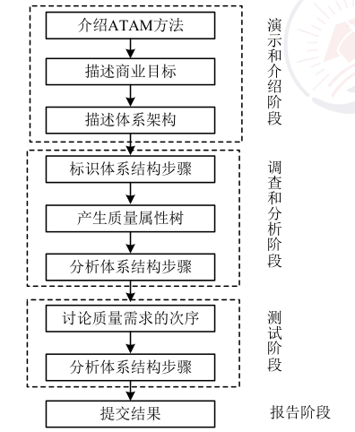
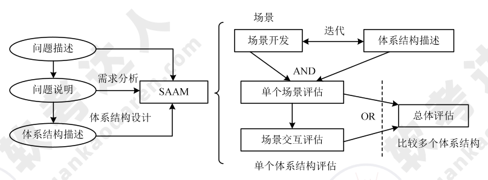

# 系统质量属性与架构评估（重要）

## 软件系统质量属性

软件系统质量属性是一个系统的可测量或可测试的属性，基于软件系统的生命周期，可将软件系统的质量属性分为开发期质量属性和运行期质量属性，见表如下：

| 属性          | 子属性       | 作用及要点                                                                                                 |
|---------------|--------------|------------------------------------------------------------------------------------------------------------|
| 开发期质量属性 | 易理解性     | 指设计被开发人员理解的难易程度                                                                             |
|               | 可扩展性     | 软件因适应新需求或改进需求变化而增加新功能的能力，也称灵活性                                               |
|               | 可重用性     | 指重用软件系统或某一部分的难易程度                                                                         |
|               | 可测试性     | 对软件测试以证明其满足需求规范的难易程度                                                                   |
|               | 可维护性     | 当需要修改或陷阱、增加功能、提高质量属性时，识别修改点并实施修改的难易程度                                 |
|               | 可移植性     | 将软件系统从一个运行环境转移到另一个不同的运行环境的难易程度                                               |
| 运行期质量属性 | 性能         | 软件系统及时提供相关服务的能力，如速度、吞吐量和容量等                                                     |
|               | 安全性       | 软件系统同时兼顾响应合法用户提供服务，以及组织非授权使用的能力                                           |
|               | 可伸缩性     | 当用户数和数据量增加时，软件系统维持高服务质量的能力                                                       |
|               | 可操作性     | 软件系统与其他系统交换数据和相互调用服务的难易程度                                                         |
|               | 可靠性       | 软件系统在一定时间内持续无故障运行的能力                                                                   |
|               | 可用性       | 系统在一定时间内正常工作的时间所占比例                                                                     |
|               | 鲁棒性       | 软件系统在非正常情况（用户进行非法操作、相关软件系统发生故障）下仍正常运行的能力，也称健壮性或容错性   |

### 面向架构评估的质量属性

> 重要的质量属性用 **`*`** 强调标识

| 属性                       | 子属性  | 作用及要点                   | 设计策略                               |
|--------------------------|------|-------------------------|------------------------------------|
| `*`性能                    |      | 效率指标：处理任务所需时间或单位时间内的处理量 | 优先级队列、增加计算资源、减少计算开销、引入并法机制、采用资源调度等 |
| `*`可靠性                   | 容错   | 出现错误后仍能保证系统正确运行，且自行修正错误 | 心跳、Ping/Echo、冗余、选举                 |
|                          | 健壮性  | 错误不对系统产生影响，指既定程序忽略错误    | 心跳、Ping/Echo、冗余、选举                 |
| `*`可用性（**与可靠性相比优先选可用性**） |      | 系统正常运行的时间比例             | 心跳、Ping/Echo、冗余、选举                 |
| `*`安全性                   |      | 系统向合法用户提供服务并阻止非法用户的能力   | 入侵检测、用户认证、用户授权、追踪审计                |
| `*`可修改性                  | 可维护性 | 局部修复使故障对架构的负面影响最小化      |                                    |
|                          | 可扩展性 | 因松散耦合更易实现新特性/功能，不影响架构   |                                    |
|                          | 结构重组 | 不影响主体进行的灵活配置            |                                    |
|                          | 可移植性 | 适用于多样的环境（硬件平台、语言、操作系统等） |                                    |
| `*`功能性                   |      | 需求满足程度                  |                                    |
| 可变性                      |      |                         |                                    |
| 互操作性                     |      | 通过可视化或接口方式提供更好的交互体验     |                                    |

???+ question "请用 200 字以内的文字列举 6 种不同的软件质量属性名称并解释其含义？（必背）"

    常见的软件质量属性有多种，例如性能（Performance)、可用性（Availability)、可 靠性（Reliability)、健壮性（Robustness)、安全性（Security)、可修改性（Modification)、可 变 性 (Changeability) 、 易 用 性 (Usability) 、 可 测 试 性 (Testability) 、 功 能 性(Functionality) 和互操作性（Inter operation)等。

    这些质量属性的具体含义是：

    1. 性能是指系统的响应能力，即要经过多长时间才能对某个事件做出响应，或者在某段时间内系统所能处理事件的个数。
    2. 可用性是系统能够正常运行的时间比例。
    3. 可靠性是指软件系统在应用或错误面前，在意外或错误使用的情况下维持软件系统功能特性的基本能力。
    4. 健壮性是指在处理或环境中，系统能够承受压力或变更的能力。
    5. 安全性是指系统向合法用户提供服务的同时能够阻止非授权用户使用的企图或拒绝服务的能力。
    6. 可修改性是指能够快速地以较高的性能价格比对系统进行变更的能力。
    7. 可变性是指体系结构经扩充或变更成为新体系结构的能力。
    8. 易用性是衡量用户使用一个软件产品完成指定任务的难易程度。
    9. 可测试性是指软件发现故障并隔离、定位其故障的能力特性，以及在一定的时间和成本前提下，进行测试设计、测试执行的能力。
    10. 功能性是系统所能完成所期望工作的能力。
    11. 互操作性是指系统与外界或系统与系统之间的相互作用能力。

!!! info "2010 综合知识 55,56,57"

    不同策略主要针对一个或多个软件质量属性，其中 Ping/Echo 主要提高系统的可用性；限制访问主要提髙系统的安全性；运行时注册主要提高系统的可修改性；接口实现分离主要提髙系统的可修改性；主动冗余提高系统的可靠性；队列调度主要提高系统的性能；信息隐藏主要提高系统的可修改性；记录回放主要提高系统的可测试性，等等。

!!! info "2010 综合知识 58"

!!! info "2010 综合知识 62,63"

    正确识别风险点、非风险点、敏感点和权衡点是进行软件架构评价的关键步骤。其中敏感点是实现一个特定质量属性的关键特征，该特征为一个或多个软件构件所共有。系统权衡点会影响一个或多个属性，并对于多个属性来说都是敏感点。基于该定义，可以看出“改变加密的级别可能会对安全性和性能都产生显著的影响”正是一个对系统权衡点的描述。

!!! info "2012 综合知识 56,57,58,59,60,61"

### 质量属性场景描述

质量属性场景是一种面向特定质量属性的需求，由 6 部分组成：

* 刺激源：某个生成该刺激的实体（人、计算机系统或者任何其他刺激器）；
* 刺激：指当刺激到达系统时需要考虑的条件；
* 环境：指该刺激在某些条件内发生。当激励发生时，系统可能处于过载、运行或其他情况；
* 制品：某个制品被激励，可能是整个系统，也可能是系统的一部分；
* 响应：指在激励到达后所采取的行动；
* 响应度量：当响应发生时，应当能够以某种方式对其进行度量，以对需求进行测试。

## 系统架构评估

系统架构评估是在对架构分析、评估的基础上，对架构策略的选取进行决策，通常分为：

| 方法                       | 描述                                             |
| -------------------------- | ------------------------------------------------ |
| 基于调查问卷或检查表的方法 | 缺点是很大程度上依赖于评估人员的主观判断         |
| 基于场景的评估方法         | 应用在架构权衡分析法（**ATAM**）和软件架构分析方法（**SAAM**）中 |
| 基于度量的评估方法         | 建立质量属性和度量之间的映射原则->在软件文档中获取度量信息->分析推导系统质量属性 |

### 系统架构评估中的重要概念

1. 敏感点：实现质量目标时应注意的点，是一个或多个构建的特性；
2. 权衡点：影响多个质量属性的敏感点；
3. 风险承担者或利益相关人：影响体系结构或被体系结构影响的群体；
4. 场景：确定架构质量评估目标的交互机制，一般采用触发机制、环境和影响三方面来描述。

!!! info "2011 综合知识 62,63"

### 软件架构分析方法（ATAM）

ATAM 是一种架构评估方法，主要在系统开发之前，针对 **性能、可用性、安全性、可修改性** 等质量属性进行评价和折中。

分为 4 个主要活动阶段：**需求收集、架构视图描述、属性模型构造和分析、架构决策与折衷**，整个评估过程强调以属性作为架构评估的核心概念。

- 阶段 1—演示（Presentation）
  
      ---

      使用 ATAM 评估软件体系结构的初始阶段，包括 3 个步骤：
      
      1. 介绍 ATAM：描述 ATAM 评估过程。
      2. 介绍业务驱动因素：着重业务视角，提供有关系统功能、主要利益相关方、业务目标和其他限制等信息。
      3. 介绍要评估的体系结构：侧重可用性以及体系结构的质量要求。

- 阶段 2—调查和分析

      ---

      使用 ATAM 技术评估架构第 2 阶段，对一些关键问题彻底调查，包括 3 个步骤：

      1. 确定架构方法：涉及能够理解系统关键需求的关键架构方法。
      2. 生成质量属性效用树：确定最重要的质量属性，并确定优先次序。
      3. 分析体系结构方法：彻底调查和分析，找出处理相应质量属性架构的方法。包括 4 个主要阶段：调查架构方法→创建分析问题→分析问题的答案→找出风险、非风险、敏感点和权衡点

- 阶段 3—测试

      ---

      1. 头脑风暴和优先场景：将头脑风暴的优先列表与生成质量属性效用树中所获取的优先方案进行比较。
      2. 分析架构方法。

- 阶段 4—报告 ATAM

      ---

      提供评估期间收集的所有信息，呈现给利益相关者。

???+ info "2011 综合知识 61"

      ATAM 是一种常用的软件架构评估方法，该方法强调对软件的质量属性进行分析、分类和优先级排序等工作，在此基础上构建质量属性效用树，并对风险点、非风险点、敏感点和权衡点进行识别和分析。

### 架构权衡分析法（**SAAM**）

SAAM 是一种非功能质量属性的架构分析方法，是最早形成文档并得到广泛应用的软件架构分析方法。SAAM 的主要输入是 **问题描述、需求说明和架构描述**，其分析过程主要包括 **场景开发、架构描述、单个场景评估、场景交互和总体评估**。

| 项目         | SAAM                                                | ATAM                                                  |
|--------------|-----------------------------------------------------|-------------------------------------------------------|
| 特定目标     | 通过程序文档验证体系结构，注重发现潜在问题，可用于评估单一系统或进行多系统比较 | 确定在多个质量属性之间折中的必要性                       |
| 评估技术     | 场景技术                                            | 场景技术、启发式分析方法                               |
| 质量属性     | 可修改性是主要分析内容                               | 性能、可用性、安全性和可修改性                         |
| 风险承担者   | 所有参与者                                          | 场景和需求收集过程中的相关人                            |
| 架构描述     | 围绕功能、结构和分配描述                             | 五个基本结构及其映射关系                               |
| 方法活动     | 场景开发、体系结构描述、单个场景评估、场景交互和整体评估 | 场景和需求收集、体系结构视图和场景实现、属性模型构造和分析、折中 |
| 知识库可复用性 | 不涉及                                              | 有基于属性的体系模型，可复用                             |
| 方法验证（应用领域） | 空中交通管制系统、嵌入式音频系统、修正控制系统   | 仍处于研究中                                             |

### 成本效益分析法

成本效益分析法（Cost Benefit Analysis Method，CBAM）分为整理场景→对场景进行求精→确定场景的优先级→分配效用→架构策略涉及哪些质量属性及响应级别→使用内插法确定“期望的”质量属性响应级别的效用→计算各架构策略的总收益→根据受成本限制影响的 ROI 选择架构策略。

### 其他评估方法。

1. SAEM 方法：将软件架构看作一个最终产品以及涉及过程中的一个中间产品，从外部质量属性和内部质量属性阐述的评估模型。
2. SAABNet 方法：辅助架构的定性评估，帮助诊断软件问题的可能原因，分析架构中的修改给质量属性带来的影响、预测架构的质量属性，帮助架构设计人员做决策。SAABNet 度量的对象包括架构属性、质量准则和质量因素。
3. SACMM 方法：一种软件架构修改的度量方法，首先基于内核定义差异度量准则来计算两个软件架构之间的距离，然后分析对象之间的相似性。
4. SASAM 方法：通过对预期架构和实际架构进行映射和比较来静态地评估软件架构。
5. ALRRA 方法：是软件架构可靠性风险评估方法，使用动态复杂度准则和动态耦合度准则来定义组件和连接件的复杂性因素。
6. AHP 方法：把定性分析和定量计算相结合，对各种决策因素进行处理。
7. COSMIC+UML 方法：针对不同表达方式的软件架构，采用统一的软件度量 COSMIC 方法来进行度量和评估。