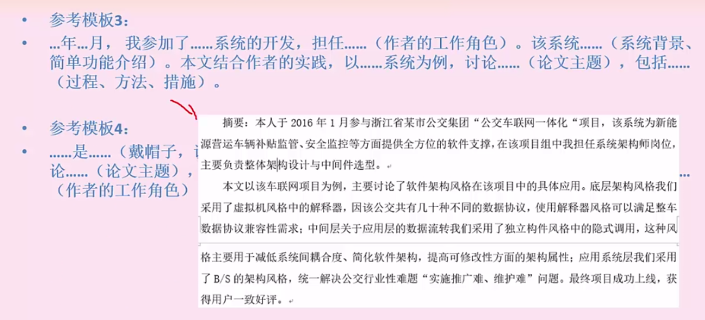
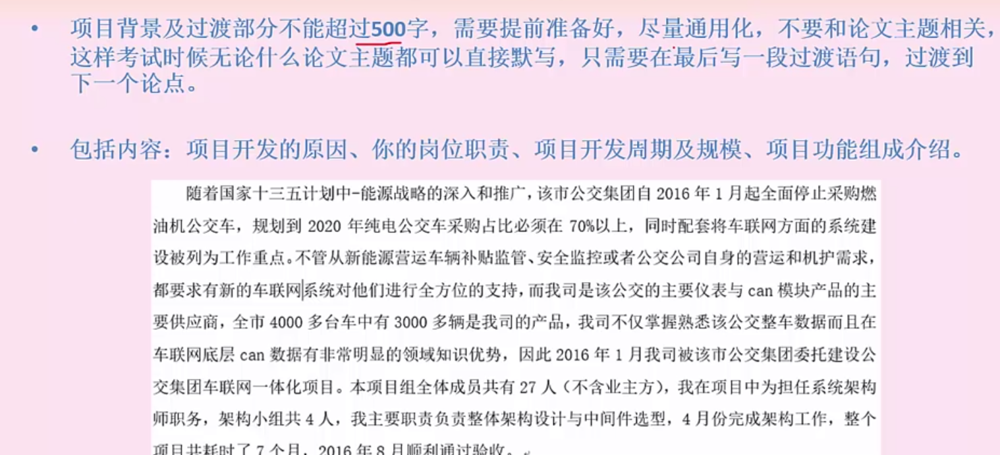
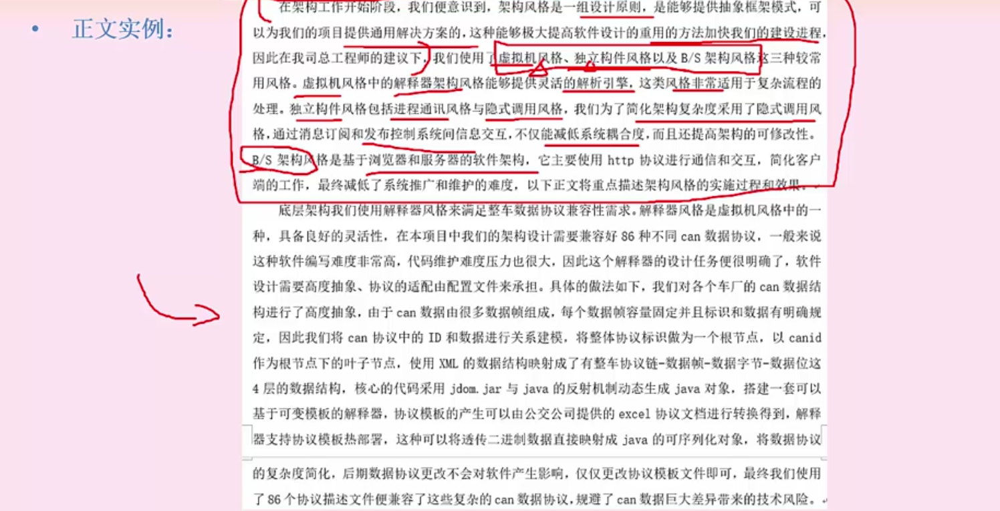
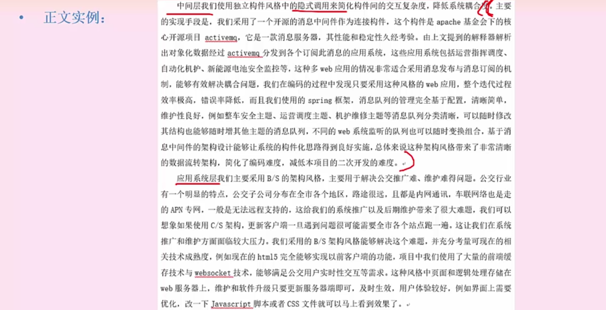
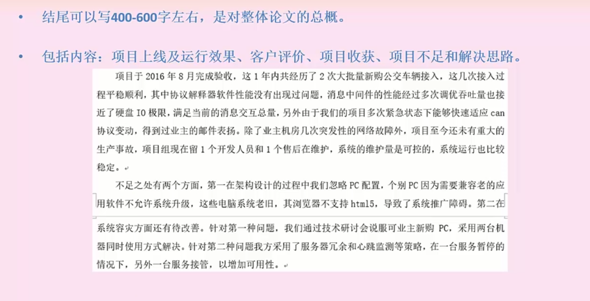
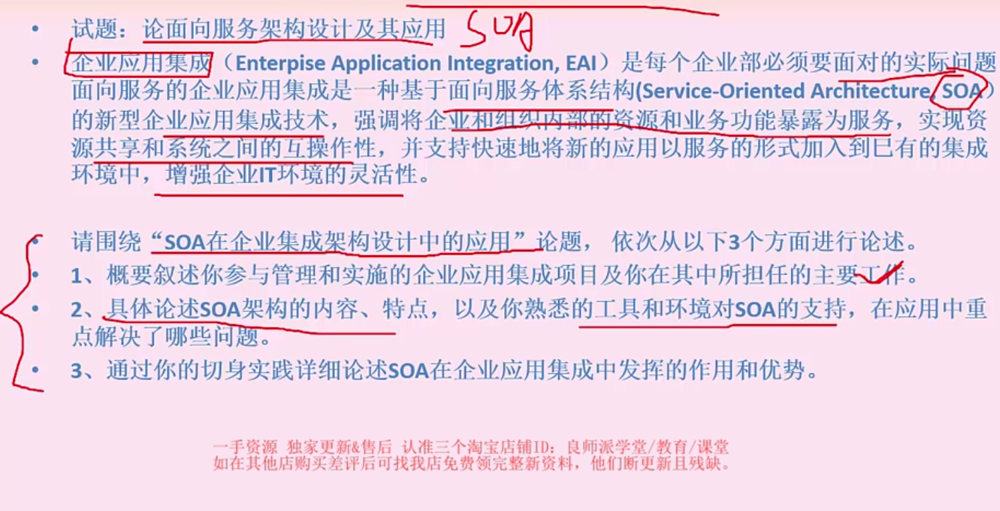

# 论文写作（重要）

## 论文写作原则

* 不要猜题，要**复用构建（摘要+项目背景+结尾**），不要整篇复用
* 不要抄范文，只能改范文，可以选择适合自己的范文进行修改，改成自己的论文。
* 练习时写文章前，提前准备号自己要写的项目，必须是近三年内的中大型商业项目。
* 做好准备工作，练习论文主题时发现有不会的知识点，一定要全部背会。
* 要用于迈出第一步，万事开头难，写完第一篇，就不难了，第一篇论文不限时间。
* 写正文时，不要生硬的回答问题，要根据问题要点组合成一片通顺的文章。
* 字数一般在 300 + 2200 左右，写到最后一页上面，字迹一定要完整，一笔一划。
* 从系统架构师的角度看项目，技术细节要少且精，书本理论要与实际的项目联系起来。
* 不要全局都列举，可以局部段落列举，论点分开论述，没必要都写编号。
* 论述要求：不能口语化、文档段落不宜太长。

## 搭建论文基本框架

!!! info "Tips"
    摘要 300 字 + 项目背景介绍 400 字 + 论文总结 400 ～ 600 字 = 确保提前准备 1200 字

| 基本框架 |        | 内容                                                           | 字数          |
|------|--------|--------------------------------------------------------------|-------------|
| 摘要   |        | 项目背景及主要功能 你的岗位及主要职责 论文主体内容的总概 项目最终的实施效果或你的总结和感悟等 | 300 ～ 320   |
| 正文   | 项目背景介绍 | 项目背景的详细介绍 项目开发的原因 项目开始时间、实施周期 你的主要岗位职责等          | 400 左右      |
|      | 相关问题回应 | 非核心论点问题的回应 引出主体内容（核心论点）                                  | 300 ～ 400   |
|      | 主体内容   | 采用总分式描述： “一总” 加 “三分” “一对三” 模式 分为四个段落                 | 1000 ～ 1500 |
|      | 论文结论   | 结构上可分三步走： 先分析项目运行效果 再总结项目不足 最后提出解决思路             | 400 ～ 600   |

## 模板

### 摘要

1. 本文讨论了......系统的......（论文主题）。该系统......（系统背景、简单功能介绍）。在本文中，首先讨论了...（过程、方法、措施），最后...（不足之处/如何改进、特色支出）。在本系统的开发过程中，我担任......（作者的工作角色）。
2. 根据......需求（项目背景），我所在的......组织了......系统的开发。在系统......（系统背景、简单功能的介绍）。在该系统的开发中，我担任了......（作者的工作角色）。我通过采取......（过程、方法、措施），使该系统开发工作圆满完成，得到了用户们的一致好评。但现在看来，......（不足之处/如何改进、特色之处）。
3. ......年......月，我参加了......系统的开发，担任......（作者的工作角色）。该系统......（系统背景、简单功能介绍）。本文结合作者的实践，以......系统为例，讨论......（论文主题），包括（过程、方法、措施）。

    摘要：

#### 项目背景

### 正文

正文要写 1500 字左右，主要用于回应论文题目，一般会有两个小问。

第一个是非核心论点，要求介绍题目描述某项目技术原理，考察理论知识，需要大家记忆，300 ～ 400 字左右。

第二个是核心论点，也是最重要的部分，要求结合实际项目实施情况，说明理论如何在实践中应用，考察真实的项目经验，1200 字左右。

### 结论

结论可以写 400 ～ 600 字左右，是对整体论文的总概。

包括内容：项目上线及运行效果、客户评价、项目收获、项目不足和解决思路。

!!! info "Tips"
    建议分两段描述，第一段描述项目上线及运行效果、客户评价、项目收获；第二段描述项目不足和解决思路。

## 案例范文赏析

### 论软件系统架构风格

### 论面向服务架构设计及应用

### 论软件多层架构设计

### 论信息系统的安全性与保密性设计

### 论高可靠性软件中软件容错技术的应用

### 基于构建的软件开发

### 论软件设计模式及其应用

### 论企业集成平台的技术与应用

### 论软件项目管理技术及其应用