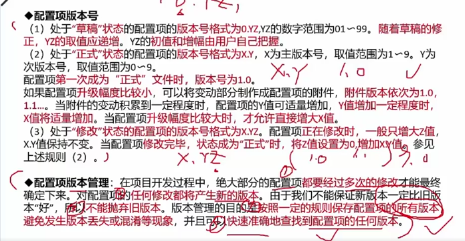
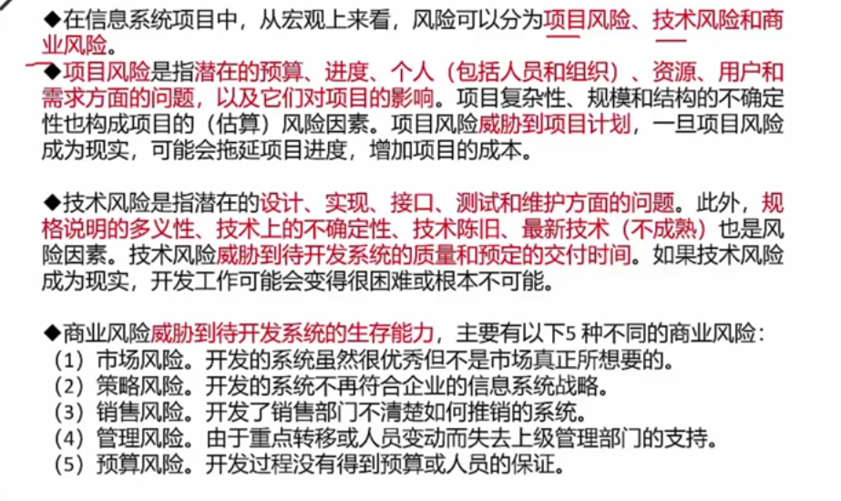

# 系统开发基础

## 结构化需求分析

1. 功能模型（数据流图）
2. 行为模型（状态转换图）
3. 数据模型（E-R 图）

## 面向对象分析方法

1. UML 关系：依赖、关联、泛化、实现、组合、聚合 
2. UML 图：用例图、类图、活动图、状态图

## 面向对象分析模型

1. 用例模型

      * 识别参与者
      * 合并需求获得用例
      * 细化用例描述
          * 用例名称
          * 简要说明
          * 事件流
          * 非功能需求
          * 前置条件
          * 后置条件
          * 扩展点
          * 优先级
      * 调整用例模型
          * 包含关系
          * 扩展关系
          * 泛化关系

2. 分析模型

      * 定义概念类
      * 识别类之间的关系
          * 依赖关系
          * 关联关系
          * 聚合关系
          * 组合关系
          * 泛化关系
          * 实现关系
      * 为类添加职责
      * 建立交互图

## 项目管理

* **PERT** 图是一种图形化的网络模型，描述了一个项目中任务和任务之间的关系，每个节点表示一个任务，通常包括任务编号、名称、开始和结束时间、持续时间和松弛时间。
* **Gantt** 图是一种简单的水平条形图，他以一个日历为基准描述项目任务，横坐标表示时间，纵坐标表示任务
!!! info 
        PERT 图主要描述不同任务之间的依赖关系；Gantt 图主要描述不同任务之间的重叠关系。

### 关键路径

**总浮动时间：** 在不延误 **项目完工时间** 且不违反进度约束因素的前提下，活动可以从最早开始时间推迟或延迟的时间量，就是该活动的进度灵活性。正常情况下关键活动的总浮动时间为零。

!!! info "总浮动时间计算方法"

        最迟开始（LS）-最早开始（ES）或 最迟完成（LF）-最早完成（EF）或 关键路径-非关键路径时长

**自由浮动时间：** 在不延误任何 **紧后活动** 的最早开始时间且不违反进度制度约束因素的前提下，活动可以从最早开始时间推迟或拖延的时间量。

!!! info "自由浮动时间的计算方法"

        紧后活动最早开始时间的最小值-本活动的最早完成时间

### 配置管理

配置管理是为了系统的控制配置变更，在系统整个生命周期中维持配置的完整性和可跟踪性，而标识系统在不同时间点上配置的学科。在 `GB/T11457-2006` 中将配置管理正式定义为：应用技术和管理的指导和监控方法以 *标识和说明配置项的功能和物理特征*，控制这些特征的变更，记录和报告变更处理和实现状态并验证与规定的需求的遵循性。

配置管理主要包括 6 个活动：制定配置管理计划、配置标识、配置控制、配置状态报告、配置审计、发布管理和交付。

#### 配置项

配置项是配置管理设计的硬件、软件或二者的集合，在配置管理中作为一个单一实体来对待。典型的配置项包括项目计划书、需求文档、设计文档、源代码、可执行代码、测试用例、运行软件所需的各类数据，它们经过 *评审和检查* 后进入配置管理。每个配置项的主要属性有：名称、标识符、文件状态、版本、作者、日期等。

配置项可以分为基线配置项和非基线配置项两类，例如：基线配置项包括所有的设计文档和源程序等；非基线配置项包括项目的各类计划和报告等。所有配置项的操作权限应由 CMO（配置管理员）严格管理，基本原则是，基线配置项向开发人员开放读取的权限；非基线配置项向 PM、CCB 及相关人员开放。

#### 配置项的状态

配置项的状态分为草稿、正式、修改三种。配置项刚建立时状态是草稿，通过评审后，状态变为正式。此后若配置项变更，其状态变为修改，当修改的配置项修改完毕并重新通过评审，其状态恢复为正式。如图所示：

#### 配置项的版本

#### 质量管理

#### 风险管理

风险管理是要对项目进行认真分析和科学的管理，这样是能够避开不利条件、少受损失、取得预期的结果并实现项目目标，能够争取避免风险的发生或尽量减小风险发生后的影响。完全避开或消除风险，或只享受权益而不承担风险是不可能的。

* 风险管理计划编制
* 风险识别
* 风险定性分析
* 风险定量分析
* 风险应对计划编制
* 风险监控：监控风险计划的执行，检测参与风险

在信息系统项目中，从宏观上看风险可以分为项目风险、技术风险和商业风险。

* 项目风险：指*潜在的预算、进度、个人（包括人员和组织）、资源、用户和需求方面的问题，以及他们对项目的影响。*
* 技术风险
* 商业风险

## 信息安全 

* 对称加密
* 非对称加密
* 信息摘要
* 数字签名
* 数字证书
