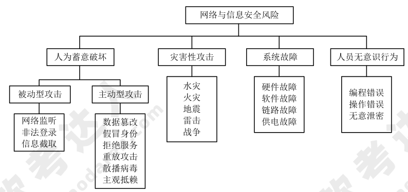

# 安全架构设计理论与实践

## 信息安全面临的威胁

1. 信息安全威胁的来源

    威胁可以来源于物理环境、通信链路、网络系统、操作系统、应用系统、管理系统。

2. 网络与信息安全风险类别

    网络与信息安全风险类别可以分为人为蓄意破坏（被动型攻击，主动型攻击）、灾害性攻击、系统故障、人员无意识行为。

    

    ???+ info "2011 综合知识 64"

        SNMPv3 把对网络协议的安全威胁分为主要的和次要的两类。标准规定安全模块必须提供防护的两种主要威胁是：
        
        1. 修改信息（Modification of Information）:就是某些未经授权的实体改变了进来的 SNMP报文，企图实施未经授权的管理操作，或者提供虚假的管理对象。
        2. 假冒（Masquerade）:即未经授权的用户冒充授权用户的标识，企图实施管理操作。

        SNMPv3 标准还规定安全模块必须对两种次要威胁提供防护：
        
        1. 修改报文流（Message Stream Modificatiqn）:由于 SNMP 协议通常是基于无连接的传输服务，重新排序报文流、延迟或重放报文的威胁都可能出现。这种威胁的危害性在于通过报文流的修改可能实施非法的管理操作。
        2. 消息泄露（Disclosure）: SNMP 引擎之间交换的信息可能被偷听，对这种威胁的防护应采取局部的策略。
        
        有两种威胁是安全体系结构不必防护的，因为它们不是很重要，或者这种防护没有多大作用：
        
        1. 拒绝服务（Denial of Service）:因为在很多情况下拒绝服务和网络失效是无法区别的，所以可以由网络管理协议来处理，安全子系统不必采取措施。
        2. 通信分析（Traffic Analysis）:即由第三者分析管理实体之间的通信规律，从而获取需要的信息。由于通常都是由少数管理站来管理整个网络的，所以管理系统的通信模式是可预见的，防护通信分析就没有多大作用了。

3. 常见的安全威胁

## 安全体系架构范围

## 安全模型

## 信息安全整体架构设计

## 网络安全架构设计

## 数据库系统安全设计

## 系统架构脆弱性分析

## 安全架构设计实践

## 