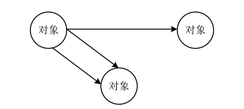
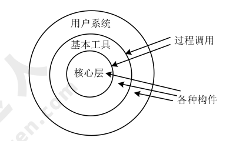

# 系统架构设计基础知识（重要）

!!! tip "2009 综合知识 44"

      软件架构是降低成本、改进质量、按时和按需交付产品的关键因素，软件架构设计需要满足系统的质量属性，如性能、安全性和可修改性等，软件架构设计需要确定组件之间的依赖关系，支持项目计划和管理活动，软件架构能够指导设计人员和实现人员的工作。一般在设计软件架构之初，会根据用户需求，确定多个候选架构，从中选择一个较优的架构，并随着软件的开发，对这个架构进行微调，以达到最佳效果。

## 基于架构的软件开发方法

基于体系结构（架构）的软件设计（Architecture-Based Software Design，ABSD）方法是体系结构驱动的，即指构成体系结构的商业、质量和功能需求的组合驱动的。在基于体系结构的软件设计方法中，**采用视角与视图来描述软件架构**，**采用用例来描述功能需求**，**采用质量场景来描述质量需求**。ABSD 方法具有三个基础：功能的分解、通过选择体系结构风格来实现质量和商业需求、软件模板的使用。ABSD 是自顶向下、递归细化的，迭代的每一步都有清晰的定义，有助于降低体系结构设计的随意性。 

!!! tip "2009 综合知识 45"

      软件架构设计包括提出架构模型、产生架构设计和进行设计评审等活动，是一个迭代的过程，在建立软件架构的初期，一般需要选择一个合适的架构风格，将架构分析阶段已标识的构件映射到架构中，并分析这些构件之间的关系，一旦得到了详细的软件架构设计，需要邀请独立于系统开发的外部人员对系统进行评审。一般来说，软件架构设计活动将已标识构件集成到软件架构中，设计这些构件，但不予以实现。

!!! tip "2009 综合知识 48"

!!! tip "2010 综合知识 46,47"

### 基于体系结构的开发模型

传统的软件开发模型开发效率较低，ABSDM 模型把整个基于体系结构的软件开发过程划分为体系结构需求、设计、文档化、复审、实现和演化六个子过程。

1. 体系结构需求

      体系结构的需求工作包括获取用户需求和标识系统中拟用构件。

      1. 需求获取。体系结构需求的获取一般来自三个方面：质量目标、系统的商业目标和系统开发人员的商业目标。
      2. 标识构件。标识构件分三步完成：生成类图→对类进行分组→把类打包成构件。
      3. 架构需求评审的审查重点包括需求是否真实反映了用户的要求、类的分组是否合理、构件合并是否合理。

2. 体系结构设计

      软件的体系设计过程：提出软件体系结构模型→映射构件→分析构件相互作用→产生体系结构设计评审。设计评审必须邀请独立于系统开发的外部人员。

3. 体系结构的文档化

      体系结构文档化过程的主要输出结果是体系结构规格说明和测试体系结构需求的质量设计说明书。

       !!! tip "2009 综合知识 49"

            软件架构文档是对软件架构的一种描述，帮助程序员使用特定的程序设计语言实现软件架构。
            
            软件架构文档的写作应该遵循一定的原则，这些原则包括：
            
            * 文档要从 **使用者** 的角度进行编写；
            * 必须分发给所有与系统有关的开发人员；
            * 应该保持架构文档的即时更新，但更新不要过于频繁；
            * 架构文档中描述应该尽量避免不必要的重复；
            * 每次架构文档修改都应该记录进行修改的原则。

4. 体系结构的复审

      一个主版本的软件体系结构分析之后，要安排一次由外部人员（用户代表和领域专家）参加的复审。复审的目的是<u>标识潜在的风险</u>，及早发现体系结构设计中的缺陷和错误，必要时，可搭建一个可运行的最小化系统用于评估和测试体系结构是否满足需要。

      !!! tip "2009 综合知识 50"

5. 体系结构实现

      体系结构的实现过程是以复审后的文档化体系结构说明书为基础的，具体为：分析与设计→构件实现→构件组装→系统测试。体系结构说明书中定义了系统中构件与构件之间的关系。测试包括单个构件的功能性测试及被组装应用的整体功能和性能测试。

6. 体系结构演化

      体系结构演化史使用系统演化步骤去修改应用，以满足新的需求。系统演化步骤为：需求变化归类→体系结构演化计划→构件变动→更新构件的相互作用→构件组装与测试→技术评审→演化后的体系结构。

## 软件架构风格

!!! tip "2009 综合知识 55"

      采用闭环结构的软件通常由几个协作构件共同构成，且其中的主要构件彼此分开，能够进行替换与重用，但闭环结构通常适用于处理简单任务（如机器装配等)，并不适用于复杂任务。分层结构的特点是通过引入抽象层，在较低层次不确定的实现细节在较高层次会变得确定，并能够组织层间构件的协作，系统结构更加清晰。

!!! tip "2009 综合知识 56"

      一个软件的架构设计是随着技术的不断进步而不断变化的。以编译器为例，其主流架构经历了管道 过滤器到数据共享为中心的转变过程。早期的编译器采用管道 过滤器架构风格，以文本形式输入的代码被逐步转化为各种形式，最终生成可执行代码。早期的编译器釆用管道 过滤器架构风格，并且大多数编译器在词法分析时创造独立的符号表，在其后的阶段会不断修改符号表，因此符号表并不是程序数据的一部分。现代的编译器采用以数据共享为中心的架构风格，主要关心编译过程中程序的中间表示。现代的编译器采用以数据共享为中心的架构风格，分析树是在语法分析阶段结束后才产生作为语义分析的输入，分析树是数据中心中重要的共享数据，为后续的语义分析提供了帮助。

### 软件架构风格概述

### 数据流体系结构风格

!!! tip "2009 综合知识 53"

1. 批处理体系结构风格：每个处理步骤是一个独立的程序，每一步必须在前一步结束后才能开始，且数据必须是完整，以整体的方式传递。
2. 管道和过滤器：把系统分为几个序贯地处理步骤，每个步骤之间通过数据流连接，一个步骤的输出是另一个步骤的输入，每个处理步骤都有输入和输出。

### 调用/返回体系结构风格

调用-返回风格在系统中采用了调用与返回机制。利用调用-返回实际上是一种分而治之的策略，主要思想是将一个复杂的大系统分解为若干个子系统，降低复杂度，增加可修改性。

#### 主程序/子程序风格

采用单线程控制，把问题划分为若干处理步骤，构件即为主程序和子程序。

#### 面向对象体系结构风格

构件是对象，即抽象数据类型的实例。

#### 层次型体系结构风格：

每一层为上层服务，并作为下层的接口，仅相邻层间具有层接口。

#### 客户端/服务器体系结构风格
   
二层 C/S 模式。主要组成部分：数据库服务器（后台：负责数据管理）
、客户应用程序（前台：完成与用户交互任务）和网络。

优点：客户应用和服务器构件分别运行在不同的计算机上。

缺点：开发成本高，客户端设计复杂，信息内容和形式单一，不利于推广，软件移植困难，软件维护和升级困难。

三层 C/S 模式：瘦客户端模式。应用该功能分为表示层、功能层和数据层。

表示层：用户接口与应用逻辑层的交互，不影响业务逻辑，通常使用图形用户界面。

功能层：实现具体的业务处理逻辑。

数据层：数据库管理系统。

#### 浏览器/服务器风格（B/S）

B/S 风格：是三层应用结构的实现方式，其三层结构分别为：浏览器；Web 服务器；数据库服务器。

相比于 C/S 的不足之处：动态页面的支持能力弱、系统拓展能力差、安全性难以控制、响应速度不足、数据交互性不强。

!!! tip "2009 综合知识 54"

      根据题干描述，调试器在设置端点时，其本质是在断点处设置一个事件监听函数，当程序执行到断点位置时，会触发并调用该事件监听函数，监听函数负责进行自动卷屏、刷新变量数值等动作。这是一个典型的回调机制，属于隐式调用的架构风格。

### 以数据为中心的体系结构风格

### 虚拟机体系结构风格

虚拟机体系结构风格基本思想是人为构建一个运行环境，可以解析与运行自定义的一些语言，增加架构的灵活性。

!!! tip "2009 综合知识 52"

      Java 语言是一种解释型语言， 在 Java 虚拟机上运行，这从架构风格上看是典型的“虚拟机”风格，即通过虚拟机架构屏蔽不同的硬件环境。

1. 解释器体系结构风格：通常被用来建立一种虚拟机以弥合程序语义与硬件语义之间的差异，缺点是执行效率较低，典型例子是专家系统

      

2. 规则系统体系结构风格：包括知识库、规则解释器、规则/数据选择器及工作内存（程序运行存储区）

      

### 独立构建体系结构风格

独立构件体系结构风格强调系统中的每个构件都是相对独立的个体，它们之间不直接通信，以降低耦合度，提升灵活度。

!!! tip "2009 综合知识 51"

      Windows 操作系统在图形用户界面处理方面采用的是典型的“事件驱动”的架构风格，首先注册事件处理的是回调函数，当某个界面事件发生时（例如键盘敲击、鼠标移 动等)，系统会查找并选择合适的回调函数处理该事件。

1. 进程通信体系结构风格：构件是独立的过程，连接件是消息传递。
2. 事件系统体系结构风格：构件不直接调用一个过程，而是触发或广播一个或多个事件。

!!! tip "2010 综合知识 21"

      * 远程过程调用一般是基于同步的方式，效率较低，而且容易失败；
      
      * 共享数据库和文件传输的集成方式在性能方面较差，系统不能保持即时数据同步，而且容易造成应用与数据紧耦合；
      
      * 消息传递的集成方式能够保证数据的异步、立即、可靠传输。

### C2 风格

C2 风格通过连接件连接构件或某个构件组，构件与构件之间无连接。

---

!!! tip "2009 综合知识 57,58,59"

      **软件设计中使用的架构模式、设计模式和惯用法的基本概念。**

      架构模式是软件设计中的高层决策，例如 C/S 结构就属于架构模式，架构模式反映了开发软件系统过程中所作的基本设计决策；设计模式主要关注软件系统的设计，与具体的实现语言无关；惯用法则是实现时通过某种特定的程序设计语言来描述构件与构件之间的关系，例如引用 计数就是 C++语言中的一种惯用法。

## 软件架构复用

## 特定领域软件体系结构

### 中间件

!!! inline end info "中间件 5 种主要类型"

      1. 数据库访问中间件
      2. 远程过程调用（RPC）
      3. 面向消息中间件（MOM）
      4. 分布式对象中间件
      5. 事务中间件

中间件在一个分布式系统环境中处于操作系统和应用程序之间的软件，可以在不同技术之间共享资源，将不同的操作系统、数据库、异构的网络环境以及若干应用结合成一个有机的协同工作整体。

中间件的任务是使应用程序开发变得更容易，通过提供统一的程序抽象，隐藏异构系统和分布式系统下低级别编成的复杂度。

---

#### 典型应用架构

!!! inline info "J2EE 层次结构"

      1. 客户层组件
      2. WEB 层组件
      3. 业务层组件
      4. 信息系统层

**J2EE 核心技术**

采用了多层分布式应用程序模型，实现不同逻辑功能的应用程序被封装到不同的构建中，处于不同层次的构建被分别部署到不同的机器中。

**JSP+Servlet+JavaBean+DAO**

---

* JSP：用于显示、收集数据的部分，作为 MVC 的视图层；
* Servlet：作为业务逻辑层，用于处理复杂的业务逻辑，如验证数据、实例化 JavaBean、调用 DAO 连接数据库等；
* JavaBean：用于数据的封装，方便将查询结果在 Servlet 和 JSP 页面之间进行传递等；
* DAO：用于连接数据库及进行数据库的操作，如：查询、删除、更改等；

JSP 发送一个数据到 Servlet， Servlet 收到后解析，根据数据调用相应的 Service 去服务， Service 如果调用数据库就通过 DAO 跟数据库交互，使用 JavaBean 完成封装，返回结果给 Servlet， Servlet 再返回给 JSP。

**.Net 平台**

`.Net` 框架处于操作系统和 `.Net` 应用语言之间，只适用于微软系统，而 J2EE 支持跨平台，任何安装了 JVM 平台。