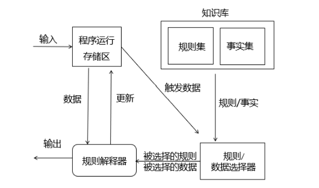

# 系统架构设计基础知识（重要）

## 基于架构的软件开发方法

### 体系结构的设计方法概述

基于体系结构（架构）的软件设计（Architecture-Based Software Design，ABSD）方法是体系结构驱动的，即指构成体系结构的商业、质量和功能需求的组合驱动的。在基于体系结构的软件设计方法中，<u>采用视角与视图来描述软件架构</u>，<u>采用用例来描述功能需求</u>，<u>采用质量场景来描述质量需求</u>。ABSD 方法具有三个基础：功能的分解、通过选择体系结构风格来实现质量和商业需求、软件模板的使用。ABSD 是自顶向下、递归细化的，迭代的每一步都有清晰的定义，有助于降低体系结构设计的随意性。 

!!! tip "2009 综合知识 48"

### 基于体系结构的开发模型

### 体系结构需求

### 体系结构设计

### 体系结构的文档化

体系结构文档化过程的主要输出结果是体系结构规格说明和测试体系结构需求的质量设计说明书。

!!! tip "2009 综合知识 49"

      软件架构文档是对软件架构的一种描述，帮助程序员使用特定的程序设计语言实现软件架构。
      
      软件架构文档的写作应该遵循一定的原则，这些原则包括：
      
      * 文档要从 **使用者** 的角度进行编写；
      * 必须分发给所有与系统有关的开发人员；
      * 应该保持架构文档的即时更新，但更新不要过于频繁；
      * 架构文档中描述应该尽量避免不必要的重复；
      * 每次架构文档修改都应该记录进行修改的原则。

### 体系结构的复审

一个主版本的软件体系结构分析之后，要安排一次由外部人员（用户代表和领域专家）参加的复审。复审的目的是<u>标识潜在的风险</u>，及早发现体系结构设计中的缺陷和错误，必要时，可搭建一个可运行的最小化系统用于评估和测试体系结构是否满足需要。

!!! tip "2009 综合知识 50"

### 体系结构实现

### 体系结构演化

## 软件架构风格

### 软件架构风格概述

### 数据流体系结构风格

!!! tip "2009 综合知识 53"

1. 批处理体系结构风格：每个处理步骤是一个独立的程序，每一步必须在前一步结束后才能开始，且数据必须是完整，以整体的方式传递。
2. 管道和过滤器：把系统分为几个序贯地处理步骤，每个步骤之间通过数据流连接，一个步骤的输出是另一个步骤的输入，每个处理步骤都有输入和输出。

### 调用/返回体系结构风格

调用-返回风格在系统中采用了调用与返回机制。利用调用-返回实际上是一种分而治之的策略，主要思想是将一个复杂的大系统分解为若干个子系统，降低复杂度，增加可修改性。

#### 主程序/子程序风格

采用单线程控制，把问题划分为若干处理步骤，构件即为主程序和子程序。

#### 面向对象体系结构风格

构件是对象，即抽象数据类型的实例。

#### 层次型体系结构风格：

每一层为上层服务，并作为下层的接口，仅相邻层间具有层接口。

#### 客户端/服务器体系结构风格
   
二层 C/S 模式。主要组成部分：数据库服务器（后台：负责数据管理）
、客户应用程序（前台：完成与用户交互任务）和网络。

优点：客户应用和服务器构件分别运行在不同的计算机上。

缺点：开发成本高，客户端设计复杂，信息内容和形式单一，不利于推广，软件移植困难，软件维护和升级困难。

三层 C/S 模式：瘦客户端模式。应用该功能分为表示层、功能层和数据层。

表示层：用户接口与应用逻辑层的交互，不影响业务逻辑，通常使用图形用户界面。

功能层：实现具体的业务处理逻辑。

数据层：数据库管理系统。

#### 浏览器/服务器风格（B/S）

B/S 风格：是三层应用结构的实现方式，其三层结构分别为：浏览器；Web 服务器；数据库服务器。

相比于 C/S 的不足之处：动态页面的支持能力弱、系统拓展能力差、安全性难以控制、响应速度不足、数据交互性不强。

!!! tip "2009 综合知识 54"

      根据题干描述，调试器在设置端点时，其本质是在断点处设置一个事件监听函数，当程序执行到断点位置时，会触发并调用该事件监听函数，监听函数负责进行自动卷屏、刷新变量数值等动作。这是一个典型的回调机制，属于隐式调用的架构风格。

### 以数据为中心的体系结构风格

### 虚拟机体系结构风格

虚拟机体系结构风格基本思想是人为构建一个运行环境，可以解析与运行自定义的一些语言，增加架构的灵活性。

!!! tip "2009 综合知识 52"

      Java 语言是一种解释型语言， 在 Java 虚拟机上运行，这从架构风格上看是典型的“虚拟机”风格，即通过虚拟机架构屏蔽不同的硬件环境。

1. 解释器体系结构风格：通常被用来建立一种虚拟机以弥合程序语义与硬件语义之间的差异，缺点是执行效率较低，典型例子是专家系统

      

2. 规则系统体系结构风格：包括知识库、规则解释器、规则/数据选择器及工作内存（程序运行存储区）

      

### 独立构建体系结构风格

独立构件体系结构风格强调系统中的每个构件都是相对独立的个体，它们之间不直接通信，以降低耦合度，提升灵活度。

!!! tip "2009 综合知识 51"

      Windows 操作系统在图形用户界面处理方面采用的是典型的“事件驱动”的架构风格，首先注册事件处理的是回调函数，当某个界面事件发生时（例如键盘敲击、鼠标移 动等)，系统会查找并选择合适的回调函数处理该事件。

1. 进程通信体系结构风格：构件是独立的过程，连接件是消息传递。
2. 事件系统体系结构风格：构件不直接调用一个过程，而是触发或广播一个或多个事件。

### C2 风格

## 软件系统质量属性

### 面向架构评估的质量属性

> 重要的质量属性用 **`*`** 强调标识

| 属性                       | 子属性  | 作用及要点                   | 设计策略                               |
|--------------------------|------|-------------------------|------------------------------------|
| `*`性能                    |      | 效率指标：处理任务所需时间或单位时间内的处理量 | 优先级队列、增加计算资源、减少计算开销、引入并法机制、采用资源调度等 |
| `*`可靠性                   | 容错   | 出现错误后仍能保证系统正确运行，且自行修正错误 | 心跳、Ping/Echo、冗余、选举                 |
|                          | 健壮性  | 错误不对系统产生影响，指既定程序忽略错误    | 心跳、Ping/Echo、冗余、选举                 |
| `*`可用性（**与可靠性相比优先选可用性**） |      | 系统正常运行的时间比例             | 心跳、Ping/Echo、冗余、选举                 |
| `*`安全性                   |      | 系统向合法用户提供服务并阻止非法用户的能力   | 入侵检测、用户认证、用户授权、追踪审计                |
| `*`可修改性                  | 可维护性 | 局部修复使故障对架构的负面影响最小化      |                                    |
|                          | 可扩展性 | 因松散耦合更易实现新特性/功能，不影响架构   |                                    |
|                          | 结构重组 | 不影响主体进行的灵活配置            |                                    |
|                          | 可移植性 | 适用于多样的环境（硬件平台、语言、操作系统等） |                                    |
| `*`功能性                   |      | 需求满足程度                  |                                    |
| 可变性                      |      |                         |                                    |
| 互操作性                     |      | 通过可视化或接口方式提供更好的交互体验     |                                    |

### 质量属性场景描述

质量属性场景是一种面向特定质量属性的需求，由 6 部分组成：

* 刺激源：某个生成该刺激的实体（人、计算机系统或者任何其他刺激器）；
* 刺激：指当刺激到达系统时需要考虑的条件；
* 环境：指该刺激在某些条件内发生。当激励发生时，系统可能处于过载、运行或其他情况；
* 制品：某个制品被激励，可能是整个系统，也可能是系统的一部分；
* 响应：指在激励到达后所采取的行动；
* 响应度量：当响应发生时，应当能够以某种方式对其进行度量，以对需求进行测试。

## 系统架构评估

系统架构评估是在对架构分析、评估的基础上，对架构策略的选取进行决策，通常分为：

| 方法                       | 描述                                             |
| -------------------------- | ------------------------------------------------ |
| 基于调查问卷或检查表的方法 | 缺点是很大程度上依赖于评估人员的主观判断         |
| 基于场景的评估方法         | 应用在架构权衡分析法（**ATAM**）和软件架构分析方法（**SAAM**）中 |
| 基于度量的评估方法         | 建立质量属性和度量之间的映射原则->在软件文档中获取度量信息->分析推导系统质量属性 |

### 系统架构评估中的重要概念

1. 敏感点：实现质量目标时应注意的点，是一个或多个构建的特性；
2. 权衡点：影响多个质量属性的敏感点；
3. 风险承担者或利益相关人：影响体系结构或被体系结构影响的群体；
4. 场景：确定架构质量评估目标的交互机制，一般采用触发机制、环境和影响三方面来描述。

### 系统架构评估方法

#### `*`软件架构分析方法（ATAM）

ATAM 是一种架构评估方法，主要在系统开发之前，针对 **性能、可用性、安全性、可修改性** 等质量属性进行评价和折中。

分为 4 个主要活动阶段：**需求收集、架构视图描述、属性模型构造和分析、架构决策与折衷**，整个评估过程强调以属性作为架构评估的核心概念。

ATAM 方法评估实践阶段划分如下：

1. 演示和介绍阶段
      1. 介绍 ATAM 方法
      2. 描述商业目标
      3. 描述体系架构
2. 调查和分析阶段
      1. 标识体系结构步骤
      2. 产生质量属性树
      3. 分析体系结构步骤
3. 测试阶段
      1. 讨论质量需求的次序
      2. 分析体系结构步骤
4. 报告阶段
      1. 提交结果

#### 架构权衡分析法（**SAAM**）

SAAM 是一种非功能质量属性的架构分析方法，是最早形成文档并得到广泛应用的软件架构分析方法。SAAM 的主要输入是 **问题描述、需求说明和架构描述**，其分析过程主要包括 **场景开发、架构描述、单个场景评估、场景交互和总体评估**。

### 中间件

!!! inline end info "中间件 5 种主要类型"

      1. 数据库访问中间件
      2. 远程过程调用（RPC）
      3. 面向消息中间件（MOM）
      4. 分布式对象中间件
      5. 事务中间件

中间件在一个分布式系统环境中处于操作系统和应用程序之间的软件，可以在不同技术之间共享资源，将不同的操作系统、数据库、异构的网络环境以及若干应用结合成一个有机的协同工作整体。

中间件的任务是使应用程序开发变得更容易，通过提供统一的程序抽象，隐藏异构系统和分布式系统下低级别编成的复杂度。

---

#### 典型应用架构

!!! inline info "J2EE 层次结构"

      1. 客户层组件
      2. WEB 层组件
      3. 业务层组件
      4. 信息系统层

**J2EE 核心技术**

采用了多层分布式应用程序模型，实现不同逻辑功能的应用程序被封装到不同的构建中，处于不同层次的构建被分别部署到不同的机器中。

**JSP+Servlet+JavaBean+DAO**

---

* JSP：用于显示、收集数据的部分，作为 MVC 的视图层；
* Servlet：作为业务逻辑层，用于处理复杂的业务逻辑，如验证数据、实例化 JavaBean、调用 DAO 连接数据库等；
* JavaBean：用于数据的封装，方便将查询结果在 Servlet 和 JSP 页面之间进行传递等；
* DAO：用于连接数据库及进行数据库的操作，如：查询、删除、更改等；

JSP 发送一个数据到 Servlet， Servlet 收到后解析，根据数据调用相应的 Service 去服务， Service 如果调用数据库就通过 DAO 跟数据库交互，使用 JavaBean 完成封装，返回结果给 Servlet， Servlet 再返回给 JSP。

**.Net 平台**

`.Net` 框架处于操作系统和 `.Net` 应用语言之间，只适用于微软系统，而 J2EE 支持跨平台，任何安装了 JVM 平台。