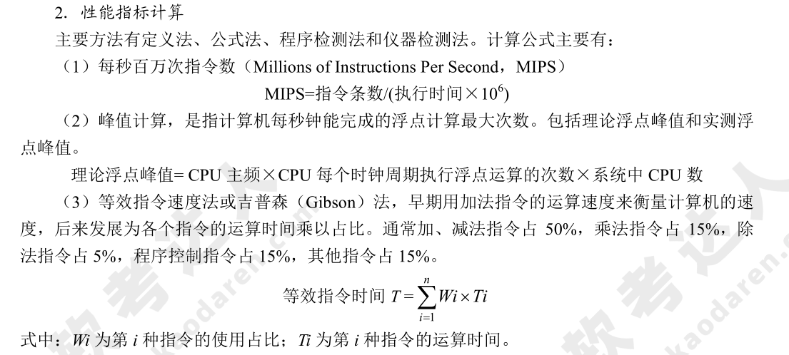
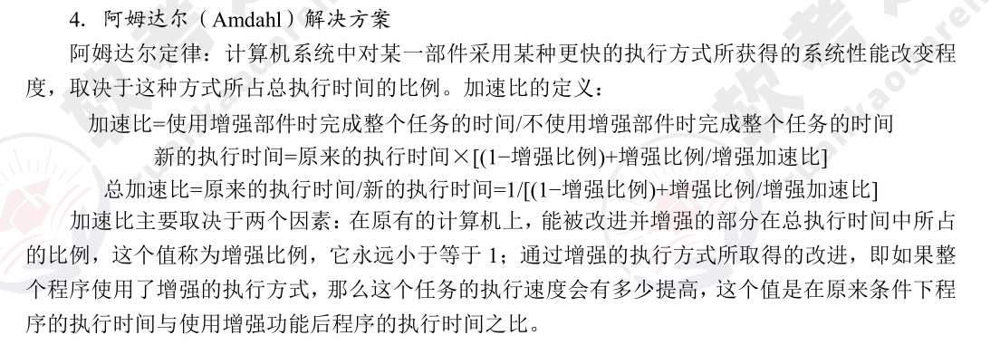

# 系统工程基础知识（编制中）

## 系统工程

系统工程是运用系统方法，对系统进行规划、研究、设计、制造、试验和使用的组织管理技术，是人们用科学方法解决复杂问题的一门技术。系统工程方法的特点是<u>整体性、综合性、协调性、科学性和实践性</u>。系统工程方法可以分为：

* 霍尔的三维结构
* 切克兰德方法
* 并行工程
* 综合集成法
* WSR 系统方法
  
### 系统工程的生命周期

### 基于模型的系统方法

## 系统性能

### 系统性能评价

系统性能评价指标是软件、硬件的性能指标的继承。其中：

* 评价 **计算机** 的主要性能指标有<u>时钟频率（主频）、运算速度、运算精度、数据处理速率（Processing Data Rate，PDR）、吞吐率等</u>。
* 评价 **路由器** 的主要性能指标有<u>设备吞吐量、端口吞吐量、全双工线速转发能力、路由表能力、背板能力、丢包率、时延、时延抖动、协议支持等</u>。
* 评价 **交换机** 所依据的性能指标有<u>端口速率、背板吞吐量、缓冲区大小、MAC 地址表大小等</u>。
* 评价 **网络** 的性能指标有<u>设备级性能指标、网络级性能指标、应用级性能指标、用户级性能指标和吞吐量</u>。
* 评价 **操作系统** 的性能指标有<u>系统上下文切换、系统响应时间、系统的吞吐率（量）、系统资源利用率、可靠性和可移植性</u>。
* 衡量 **数据库** 管理系统的主要性能指标有<u>最大并发事务处理能力、负载均衡能力、最大连接数等</u>。
* 评价 **Web 服务器** 的主要性能指标有<u>最大并发连接数、响应延迟和吞吐量</u>。

### 性能指标计算

### 性能调整

**性能调整由查找和消除瓶颈组成。** 

对于数据库系统，性能调整主要包括 <u>CPU/内存使用状况、优化数据库设计、优化数据库管理以及进程/线程状态、硬盘 I/O 及剩余空间、日志文件大小等。</u>

对于应用系统，性能调整主要包括应用系统的<u>可用性、响应时间、并发用户数以及特定应用的系统资源占用等。</u>

### 阿姆达尔（Amdahl）解决方案

### 性能评估

性能评估主要包括：

* 基准测试程序（Benchmark）定义：应用程序中用得最多、最频繁的那部分核心程序。基准测试程序中，评测的准确程度依次递减：<u>真实的程序、核心程序、小型基准程序和合成基准程序。</u>基准测试程序有整数测试程序 Dhrystone、浮点测试程序 Linpack、Whetstone 基准测试程序、SPEC 基准测试程序和 TPC 基准程序。
* Web 服务器的性能评测方法有基准性能测试、压力测试和可靠性测试。
* 系统监视的方法通常有系统内置命令、查阅系统日志、可视化技术 3 种方式。