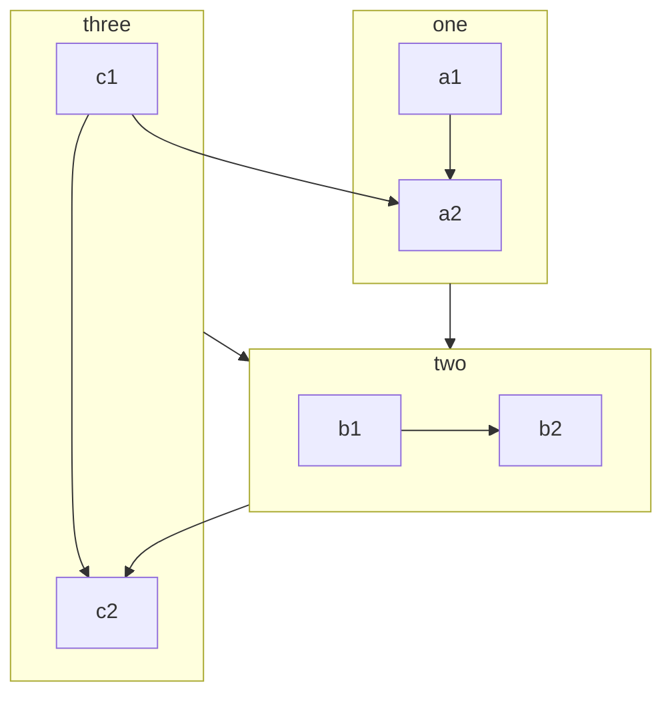

:::: code-group

::: code-group-item yarn

```bash
yarn add -D vuepress-theme-hope
```

:::

::: code-group-item npm:active

```bash
npm i -D vuepress-theme-hope
```

:::

::::


脚注 1 链接[^first].

脚注 2 链接[^second].

行内的脚注^[Text of inline footnote] 定义.

重复的页脚定义[^second].

[^first]: 脚注 **可以包含特殊标记**

    也可以由多个段落组成

[^second]: 脚注文字。


- [ ] Plan A
- [x] Plan B

$$
\frac {\partial^r} {\partial \omega^r} \left(\frac {y^{\omega}} {\omega}\right)
= \left(\frac {y^{\omega}} {\omega}\right) \left\{(\log y)^r + \sum_{i=1}^r \frac {(-1)^i r \cdots (r-i+1) (\log y)^{r-i}} {\omega^i} \right\}
$$

```flow
st=>start: 开始|past:>http://www.google.com[blank]
e=>end: 结束|future:>http://www.google.com
op1=>operation: 操作1|past
op2=>operation: 操作2|current
sub1=>subroutine: 子程序|invalid
cond=>condition: 是/否?|approved:>http://www.google.com
c2=>condition: 判断2|rejected
io=>inputoutput: 进行反思...|future

st->op1(right)->cond
cond(yes, right)->c2
cond(no)->sub1(left)->op1
c2(yes)->io->e
c2(no)->op2->e
```




::: demo Demo 演示

```html
<h1>VuePress Theme Hope</h1>
<p><span id="very">非常</span>强大!</p>
```

```js
document.querySelector("#very").addEventListener("click", () => {
  alert("非常强大");
});
```

```css
span {
  color: red;
}
```

:::
