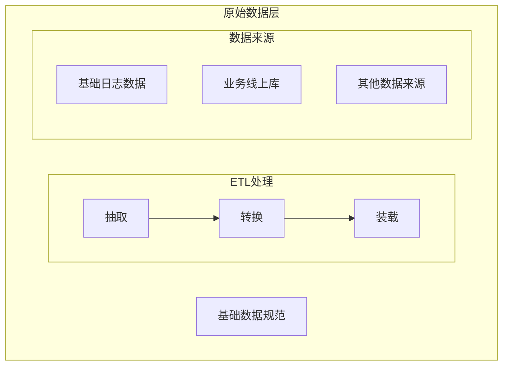
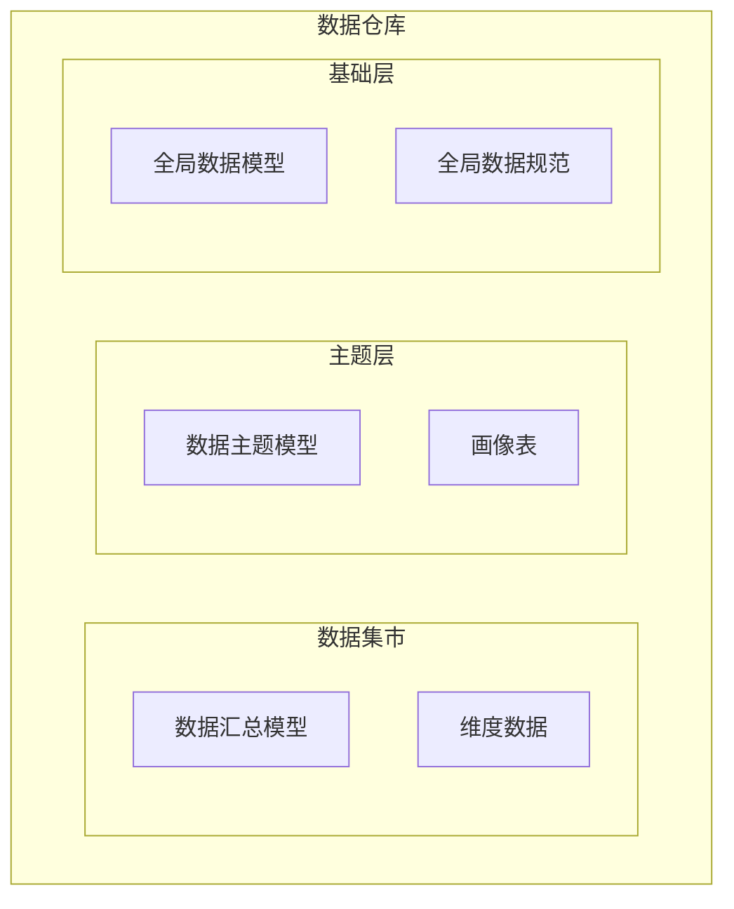
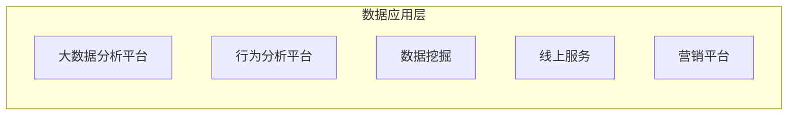

本文主要介绍大数据的应用层级划分，帮助自己梳理数据在大数据平台的生命周期。

根据大数据平台中的数据流入流出，可分为原始数据层、数据仓库、数据应用层。

<!-- more -->

1. 原始数据层（ODS，Operational Data Store），一般由基础日志数据、业务线上库和其他来源数据获得。数据仓库的数据来自对 ODS 层的数据经过 ETL（抽取Extra，转化Transfer，装载Load）处理。
   > ODS层的特性较着重于查询，变动性大；

2. 数据仓库的主要功能是以 ODS 层数据为基础，通过逻辑加工产出数据仓库主题表。数据仓库又细分为基础层、主题层和数据集市。
   > 数据仓库通常为企业层级，用来解决及时性、临时性的问题；
   > 数据集市则较偏向解决特定业务的问题，部分采用维度模型;

3. 数据应用层主要用户处理消费数据仓库的数据。

## ODS 层

ODS 翻译成中文为操作型数据存储，是面向主题的、集成的、可变的、反映当前数据值的、详细的数据的集合，用来满足企业综合的、集成的和操作型的处理需求。通常包括两类，一类用于存储当前需要加载的数据，另一类用于存储处理完后的历史数据。历史数据一般保存3～6个月后需要清除，以节省空间，但不同的项目要区别对待。

ODS 层保存的数据是当前的、不断变化的数据，而数据仓库的数据是历史的、不再变化的数据，所以一般来说会落后 ODS 层一天或一天以上。ODS层按分钟级别捕捉生产系统的数据变化，然后可以每天将归档后的数据加载到数据仓库中，归档的标记为这条记录是否已完成。

一般在带有 ODS 层的系统体系结构中，ODS 层具备以下几个作用：

* 在业务系统和数据仓库之间形成一个隔离层；
  一般的数据仓库应用系统都具有非常复杂的数据来源，这些数据存放在不同的地理位置、不同的数据库、不同的应用之中，从这些业务系统中对数据进行抽取并不是一件容易的事。因此，ODS层用于存放从业务系统中直接抽取出来的数据，这些数据从数据结构、数据之间的逻辑关系上都与业务系统基本保持一致，因此在抽取过程中极大地降低了数据转化的复杂性，而主要关注数据抽取的接口、数据量大小、抽取方式等方面的问题。

* 转移一部分业务系统细节查询的功能；
  ODS层的数据在粒度、组织方式等方面都保持了与业务系统的一致，那么原来由业务系统产生的报表、详细数据的查询自然能够从ODS层中进行，从而降低了业务系统的查询压力。

* 完成数据仓库中不能完成的一些功能；
  数据仓库从宏观角度满足企业的决策支持要求，而ODS层则从微观角度反映细节交易数据或者低粒度的数据查询要求。

## 数据仓库

数据仓库是为了方便企业快速做各种业务决策提供数据支撑而构建的集成化数据环境。

数据仓库本身并不“生产”任何数据，同时自身也不需要“消费”任何数据，数据来源于外部，并且开放给外部应用，这也是为什么叫“仓库”，而不叫“工厂”的原因。

数据仓库主要有以下三个特点：

* 数据仓库是**面向主题的**，它会按照一定的主题进行组织。主题是指业务方使用数据仓库决策时所关心的重点方向，一般会根据业务线情况划分；
* 数据仓库是**集成的**，数据仓库中的数据可能来源于多个数据源，数据仓库会将需要的数据从中抽取出来，然后进一步转化、清洗，再集成到数据仓库中；
* 数据仓库是**不可更新的**，数据仓库主要是为业务提供分析决策的数据，因此，对数据的主要操作都是查询；

数据仓库需要为业务提供快速高效的分析，因此数据仓库只有满足一些要求，才能方便使用：

* 效率足够高。 数据仓库的分析数据一般分为日、周、月、季、年等，可以看出，以日为周期的数据要求的效率最高。
* 数据质量。 数据仓库处理流程通常分为多个步骤，包括数据清洗、转换、装载等，如果数据质量控制不好，导致出现脏数据，就会影响整个数据仓库的质量，如果基于错误的数据做分析，就可能导致做出错误的决策。
* 可扩展性。可扩展性主要体现在数据建模的合理性，便于以后因为业务规模发生变化而不用重复造轮子。

### 数据仓库分层

根据数据仓库处理的数据层次不同，数据仓库主要分为基础层、主题层、数据集市这三层。

#### 基础层

基础层的主要作用是对ODS层的数据进行轻度汇总，产出轻度汇总明细、维度表、码表、事实集等一些基础数据。

这里通过建模的方式，对数据进行多个模型的处理，数据模型是抽象描述现实世界的一种工具和方法。

1. 生成业务模型，主要解决业务方面的分层；
2. 完成领域模型，基于业务模型的基础进行抽象处理；
3. 生成逻辑模型，将领域模型的实体与实体的关系进行数据库层次的逻辑化；
4. 生成物理模型，用来完成对不同关系型数据库的物理化及性能等具体技术问题；

#### 主题层

主题层为数据的高度聚合层，按照一定的维度和业务逻辑，对一类数据进行聚合，主要生成画像表和主题表。主题层的数据来源是基础层和ODS层。

数据模型的建设、维度的选择是为了满足数据主题的需求，这层数据是面向主题组织数据的。

从数据粒度来说，这层的数据是轻度汇总级的数据，已经不存在明细数据了。

从数据的时间跨度来说，主题层通常是基础层的一部分，主要的目的是满足用户分析某个主题的需求。

从分析的角度来说，用户通常只需要分析近几年（如近三年）的数据即可。从数据的广度来说，主题层仍然覆盖了所有业务数据。

#### 数据集市

数据集市（Data Mart）也叫数据市场，主要功能是将主题层和基础层的数据按各业务需求进行聚合，生成宽表和Cube，并直接推送给数据分析和业务部门使用，例如直接推送表数据至MySQL数据库。

数据集市是数据仓库的一部分，主要面向各业务部门使用，并且仅面向某个特定的主题。为了解决灵活性和性能之间的矛盾，数据集市可以被理解为一种小型的主题或业务级别的数据仓库。

数据集市会根据不同业务主题划分来满足业务信息需求，一个合格的数据集市应具备如下特点：

1. 数据集市表是为了解决特定业务需求的，更具有面向主题性；
2. 在更多情况下，数据集市支持离线数据，在一般情况下，业务经常使用的是T+1数据，即今天看昨天的数据；
3. 数据来源于多个方面，比如业务订单数据、前端用户使用数据以及外部来源数据等；
4. 查询时间尽量短，为分析和查询尽快响应；

> 数据集市中数据的结构一般是星型结构或者雪花结构，而星型结构通常由事实表和维度表构成。

**事实表**

事实表用于记录数据集市表中的详细数据。事实表会首先把多种类型的数据连接在一起。例如，一个订单、一次骑行等都会以主键的方式存储在表中，然后与维度表的主键关联。因此，事实表是高度索引化的，表中经常会出现几十条索引，甚至有时事实表的每列都建了索引，这样在查询时速度会进一步提升。

**维度表**

维度表是围绕事实表建立的。维度表里的数据主要用来存储维度数据，主要是一些非密集型数据，包括客户端的版本、操作系统、车型等。

数据集市表在设计时要遵循的原则：

* 数据表的名字需要明确地显示出业务属性和更新频率等信息，如dwm.dw_user_baseinfo_d，表示[集市库].[生产方：dw]_[主题：user]_[细分主题：基础信息]_[更新频率：daily]）；
* 字段名称需要体现一定的业务属性，避免二义性；
* 字段值规范化，如统一大小写、空值转化为NULL、异常时间戳处理、测试数据清理等；
* 对于低频更新的表，需要使用快照表，屏蔽更新频率对数据使用方的影响，增加依赖等级；对于弱依赖等级的数据，使用快照表的方式降低更新未完成的风险，便于提前调度时间；
* 对于需要关注变化的表，需要做拉链表，维护历史状态；
* 在日志数据中，需要保留数据仓库的处理时间，便于后续统计；
* 需要保留每个表的元数据信息，丰富数据字典，且需要采用相同的方式，确保血缘关系可通过解析生成；

拉链表：拉链表是针对数据仓库设计中表存储数据的方式而定义的，就是记录历史数据的每个状态，记录一个事物从开始，一直到当前状态的所有变化的信息；拉链表通常是对账户信息的历史变动进行处理保留的结果。

数据集市是数据仓库的核心组成部分，正是因为它的存在，数据准确性和取数效率有了很大的提升。

## 数据层应用层

大数据的分析应用主要为以下三种形式：

1. 描述性分析应用。主要用来描述所关注的业务的数据表现，主要关注事情表面发生了什么，在数据分析之后，把数据可视化展现出来，让用户可以了解业务的发展状况。
2. 预测性分析应用。在描述性数据的基础上，根据历史数据情况，在一定的算法和模型的指导下，进一步预测业务的数据趋势。
3. 指导性分析应用。基于现有的数据和对未来的预测情况，可以用来指导完成一些业务决策和建议，例如为公司制订战略和运营决策，真正通过数据驱动决策，充分发挥大数据的价值。